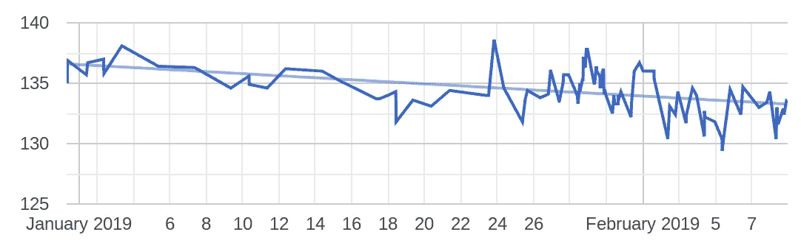
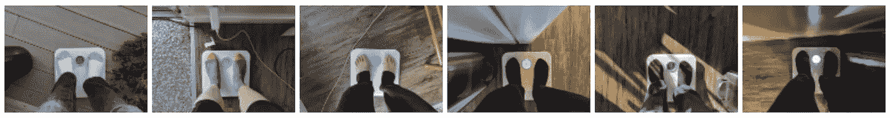
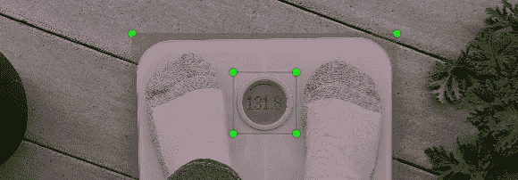
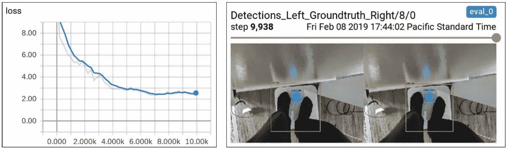
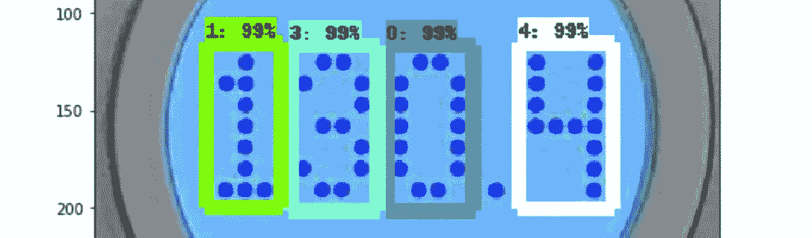

# 使用 TensorFlow 创建智能秤

> 原文：<https://towardsdatascience.com/creating-a-smart-scale-with-tensorflow-cf62a834b670?source=collection_archive---------30----------------------->

想要尝试机器学习，同时构建一些有用的东西吗？这里有一个有趣的周末项目，使用 TensorFlow 从你的体重秤图片中自动读取你的体重，并绘制出一段时间的图表。您将学习到 [TensorFlow 对象检测 API](https://github.com/tensorflow/models/tree/master/research/object_detection) 的基础知识，并能够将其应用于这个和其他图像分析项目。

Weight over time as automatically detected using TensorFlow from analyzing pictures (the line is more jagged on the right side because there are more data points)

这篇文章故意写得很短，这样你可以很快得到一个很好的概述，同时提供包含更多细节的其他材料的链接。就这样，让我们开始吧！

# 获取您的秤的图像

首先，与任何机器学习项目一样，数据是关键。每次你站在你的体重秤上，拍一张清楚显示你体重的照片。为了获得最佳效果，可以在不同的光线条件下拍照，也可以在房子的不同区域拍照。100 张图片应该可以作为一个相当好的训练集。

如果你的照片被备份到 Google 相册，那么你可以使用一个脚本，比如[这个](https://github.com/xiaowen/weightcheck/blob/master/scale/dlphotos.py)来下载它们。

# 标记您的图像

接下来，用一个工具给你的图片加标签，比如 [labelImg](https://github.com/tzutalin/labelImg) 。他们的 docker 映像很容易设置，只需几个简单的命令[就可以使用。我在整个刻度周围添加了一个名为“刻度”的标签，在圆形显示屏周围添加了另一个名为“读数”的标签。labelImg 将创建 XML 文件，每个图像一个，看起来像](https://github.com/xiaowen/weightcheck/blob/master/labelImg.sh)[这个](https://gist.github.com/xiaowen/6d9bcfa802668d6b0daf0d83d33eb6d6)。

Image of a scale with bounding boxes drawn around the scale and also around the display

# 训练一个神经网络来检测你的秤

一旦你有了数据，你就可以训练神经网络来检测你的图像的比例。概括地说，步骤如下:

1.  [安装](https://github.com/tensorflow/models/blob/master/research/object_detection/g3doc/installation.md)tensor flow 对象检测 API
2.  [安装](https://cloud.google.com/sdk/install)用于向[谷歌云机器学习(ML)引擎](https://cloud.google.com/ml-engine/)提交作业的`gcloud`命令行工具。
3.  [创建](https://cloud.google.com/storage/docs/creating-buckets)一个谷歌云平台存储桶。您的训练数据将存储在这里。
4.  上传预先训练的模型，开始你的训练。TensorFlow 为[模型动物园](https://github.com/tensorflow/models/blob/master/research/object_detection/g3doc/detection_model_zoo.md)提供了一些常见的模型。`ssd_mobilenet_v1_coco`是一个流行的选择，它在简单模型的速度和准确性之间取得了良好的平衡。
5.  [准备](https://github.com/tensorflow/models/blob/master/research/object_detection/g3doc/preparing_inputs.md)您的自定义输入数据并上传到您的云存储桶。
6.  将张量流对象检测源代码捆绑到 ML 引擎上运行。
7.  [更新](https://github.com/tensorflow/models/blob/master/research/object_detection/g3doc/configuring_jobs.md)物体检测配置文件。你可以通过最小的改变来重用[矿](https://github.com/xiaowen/weightcheck/blob/master/scale/objdetect.config)。
8.  [向 ML 引擎提交](https://github.com/tensorflow/models/blob/master/research/object_detection/g3doc/running_on_cloud.md)培训作业。请注意，ML 引擎需要几分钟时间来启动作业。
9.  当您的训练作业运行时，它每十分钟将其状态写入您的存储桶。您可以使用 [TensorBoard](https://www.tensorflow.org/guide/summaries_and_tensorboard) 对其进行监控，并寻找曲线的收敛性。如果在单个 GPU 上运行，这个作业可能需要几个小时才能收敛。
10.  当你的模型被充分训练后，下载并[导出](https://github.com/tensorflow/models/blob/master/research/object_detection/g3doc/exporting_models.md)它。
11.  使用您导出的模型来执行一些推理。您可以使用 TensorFlow 的演示版 [Jupyter 笔记本](https://github.com/tensorflow/models/blob/master/research/object_detection/object_detection_tutorial.ipynb)检查您的结果。

这里[记录了我为每个步骤运行的确切命令](https://github.com/xiaowen/weightcheck/blob/master/setup.sh)，包括我为帮助完成任务而编写的脚本，所以请在那里查看详细信息。也可以参考[官方快速入门指南](https://github.com/tensorflow/models/blob/master/research/object_detection/g3doc/running_pets.md)了解更多。

Screenshots of TensorBoard; left: loss curve converging; right: inferred output shown side-by-side with the hand-annotated bounding boxes

# 训练一个神经网络来读取显示器

现在你已经训练了一个神经网络来检测你的体重，下一步是训练一个从体重计上读取你的体重。

幸运的是，这个过程几乎和你已经做过的一样。概括地说，步骤如下:

1.  使用该标度的训练模型来自动裁剪出显示器的图像。你可以试试这个任务的[我的脚本](https://github.com/xiaowen/weightcheck/blob/master/scale2reading.py)。
2.  标记这些图像中的每个数字，以教会神经网络识别它们。我为每个数字(0–9)和“%”使用了一个标签。我的标签图传递给物体检测代码是[这里是](https://github.com/xiaowen/weightcheck/blob/master/reading/labels.pbtxt)。
3.  使用与上述相同的步骤来训练神经网络识别数字。由于训练数据的差异，使用稍微修改的[物体检测配置文件](https://github.com/xiaowen/weightcheck/blob/master/reading/pipeline.config)和[标签图](https://github.com/xiaowen/weightcheck/blob/master/reading/labels.pbtxt)。

# 把它放在一起

如果你已经做到了这一步，恭喜你！你已经训练了一个模型来识别你的体重，然后再做一次来读取你的体重。现在，您可以将它放在一起，自动分析您拍摄的所有照片，读取您的体重，并使用简单的 HTML 文件(如 [this](https://github.com/xiaowen/weightcheck/blob/master/reading/viz.html) )绘制其随时间变化的趋势。

精明的读者可能会想，为什么我要运行两次，而不是只训练一个模型来识别比例和数字。原因是我不认为单一模型在我的数据上是有效的。对象检测管道通常用于训练大小为 300x300 或类似大小的图像。它当然可以在更大的图像上训练，但这可能需要更长的时间来收敛。当我的图像大幅缩小时，圆形显示变得不可读。因此，我首先训练一个神经网络来找到圆形显示(我仍然在[我的配置](https://github.com/xiaowen/weightcheck/blob/master/scale/pipeline.config)中将训练图像的大小增加到 600x600)。利用这一点，我们可以从图像中自动提取出圆形显示，在我的数据中，它恰巧是大约 300x300，现在可以使用这些提取的图像在其原始分辨率下训练另一个神经网络来识别数字。

你可能还想知道为什么我不简单地使用现有的 OCR 工具包来读取刻度上的数字。我试了试 [Tesseract](https://en.wikipedia.org/wiki/Tesseract_(software)) ，但是它不能识别任何文本，即使在一些预处理之后。我预计，最终，在这个数据集上训练的神经网络无论如何都会胜过传统的 OCR 软件。

最后，我希望这有助于您了解 TensorFlow 的对象检测，并启发您自己构建一些很酷的项目。请在评论区留下你的想法和反馈。

感谢阅读！