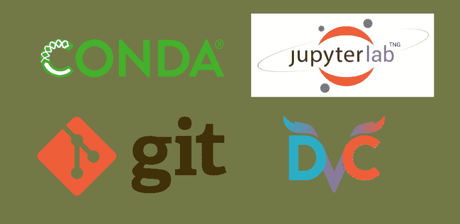

# 创建可靠的数据科学开发环境

> 原文：<https://towardsdatascience.com/creating-a-solid-data-science-development-environment-60df14ce3a34?source=collection_archive---------11----------------------->

## 如何使用 Conda、Git、DVC 和 JupyterLab 来组织和复制您的开发环境。



# 1.介绍

开始一个数据科学项目通常很有趣，至少在开始的时候是这样。你得到一些数据，开始提问并探索它，制作一些图，尝试一些模型，几分钟后，你有一堆有趣而混乱的见解和更多的数据争论要做。然后你意识到你必须整理你的 Jupyter 笔记本，开始注释和版本化你的代码，并且你需要花一些时间在你的分析中“不那么有趣”的部分。如果您需要与他人分享您的发现，或者将模型投入生产，那么前面会有更多的问题，因为您发现您并不确切知道在您的分析过程中使用了哪些库和版本。

一般来说，我们数据科学家倾向于更关注结果(模型、可视化等)而不是过程本身，这意味着我们没有像软件工程师那样足够重视文档和版本控制。

既然如此，就有必要使用当今可用的适当工具，为数据科学项目的开发建立良好的实践。

**目标:**本文的目标是为数据科学家提供工具和方向，通过使用四个关键工具:Conda、Git、DVC 和 JupyterLab，以可靠和可重复的方式管理他们的项目。本教程结束时，您将能够创建一个存储库，对您的脚本、数据集和模型进行版本化，并在新机器上复制相同的开发环境。

本教程是在运行 Ubuntu 18.04 的 Linux 机器上完成的，但是可以很容易地在 Mac 或 Windows 上使用其他命令行包管理器复制，如[家酿](https://brew.sh/) (Mac)，或[巧克力](https://chocolatey.org/products#foss) (Windows)。

此外，我们将使用 S3 自动气象站来存储我们与 DVC 的数据文件。要遵循教程中的相同步骤，您需要一个安装并配置了 [awscli](https://aws.amazon.com/cli/?nc1=h_ls) 的 [AWS](https://aws.amazon.com/?nc1=h_ls) 帐户。

遵循本教程创建的项目资源库可以在我的 [GitHub 页面](https://github.com/GabrielSGoncalves/DataScience_DevEnv)上访问。

# 2.工具

## 康达

[Conda](https://docs.conda.io/en/latest/) 是一个环境和包管理器，可以代替 Python 中的 [pipenv](https://github.com/pypa/pipenv) 和 [pip](https://pip.pypa.io/en/stable/) 。它是专注于数据科学的 Python(和 R)发行版 [Anaconda](https://www.anaconda.com/) 的一部分。您可以选择安装完整版(Anaconda，大约 3GB)或轻型版(Miniconda，大约 400MB)。我推荐使用 Miniconda，因为你将只安装你需要的库。关于更广泛的评论，请查看 Gergely Szerovay 关于 Conda 的文章[。](https://medium.com/u/345a0f19db9c?source=post_page-----60df14ce3a34--------------------------------)

## 饭桶

Git 是一个管理软件开发的版本控制系统。使用 Git，您可以跟踪对存储在存储库文件夹中的代码所做的所有更改。你通常使用云服务如 [GitHub](https://github.com/) 、 [Bitbucket](https://bitbucket.org) 或 [GitLab](https://about.gitlab.com/) 连接到你的本地存储库来管理和存储你的存储库。我们将使用 GitHub 来存储我们的项目资源库，因此您需要一个活动帐户来遵循教程的步骤。

## DVC

[DVC](https://dvc.org/) (数据版本控制)是管理数据集和机器学习模型的 Git 等价物。你通过 DVC 将你的 Git 库链接到云(AWS，Azure，Google Cloud Platform 等)或本地存储来存储大文件，因为 Git 不适合大于 100MB 的文件。关于 DVC 的完整教程，请看看 Dmitry Petrov 的文章。

## JupyterLab

JupyterLab 是一个用于 Jupyter 笔记本、代码和数据的交互式开发环境。这是 Jupyter 项目的最新版本，它提供了传统 Jupyter 笔记本的所有功能，界面更加坚固。笔记本电脑在数据科学项目中非常受欢迎，因为它提供了一种动态探索数据的好方法。

## 代码编辑器和 Git 客户端

代码编辑器是程序员必备的工具，如今有很多开源和付费的选项。因此，请随意选择更适合您需求的[代码编辑器。](https://www.software.com/review/ranking-the-top-5-code-editors-2019)

Git 客户端是为你的代码版本化提供图形用户界面的工具，并且可以成为帮助你管理项目的工具集的有趣补充。

# 3.安装 Git 和 Conda

为了开始组织我们的开发环境，我们首先需要安装工具。我们将从安装 Git (1)开始，并使用我们的终端配置它(2)。

```
**# 1) Install Git** sudo apt-get install git**# 2) Configure your Git account** git config --global user.name "Your Name" 
git config --global user.email "yourmail@mail.com"
```

接下来，我们将安装 Miniconda，方法是下载它的最新版本(3)，更改安装文件的权限(4)并运行它(5)。将 Miniconda 文件夹添加到您的系统路径(6)也很重要，只需在终端上键入 *conda* 即可运行它的命令。

```
**# 3) Download Miniconda latest release for Linux** wget https://repo.continuum.io/miniconda/Miniconda3-latest-Linux-x86_64.sh**# 4) Change the permission to run the Miniconda bash file** chmod +x Miniconda3-latest-Linux-x86_64.sh**# 5) Run Miniconda installation file** ./Miniconda3-latest-Linux-x86_64.sh**# 6) Export the path to Miniconda installation folder** export PATH=/home/YOURNAME/miniconda3/bin:$PATH
```

# 4.配置开发环境

现在我们已经安装了工具，是时候开始设置我们的开发环境了。

## 创建项目 Git 存储库

首先，我们将使用 GitHub 信息定义变量(8)，在 GitHub 上创建一个远程存储库(9)，并检查创建是否成功(10)。接下来，我们创建一个本地文件夹来存储我们的项目存储库(11)和自述文件(12)。然后，我们启动我们的本地 Git 存储库(13)并将我们的第一个提交推送到 GitHub (14)。

```
**# 8) Define the your GitHub information as variables** GitHubName=<YourGitHubName>
GitHubPassword=<YourGitHubPassword>**# 9) Create a new git repository on GitHub 
#    named "DataScience_DevEnv"** curl -u $GitHubName:$GitHubPassword [https://api.github.com/user/repos](https://api.github.com/user/repos) -d '{"name":"DataScience_DevEnv"}'**# 10) Check if your new repository is available on GitHub**
curl "https://api.github.com/users/$GitHubName/repos?per_page=100" | grep -w clone_url | grep -o '[^"]\+://.\+.git'**# 11) Create a folder with the name of your repository** mkdir DataScience_DevEnv
cd DataScience_DevEnv**# 12) Create a README file for your repository** echo "# Data Science development environment repository" >> README.md**# 13) Initiate our local Git repository** git init**# 14) Add, commit and push README.md to GitHub** git add README.md
git commit -m "first commit with README file"
git remote add origin https://github.com/GabrielSGoncalves/DataScience_DevEnv.git
git push -u origin master
```

我们可以在 GitHub 页面上检查一下，是否在第一次提交时正确地创建了包含 README 文件的存储库。

## 用康达创造环境

现在我们已经设置好了 Git 存储库，我们将创建我们的 conda 环境(15)。我们只需要定义我们的环境的名称(-n)、python 版本和我们想要安装的库(例如 pandas 和 scikit-learn)。创建完成后，我们只需要输入`conda activate`和环境名(16)。

```
**# 15) Create o Conda environment** conda create -n datascience_devenv python=3.7 pandas scikit-learn**# 16) Activate your environment** conda activate datascience_devenv
```

## 在我们的环境中安装 JupyterLab、DVC 和其他库

现在，我们正在我们的 conda 环境中工作，我们可以安装 JupyterLab (17)和 DVC (18)。使用 conda 的另一个好处是它也可以用来安装包，就像我们使用 pip 一样。

```
**# 17) Install JupyterLab with
# conda**
conda install -c conda-forge jupyterlab**# or pip** pip install jupyterlab**# 18) Install DVC with
# conda**
conda install -c conda-forge dvc**# or pip** pip install dvc
```

我们可以使用命令`list` (19)列出当前环境中可用的库。我们还可以使用 conda 或 pip (20)为您的环境生成需求文件。

```
**# 19) List your packages installed
# with conda**
conda list**# with pip** pip list**# 20) Create requirements file
# with conda**
conda list --export > requirements.txt**# with pip**
pip freeze > requirements.txt
```

## DVC 和附属国

要使用 DVC 来存储您的大数据文件，您需要配置一个远程存储文件夹。我们将在我们的教程中使用 AWS S3，但你有[其他选项](https://dvc.org/doc/get-started/configure)(本地文件夹、Azure Blob 存储、谷歌云存储、安全外壳、Hadoop 分布式文件系统、HTTP 和 HTTPS 协议)。在 DVC 安装过程中，您必须定义将要使用的存储类型，并在括号(21)中指定。在为 DVC 安装了 AWS S3 依赖项之后，我们初始化我们的 DVC 存储库(22)。接下来，我们将在存储库中创建一个名为`data`的文件夹来存储我们的数据文件，并用 DVC (23)进行版本控制。然后，我们创建一个 S3 存储桶来远程存储我们的数据文件(24)。重要的是要记住，我们已经用 IAM 凭证配置了 awscli，以便使用终端运行 AWS 命令。创建 S3 存储桶后，我们将其定义为我们的 DVC 远程文件夹(25)，并检查最后一步是否被接受(26)。现在我们可以下载一个 csv 文件到我们的`data`文件夹(27)，并开始用 DVC (28)对它进行版本控制。

```
**# 21) Install DVC and its dependecies for connection with S3** pip install dvc[s3]**# 22) Initialize DVC repository** dvc init**# 23) Create folder on repository to store data files** mkdir data**# 24) Create S3 bucket** aws s3 mb s3://dvc-datascience-devenv**# 25) Define the new bucket as remote storage for DVC** dvc remote add -d myremote s3://dvc-datascience-devenv**# 26) List your DVC remote folder** dvc remote list **# 27) Download data file** wget -P data/ [https://dvc-repos-gsg.s3.amazonaws.com/models_pytorch_n_params.csv](https://dvc-repos-gsg.s3.amazonaws.com/models_pytorch_n_params.csv)**# 28) Add data file to DVC** dvc add data/models_pytorch_n_params.csv
```

每当我们向 dvc 添加文件时，它都会创建一个. DVC 文件，该文件跟踪对原始文件所做的更改，并且可以用 Git 进行版本控制。DVC 还在`data`文件夹中创建了一个. gitignore，并将数据文件添加到其中，这样 Git 就可以忽略它，我们不需要手动设置它(29)。最后，我们使用 DVC (30)将数据文件推送到我们的远程文件夹(我们创建的 S3 桶)。

```
**# 29) Start tracking DVC file and .gitignore with Git** git add data/.gitignore data/models_pytorch_n_params.csv.dvc
git commit -m "Start versioning csv file stored with DVC on S3 bucket"
git push**# 30) Push data file to DVC remote storage on S3 bucket** dvc push
```

DVC 还可以帮助我们建立管道和进行实验，使测试和重现特定的 ETL 步骤变得更加容易。有关 DVC 功能的更多信息，请查看 [Gleb Ivashkevich](https://medium.com/u/91810d41d974?source=post_page-----60df14ce3a34--------------------------------) 的[文章](https://medium.com/y-data-stories/creating-reproducible-data-science-workflows-with-dvc-3bf058e9797b)。

## JupyterLab 内核

安装 JupyterLab 后，我们可以在终端上输入`jupyter lab`来运行它。作为默认设置，JupyterLab 使用我们的基本 Python 安装作为内核，所以如果我们尝试导入您安装在我们新创建的 conda 环境(而不是基本 Python 环境)上的库，我们将得到一个`ModuleNotFoundError`。为了解决这个问题，我们需要从我们的环境(32)中安装 ipython 内核(31)。通过这样做，我们将拥有一个与我们的 conda 环境相对应的内核，因此每个已安装和新安装的库都将在我们的 JupyterLab 环境中可用。我们还可以检查安装在我们机器上的可用 Jupyter 内核(33)。

```
**# 31) Install ipython using conda** conda install ipykernel**# 32) Install your kernel based on your working environment**ipython kernel install --user --name=datascience_devenv**# 33) List the kernels you have available** jupyter kernelspec list
```

## 导出我们的康达环境

正如在简介中提到的，一个可靠的开发环境的一个重要方面是容易复制它的可能性。一种方法是将关于 conda 环境的信息导出到 YAML 文件(34)。记住，为了做到这一点，你需要先激活环境。

```
**# 34) To export your current conda environment to YAML** conda env export > datascience_devenv.yaml**# 35) Add the yaml file to our GitHub repository** git add datascience_devenv.yaml
git commit -m 'add environment yaml to repo'
git push
```

## 我们项目存储库的结构

到目前为止，我们的项目存储库具有以下结构(36)。

```
**# 36) Project repository structure** tree.
├── data
│   ├── models_pytorch_n_params.csv
│   └── models_pytorch_n_params.csv.dvc
├── datascience_devenv.yaml
├── README.md
└── requirements.txt
```

如果我们在命令`tree`中使用参数`-a`，我们可以更好地理解构成 Git 和 DVC (37)的配置文件。如前所述，DVC 为我们添加的每个数据文件创建了一个. gitignore，这样 Git 就可以避免跟踪它。

```
**# 37) Detailed repository structure**
tree -a
.
├── data
│   ├── .gitignore
│   ├── models_pytorch_n_params.csv
│   └── models_pytorch_n_params.csv.dvc
├── datascience_devenv.yaml
├── .dvc
│   ├── cache
│   │   └── 6f
│   │       └── 387350081297a29ecde86ebfdf632c
│   ├── config
│   ├── .gitignore
│   ├── state
│   ├── tmp
│   └── updater
├── .git
│   ├── branches
│   ├── COMMIT_EDITMSG
│   ├── config
│   ├── description
│   ├── HEAD
│   ├── hooks
│   │   ├── applypatch-msg.sample
│   │   ├── commit-msg.sample
│   │   ├── fsmonitor-watchman.sample
│   │   ├── post-update.sample
│   │   ├── pre-applypatch.sample
│   │   ├── pre-commit.sample
│   │   ├── prepare-commit-msg.sample
│   │   ├── pre-push.sample
│   │   ├── pre-rebase.sample
│   │   ├── pre-receive.sample
│   │   └── update.sample
│   ├── index
│   ├── info
│   │   └── exclude
│   ├── logs
│   │   ├── HEAD
│   │   └── refs
│   │       ├── heads
│   │       │   └── master
│   │       └── remotes
│   │           └── origin
│   │               └── master
│   ├── objects
│   │   ├── 10
│   │   │   └── c06accd2ad99b6cde7fc6e3f3cd36e766ce88f
│   │   ├── 19
│   │   │   └── 193f4a173c56c8d174ecc19700204d250e9067
│   │   ├── 4e
│   │   │   └── 0790499d1d09db63aaf1436ddbd91bfa043058
│   │   ├── 52
│   │   │   └── 4cb7d319626c1bcf24ca5184d83dc1df60c307
│   │   ├── 5f
│   │   │   └── 694b1bd973389b9c0cdbf6b6893bbad2c0ebc6
│   │   ├── 61
│   │   │   └── d5f990a1bee976a2f99b202f1dc14e33b43702
│   │   ├── 67
│   │   │   └── 3b06660535a92d0fdd72fe51c70c9ada47f22d
│   │   ├── 70
│   │   │   └── 1490f13b01089d7da8fa830bae3b6909d12875
│   │   ├── 72
│   │   │   └── a0ddbcc242d223cd71ee5a058fc99de2fa53cc
│   │   ├── a3
│   │   │   └── b5ebf7e3b752fa0da823aeb258b96e007b97ef
│   │   ├── af
│   │   │   └── 8017769b22fcba5945e836c3c2d454efa16bd1
│   │   ├── c1
│   │   │   └── 694ff5e7fe6493206eebf59ac31bf493eb7e6b
│   │   ├── d7
│   │   │   └── 39682b1f99f9a684cecdf976c24ddf3266b823
│   │   ├── e4
│   │   │   └── 5eca3c70f6f47e0a12f00b489aabc526c86e8b
│   │   ├── e6
│   │   │   └── 9de29bb2d1d6434b8b29ae775ad8c2e48c5391
│   │   ├── ee
│   │   │   └── 75f0e66a68873ac2f767c212c56411cd729eb2
│   │   ├── info
│   │   └── pack
│   └── refs
│       ├── heads
│       │   └── master
│       ├── remotes
│       │   └── origin
│       │       └── master
│       └── tags
├── README.md
└── requirements.txt
```

接下来，我们[在你的存储库的根目录下为我们不想跟踪的其他文件创建一个. gitignore](https://raddevon.com/articles/adding-to-gitignore-from-the-terminal/) (例如 Python 编译的字节码文件。pyc)与 Git (38)。

```
**# 38) Add .gitignore for script files on our repository** echo "*.pyc" >> .gitignore
git add .gitignore
git commit -m 'Add .gitignore for regular files'
git push
```

现在我们已经配置好了开发环境，并且准备好了。我们的 JupyterLab 拥有与我们的 conda 环境相匹配的内核，我们的数据文件由 DVC 进行版本控制，我们的 Git 存储库正在跟踪其余的文件。因此，对我们项目所做的任何更改都将被记录下来，并且可以很容易地被复制和跟踪。

# 5.复制我们的开发环境

在设置我们的 Git 存储库和配置我们的 DVC 存储文件夹之后，我们可以在任何新机器上复制它。简单地克隆存储库(39)，从 YAML 文件创建一个 conda 环境(40)，激活它(41)，为我们的环境创建一个 JupyterLab 内核(42)，最后使用 DVC 从 S3 桶拉数据文件(43)。

```
**# 39) On a new machine, clone the repository** git clone [https://github.com/$GitHubName/DataScience_DevEnv.git](https://github.com/GabrielSGoncalves/DataScience_DevEnv.git)**# 40) Create conda environment** conda env create --file=datascience_devenv.yaml**# 41) Activate environment** conda activate datascience_devenv**# 42) Install the JupyterLab kernel** ipython kernel install --user --name=datascience_devenv**# 43) Pull the data file from the S3 bucket using DVC** dvc pull
```

因此，我们可以在一台新机器上拥有完全相同的开发环境(包括数据文件和已安装的库)，只需要 5 条命令。

# 7.结论

在本文中，我们展示了为数据科学家创建可靠且可重复的开发环境的关键工具。我们相信，通过在项目开发中使用最佳实践，数据科学是一个可以变得更加成熟的领域，康达、Git、DVC 和 JupyterLab 是这种新方法的关键组成部分

要了解更多关于实践和方法的数据科学开发环境的观点，请看看[威尔·科尔森](https://medium.com/u/e2f299e30cb9?source=post_page-----60df14ce3a34--------------------------------)的[文章](/how-to-avoid-common-difficulties-in-your-data-science-programming-environment-1b78af2977df)。

# 非常感谢你阅读我的文章！

*   你可以在我的[个人资料页面](https://medium.com/@gabrielsgoncalves) **找到我的其他文章🔬**
*   如果你喜欢并且**想成为中级会员**，你可以使用我的 [**推荐链接**](https://medium.com/@gabrielsgoncalves/membership) 来支持我👍

# 更多资源

[](https://medium.com/@gergoszerovay/why-you-need-python-environments-and-how-to-manage-them-with-conda-protostar-space-cf823c510f5d) [## 为什么需要 Python 环境以及如何使用 Conda-protostar . space 管理它们

### 我不应该只安装最新的 Python 版本吗？

medium.com](https://medium.com/@gergoszerovay/why-you-need-python-environments-and-how-to-manage-them-with-conda-protostar-space-cf823c510f5d) [](https://blog.dataversioncontrol.com/data-version-control-tutorial-9146715eda46) [## 数据版本控制教程

### 2019 年 3 月 4 日更新:本教程中的代码示例已经过时。请使用更新的教程…

blog.dataversioncontrol.com](https://blog.dataversioncontrol.com/data-version-control-tutorial-9146715eda46) [](https://blog.jupyter.org/jupyterlab-is-ready-for-users-5a6f039b8906) [## JupyterLab 已经为用户准备好了

### 我们很自豪地宣布 JupyterLab 的测试版系列，这是 Project…

blog.jupyter.org](https://blog.jupyter.org/jupyterlab-is-ready-for-users-5a6f039b8906) [](https://medium.com/y-data-stories/creating-reproducible-data-science-workflows-with-dvc-3bf058e9797b) [## 使用 DVC 创建可重复的数据科学工作流

### “入门”教程进入 DVC，在你的日常管理工作中建立一个结构和秩序

medium.com](https://medium.com/y-data-stories/creating-reproducible-data-science-workflows-with-dvc-3bf058e9797b) [](https://raddevon.com/articles/adding-to-gitignore-from-the-terminal/) [## 快速添加到。从终端 gitignore

### 我不久前学了一个技巧来创造我的。gitignore 文件(并添加到它)很快从终端。这里有一个常见的…

raddevon.com](https://raddevon.com/articles/adding-to-gitignore-from-the-terminal/) [](https://www.software.com/review/ranking-the-top-5-code-editors-2019) [## 2019 年排名前 5 的代码编辑器

### 自从微软的 Visual Studio 代码推出以来，代码编辑器大战真的白热化了。有这么多…

www.software.com](https://www.software.com/review/ranking-the-top-5-code-editors-2019) [](https://www.fossmint.com/gui-git-clients-for-mac/) [## Mac 的 10 个最佳 GUI Git 客户端

### Git 是一个版本控制系统，用于跟踪文件变化。通常用于团队环境，尤其是…

www.fossmint.com](https://www.fossmint.com/gui-git-clients-for-mac/) [](/how-to-avoid-common-difficulties-in-your-data-science-programming-environment-1b78af2977df) [## 如何避免数据科学编程环境中的常见困难

### 减少编程环境中的附带问题，这样您就可以专注于重要的数据科学问题。

towardsdatascience.com](/how-to-avoid-common-difficulties-in-your-data-science-programming-environment-1b78af2977df)