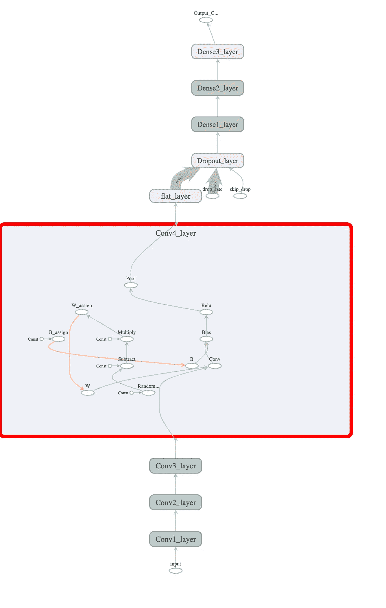
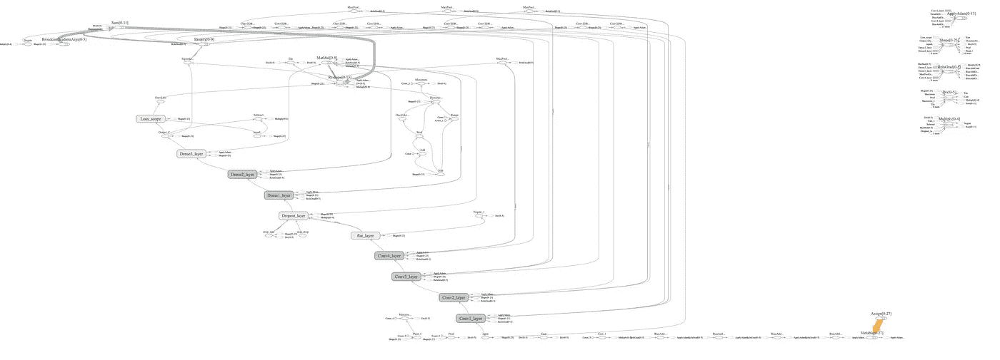

# 用 C++创建 TensorFlow CNN(第 2 部分)

> 原文：<https://towardsdatascience.com/creating-a-tensorflow-cnn-in-c-part-2-eea0de9dcada?source=collection_archive---------6----------------------->

## *在这篇文章中，我将展示如何使用 TensorFlow C++ API 创建、训练和测试一个卷积神经网络*

# 背景

最近两年，谷歌的 TensorFlow 越来越受欢迎。它是迄今为止最受欢迎的深度学习框架，与 Keras [一起，它是最主要的](/deep-learning-framework-power-scores-2018-23607ddf297a)框架。

现在有了版本 2，TensorFlow 包含了 Keras 构建的内容。

然而，当谈到 C++ API 时，你真的找不到太多关于使用它的信息。大多数代码示例和文档都是用 Python 编写的。正如我在以前的帖子中提到的，我希望允许 C++用户，比如我自己，使用 TensorFlow C++ API，这是一个低级 API，这实际上意味着您必须投入更多的工作来实现它。我的帖子是来帮助你的。

就像我过去写的，我喜欢 C++。我并不反对 Python，但是我希望能够用 C++来构建我的模型，并且拥有工具生态系统来帮助我调试和优化它。

我阅读了文档，并寻找将向我展示如何创建卷积神经网络的代码示例。有几个例子，这里的和这里的启发了我。仅此而已！

我必须对一些 API 进行逆向工程，经历了大量的试验和错误，直到它工作为止。

我希望这篇文章能够帮助那些想开始使用 C++ API 的人。

我在 MacOS 上使用 XCode，但我试图以一种在 Windows 或 Linux 上也能工作的方式构建代码。我没有测试过，所以如果你有任何改变的建议，请告诉我。

# 设置

我假设您已经安装了 TensorFlow，并且有一个 XCode 项目可以使用它。如果你需要这方面的帮助，请阅读并遵循我的指示[这里](https://itnext.io/how-to-use-your-c-muscle-using-tensorflow-2-0-and-xcode-without-using-bazel-builds-9dc82d5e7f80)。

正如我在[第 1 部分](https://itnext.io/creating-a-tensorflow-dnn-in-c-part-1-54ce69bbd586)中所写的，我们的目标是实现 Arden Dertat 著名文章系列第 4 部分中的 AlexNet 缩减版。

我还假设你知道卷积网络的术语，如果没有，我建议你阅读 Arden 的文章。

为了获得训练数据，您需要从 [Kaggle](https://www.kaggle.com/c/dogs-vs-cats) 下载图像。

从[这里](https://s3.amazonaws.com/img-datasets/cats_and_dogs_small.zip)下载小版本。那里有足够的图像供我们使用。

提取文件，并将它们放在项目文件夹下的数据文件夹中。

它应该是有组织的，所以你有三个子文件夹用于训练，验证和测试。

# 密码

这篇文章的代码可以在[这里](https://github.com/bennyfri/TFMacCpp)找到。

有一个驱动执行的 main.cpp 和两个类文件 CatDogCNN.cpp 和 CatDogCNN.h，它们是网络本身的实现。

mainV1.cpp 是前面的文章代码。

通常，在为 TensorFlow 编写代码时，将图形的创建与其实际运行分开是明智的。这是由于一个简单的事实，即您通常创建一次图表，然后用不同的输入运行多次。即使你不改变图的变量(如权重)，也没有必要在每次运行图时重新创建图，除非它非常简单，并且分离的努力是无用的。

# 完成数据准备

CreateGraphForImage 是一个创建类似于我在[第一部分](https://itnext.io/creating-a-tensorflow-dnn-in-c-part-1-54ce69bbd586)中展示的图形的方法。

它接受是否拆分图像的布尔值。当您只想加载一个图像时调用 false，当您想加载一批图像时调用 true。这是因为堆叠批次时会增加一个额外的尺寸。但是，当你想运行 CNN 只有一个图像，你需要有所有 4 个维度。

请注意，当从拆分更改为堆叠时，您必须重新创建图形。

ReadTensorFromImageFile 负责运行由前面的方法创建的图形。你输入一个文件的完整路径名，得到一个 3 或 4 维张量。

这两种方法的代码几乎与 mainV1.cpp(文章第 1 部分)中的代码相同。

## 处理文件夹和路径

ReadFileTensors 处理文件夹和文件。它接受一个基本文件夹字符串和一个向量对[子文件夹，标签值]。

如果你从 Kaggle 下载了图片，你可能会注意到在 train 下有两个子文件夹 cats 和 dogs。用一个数字标记它们中的每一个，并将这些对作为输入进行传递。

返回的是一对向量，每一对向量都是一个张量(图像的)和一个标签。

这里有一种说法:

```
base_folder = "/Users/bennyfriedman/Code/TF2example/TF2example/data/cats_and_dogs_small/train";vector<pair<Tensor, float>> all_files_tensors;model.ReadFileTensors(base_folder, {make_pair("cats", 0), make_pair("dogs", 1)}, all_files_tensors);
```

我们需要打开一个目录，读取其中的文件，然后一个一个地检查。

要连接两个路径字符串，请使用 io::JoinPath(包括 tensorflow/core/lib/io/path.h)

```
string folder_name = io::JoinPath(base_folder_name, “cats”);
```

要与文件系统交互，请使用“Env”。这是一个实用程序类(没有真正的文档记录),它为您提供了类似于 C++17 std::filesystem 的便利。

```
Env* penv = Env::Default();TF_RETURN_IF_ERROR(penv->IsDirectory(folder_name));vector<string> file_names;TF_RETURN_IF_ERROR(penv->GetChildren(folder_name, &file_names));for(string file: file_names){…}
```

ReadFileTensors 还会打乱矢量中的图像，这样我们就可以在训练时输入不同的图像(你不会想先喂所有的猫，然后再喂所有的狗)。

## 创建批处理

ReadBatches 封装了所有的逻辑 main 需求。你给它一个基本文件夹，一对子文件夹和标签的向量，以及一个批处理的大小。作为回报，你得到两个张量向量，一个用于图像，一个用于标签。每个张量都是按照你传递的大小一批图像/标签。

首先，它将文件夹及其子文件夹的内容读入一个向量。接下来，它会计算如何拆分批次。然后，它断开张量和标签对以创建两个输入向量，其中张量向量中的每个第 n 个元素匹配标签向量中的第 n 个元素。

为了堆叠这两个向量，我们当场创建一个小图，并在每次迭代中运行它。

结果被添加到输出向量中。

注意堆栈操作是如何需要得到一个要堆栈的图像张量的输入列表的。最简单的方法是创建一个 vector(或另一个容器)并用它实例化 InputList。

```
vector<Input> one_batch_image;one_batch_image.push_back(Input(tensor));//Add more tensorsInputList one_batch_inputs(one_batch_image);Scope root = Scope::NewRootScope();auto stacked_images = Stack(root, one_batch_inputs);ClientSession session(root);vector<Tensor> out_tensors;TF_CHECK_OK(session.Run({}, {stacked_images}, &out_tensors));//use out_tensors[0]
```

如上所述，张量以三维张量的形式出现，而创建的批次是四维的。

# CNN 图表

现在有趣的部分来了。

我们想创建一个类似于 AlexNet 的模型。

## 投入

首先，我们想要定义图形的输入:我们已经知道我们需要输入一批图像:

```
input_batch_var = Placeholder(t_root.WithOpName("input"), DT_FLOAT);
```

占位符类似于函数参数。您指定了它的名称和元素类型，但此时它的形状未知。

从占位符获取结果的变量是 CatDogCNN 类类型输出的成员。

首先，我们在图中使用它作为第一层的输入，稍后我们将需要在 ClientSession 运行命令中指定它及其值(批处理张量)。

接下来有几个占位符，我稍后会解释。

与通常的 Python Keras 网络不同，C++层是操作的组合(Google 称之为低级 API)。为了知道每个操作属于哪一层，我们为每一层创建一个子范围。

```
Scope scope_conv1 = t_root.NewSubScope("Conv1_layer");
```

将使用此范围对象创建操作。

## 盘旋

第一层是卷积层，所以我们需要定义 4 个参数:过滤器高度和宽度以及进出通道。此外，我们还有激活函数(Relu)和后面的 MaxPool 操作。

我们有 4 个 Conv 层，所以我创建了一个函数来创建一个包含这些操作的通用层:

```
Input CatDogCNN::AddConvLayer(string idx, Scope scope, int in_channels, int out_channels, int filter_side, Input input){TensorShape sp({filter_side, filter_side, in_channels, out_channels});m_vars["W"+idx] = Variable(scope.WithOpName("W"), sp, DT_FLOAT);m_shapes["W"+idx] = sp;m_assigns["W"+idx+"_assign"] = Assign(scope.WithOpName("W_assign"), m_vars["W"+idx], XavierInit(scope, in_channels, out_channels, filter_side));sp = {out_channels};m_vars["B"+idx] = Variable(scope.WithOpName("B"), sp, DT_FLOAT);m_shapes["B"+idx] = sp;m_assigns["B"+idx+"_assign"] = Assign(scope.WithOpName("B_assign"), m_vars["B"+idx], Input::Initializer(0.f, sp));auto conv = Conv2D(scope.WithOpName("Conv"), input, m_vars["W"+idx], {1, 1, 1, 1}, "SAME");auto bias = BiasAdd(scope.WithOpName("Bias"), conv, m_vars["B"+idx]);auto relu = Relu(scope.WithOpName("Relu"), bias);return MaxPool(scope.WithOpName("Pool"), relu, {1, 2, 2, 1}, {1, 2, 2, 1}, "SAME");}
```

让我们回顾一下代码:

AddConvLayer 获取一个索引字符串(用于区分层)、子范围、输入和输出通道、过滤器大小(我们假设高度和宽度相同)和输入 Input。

通道中的第一层是图像的颜色数(3 种颜色)，输入是图像张量。

Conv2D 操作需要一个张量变量来保存不同的滤波器(第一层中的 32 个)。当网络在训练时，这个变量将在每一步内改变。

出于这个原因，有一个成员映射 m_vars 保存这些变量以及偏差。此外，我们需要存储这些变量的形状(m_shapes map)，我们还需要用值初始化这些变量(类似于 Python 变量初始化器)——这些操作存储在 m_assigns 中。Xavier 初始化现在很流行，所以我为 Conv 和 Dense 实现了 XavierInit。

在 Conv2D 之后，调用 BiasAdd 来添加偏置(初始化为 0)。

接下来是对 Relu 的调用，然后是对 MaxPool 的调用。

请注意，对于 Python Keras 版本中的 MaxPool，您只需指定窗口大小及其两个维度(例如 2，2)。这里我们需要提供两个四维的形状(窗口大小和跨度)。要将每层中的图像大小减半，必须在窗口大小和步幅中输入 1，2，2，1。

还要注意，在 CreateGraphForCNN 函数中，我跟踪了进出通道的大小，因为它们必须在层之间匹配。

此外，由于没有办法从运算中得到张量的形状(只有在运行时才知道)，我们必须在每一步中计算图像的大小。

## 平的

扁平化意味着我们将只有两个维度，批处理和平面数据。

为此，我们需要重塑张量。因为我不想硬编码批处理大小(我不知道它是否会被批处理)，所以我必须知道平面数据的大小。这就是为什么我在这些层中做这些计算，直到我们得到 flat_len。

```
auto flat = Reshape(flatten, pool4, {-1, flat_len});
```

在 Reshape 中，您可以在其中一个维度中传递-1，因此它将被自动计算。整形不会添加数据，只会改变数据的组织方式。

## 拒绝传统社会的人

这一层负责丢弃随机的神经元，这样网络就不会过度适应。

我们创建一个具有相同形状的新张量，并根据丢弃率随机填充 0 或 1，然后用它乘以我们的数据。

然而，当你想要验证或预测时，你不想放弃神经元。

实现这一点的逻辑方法是在图中放置一个条件。有一些操作以一种非常麻烦的方式支持它(切换和合并)，但是在 C++中它们不支持反向传播，所以我们不能使用它们。

相反，我向网络 drop_rate 和 skip_drop 引入了另外两个输入参数，例如，如果您分别传递 0.4 和 0，就会得到 40%的丢弃。如果你通过 1 和 1，就不会有水滴。

```
Scope dropout = t_root.NewSubScope("Dropout_layer");auto rand = RandomUniform(dropout, Shape(dropout, flat), DT_FLOAT);//binary = floor(rand + (1 - drop_rate) + skip_drop)auto binary = Floor(dropout, Add(dropout, rand, Add(dropout, Sub(dropout, 1.f, drop_rate_var), skip_drop_var)));auto after_drop = Multiply(dropout.WithOpName("dropout"), Div(dropout, flat, drop_rate_var), binary)
```

丢弃时，我们通过除以丢弃率来增加剩余神经元的值。

注意，当 skip_drop 为 1 时，floor 会将“二进制”变为全 1。

## 完全连接(密集)

接下来是三个致密层。

密集是基于乘以权重并加上偏差。我们将变量保存在地图中，对形状和赋值也是如此。

我们还用 Xavier init 初始化权重，用 0 初始化偏差。

注意，在最后一个密集层中，我们需要跳过 Relu 激活(为此我们有细菌培养)。

## 二元分类

最后的致密层将尺寸减小到 1(超过批量尺寸)。这就是所谓的逻辑。

为了使逻辑值为 0(代表猫)或 1(代表狗),我们调用 Sigmoid 并返回这个结果。

这就是打开 TensorBoard 时网络的样子(详见第 1 部分):



The CNN before we add optimization

我打开了其中一个子范围，这样你就可以看到第四个卷积层中的低级操作。

## 优化图(反向传播)

这封装在 CreateOptimizationGraph 函数中。它不是一个单独的图，而是同一个图中的附加节点(同一个 t_root 主作用域)。

我们从标签的占位符开始。如果图像张量是 x，这是 y。

接下来我们计算损失。这是一个分类问题，所以我们应该使用交叉熵，但是我不知道如何使用 SoftmaxCrossEntropyWithLogits 操作，也找不到任何有意义的信息，所以我必须使用常规的均方 diff 方法。

```
input_labels_var = Placeholder(t_root.WithOpName("inputL"), DT_FLOAT);Scope scope_loss = t_root.NewSubScope("Loss_scope");out_loss_var = Mean(scope_loss.WithOpName("Loss"), SquaredDifference(scope_loss, out_classification, input_labels_var), {0});TF_CHECK_OK(scope_loss.status());
```

接下来，我收集所有的权重和偏差，并将它们和损失一起发送给神奇的 API 调用 AddSymbolicGradients。这个神奇的功能不是手术。它获取一个图(通过其相关范围)，添加所有相关的反向传播操作，并返回一个梯度向量，其大小与权重和偏差的数量相同。

然后，我们对权重和偏差中的每个变量使用 ApplyAdam 及其各自的梯度。

```
auto adam = ApplyAdam(t_root, i.second, m_var, v_var, 0.f, 0.f, learning_rate, 0.9f, 0.999f, 0.00000001f, {grad_outputs[index]});v_out_grads.push_back(adam.operation);
```

出于某种原因，m_var 和 v_var 必须是变量(它们不能是常数)。

传递给 ApplyAdam 的最重要的变量是学习率。我怎么强调这个价值的重要性都不为过。我从 0.001(来自 python 版本)开始，无法停止对为什么损失不收敛的困惑。最终我意识到优化函数在两个峰值之间跳得太长了。仅仅过了几天，当我把它改成 0.0001 时，它就开始工作了。您可以尝试不同的值，看看它在您的情况下是如何工作的。

你也可以改变 ApplyAdam 得到的其他值，尽管我不确定这会有什么影响。

现在，张量板图像看起来“有点”不同:



The CNN with optimization

## 初始化

我已经提到了用赋值操作初始化所有变量的需要。

我们将所有 m_assigns 元素(也是我们为 ApplyAdam 添加的元素)收集到一个 vector 中，并在创建的会话中运行它们。

```
vector<Output> ops_to_run;for(pair<string, Output> i: m_assigns)ops_to_run.push_back(i.second);t_session = unique_ptr<ClientSession>(new ClientSession(t_root));TF_CHECK_OK(t_session->Run(ops_to_run, nullptr));
```

保留摘要文件编写器代码周围的注释，仅当您想要为 TensorBoard 可视化生成新图形时才使用它。

# 培养

让我们回到 main:我们构造了 CatDogCNN 类的一个实例，创建了图形，加载了图像并运行了初始化。

现在是主历元/步长循环的时间。

一个历元是贯穿所有训练数据的一次运行。一个步骤是一批图像的一次运行。

我们定义历元的数量，遍历它们，然后遍历批。

在每次迭代中，我们调用 TrainCNN，我们调用 ValidateCNN，我们做一些计算来检查网络的性能。

TrainCNN 得到一批图像，一批标签(对应这些图像)并返回结果和损失。

该函数首先运行批处理:

```
vector<Tensor> out_tensors;//Inputs: batch of images, labels, drop rate and do not skip drop.//Extract: Loss and result. Run also: Apply Adam commandsTF_CHECK_OK(t_session->Run({{input_batch_var, image_batch}, {input_labels_var, label_batch}, {drop_rate_var, 0.5f}, {skip_drop_var, 0.f}}, {out_loss_var, out_classification}, v_out_grads, &out_tensors));
```

然后它计算精确度。注意使用张量方法来提取数据:out_tensors[0]。标量 <float>()(0)得到一个标量和 out_tensors[1]。matrix <float>()得到一个矩阵(几乎就像向量的向量)。</float></float>

## 确认

验证是重要的，因为事实上我们运行的网络图像，网络从未见过。如果在每一个时期我们都有更好的表现，我们就不会过度适应。

```
vector<Tensor> out_tensors;//Inputs: batch of images, drop rate 1 and skip drop.TF_CHECK_OK(t_session->Run({{input_batch_var, image_batch}, {drop_rate_var, 1.f}, {skip_drop_var, 1.f}}, {out_classification}, &out_tensors));
```

请注意不同之处:我们跳过了漏失(见上面的解释)，我们不评估损失，我们不运行梯度。

输出控制台如下所示:

```
Epoch 1/20:....................................................................................................Validation:..................................................Time: 74 seconds Loss: 0.243231 Results accuracy: 0.561 Validation accuracy: 0.642Epoch 2/20:....................................................................................................Validation:..................................................Time: 72 seconds Loss: 0.203312 Results accuracy: 0.6875 Validation accuracy: 0.692***Epoch 20/20:....................................................................................................Validation:..................................................Time: 73 seconds Loss: 0.041021 Results accuracy: 0.956 Validation accuracy: 0.742
```

损失在持续下降，结果准确率将达到 95%，验证准确率将达到 75%。

# 测试

我们来测试一下训练好的网络。

为此，我们需要重新创建负载图像图，这样它就不会散开。

然后我们调用 ReadFileTensors 来加载 test 子文件夹中的图像。最后，我们运行其中几个的循环，以查看网络的性能。

预测类似于验证，尽管它运行单个图像。

输出控制台如下所示:

```
Test number: 1 predicted: 0 actual is: 0Test number: 2 predicted: 1 actual is: 1***Test number: 20 predicted: 0 actual is: 0total successes: 16 out of 20
```

80%的准确率。有一些改进的空间，但是我们比 Arden 在他的网络上得到更好的结果。

# 摘要

我们看到了如何只用 C++和 TensorFlow API 实现、训练和测试 CNN。

我们看到了如何准备数据(用于训练、验证和测试的图像)以及如何对它们进行批处理，以便我们可以将这些批处理提供给 TensorFlow 低级 API。

我们实现了梯度和其他优化方法。

我们取得了良好的结果，但还有更多工作要做。

接下来我打算做一些改进。

正如你在控制台输出中看到的，我正在我的本地 MacBook Pro CPU 上运行，它需要很长时间才能运行…

我打算实现冻结模型功能和 GPU 的使用，以加快速度。

此外，我会看看我是否可以做一些图像增强，为培训创建更多的数据。