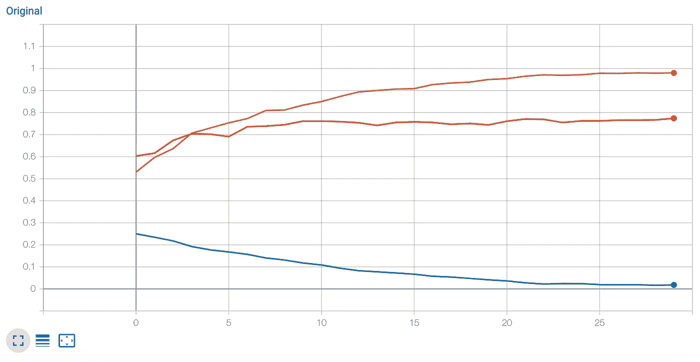
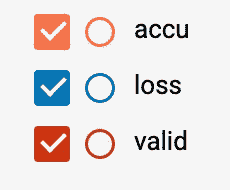
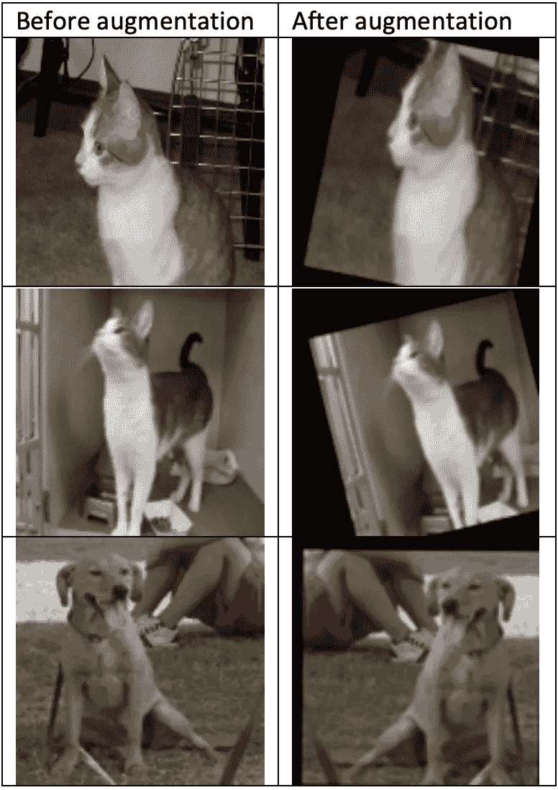
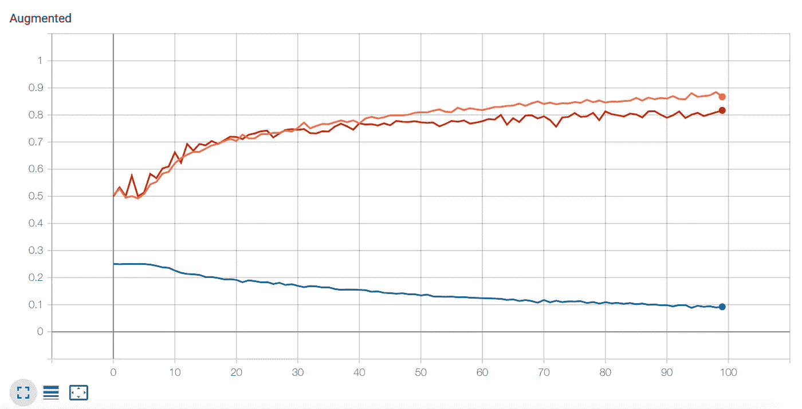

# 用 C++创建 TensorFlow CNN(第 3 部分:冻结模型并扩充它)

> 原文：<https://towardsdatascience.com/creating-a-tensorflow-cnn-in-c-part-3-freezing-the-model-and-augmenting-it-59a07c7c4ec6?source=collection_archive---------17----------------------->

这是关于如何在 TensorFlow C++ API 上创建 CNN 的第三篇也是最后一篇文章。在本文中，我将讨论实现模型冻结、保存和加载，以及数据扩充

# 背景

前两篇文章([这里](https://itnext.io/creating-a-tensorflow-dnn-in-c-part-1-54ce69bbd586)和[这里](/creating-a-tensorflow-cnn-in-c-part-2-eea0de9dcada))讨论了如何实现 CNN，以及训练、验证和测试它的方法。现在，您需要优化模型以获得更好的结果，并将其部署到“生产”环境中，以便您可以使用优化后的模型进行一些预测。

就像我之前的文章一样，我会详细说明 TensorFlow 在其 C++ API 中不太成熟的地方，以及如何克服这些困难。

这篇文章的代码位于[这里](https://github.com/bennyfri/TFMacCpp)。

# 冻结模型

虽然冷冻模型是最后一步，但我先讨论一下。

你建立你的模型，然后你训练和优化它。一旦你对结果满意，你想要保存模型权重和偏差；把它们从变量变成常量。

这样做时，将模型保存到磁盘将保存常数，稍后当您加载模型时，它就可以运行并可以对新图像进行分类。

## 新旧 API

TensorFlow C++ API 包括两组 API:

–旧的(基于会话类别)；和

–新的(基于 ClientSession 类)

我选择了新的。然而，我注意到存储库中的一些实用程序类还没有迁移到新的 API 中。TensorFlow 存储库附带的冻结/保存实用程序类使用较旧的 API。在/tensor flow/cc/tools/freeze _ saved _ model . cc 文件和头文件中实现。

要使用 API，应该包含/tensor flow/cc/tools/freeze _ saved _ model . h 文件，并调用 FreezeSavedModel API 调用来冻结模型。

问题是，您需要传递会话对象(间接)，以便内部实现可以进入活动模型以获取变量的当前值。但是，您没有会话，您有一个 ClientSession，并且该 ClientSession 不公开其具有该会话对象的内部数据。

那你是做什么的？有几个策略:

1.使用旧的 API 重新实现 CNN，这意味着不仅要使用会话，还要使用字符串作为变量名，而不是句柄(模型创建代码中的“auto”声明)。

2.不需要发送会话对象:在调用 API 之前收集变量值，并传递这些值和其他参数。

我选择了第二个选项。我想保持代码的整洁，以便有一天，当有人将这些代码移植到新的 API 时，您可以简单地调用它而无需准备。

## 如何冷冻

为了冻结模型，我们需要找到所有变量及其各自的值。

变量和偏差的列表已经可用，我们在创建优化图时使用它作为向量(这些是我们计算梯度的变量)。

因此，我们所需要的是一个映射这些变量和当前值的 map 对象:

```
vector<Tensor> out_tensors;//Extract: current weights and biases current valuesTF_CHECK_OK(t_session->Run(v_weights_biases , &out_tensors));unordered_map<string, Tensor> variable_to_value_map;int idx = 0;for(Output o: v_weights_biases){ variable_to_value_map[o.node()->name()] = out_tensors[idx]; idx++;}
```

接下来，我们从示波器中获得图形(就像我们使用 TensorBoard 可视化它时所做的那样)。

接下来，我们创建一个包。bundle 是一种特殊的结构，它结合了会话和元图。将不会使用该会话(如前所述)，因为我们已经有了所需的地图。

元图是一个非常复杂的类，用于各种用例，但我们只需要它用于 SignatureDef，这类似于函数签名(输入和输出)。

我们用数据填充它，并添加图表本身:

```
SavedModelBundle saved_model_bundle;SignatureDef signature_def; (*signature_def.mutable_inputs()) [input_batch_var.name()].set_name(input_batch_var.name());(*signature_def.mutable_outputs())[out_classification.name()].set_name(out_classification.name());MetaGraphDef* meta_graph_def = &saved_model_bundle.meta_graph_def;(*meta_graph_def->mutable_signature_def())["signature_def"] = signature_def;*meta_graph_def->mutable_graph_def() = graph_def;SessionOptions session_options;saved_model_bundle.session.reset(NewSession(session_options));//even though we will not use it
```

接下来，我们准备几个输出参数，并调用修改后的 API:

```
TF_CHECK_OK(FreezeSavedModel(saved_model_bundle, variable_to_value_map, &frozen_graph_def, &inputs, &outputs));
```

原始 API 中不存在参数 variable_to_value_map，我添加了它，这样我们就可以跳过会话对象的使用。您还可以查看 freeze_saved_model.cc 文件，查看该文件中与该更改相匹配的其他更改。

最后，我们调用 WriteBinaryProto 将冻结的输出图保存到文件中。

## 加载冻结的模型

加载模型又涉及到旧的 API(意味着会话，而不是客户端会话):

```
std::unique_ptr<GraphDef> graph_def;SessionOptions options;f_session.reset(NewSession(options));graph_def.reset(new GraphDef());TF_CHECK_OK(ReadBinaryProto(Env::Default(), file_name, graph_def.get()));return f_session->Create(*graph_def.get());
```

我们首先创建一个会话，然后创建一个 GraphDef，最后读取 protobuf 文件以在会话中创建图形。

## 运行“生产”模型预测

由于我们使用旧的 API 来创建会话，我们还需要一个特殊的方法来运行预测模型，使用我们前面创建的相同会话:

```
Status CatDogCNN::PredictFromFrozen(Tensor& image, int& result){ vector<Tensor> out_tensors; Tensor t(DT_FLOAT, TensorShape({1})); t.scalar<float>()(0) = 1.f; //Inputs: image, drop rate 1 and skip drop. TF_CHECK_OK(f_session->Run({{input_name, image}, {drop_rate_name, t}, {skip_drop_name, t}}, {out_name}, {}, &out_tensors)); auto mat = out_tensors[0].matrix<float>(); result = (mat(0, 0) > 0.5f)? 1 : 0; return Status::OK();}
```

该方法获取单个张量图像并返回类(0 或 1:猫或狗)。

请注意我们是如何使用变量的名称而不是句柄的。除此之外，代码的其余部分不言自明。

## 在 main 中使用类方法

在 main 中，我创建了一个 if 分支，它选择我们是要使用一个冻结的模型，还是训练这个模型，然后保存它:

```
string proto_name = "/Users/bennyfriedman/Code/TF2example/TF2example/frozen/cnn.pb";bool use_frozen = false;if(!use_frozen){ … //this is where the model training code is … …//and at the end s = model.FreezeSave(proto_name); TF_CHECK_OK(s);}else //use the frozen model{ s = model.LoadSavedModel(proto_name); TF_CHECK_OK(s); //testing the model s = model.CreateGraphForImage(false);//rebuild the image loading model without unstacking TF_CHECK_OK(s); string base_folder = "/Users/bennyfriedman/Code/TF2example/TF2example/data/cats_and_dogs_small/test"; vector<pair<Tensor, float>> all_files_tensors; s = model.ReadFileTensors(base_folder, {make_pair("cats", 0), make_pair("dogs", 1)}, all_files_tensors); TF_CHECK_OK(s); //loop through the images and call PredictFromFrozen to get the prediction.}
```

阅读[存储库](https://github.com/bennyfri/TFMacCpp)中的代码，查看统计数据是如何计算的。
不要忘记你需要包含修改后的头文件，并将修改后的 cc 文件添加到你的项目中，这样它将作为产品的一部分进行编译。

# 衡量模型性能

我们已经了解了如何计算损失、准确性和验证指标。

现在的目标是看到一个图表，显示指标随时间的变化(运行时期的进度)。这将告诉我们是否过度适应或者干脆停止学习。

在 Python 中使用 Keras API 时，内置了指标的可视化。

在 C++ API 中，您有两个选项:

1.使用模型中的[日志操作](https://www.tensorflow.org/versions/r2.0/api_docs/cc/group/logging-ops)将指标写入磁盘

2.使用我们在上一篇文章中用来可视化图表的实用程序类摘要文件编写器，将度量保存到模型外部的磁盘上

在这两种情况下，你都使用张量板来想象。

你用哪一个？看情况。一方面，由于 API 是对 ScalarSummary 操作的一个简单调用，因此在模型内部更容易一些。另一方面，使用 utility 类为您提供了在模型之外计算指标的灵活性。

我使用了第二个选项:

```
SummaryWriterInterface *w1;TF_CHECK_OK(CreateSummaryFileWriter(1, 0, "/Users/bennyfriedman/Code/TF2example/TF2example/graphs/loss/", "loss", Env::Default(), &w1));Tensor t(DT_FLOAT, TensorShape({1}));t.scalar<float>()(0) = loss_sum/num_batches;TF_CHECK_OK(w1->WriteScalar(epoch, t, "Original"));
```

首先创建一个摘要文件编写器对象，然后创建一个标量形状的张量，并使用访问器 scalar <>()填充数据。

然后使用 WriteScalar 将其写入磁盘。

可视化将通过 TensorBoard 完成(见下文)。

## 组合图表

在大多数情况下，您希望看到指标之间的相互关系如何随着时间的推移而变化。您希望一个接一个地查看图表，以便比较准确性和有效性。

这有点令人困惑，所以你需要注意:

1.对于每个指标，您需要一个单独的文件写入器，将数据保存在单独的文件夹中(文件名后缀参数不太重要)

2.对于图形的每个版本，都需要一个惟一的标记(传递给 WriteScalar 的字符串)。带有此标签的数据将出现在同一个组合图表中。

3.连续运行该程序会在磁盘上添加不同的文件，但 TensorBoard 会将新数据添加到相同的图表中，除非您更改文件夹或删除旧文件。

所以策略应该是:

1.使用 3 个文件写入器(分别用于损失、准确性和验证指标),在“/graphs”文件夹下有 3 个子文件夹。

2.为模型的每个版本使用不同的标签。例如，我将进行一些数据扩充，这将增加通过模型运行的图像数量，因此我将使用“原始”进行正常运行，并使用“扩充”进行具有更多数据的更好模型。例如，这是“原始”图表:



Legend

如您所见，损失几乎为 0 (0.0187)，但准确性和验证之间的差距越来越大，验证也没有从大约第 8 纪元开始改善。这意味着我们过度适应。

解决这个问题的唯一方法是获取更多数据来训练模型。运行更多的纪元不能改进模型。

# 数据扩充

获取更多数据的一种方法是获取更多图像。然而，就像在我们模型的 [Python Keras 版本](https://github.com/ardendertat/Applied-Deep-Learning-with-Keras/blob/master/notebooks/Part%204%20(GPU)%20-%20Convolutional%20Neural%20Networks.ipynb)中，我们可以增加图像来“创建”更多的数据来训练模型。

在 Python 中这非常容易，您只需指定想要创建什么样的数据扩充，一切都在幕后为您完成。

对于 C++ API 来说，这有点复杂，但也是可能的。

我们需要创建一个新的图表，将图像批次和扩大他们。

我实现了 4 种增加数据的方法:

1.从右向左翻转(上下没有意义)

2.顺时针和逆时针旋转到一定程度

3.将图像放大或缩小到某个比例

4.水平或垂直向上移动到某个系数

每一种方式都有一个随机因素，所以我们将在不同的时期创造不同的变化。您在 main 中指定的是机会或限制:

```
float flip_ratio = 0.5f;float rotation_max_angles = 40.f;float scale_shift_factor = 0.2f;TF_CHECK_OK(model.CreateAugmentGraph(batch_size, image_side, flip_ratio, rotation_max_angles, scale_shift_factor));
```

方法 CreateAugmentGraph 创建图形，该图形随后在每个批次上运行，以创建每个时期中图像的不同变化。

## 翻转图像

让我们先来看看我们是如何翻转图像的:

```
auto rand1 = RandomUniform(a_root, {batch_size}, DT_FLOAT);auto flips_vector = Floor(a_root, Add(a_root, rand1, flip_chances));auto flips_tensor = Cast(a_root, Reshape(a_root, flips_vector, {batch_size, 1, 1, 1}), DT_FLOAT);auto reverses = Reverse(a_root, input_images, {2}); // right to leftauto tensors_reversed = Mul(a_root, reverses, flips_tensor);auto tensors_normal = Mul(a_root, input_images, Sub(a_root, 1.f, flips_tensor));fliped_images = Add(a_root, tensors_reversed, tensors_normal);
```

首先，我们创建一个批量大小的随机向量。然后，我们加上翻转机会因素和地板。这给我们批中的每个图像一个 1 或 0(翻转或不翻转)。

现在，我们对矢量进行整形，使其与图像批次的形状相匹配，并且增加了 3 个维度。

翻转是通过在从右向左的维度 2 上调用反向操作来完成的。

现在我们有两个批次，一个翻转，一个正常。我们在每个图像上调用与随机向量及其 1 的补数相乘，以将我们不需要的图像置零，并将它们相加在一起，以获得增加的批次。

# 做投影变换

射影变换是将任意维的张量变换成新的张量，同时通过投影改变其“视觉”性质的数学方法。

这正是我们需要移动或缩放图像以及旋转它们。

幸运的是，作为 TensorFlow repository 附带的“Contrib”代码的一部分，已经有人实现了完成这种转换的操作。

代码位于/tensorflow/contrib/image 文件夹中。

不幸的是，贡献者没有完全实现 C++ API，而只是实现了 Python API。我们可以解决。

## 自定义操作

张量流是可扩展的。有关于如何添加新操作的指南，所以你可以在你的模型中使用它们。有些操作是由贡献者开发的，但没有成为核心张量流的一部分。它们在 Git 存储库中，但是不会作为基本包的一部分进行编译。

为了能够使用它们，我们需要单独编译它们(是的，使用 Bazel)，将它们的二进制文件添加到项目中，并包含一个头文件。

控制代码生成和编译的是 Bazel 使用的构建文件。

当查看/tensor flow/contrib/image/BUILD 文件时，您可以看到一个 tf_gen_op_wrapper_py 部分，它负责在操作之上生成 python 包装器，但是没有 tf_gen_op_wrapper_cc 部分，它将为 C++类创建包装器。此外，cc_library 部分缺失，它将创建我们想要链接的库。

使用我的存储库中的构建文件覆盖原始构建文件，然后运行:

```
bazel build -c opt --verbose_failures //tensorflow/contrib/image:image_cc
```

构建完成后，您应该有了可以链接的库文件/tensor flow/bazel-bin/tensor flow/contrib/image/libimage _ cc . so。请注意，如果您将它复制到本地工作区(在 lib 子文件夹中的项目文件夹下)，您可能需要使用 install_name_tool，以便能够消除 dyld 错误。

此构建还生成了文件/tensor flow/bazel-gen files/tensor flow/contrib/image/image _ ops . cc 和头文件。

这些是从 contrib 源文件生成的包装类。我们将需要包括标题，并添加到我们的项目抄送文件。

将这两个文件与同一文件夹中生成的内部 ops 文件一起复制到项目文件夹下的/include/tensor flow/contrib/image 子文件夹中。

现在我们准备使用自定义操作(ImageProjectiveTransform)

## 构建转换数据结构

与其他转换操作一样，ImageProjectiveTransform 接受一个名为 transforms 的参数。

这是一个具有 8 个浮点数的张量，称为 a0、a1、a2、b0、b1、b2、c0、c1，如果我们处理一批图像，还有另一个维度的批大小(每个图像有一组 8 个数字)。

为了创建这个张量，在我们的例子中是 20x8，我们需要创建一个 InputList(由一个向量组成)并沿着轴 1 连接它。我们不能使用 Stack，因为这将导致 8x20 的形状被转换操作拒绝。

要水平或垂直移动图像(出于某种原因也称为 translate)，我们需要在 a2 和 b2 中放置像素数(正数和负数)。

要缩放图像(放大或缩小)，我们需要在 a0 和 b1 中放一个因子(大于或小于 1)。

因为我们还需要加入一个随机因子，所以计算是这样进行的:

```
auto rand1 = RandomUniform(a_root, {batch_size, 1}, DT_FLOAT);auto rand2 = RandomUniform(a_root, {batch_size, 1}, DT_FLOAT);auto rand3 = RandomUniform(a_root, {batch_size, 1}, DT_FLOAT);auto rand4 = RandomUniform(a_root, {batch_size, 1}, DT_FLOAT);auto rand_shift1 = Sub(a_root, Mul(a_root, rand1, scale_shift_factor*2*image_side), scale_shift_factor*image_side);auto rand_shift2 = Sub(a_root, Mul(a_root, rand2, scale_shift_factor*2*image_side), scale_shift_factor*image_side);auto rand_scale1 = Add(a_root, Mul(a_root, rand3, scale_shift_factor*2), 1-scale_shift_factor);auto rand_scale2 = Add(a_root, Mul(a_root, rand4, scale_shift_factor*2), 1-scale_shift_factor);Input::Initializer zeros(0.f, {batch_size, 1});auto transforms = Concat(a_root, MakeTransforms(batch_size, rand_scale1, zeros, rand_shift1, zeros, rand_scale2, rand_shift2), Input::Initializer(1, {}));shifted_images = ImageProjectiveTransform(a_root, input_images, transforms, "BILINEAR");
```

首先，我们创建 4 个随机向量(以一批的长度)。因为这些是 0 到 1 之间的数字，我们需要做一些数学运算来得到我们需要的数字。请注意，我们传递到计算中的因子与 Keras API 匹配:当您传递 0.2 时，每个轴上的缩放在 0.8 到 1.2 之间，并且向右或向左以及向上或向下移动高达 20%。

我们将不使用的转换成员置零，并通过连接创建转换。MakeTransform 只是构建 InputList。

最后，我们用图像批处理调用 ImageProjectiveTransform。

## 旋转图像

旋转稍微复杂一点，但是它使用相同的转换结构和操作:

```
auto rand6 = RandomUniform(a_root, {batch_size}, DT_FLOAT);auto angles = Mul(a_root, Sub(a_root, rand6, 0.5f), max_angles*2);auto rand_angles = Div(a_root, Mul(a_root, angles, (float)M_PI), 180.f);auto sins = Sin(a_root, rand_angles);auto m_sins = Mul(a_root, sins, -1.f);auto coss = Cos(a_root, rand_angles);float img_side_1 = image_side - 1;auto x_offset = Div(a_root, Sub(a_root, img_side_1, Sub(a_root, Mul(a_root, coss, img_side_1), Mul(a_root, sins, img_side_1))), 2.f);auto y_offset = Div(a_root, Sub(a_root, img_side_1, Add(a_root, Mul(a_root, sins, img_side_1), Mul(a_root, coss, img_side_1))), 2.f);auto transforms = Concat(a_root, MakeTransforms(batch_size, coss, m_sins, x_offset, sins, coss, y_offset), Input::Initializer(1, {}));aug_tensor_output = ImageProjectiveTransform(a_root, fliped_images, transforms, "BILINEAR");
```

我们首先创建一个随机向量，转换成正负度数，然后转换成弧度。

接下来我们计算正弦，负正弦，余弦等。

我们再次创建一个转换并调用转换操作。我通过查看它的 python 版本(tf.contrib.image.rotate)实现了这个方法。

查看创建包含所有 4 个转换的图形的完整代码。有一些优化，以防你没有做其中的一两个。

对输入图像批次运行模型非常简单。

# 增强图像的验证

如果图像以这样一种方式被转换，以至于它们不再能被人眼识别为猫或狗，那会怎样？我们怎么检查呢？

我已经编写了一个实用方法 WriteBatchToImageFiles，它可以帮助您将增加的张量转储回您可以查看的图像文件。

在培训的主循环中(我们不会在验证或测试中增加图像)，您可以看到以下代码:

```
if(augment_data){ //TF_CHECK_OK(model.WriteBatchToImageFiles(image_batches[b], "/Users/bennyfriedman/Code/TF2example/TF2example/data/cats_and_dogs_small", "source")); Tensor augmented; TF_CHECK_OK(model.RandomAugmentBatch(image_batches[b], augmented)); //TF_CHECK_OK(model.WriteBatchToImageFiles(augmented, "/Users/bennyfriedman/Code/TF2example/TF2example/data/cats_and_dogs_small", "augmented")); s = model.TrainCNN(augmented, label_batches[b], results, loss);}else s = model.TrainCNN(image_batches[b], label_batches[b], results, loss);
```

如果我们使用扩充的数据(我们应该这样做)，我们首先扩充批处理，然后用扩充的张量调用 TrainCNN 方法。

取消对增强前后的 WriteBatchToImageFiles 调用的注释，以查看图像如何随机变化。



# 模型性能

让我们看看模型性能是否有所提高:



Legend

您可以清楚地看到，即使经过 100 个时期，损失仍在下降，准确性和验证数字之间的差距也不那么明显了。

它仍然不完美，我们在测试中远远超过 80%,但为了改善这一点，我们可能应该运行更多的时代，并获得新鲜的图像。

# 摘要

在这一系列文章([概述](https://itnext.io/how-to-use-your-c-muscle-using-tensorflow-2-0-and-xcode-without-using-bazel-builds-9dc82d5e7f80)、[第一部分](https://itnext.io/creating-a-tensorflow-dnn-in-c-part-1-54ce69bbd586)、[第二部分](/creating-a-tensorflow-cnn-in-c-part-2-eea0de9dcada))中，我展示了如何使用 XCode 进行 TensorFlow C++开发，如何使用 C++ API 创建 CNN，可视化它，为它准备数据并以几种方式进行优化。我试图遵循 Arden Dertat 在他的第四篇文章中的步骤，实现他在 Keras Python 中实现的 AlexNet。

我希望这将作为其他人的教程，这些人在使用 C++作为主要语言的同时开始了他们在 TensorFlow 中的道路。

让我知道你的想法。欢迎建议！