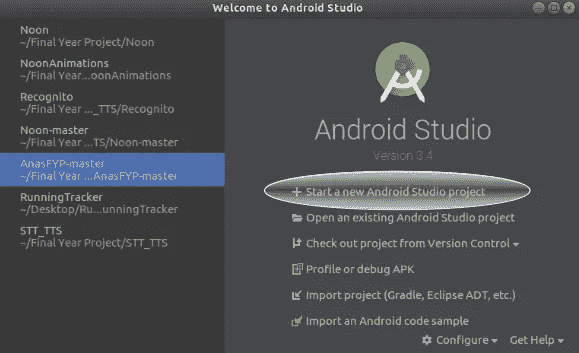
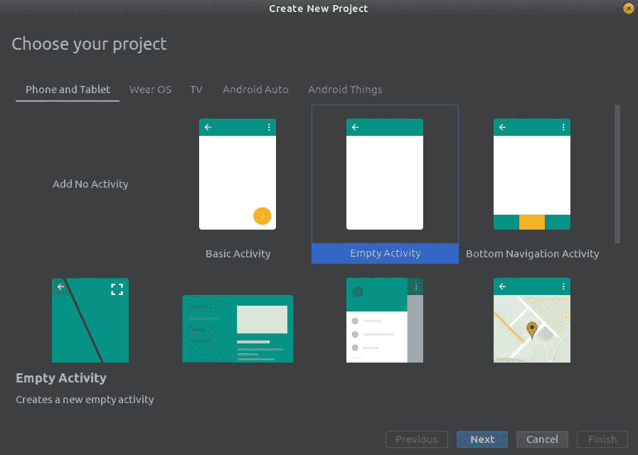
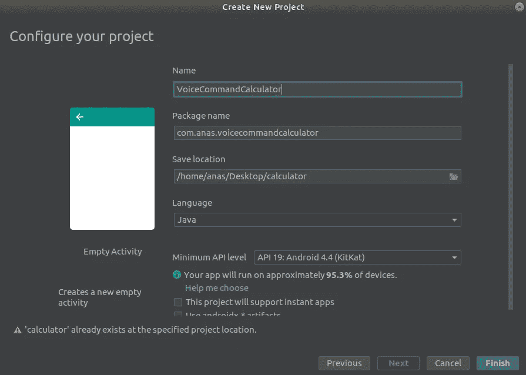
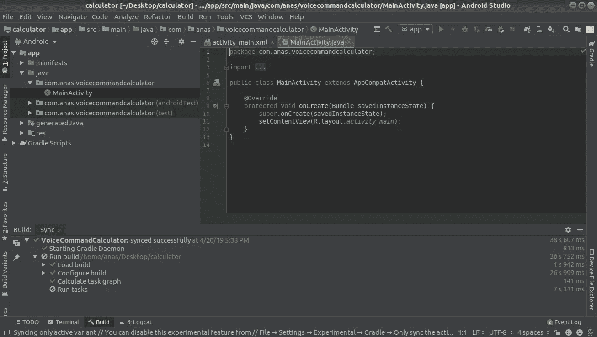

# 创建语音识别计算器 Android 应用程序

> 原文：<https://towardsdatascience.com/creating-a-voice-recognition-calculator-android-app-869a515bf6d1?source=collection_archive---------3----------------------->


Photo by [Andres Urena](https://unsplash.com/@andresurena?utm_source=medium&utm_medium=referral) on [Unsplash](https://unsplash.com?utm_source=medium&utm_medium=referral)

自动语音识别是当今机器学习中最著名的话题之一，每天都有许多新人投入他们的时间和专业知识。在这篇文章中，我们将构建一个简单的端到端语音激活计算器应用程序，它将语音作为输入，并将语音作为输出返回。输入包括整数和基本的数学运算符，而输出是用户说出的运算结果。

# 这个教程不是什么

*   关于语音识别如何工作的理论教程。
*   关于基于云的语音 API 的教程，如 Amazon Polly 或 Google Cloud Speech。
*   Java 语法和原理教程。
*   关于 Java-XML 通信如何在 Android 上工作的教程。
*   安卓材质设计教程。

# 先决条件

*   基本的 Android 开发知识。
*   Android Studio(您可以使用 Eclipse 等其他 ide，但我将在本教程中介绍 Android Studio)。
*   期望:基本的 API 知识(不需要认证)。

# 教程大纲

*   创建 Android 项目
*   创建语音转文本功能
*   处理输入值(整数和运算符)
*   计算结果
*   创建文本到语音转换功能

# 创建 Android 项目

让我们首先打开 Android Studio 并开始一个新项目。如果你已经打开了一个项目，进入**文件- >关闭项目**，然后按照下图操作:



选择**空活动**然后点击**下一步**:



选择您想要的项目细节，或者保持所有设置为默认，然后单击**完成**:



给 Android Studio 几分钟时间来完成项目的构建和索引。如果您达到以下要求，您就万事俱备了:



# 创建用户界面

现在让我们创建 **activity_main.xml** 布局文件。我尽可能保持简约，因为这里的目标不是设计，而是功能:


其中 **A、B、**和 **+** 只是**可点击的**占位符，而 **C** 和 **=** 是不可点击的占位符。**走！**按钮触发计算并更新结果 **C** 。用户将点击它们中的每一个，并以语音形式输入它们自己的值。当然，设计和布局取决于作为开发者的你。这只是为了演示。

# 将布局链接到 Java 代码

现在让我们导航回 out**MainActivity.java**，并为我们拥有的每个可点击的文本视图设置一个 **OnClickListener** 。随后，我们的 **MainActivity** 类将如下所示:

# 创建语音识别功能

现在开始本教程有趣的部分。让我们从请求 **RECORD_AUDIO** 许可开始这一部分。这是通过在 **AndroidManifest.xml** 中的 **<应用>** 标签前添加以下行来实现的:

```
<uses-permission android:name="android.permission.RECORD_AUDIO" />
```

Android 有一个内置的语音识别 API，其形式为 **Intent** 。我们处理这个意图就像处理任何其他 Android 意图一样。现在回到我们的。我们拥有的 onClick 方法将负责记录语音并将其转录成文本，以便我们可以将其作为数学运算来处理。因此，我们的意图代码需要驻留在我们所有的 **onClick** 方法中。

让我们首先为识别器创建一个 Intent 实例:

```
Intent intent = new Intent(RecognizerIntent.ACTION_RECOGNIZE_SPEECH);
```

让我们添加一些额外的数据(用于内务管理和语言选择),并以请求代码开始意向活动:

```
intent.putExtra(RecognizerIntent.*EXTRA_LANGUAGE_MODEL*, RecognizerIntent.*LANGUAGE_MODEL_FREE_FORM*);intent.putExtra(RecognizerIntent.*EXTRA_LANGUAGE*, Locale.*ENGLISH*);startActivityForResult(intent, 10);
```

以上两段代码需要复制粘贴到我们所有的三个 **onClick** 方法中，但是**具有不同的请求代码**。现在，**MainActivity.java**类中的那些方法应该是这样的:

到目前为止，我们的代码能够检测可点击文本视图上的点击，并在点击时开始识别语音。然而，它没有返回转录文本的方法。基本上，我们开始了一个意图，但没有收到预期的结果。因此，我们需要定义一个 **onActivityResult** 方法(在**MainActivity.java**)来处理那些转录结果:

我们的**数据**变量是一个**意图**实例，我们可以通过**数组列表**从中获取结果。这可以通过简单地调用:

```
data.getStringArrayListExtra(RecognizerIntent.*EXTRA_RESULTS*)
```

请记住，这个结果在我们拥有的所有 3 个识别器意图之间是共享的。现在我们需要一种方法来从这个列表中找到并获得实际的整数——在请求代码为 10 或 20 的情况下。为此，我们将创建一个循环遍历由 intent 返回的结果的方法(即 **ArrayList** )和另一个将说出的数字从**字符串**转换为 **int** 的方法:

这里有一个旁注，为了保持代码的整洁，在 **switch** 语句中不需要任何 **break** 语句。这是因为一旦其中一种情况评估为真，**返回**将负责停止**开关**的执行。

参考上面的代码，当请求代码为 10 或 20 时，我们可以从我们的 **onActivityResult()** 中调用 **getNumberFromResult()** 。当用户点击 **firstNumberTextView** 或 **secondNumberTextView** 时，这将负责将说出的数字转录成相应的整数。

现在让我们为操作符转录创建类似的方法:

最后，让我们将调用 getOperatorFromResult()和 getNumberFromResult()的部分添加到我们的 onActivityResult()中:

其中 **FIRST_NUMBER** 、 **SECOND_NUMBER** 和**运算符**是类中的全局变量，定义如下:

```
private int FIRST_NUMBER;
private int SECOND_NUMBER;
private char OPERATOR;
```

这些将是我们要计算的实际值。让我们定义一个执行这些计算的方法:

这个方法将从 **GO 中调用！**按钮的 **onClick** 方法。我们还没有处理过这个按钮。所以让我们添加以下代码:

```
goButton.setOnClickListener(new View.OnClickListener() {
    @Override
    public void onClick(View view) {
        RESULT = performCalculations();
        resultTextView.setText(String.*valueOf*(RESULT));
    }
});
```

其中**结果**是在类中定义的全局整数变量。

就是这样！现在，应用程序应该可以成功运行了。

# 创建语音合成功能

语音合成是将文本转换成语音的过程。我们将在应用程序中使用它，以便让 API 大声读出 **performCalculations()** 方法返回的结果。对于这个相当短的任务，我们将使用 Android 内置的 **TextToSpeech** 功能。

首先，该类需要实现 **TextToSpeech** 监听器。简单地说，转到 **MainActivity** 类签名，将它从:

```
public class MainActivity extends AppCompatActivity { ...
```

收件人:

```
public class MainActivity extends AppCompatActivity implements TextToSpeech.OnInitListener { ...
```

这表明需要在类中实现以下方法(从类签名中删除红色下划线):

```
@Override
public void onInit(int i) { }
```

我们将暂时保留没有实际实现的方法，因为应用程序的当前用例不需要实现。这是必需的，因为我们正在实现一个接口(遵循 OOP 原则)。

现在让我们声明一个对类 **TextToSpeech** 的全局引用:

```
TextToSpeech textToSpeech;
```

然后在我们的 **onCreate()** 方法中初始化它:

```
textToSpeech = new TextToSpeech(this, this);
```

我们现在已经准备好使用这个对象了。导航到 **GO！**按钮的 **onClickListener** 并在我们使用 **setText()** 的部分后添加下面一行:

```
textToSpeech.speak(
        String.*valueOf*(RESULT), TextToSpeech.*QUEUE_ADD*, null
);
```

就是这样！只要用户点击开始！按钮，结果将由 API 以语音的形式发出。

# 最后看一下代码

我已经把 Android 项目推给了 GitHub。可以通过这个链接查看:[https://github.com/AnasAlmasri/VoiceRecognitionCalculator](https://github.com/AnasAlmasri/VoiceRecognitionCalculator)

然而，这里有一个 **AndroidManifest.xml** 文件:

下面是 **activity_main.xml** 文件:

最后一节，**MainActivity.java**课:

我们构建了一个 Android 应用程序，它将两个整数(0-9)和一个语音形式的运算符作为输入，识别这些输入，执行数学运算，然后将结果作为语音返回，同时在屏幕上显示出来。这只是初学者掌握语音识别应用程序如何工作的一次尝试。接下来将支持多位数、负数、浮点数，并一次性合并所有三种输入，以便用户可以说出“一加五”，应用程序可以分割感兴趣的单词，并进行必要的中间步骤以获得结果。