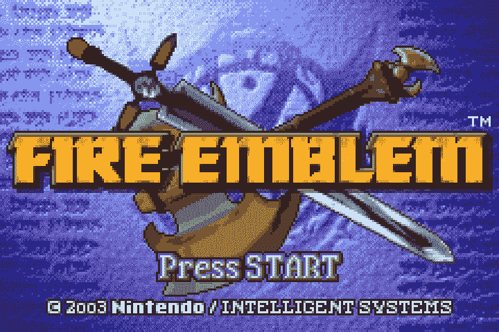
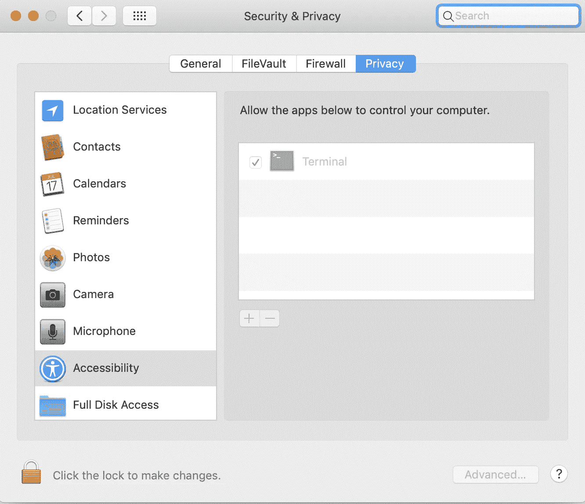

# 为 GameBoy 创建 AI 第 1 部分:编写控制器代码

> 原文：<https://towardsdatascience.com/creating-ai-for-gameboy-part-1-coding-a-controller-5eb782f54ede?source=collection_archive---------17----------------------->



2003 年发布的《火徽，炽剑》是一款非常成功的战略游戏，其角色出现在《超级粉碎兄弟》中，该系列的第 15 部将于 2019 年初上映。游戏的玩法是选择角色(又名单位)，决定将他们移动到哪里，然后从一组选项中决定攻击、使用物品等等。因为我在十几岁和十几岁时非常喜欢这个游戏，所以我想为这个 Gameboy Advance classic 制作一个 AI。这篇文章将是我在从头开始构建一个玩游戏的人工智能的过程中，将这一努力分成更多小块的第一篇。这里展示的代码可以在 github.com/aaronfrederick 找到，它的最新版本是为那些想要创建类似项目的人准备的。

在这个项目开始的时候，我把任务分成了 4 大块:

1.  在 python 中创建控制器
2.  从游戏中获取数据
3.  自动化播放过程以连续生成数据
4.  实现一种算法来优化游戏

为了玩火徽和创造一个 AI，我下载了 [VisualBoy Advance](http://www.emulator-zone.com/doc.php/gba/vboyadvance.html) 模拟器和一个[火徽 ROM](https://emulator.games/roms/gameboy-advance/fire-emblem/) 到我的电脑上。该模拟器与 ROM 一起，允许人们在一台计算机上从不同的控制台玩游戏。另一个例子是海豚模拟器，它允许在电脑上玩 Wii 和 Gamecube 游戏。



Pyautogui will not work unless the box is checked!

现在我们已经有了模拟器设置，我们需要能够以编程方式访问它。在准备过程中，我打开了模拟器，并把它放在电脑屏幕的左上角，不受其他应用程序的干扰。有一个一致的位置是至关重要的，在这里我们将点击选择模拟器，但这个一致的位置更重要的是从屏幕上获取信息时，到了屏幕上的数据模拟器。pyautogui 库非常适合用 python 控制你的电脑，但是如果你像我一样在 Mac 上，你需要让终端访问你的电脑，如左图所示。

我们需要做的第一件事是选择模拟器，让它运行，这可以通过将鼠标移动到应用程序上并单击来完成。

```
import pyautoguipyautogui.moveTo(7,54,0.2)
pyautogui.click()
```

The code above with a 4 second time to reach destination for clarity

传递给 moveTo 函数的参数是 *x 像素位置*、 *y 像素位置*和*到达该位置所用的时间*。因为左上角是(0，0)，所以我们将鼠标移动到靠近左上角，但不是一直移动，这样我们就可以将光标放在应用程序上。

为了在我们选择模拟器后按下按钮，我们需要一个再次使用 pyautogui 的函数。下面的 press_key 函数为将来简化了这一点，这样我们只需键入 press_key(键，次数)就可以轻松控制游戏。

```
def press_key(key, n_times = 1):
    for _ in range(n_times):
        pyautogui.keyDown(key)
        pyautogui.keyUp(key)
```

现在我们可以按按钮了，我们需要把它应用到游戏中。我将在这个例子中展示的三个函数是 select_next_unit、move_unit 和 wait。这些函数将为这个人工智能做大部分的工作，所以把它们做好是很重要的。

如下所示，select_next_unit 只需按“q”键，然后按“'”键。这相当于在 Gameboy Advance 上按 L，然后按 A，这是将光标移动到下一个可用单位并按 A 的控件。这将弹出一个界面，允许我们选择将单位移动到哪里。

```
def select_next_unit():
    press_key('q')
    press_key("'")
```

在我的 [github](https://github.com/aaronfrederick/Fire-Emblem-AI) 上实现的 move_unit 函数比这里显示的稍微复杂一些——它允许随机移动——但是功能基本相同。这个功能背后的基本思想是，我们要输入一组坐标来移动，然后按下按键来实现这些坐标。这些不等式是针对随机移动世代的，因此，例如，如果左的值大于右，我们只按左。

```
def move_unit(left=0,right=0,up=0,down=0):
    ret_list = [left,right,up,down]
    if left>right:
        press_key('a', left-right)
    elif right>left:
        press_key('d', right-left)
    if up>down:
        press_key('w', up-down)
    elif down>up:
        press_key('s', down-up)
    press_key("'")
    time.sleep(0.2)
    return ret_list
```

使用 W，A，S，D 分别作为上，左，下，上，我们可以按下按键的次数，对应于我们传入的坐标。一旦我们移动我们的单位，我们会看到一个菜单，允许我们使用一个项目或等待。使用等待功能，我们将保持我们的单位(Lyn)在我们移动她的地方，然后结束我们的回合。

```
def wait():
    time.sleep(0.2)
    press_key('w')
    time.sleep(0.2)
    press_key("'")
```

The code to the right playing Fire Emblem!

把这三个功能放在一起，我们就可以在火徽第一关第一个回合了！左边的 GIF 显示了下面的代码在工作。

```
#Select the Emulator
pyautogui.moveTo(7,54,0.2)
pyautogui.click()
time.sleep(0.3)#Play the Game
select_next_unit()
move_unit(left=2, up=2)
wait()
```

在第 2 部分，我将讨论如何从这个游戏中获取信息，以便我们可以为机器学习创建数据集和损失函数。这将涉及一些图像处理技术，并创建一个图像分类器来智能地从屏幕上提取数据。