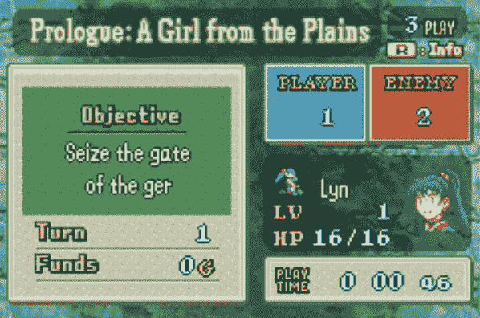

# 为 GameBoy 创建人工智能第 2 部分:从屏幕上收集数据

> 原文：<https://towardsdatascience.com/creating-ai-for-gameboy-part-2-collecting-data-from-the-screen-ccd7381a1a33?source=collection_archive---------21----------------------->

欢迎来到为 GameBoy 创建人工智能的第 2 部分！如果您错过了第 1 部分:编写控制器代码，[单击此处](/creating-ai-for-gameboy-part-1-coding-a-controller-5eb782f54ede)继续学习。在这一期，我将讲述如何通过各种图像处理和分类技术智能地从游戏中获取信息。这对任何游戏人工智能都很重要，但对它在火徽中的应用至关重要，因为游戏是完全通过决策来进行的。从游戏中获取信息如此重要的原因是，我们将训练一个机器学习算法来玩，由于 ML 算法需要数据集来学习，我们需要能够生成数据。考虑到这一点，我们需要知道我们需要哪些信息来建立我们的特征和目标。特征数据应该表示为游戏状态和采取的行动，而目标应该是我们玩游戏的好坏的衡量标准。和以前一样，当前状态的代码可以在我的 [github](https://github.com/aaronfrederick/Fire-Emblem-AI) 上找到。

这个任务需要几个库，所以我认为有必要简单回顾一下哪些库对哪些任务有用:

*   Python 图像库(PIL)-用于截屏/提供图像
*   cv2 —用于处理图像和转换颜色
*   pytesserac——用于从图像中获取文本
*   Keras 用于训练模型以从图像中获取数字
*   Scikitlearn —用于训练模型从图像中获取数字

图像处理任务的基本工作流程遵循以下顺序:

1.  用 PIL 拍一个大截图(在我的旧笔记本电脑上，这个功能非常慢，大约 0.6 秒到 0.75 秒)
2.  根据需要用下面列出的函数对图像进行子集化(*如果 PIL 不那么慢，多张截图就好了*
3.  使用 cv2 填充功能，根据需要转换颜色和填充
4.  将图像分类模型应用于经处理的图像以获得数据

下面的函数是我用 PIL 拍摄的图像的子集。虽然使用列表中的切片方法可能会更快，但与 PIL ImageGrab 函数拍摄初始图片所需的 0.6 秒以上的时间相比，这种差异可以忽略不计。

```
def subscreen(x0,y0,x1,y1, screen):
    sub_img = []
    for i in range(y0,y1,1):
        row=[]
        for j in range(x0,x1,1):
            row.append(screen[i][j])
        sub_img.append(np.array(row))
    sub_img = np.array(sub_img)
    return sub_img
```


We need to know the name of our character: Lyn

对于这两张图片，我们最感兴趣的是文本数据——我们将要使用的角色的名字以及我们可以使用的选项。为此，pytesseract 是一个无价的工具。Google 的 tesseract 是一个开源的光学字符识别(OCR)工具，在 python 中以 pytesseract 的名字发布。这个库的使用非常简单，我们可以从左上角的蓝色窗格中获得文本“Lyn ”,只需一行代码(上图)和第二张图(下图)中显示的选项:

```
#for black text
text = pytesseract.image_to_string(image)#for white text
text = pytesseract.image_to_string(inverted_grayscale(image))
```


pytesseract can tell us what options we have

处理函数*inverted _ gray*可能会因情况而异——在这种情况下，它会将图片变成灰色，并反转所有像素值，将白色像素变成黑色，反之亦然。Cv2 有很好的颜色变化功能，可以替代我使用的处理功能，这是我为这个特定情况编写的，但是真正神奇的是 pytesseract 使我们能够做到的。Pytesseract 允许我们放弃创建带标签的图像数据集、训练分类模型，或者重新发明轮子，这是一个巨大的时间节省，因为我们将看到…



The ‘Status’ screen shows the current game state

下面两张图片分别代表游戏状态和角色状态。充满了数字，从这些屏幕上可以获得很多信息。理想情况下，我们将只使用上面的 pytesseract 代码，但遗憾的是这些字母给软件包带来了一些麻烦。在为一个数据集标记了多个图片并在 Keras 中训练了一些卷积神经网络模型(CNN)之后，我决定返回到基本的 sci-kit 学习包，看看慢速训练的 CNN 是否真的有必要检测哪些图像对应于哪些数字。在没有任何超参数操作的情况下，第一次尝试逻辑回归模型时，我能够达到 99.5%的准确性——大概这 0.5%来自一个错误标记的图像。坦白说，我错标了 500 张图片中的 2 张……显示了这个模型有多好。用于数据提取的代码的实际用法如下，为清楚起见进行了编辑:

```
#using logistic regression model 'block_reader'
#padder function adds black to outline if image is too smallstats['str'] = block_reader \
                 .predict(padder(str_img).reshape(***to fit model***))[0]
```


更简单的模型如此成功的原因是由于小的图像大小，不同类别之间的明显差异，以及每个类别之间的一致性。更进一步地说，逻辑回归模型可以处理 30x24 的图像，而不是 400x600 的图像，因为每次观察的特征(像素)数量相对较少。类别的差异允许不同的像素在分类中具有不同的重要性。每个类中的一致性是导致开箱即用模型成功的另一个因素，因为模型的测试数据与之前在训练数据中看到的数据非常相似(如果不完全相似的话)(这就是为什么我们可以使用训练准确性作为评估指标)。

现在，有了谷歌和我们自己训练的模型，我们就可以从火徽中获取信息了。我们所需要做的就是拍摄图片，处理它，并应用我们的模型获得数据，并将其纳入游戏过程！