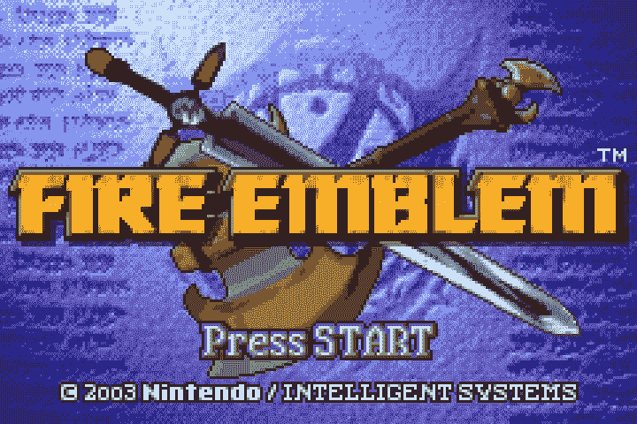

# 为 GameBoy 创造人工智能第 3 部分:自动化(糟糕的)游戏

> 原文：<https://towardsdatascience.com/creating-ai-for-gameboy-part-3-automating-awful-gameplay-b60fe7504e4e?source=collection_archive---------23----------------------->

## 通过随机移动生成数据！



欢迎来到为 GameBoy 创造 AI 的第 3 部分！如果你错过了前两部分中的任何一部分，你可以在这里找到第一部分和第二部分。一如既往，我的 [GitHub](https://github.com/aaronfrederick/Fire-Emblem-AI) 是这个项目的最新版本。在这个项目的第三部分，我们将自动随机输入游戏，因此标题。这个游戏必须在玩的时候为我们生成数据，这样我们就可以在未来训练我们的机器学习模型。

我们训练算法所需的数据有三种:状态、动作和度量。状态数据指的是游戏的状态——我们的角色在哪里，谁在我们周围，我们角色的健康水平如何。同样，行动指的是我们在给定的状态下采取的行动。状态和行动是相互关联的数据点，这些数据点将产生一个结果，我们需要对这个结果进行衡量，以了解行动有多好。在这样的尝试中有一些算法可以使用(Q 学习，遗传算法)，其中度量数据有不同的名称，如奖励、适合度或 Q(s，a)。我还不想把这个项目放在一个特定的算法上，所以我将把我们对成功的测量称为我们的度量。

为了完全自动化游戏，我们需要两个功能:一个是玩游戏，一个是在出错或运行结束时重启模拟器。游戏功能将更加复杂，因为它将实现我们在第 1 部分中构建的控制器，同时使用我们在第 2 部分中编写的图像处理生成数据。每次我们单位做出一个举动或决定，我们都会捕捉并存储数据。总的来说，每个回合的游戏功能的工作流程是:

*   收集游戏状态——记录敌人和玩家单位的数量，回合计数(**状态**)
*   游戏状态也给了我们想要最小化的值的信息，也就是剩余的敌人单位+回合数(**度量**)
*   找到我们的角色—记录名字(**动作**)
*   移动我们的角色——记录我们将她移动到的坐标(**动作**
*   选择一个选项——记录我们是否攻击、使用物品或等待(**动作**)

下面我将展示 gen_data 函数的一个截断版本，以展示上面概述的思想的整体感觉和逻辑。在火徽的上下文中，为了清晰易读，我省略了一些按键和睡眠线。

相比之下，重启功能要简单得多。本质上，它按下重启模拟器所需的按键，并通过菜单导航，再次开始游戏。下面我将这两个函数结合起来生成数据，这些数据将在本系列的第 4 部分中使用，以便从这些数据中学习如何玩得更好。通过一个指定要完成的运行次数的 for 循环，我们可以通宵玩游戏来为这个挑战的学习方面生成数据。

```
#s, a, m are lists containing states, actions and metrics valuesreset_to_prologue()
states, actions, metrics = gen_data_prologue()
s.extend(states)
a.extend(actions)
m.extend(metrics)
```

对于任何参与类似项目的人来说，火之徽不同于许多其他游戏，因为控制随着每个命令而变化，与其他游戏相比，项目的这一部分变得复杂。在像马里奥，索尼克和许多其他游戏中，“右”总是把角色带到右边，“A”几乎总是跳，“开始”会调出菜单。在火焰徽章中，根据屏幕的不同,“向下”可以有多种含义。它可以将光标下移一格，将一个单位下移一格，将选择从一个选项移动到另一个选项，如果正在检查一个单位，甚至可以改变单位。由于这种复杂性，我编写了一些函数，在很多游戏都不需要这些函数的时候，很明智地解决了这个问题。如果你试图为一个不同的游戏编写一个人工智能，很可能你可以省略这些功能，使用屏幕图像作为状态，使用控制器输入作为动作。