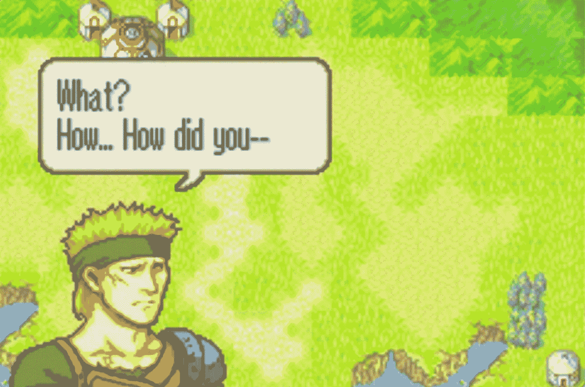
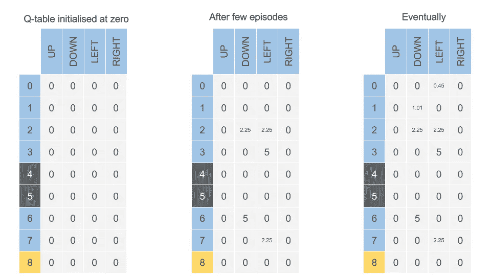

# 为 GameBoy 创造人工智能第 4 部分:Q-学习和变化

> 原文：<https://towardsdatascience.com/creating-ai-for-gameboy-part-4-q-learning-and-variations-2a0d35dd0b1c?source=collection_archive---------8----------------------->

When the boss dies, he asks us a fitting question

## 我们期待已久的部分

大家好，欢迎来到为 Gameboy 构建人工智能的第 4 部分！这是真正的奇迹发生的地方——我们已经建立了我们的工具，现在是时候启动它们了。快速回顾一下我们到目前为止的旅程:首先，我们[构建了一个控制器](/creating-ai-for-gameboy-part-1-coding-a-controller-5eb782f54ede)，这样我们就可以使用 Python 脚本运行游戏；第二，我们使用了开源和自制的图像处理工具相结合的方式，从游戏中提取信息[；第三，我们](/creating-ai-for-gameboy-part-2-collecting-data-from-the-screen-ccd7381a1a33)[自动化了这个过程](/creating-ai-for-gameboy-part-3-automating-awful-gameplay-b60fe7504e4e)，这样游戏就可以在随机输入的情况下自动运行。现在，我们将实现一个 Q-learning 的变体来击败这个游戏的第一关。如果你想更深入地研究强化学习，我强烈推荐这两篇帖子([链接 1](https://github.com/simoninithomas/Deep_reinforcement_learning_Course) 、[链接 2](/cartpole-introduction-to-reinforcement-learning-ed0eb5b58288) )，它们在分解算法和实现方面做得非常好。

The final result — playing using the Q-Table’s most rewarded actions

# 什么是 Q-Learning，我们如何在这里应用它？

为了解决火徽的问题，我们将使用一个 Q 表。该表的行代表游戏的可能状态，列代表动作。在这种特殊的情况下，桌子有 150 种状态(关卡就像一个有 150 个方块的棋盘——10 行 15 列)和 180 种可能的行动。这个数量的动作来自我们的角色 Lyn，她能够走最大曼哈顿距离五个单位(这导致了 60 种不同的移动选项)，并且当她到达时有三个选项(攻击、物品和等待)。填充每个状态、动作对的值是在给定状态下与采取该动作相关联的估计回报。这种回报通常被表示为函数 Q(s，a)，这就是为什么这个过程被称为 Q-learning。你可能对“深度 Q-Learning”(DQN)这个词很熟悉，并想知道我们为什么不实现它——游戏运行太慢，无法为深度学习生成令人满意的数据量，我们无法在当前的模拟器设置中加快它的速度。下面是一个在任意问题上填写 Q 表的例子。

A small example of a Q-table getting filled in — [Source](/practical-reinforcement-learning-02-getting-started-with-q-learning-582f63e4acd9)

要填满这个 150x180 的桌子，我们必须多次玩这个游戏。我们从根据我们的状态采取随机行动开始，并随着我们的进步记录奖励。在这种情况下，奖励是我们在上一轮击败的敌人数量。如果我们在一个任意的状态 s，采取一个任意的行动 a，我们的奖励 Q(s，a)要么是 0(如果该回合所有敌人都幸存)要么是 1(每杀死一个敌人)。当我们随机玩游戏时，我们目前正在探索动作/状态空间，并跟踪回报，以便当我们以后想要利用这些知识时，我们可以对什么工作得好有所了解。我们必须首先探索，以便找到行之有效的路线，就像我们最终必须使用我们获得的信息来改进我们的游戏性一样。在实践中，这是由一个称为 exploration_rate(或 epsilon)的变量表示的，它随着我们的进展而衰减。每次我们尝试关卡时，我们会降低我们的探索速度(通过指数衰减)并将其与一个随机数进行比较，看看我们是否会探索或利用这一尝试。在学习过程的最后，我们将基本上在没有任何随机产生的决定的情况下玩游戏，仅仅依靠我们通过玩存储在 Q 表中的游戏而积累的知识。

在实施过程中，我们有 3 个主要部分:

1.  初始化数据结构
2.  初始化超参数
3.  实现算法

# 设置代码

这里的第一个代码块设置了我们需要的数据结构，即 Q 表和字典，它们将状态和动作映射到所述表中的索引。

第二个代码块初始化我们将在这个实验中使用的超参数。当我们更新 Q 表时，学习率和 gamma 是影响我们奖励得分的乘数。

第三个代码块显示了实际的 Q 学习。我们通过重置游戏和将我们的状态设置到开始位置来开始每一轮，然后开始轮流。对于每个回合，我们使用一个随机数生成器来决定是探索还是剥削，并评估该数字是否高于我们当前的探索率。如果是这样，我们正在利用 Q 表中现有的知识。一旦我们做出了决定，我们要么随机(探索)产生一个行动，要么从 Q 表中选择最高回报的行动(利用)。然后，我们使用我编写的 take_turn*函数轮流执行那个动作，该函数返回信息:谁移动了，他们移动到哪里，他们采取了什么动作，以及奖励。布尔自变量表明我们是在探索还是在利用 Q 表。因为有一些空间是禁区，例如不可通行的地形，敌人的单位，我包括了一个检查，看看移动是否无效。然后，我们使用先前的状态和移动到的位置来设置新的状态，并用结果更新我们的 Q 表。在每次训练结束时，我们降低我们的探索率，以便我们可以更恰当地使用我们的信息。

*关于 take_turn 函数的注意事项:在 OpenAI 的 gym 中，他们有一个非常类似的方法——env . step(action)在游戏中进行一步后返回类似的信息。我想模仿他们的逻辑，使我的实现尽可能适用于其他问题。如果你想了解我的 take_turn 功能，你可以在我的 [GitHub](https://github.com/aaronfrederick/Fire-Emblem-AI) 上找到它。

# 情节变得复杂了——替代方法

如当前描述的，这种方法是非深度 Q 学习的典型方式。对于这个问题，是不行的。这个程序不仅玩游戏太慢，不能为 DQN 生成数据，甚至不能用最优值填充 Q 表。亲爱的读者，不要烦恼，因为到目前为止我还没有浪费你的时间；Q-learning 有不同的变体，我们将讨论如何解决这个问题。

## 改变奖励

到目前为止，奖励仅仅是为了杀死敌人。这并不能激励我们的英雄走向最终的静态 boss。她随机移动到老板旁边的方格攻击他，然后停留在那里第二回合结束他的概率微乎其微。这并不是说，通过足够多的训练和加速模拟，这是不可能做到的，但坦率地说，我有更好的事情要做，我的时间和电脑。为了解决这个问题，我在奖励中加入了一个基于欧几里德距离的东西，放在老板旁边的一个正方形里。不是每杀死一个敌人增加 1，我们现在增加 1/敌人+%从起点到终点的进度。

## 明智地初始化 Q 表

改变奖励帮助很大，但我们仍然努力完成平衡杀死我们的第一个敌人和利用我们已知的目标广场治愈我们自己所需的探索。我们没有找到通向老板的最佳路径，而是在第一条随机选择的路径上花费了更多的时间，因为我们知道那是“可行的”。在我看来，这是一个不需要成为问题的问题——在我们开始玩之前，我们已经知道基于距离的奖励条款将是什么。考虑到这一点，我循环了 Q 表中的每一个可能的状态，并奖励了每一个动作在这一关结束时我们离老板有多近。这样，我们就可以以最快的路线到达关卡的终点，并且只需要“学习”如何对付路上的敌人。这也允许我们增加探索率衰减，因为有更多的先验知识和更少的“学习”要做，我们需要执行更少的随机运动。

使用 Q-learning 和合理的奖励函数，我能够在最佳数量的回合中击败第一级火徽。第二层向我们介绍盟友，使我们的问题更加复杂:我们如何改变我们的方法来使用盟友？我将在下一期《为 GameBoy 创造 AI》中回答这个多智能体强化学习问题！