# 使用 IBM PowerAI Vision 快速创建人工智能驱动的计算机视觉应用程序。

> 原文：<https://towardsdatascience.com/creating-ai-powered-computer-vision-applications-in-no-time-with-ibm-powerai-vision-33ebe49f4f2e?source=collection_archive---------12----------------------->


自从机器学习和人工智能术语浮现在我们周围人的脑海中以来，这已经是一个漫长的旅程，它激励我们许多人探索更新的维度，以应对自动化的需求，在一些可能的特定场景中，甚至可以挑战人类水平的准确性。在机器学习维度中，NLP、计算机视觉、语音识别等等，要解决计算机视觉问题非常非常复杂，如果你在更高的层次上思考它，你会意识到我们正在提供像素矩阵形式的图像，并试图分类、识别或分割对象。正如我们已经看到的，训练机器学习是一个迭代过程，这个过程是调整不同参数、超参数、重塑、添加或删除一个或多个层、连接或跳过连接一个或多个残差块等等的永无止境的迭代。

为了简化和统一为实现不同算法而在数据集上采取的大量操作，有一个简单的解决方案，IBM PowerAI Vision，它通过将复杂的代码任务包装在一个简单易学和易于使用的 web 界面中，使即使是机器学习新手也能够为测试和生产环境创建、训练、调整、维护和部署他们的模型。它在其核心中利用 IBM PowerAI 平台，并使用 IBM Power Systems 支持的加速计算平台，同时尊重 PowerAI GPU/CPU 通信和并行性。可以导入使用 Tensorflow、Keras 或许多其他框架训练的深度学习模型，以将其作为 PowerAI Vision 平台内的自定义模型。这些定制模型可以用作基础模型，它们的功能和性能指标可以通过在 PowerAI 愿景中进行调整来增强。通过使用自动标记功能，我们作为数据科学家可以有效地减少我们的工作量。随着部署模型的跨平台可用性，开发过程的开销变得更少。

# 聊够了，让我们把手弄脏:

要开始使用 PowerAI Vision，您需要做的只是通过 IBM PowerAI Vision 的官方网站请求试用，[https://developer . IBM . com/linuxonpower/deep-learning-power ai/Vision/access-registration-form/](https://developer.ibm.com/linuxonpower/deep-learning-powerai/vision/access-registration-form/)并填写您的详细信息以及您的企业或机构电子邮件地址。您将在两个工作日内收到他们的回复，并提供您登录 PowerAI Vision 门户网站的凭据。只需按照电子邮件中提供的链接，输入提供的凭据，您就可以开始了。

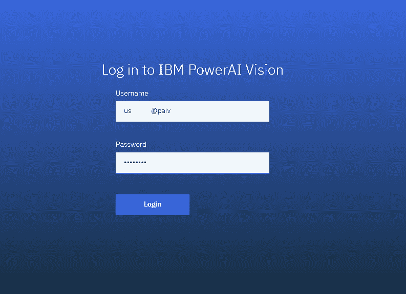

PowerAI Vision Login Page

当我们完成登录后，我们将会看到应用程序本身。它分为四个不同的选项卡，数据集、模型、自定义模型和部署模型。“数据集”选项卡允许我们上传不同的图像和视频，作为输入要素提供。“模型”选项卡提供了在指定不同的超参数以帮助算法以更高的准确性更快地收敛之后，在选定的数据集上根据不同的预定义算法训练机器学习模型的选项。自定义模型类型允许您将之前在 PowerAI 视觉平台上训练的预训练视觉模型作为. zip 文件导入，并允许您使用该模型在更大程度上节省工作和时间。这个平台可以被视为迁移学习的真实例子。为了能够对对象进行分类或分割图像，我们需要创建一个非常深的神经网络模型，该模型具有大量的层和数百万个参数、超参数、训练、开发和测试矩阵，以便向前看。更重要的是，我们需要巨大的计算能力和如此多的时间来训练网络。但这就是迁移学习的用武之地，我们不是从零开始，我们从预先训练的模型开始，特别是在计算机视觉模型中训练。这就是像 IBM PowerAI vision 这样的平台发挥作用的地方，它不仅可以简化开销，还可以有效地为用户提供计算能力和数据洞察力。deployed models 选项卡允许您浏览您已经为生产环境部署的模型，可能通过不同的应用程序编程接口向您的客户展示对代表性状态转移范例的尊重。比如你可以从你开发的应用程序内部使用下面的 API 调用来识别或分类或分割结果。在为输入图像提供预测的同时，PowerAI Vision 还提供了嵌入在输入图像顶部的热图，以表示图像矩阵中的位置，这些位置对于算法正确分类或识别图像中的对象起着重要作用。在下面的 API 调用中，我将 true 传递给 containHeatMap 标准，以获取该热图作为响应。

```
https://{your_deployment_url_or_ip.com}/api/dlapis/{deployed_model_id}?imageUrl={url_of_the_image_object}?containHeatMap="true"?containRle="{true/false}"?containPolygon="{true/false}"?confthre={specify_floating_point_threshold_for_prediction}?cisnum={to_determine_possible_matches}
```

让我们从创建一个示例计算机视觉模型开始。让我们想象一下，我们将为无人机创建一个计算机视觉算法，以正确识别在洪水、地震或其他自然灾害中受损的房屋。嗯，我在这个主题上通过使用传统的深度神经网络(不使用 PowerAI Vision)实现了一个全尺寸模型，目前它在我的实验室中处于测试阶段。在本次演示中，我将向大家展示，使用 IBM PowerAI 视觉平台开始这样一项复杂的任务是多么容易，我最终在 PowerAI 视觉平台中获得了相当高的分类精度，无需做太多调整，在精度方面一点也不差，同时记住算法训练的迭代过程，调整不同的超参数，将不同的算法集成在一起等等。

所以，让我们来收集一些数据。因此，在这次演示中，我们将从互联网上下载一些被毁房屋的图像，在这次演示中，我只下载了 40 张可能包含受损房屋的航拍图像，还下载了一些其他完好房屋的航拍图像。这是我的数据集，总共只包含 52 张图片。嗯，这绝对不会是我们的任何生产阶段部署。我们将使用 PowerAI 视觉平台提供的工具来增强更多的图像。

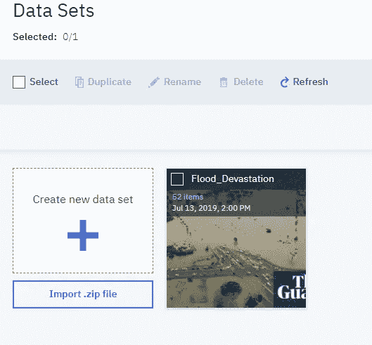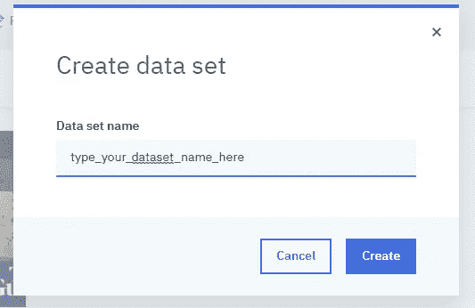

Creating or importing Datasets to the PowerAI Vision portal.

选择创建新数据集或使用导入功能导入数据集。zip 文件开始使用。等待图像和视频文件完成上传，在上传过程完成后，您将看到一个类似如下的界面:

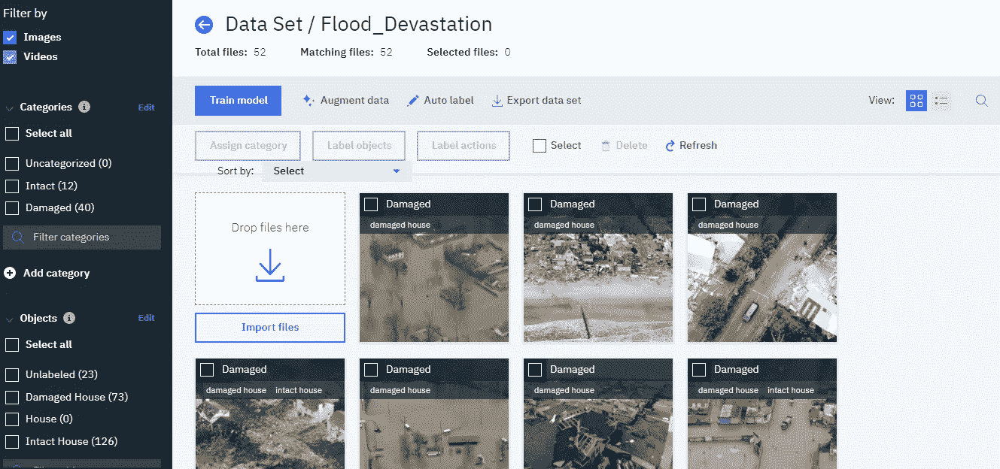

Dataset Page: After Creating /Importing a dataset augmentation Process in progress.

有了这么少量的文件，我们的算法不会收敛。所以，我们能做的，就是从我们上传的 52 张图片中增加更多的图片。为此，我们只需单击“增强数据”,它将提供诸如裁剪、旋转、噪声等各种选项来增强原始图像中的新图像，并以您提供的名称创建新数据集。增强过程可能需要很长时间，具体取决于输入图像或视频的大小。通过扩充，我们能够从仅仅 52 个输入图像中生成近 1300 个文件。

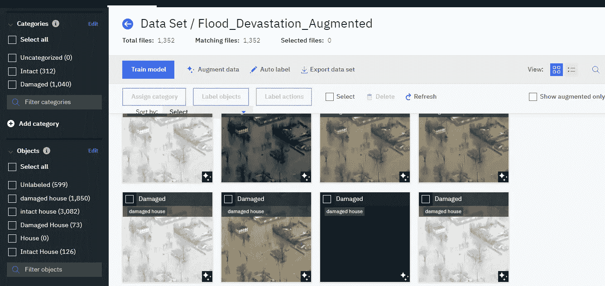

After Data Augmentation

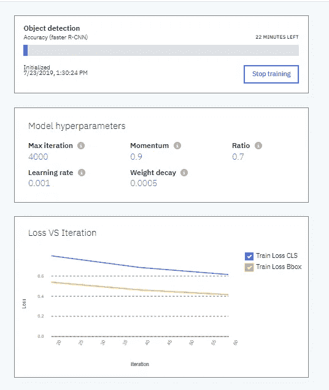

Initiation of Training of the dataset

在增强过程完成之后，我们有 312 个图像被分类为完好房屋，其中 3082 个对象被标记为完好房屋，1040 个图像被分类为受损房屋，其中 1850 个对象被标记为受损房屋。直到这个数据集不意味着生产就绪的计算机视觉项目，只是为了演示的目的。因此，我们将进一步从我们生成的图像中训练出一种算法。因此，让我们单击“Train Model ”(训练模型),选择“object recognition model ”(对象识别模型),我们将选择要在更快的 RCNN 算法上训练的模型，以获得更高的准确性。我们单击高级选项来进一步微调超参数，例如迭代或时期的最大数量、梯度下降的动量、训练和测试/验证集的比率、学习率、正则化的权重衰减以减少过度拟合的机会。现在我们开始训练，PowerAI 视觉平台将在提供的 GPU 上开始训练。默认情况下，PowerAI Vision 上的每个试用帐户都可以访问 12 个 GPU，从而大大减少了训练模型的时间。随着培训的进行，您将会看到一个实时的损失与迭代图，在图中您会看到随着迭代的增加，损失会减少。培训结束后，您将会看到一个部署模型和导出模型的选项。只需单击 Deploy Model 或 Deploy and Export Model 即可为生产部署模型。正如您在下面看到的，我的模型在所选的超参数下表现出 100%的准确性。

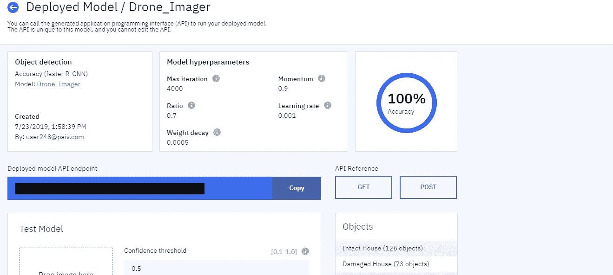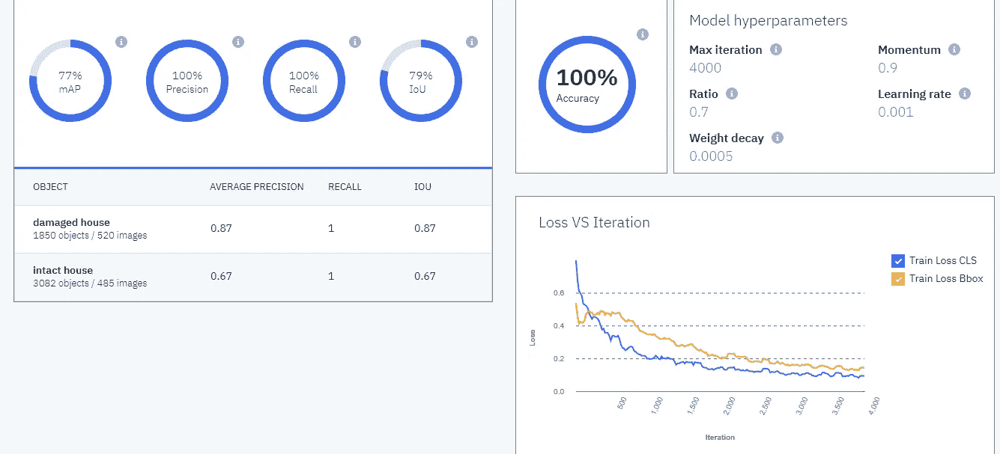

Model Evaluation Metrics

模型完成训练后，您还可以查看不同的算法指标，以分析模型的实际表现，包括混淆矩阵、迭代与损失图等。导航到 Models 选项卡，单击您刚刚创建的模型，打开 advanced metrics 选项卡，您就可以开始了。

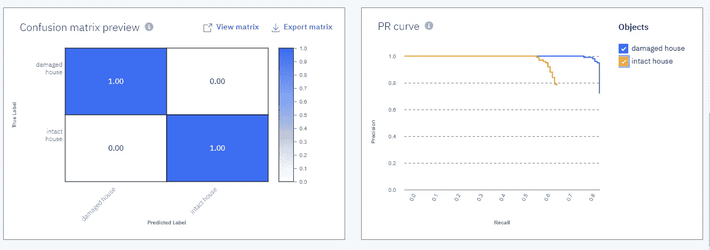

Confusion Matrix and Precision-Recall Curve of the trained model

现在，让我们测试我们的模型如何在两个不同的插图中识别受损的房屋和完好的房屋。要使用您自己的映像进行测试，请导航到 Deployed Models 选项卡，单击您刚刚部署的模型并单击以打开模型详细信息，然后在 Test model 部分下，放置您的映像或提供一个指向对象存储的超链接，或者使用 import 按钮导入映像。为了这个演示，我从网上下载了两张图片，一张是一栋毁坏的房子，另一张是一栋豪华平房。让我们看看算法对它们的表现。我们将 0.5 设置为算法进行预测的置信度阈值。

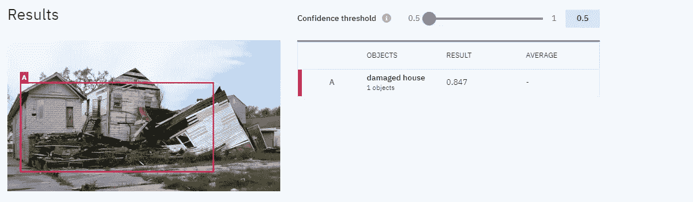

Algorithm performing object detection over the wrecked houses

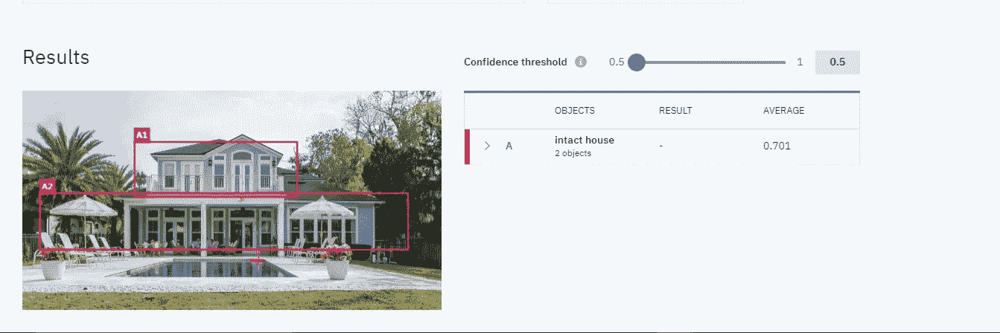

Algorithm performing object detection over the intact houses

我们可以看到，这个模型表现得非常准确。由于我们使用了正则项，过拟合的可能性非常小。但由于数据较少，该模型不适合生产环境。现在，使用该模型作为基础模型，您可以训练不同数据集的模型，使用该模型自动标记新数据集中的对象，调整超参数，在一个地方创建集合模型。

自动标记数据集意味着使用您之前部署的模型自动标记数据集中的对象。随着此过程向图像中添加更多数据，模型的性能也会提高。

只需点击下面的链接，您就可以获得这个演示的部署基础模型。您将需要一个 IBM PowerAI Vision 帐户来访问该模型。

[https://129 . 33 . 249 . 70/power ai-vision-ny/#/deployed models/2b 998d 64-7a 47-4d 21-92ff-2a 08a 093702 e](https://129.33.249.70/powerai-vision-ny/#/deployedModels/2b998d64-7a47-4d21-92ff-2a08a093702e)

那么，你还在等什么？继续构建您自己的支持深度学习的模型，并立即运行！

结束！

*宇宙中所有的力量都已经是我们的了。是我们把双手放在眼前，哭喊着天已经黑了”——斯瓦米·维威卡难达。*