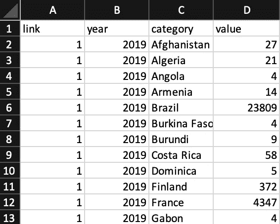
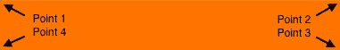
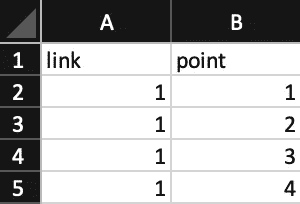
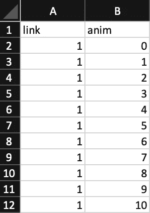
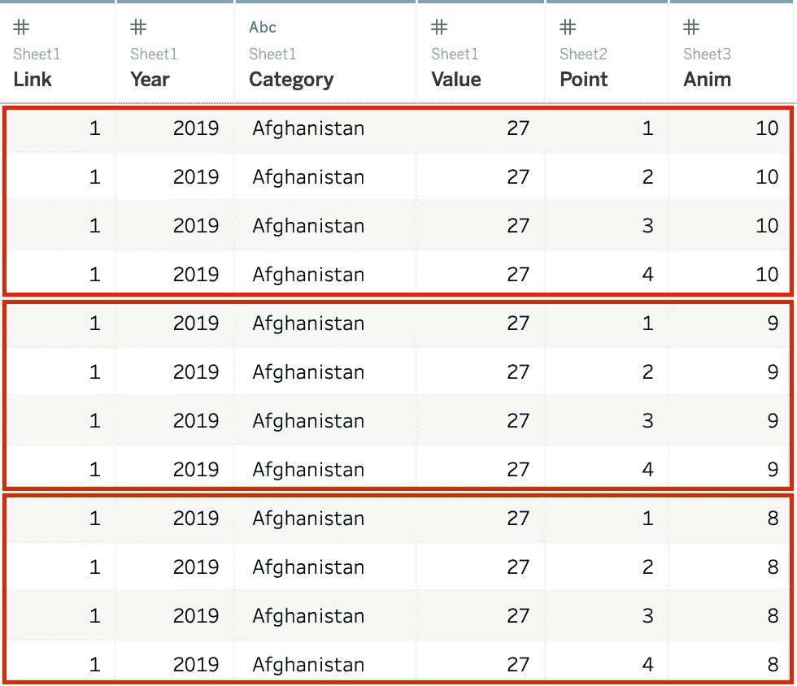
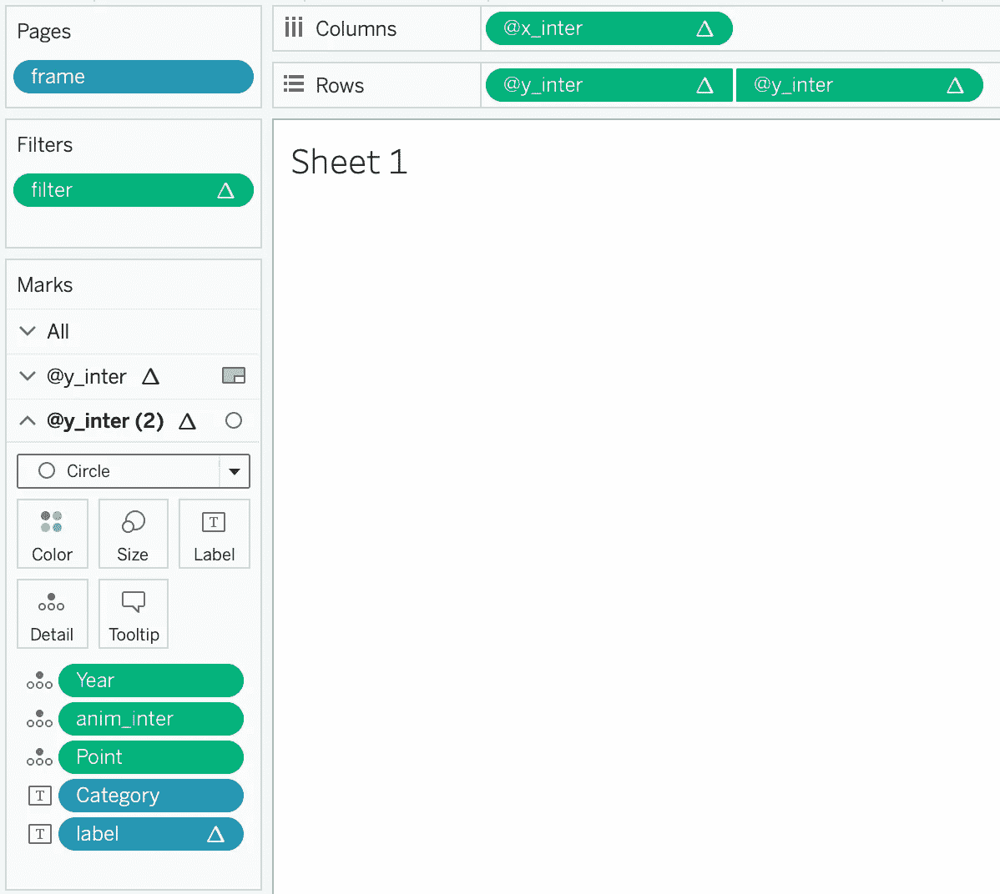
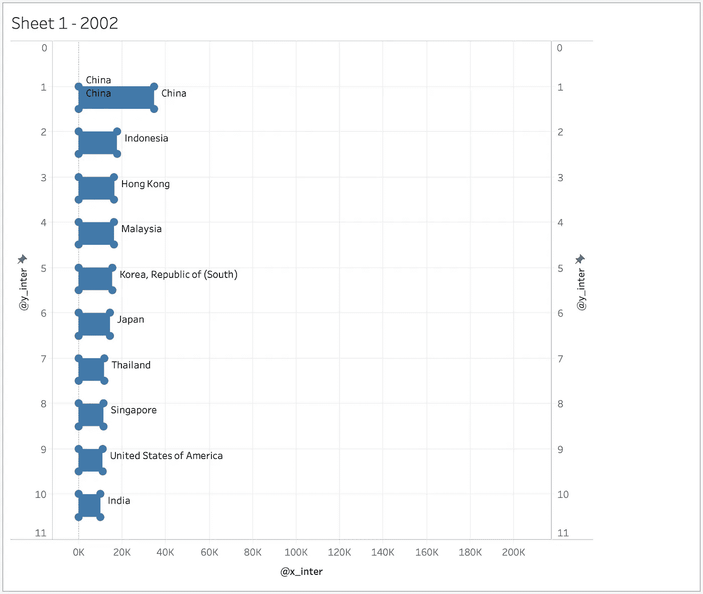
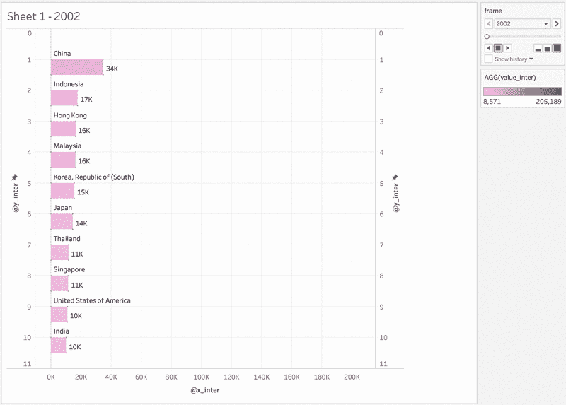

# 用 Tableau 创建一个动画条形图比赛

> 原文：<https://towardsdatascience.com/creating-an-animated-bar-chart-race-with-tableau-6a7839f703af?source=collection_archive---------11----------------------->

## 使用 Tableau 模拟动画条形图竞赛的分步指南


不久前，我在 Reddit 上的/r/dataisbeautiful 上发布了一个动画条形图，显示了澳大利亚按原籍国分列的国际学生人数的变化。这样的动画条形图非常适合以非常醒目(或者有时很烦人)的方式展示一段时间内不同类别对应的数值数据的演变。

半个月前我没有时间去记录它是如何完成的，但我最近决定，在忘记它们之前，最好在某个地方记录我遵循的步骤和我的思维过程，所以这里有一篇文章详细介绍了当时我脑海中的想法:

在我继续之前，我想说这篇文章很大程度上受到了我从 Ludovic Tavernier 的博客[上读到的](https://greatified.com/)[教程](https://greatified.com/2019/03/20/how-to-build-an-animated-bar-chart-race-in-tableau-software/)的启发。我对他发现这种用画面模拟条形图动画帧的方法表示最大的尊敬和钦佩，他所做的一切值得称赞！

事实上，我密切遵循他的步骤来创建我发布的条形图，但在浏览完教程后，我认为提炼和阐述某些部分可能会有用，以使教程更全面，更易于初学者理解，并概述所涉及方法的步骤背后的动机和逻辑。本文中的所有代码(除了一些调整)都取自 Ludovic 的，再次感谢他！

在分步指南中，我将向您展示如何使用 Tableau 创建自己的动画条形图，并以我的学生人数数据集为例。希望在本教程结束时，您能看到一些东西在移动！

# 入门指南

***Tableau 不会自动从数据集创建动画条形图。解决这个问题的一个快速方法是让 Tableau 创建单独的帧，当你把它们串在一起时模拟一个动画。这和卡通的制作方式是一样的。***


It’s never too late to get moving. Sometimes we fall, but sometimes we succeed too. (Photo: freepik.com / macrovector)

现在，要做到这一点，你最好让 Tableau 自动创建这些帧，这些帧又是从你提供给 Tableau 的数据中创建的。但是除非你真的喜欢手动创建数据集，否则你实际上是如何自动创建这些“伪数据”的呢？

这种方法就是围绕这样做的。

# 1.创建必要的数据条目

在这个步骤中，您需要创建 3 张数据(最好都在同一个 Excel 文件中)。目标是创建一个包含更多行的更大的数据集，使得每一行代表 1)每个动画帧和 2)动画条的每一点(更多信息见下文)。

不明白吗？这里有一个简单的例子:你从一个包含 20 个条目的表格开始，从 2001 年到 2020 年。现在，您想保留更多关于每年每个月的信息，所以您为“月”创建了一个额外的列。每一年包含 12 个月，您需要确保每一年，比如 2001 年，每个月重复 12 次。因此，您会得到 20 x 12 个条目。这就是我们所说的笛卡儿积。

回到我们应该做的事情，我们想在数据集中复制条目，但是我们想以更优雅的方式来做，而不仅仅是手动为每个条目创建行。因此，我们将通过在单独的表格中为我们想要引入的每个新列创建新的通用条目(或者在前面的例子中，为每个单独的月份创建新的通用条目)来实现这一点。然后，我们让 Tableau 在这些表上自动执行笛卡尔连接。

您的第一张工作表将包含您的原始数据，而另外两张工作表将包含新的通用条目。

## 表 1:关于数据集的信息

第一张工作表实际上是您想要制作动画的主数据集。应包含**年**、**类**、**值**等基本信息。除此之外，您需要创建一个额外的列**链接**，稍后将用于连接其他数据表上的数据。

*   **年**:您观察的时间单位的数值
*   **类别**:任何你想观察的事物的名称，比如国家名称
*   **值**:您感兴趣的数值，如 count
*   **链接**:作为连接各种数据表的锚的标识符(在所有数据表中使用相同的值；为了简单起见，在这种情况下为 1)



Sheet 1: Information about your dataset

## 第 2 页:各酒吧信息

该工作表实际上为数据集中的每个类别创建了条形图的 4 个角(将出现在图表中)。点 1 代表矩形左上方的点，随后的每个点都是顺时针方向，以点 4 代表左下方结束。

*   **链接**:作为连接各种数据表的锚点的标识符(在整个数据集中使用相同的值；为了简单起见，在这种情况下为 1)
*   **点**:表示条的某个角的点(编号为 1-4)



The four corners of a bar labelled from 1 to 4

您的第二张工作表应如下所示:



Sheet 2: Information about each bar

## 表 3:每个动画帧的信息

此表创建动画帧，以动画显示数据集中指定的固定间隔之间的时间间隔。例如，如果您的数据集中的最小时间间隔是 1 年，该表将创建 *k* 个帧数，以动画显示从*年*到*年【n+1】年*的条形图。

*   **link** :一个标识符，作为连接各种数据表的锚(在整个数据集中使用相同的值；为简单起见，在这种情况下为 1)
*   **anim** :创建的每一帧的标识符(编号为 1 到 *k* ，您想要为每个间隔创建的帧数)

您的第三个工作表应该完全如下所示:



Sheet 3: Information about each animation frame

有了这三张工作表后，打开一个新的 Tableau 工作簿，并选择您在上一步中创建的 Excel 文件。对**链接**列上的所有工作表执行笛卡尔连接。

回头看看 Tableau 创建的新数据条目，您应该会看到，原始数据集中的每个数据条目都已经用条形中每个点的条目以及每个动画帧的条目进行了复制:



Each original entry in your dataset gets replicated for each animation frame and for each point on the bar. Each highlighted box shows the 4 entries needed to define a specific bar at a particular frame.

# 2.创建必要的变量来定义每个条形

现在，我们的数据集大大扩展，以容纳每个动画帧和每个动画条的更多数据条目，我们现在的目标是计算这些条目的一些值，这些值将定义每个特定帧的条的大小和位置。

切换到一个空的 Tableau 表，然后我们继续使用数据集的列中包含的数据创建几个计算字段:

**anim_inter** :一个*数*，包含当前帧/每间隔总帧数的比值(例如 2/10 = 0.2)

```
[Anim]/{MAX([Anim])}
```

**帧**:一个*数字*，表示某一区间(如 2001.2 年)内的确切动画帧

```
[Year]+[anim_inter]
```

**value_current** :一个*数字*，表示间隔开始时的棒线实际值(如 2001 年至 2002 年间隔开始时为 190)

```
{FIXED [Year],[Category]:MIN([Value])}
```

**value_next** :一个*数字*表示间隔结束时棒线的实际值(如 2001 年和 2002 年之间的间隔结束时为 195)

```
LOOKUP(ATTR([value_current]),1)
```

**value_inter** :一个*数字*，表示在间隔内的一个精确动画帧上的条的内插值(例如在间隔 2001.3 时为 193.2)

```
ATTR([value_current])+
([value_next]-ATTR([value_current]))*ATTR([anim_inter])
```

**rank_current** :一个*数字*，根据间隔开始时的 **value_current** 显示该条相对于其他条的等级

```
RANK_UNIQUE(ATTR([value_current]),”desc”)
```

**rank_next** :一个*数字*，显示间隔结束时棒线的等级

```
LOOKUP([rank_current],1)
```

**rank_inter** :一个*数字*显示在间隔内的一个精确的动画帧上条形的‘中间’等级

```
[rank_current]+([rank_next]-[rank_current])*ATTR([anim_inter])
```

**@x_inter** :一个*数字*表示条的指定角的 x 值(即点 1 和点 4 的值应该总是 0，因为条的左侧不移动；而点 2 和 3 的那些应该总是指示条的当前长度)

```
IF ATTR([Point])=1 THEN 0
ELSEIF ATTR([Point])=2 THEN [value_inter]*1.0
ELSEIF ATTR([Point])=3 THEN [value_inter]*1.0
ELSEIF ATTR([Point])=4 THEN 0
END
```

**@y_inter** :一个*数字*表示条的指定角的 y 值(即点 1 和 2 的值应该总是相同的，并且表示条的上边缘的高度；而 3 和 4 的那些应该总是相同的，并且代表条的底部边缘。y 值之间的任何差异表示该条的高度)

```
IF ATTR([Point])=1 THEN [rank_inter]*1.0 
ELSEIF ATTR([Point])=2 THEN [rank_inter]*1.0
ELSEIF ATTR([Point])=3 THEN [rank_inter]+0.5
ELSEIF ATTR([Point])=4 THEN [rank_inter]+0.5
END
```

**filter** :一个*数字*，显示该条 **value_inter** 的等级；我们将使用它来过滤掉不在顶部 *x* 条数内的所有其他条

```
RANK_UNIQUE([value_inter],”desc”)
```

**标签**:一个*字符串*表示该条的**类别**和**value _ inter**；**类别**显示在条形的点 1 上方，而 **value_inter** 显示在点 3 上方

```
IF ATTR([Point])=1 THEN ATTR([Category])
ELSEIF ATTR([Point])=3 THEN STR(INT([value_inter]/1000))+”K”
END
```

# 3.观想时间！

本质细节都解决了，我们现在终于可以专注于这个过程中令人兴奋的部分:观想！

## 设置货架和卡片

让我们从在 Tableau 工作表上摆放所有搁板和卡片开始:

1.  将 **@x_inter** 拖到*列*架上。修改表格计算
2.  将 **@y_inter** 拖至*行*架，然后再次重复完全相同的步骤。将第二个 **@y_inter** 设置为*双轴*。
3.  右键单击视图窗格上的任意两个 y 轴，并选择*同步轴*。将轴的范围设置为从 0 到 11，并反转其刻度。
4.  将**框**拖至*页*架，并确保其为*离散尺寸*。
5.  将**过滤器**拖到*过滤器*架上。
6.  选择 **@y_inter** *标记*卡片下的*多边形*标记，添加**年份**、**类别**、 **anim_inter** 为*细节*，最后**点**为*路径*。确保这些都作为*尺寸*添加。
7.  选择 **@y_inter(2)** *标记*卡片下的*圆圈*标记，添加**类别**和**标签**为*标签*，以及**年份、anim_inter** 和**点**为*明细*。确保这些都作为*尺寸*添加。

在这一系列步骤的最后，您的 Tableau 工作表应该看起来像这样:



How your Tableau worksheet should look like at the end of this series of steps

## 指定一些表格计算

设置好所有字段后，就该配置一些表计算了，以确保我们之前创建的计算字段在视图窗格中正常工作:

1.  右键点击*栏*架上的 **@x_inter** ，配置表格计算。使用**年**和**帧**计算 **@x_inter** 。这就使得 Tableau 对每一个 **anim_inter** 、**类别**、**点** *按**年**和**帧**计算 **@x_inter** 。
2.  右键点击*行*架上的 **@y_inter** ，配置表格计算。设置为使用**类别**计算 **rank_current** ，使用**类别**、**年份**和**帧**计算 **rank_next** ，每选择一个 **类别**时*重新启动。对两个 **@y_inter** 轴重复此操作。*
3.  右键点击*过滤器*卡下的**过滤器**，设置表格计算。使用**类别**计算**过滤器**，使用**年**和**帧**计算**值 _ 下一个**。指定 0–10 作为值的范围。

*对于那些不真正理解表格计算的人来说，请点击这里查看安迪·克里贝尔的精彩解释。

瞧啊。经过这么多步骤后，你终于有了一些条形图的外观！点击播放(界面右上角)查看你的条形图移动！



The moment of truth: a bar chart appears!

## 在条形图上润色

然而，正如你肯定会注意到的，你的星盘可能仍然是丑陋的一面，仍然有一些事情要做，以润色一些美感:

1.  在 **@y_inter(2)** *标记*卡片下，选择*标签。*点击“…”编辑文本。从字段中删除<类别>，并将< AGG(label) >向右对齐。接下来，将*标签*的*定位*从*自动*改为*右上*。最后选择复选框*允许标签覆盖其他标记*。
2.  点击*尺寸*并在滑块上选择最小尺寸。现在你不再有看起来傻傻的长方形了！
3.  为了给你的条添加一些冷色调，将 **value_inter** 添加到 **@y_inter** 标记卡中作为*颜色*。使用**年**和**帧**计算 **value_inter** (就像前面的一系列步骤一样)，最后选择你想要的颜色渐变。



How your screen should look like after some aesthetic tweaks

这些是我认为使你的图表看起来最起码是像样的一些步骤，尽管你也应该自己尝试其他的事情来使你的图表看起来更好——尝试重命名/隐藏你的轴、轴标题和图表标题！

您还可以创建一个 Tableau 仪表板，除了具有条形图的视图窗格之外，还具有多个视图窗格。一个这样的视图窗格可以显示随着图形的移动动画的年份。

如果你发现了有趣的个性化条形图的方法，请告诉我！

## 结束步骤

最后但同样重要的是，目前还不能使用 Tableau 直接将模拟的动画条形图导出为图像或视频。对于那些想以另一种格式保存动画图表的人，可以考虑使用电脑(或第三方应用程序)上的屏幕录制功能来录制 Tableau 上的动画帧。然后你可以使用互联网上的免费工具将你的视频文件转换成. gif 格式，如果你喜欢的话，就像我一样。这就是你要的，一个漂亮的动画图表！

# 现在一切都好

所以这应该是本教程！我想我可能已经记下了我的大部分想法和我为了得到一个好看的动画条形图比赛而遵循的步骤，所以如果我有一段时间不接触 Tableau，我可能很容易在未来重新创建一个。

如果你有任何问题或疑问，请告诉我，谢谢你的阅读！希望你在创建图表时玩得开心！

> 如果你想阅读我创作的动画条形图比赛(澳大利亚的比赛在最上面)的简短反思以及它在 Reddit 上引起的巨大讨论，请查看我的另一篇[文章](/how-data-sparks-a-global-discussion-on-a-global-issue-f66f43e330d5)！