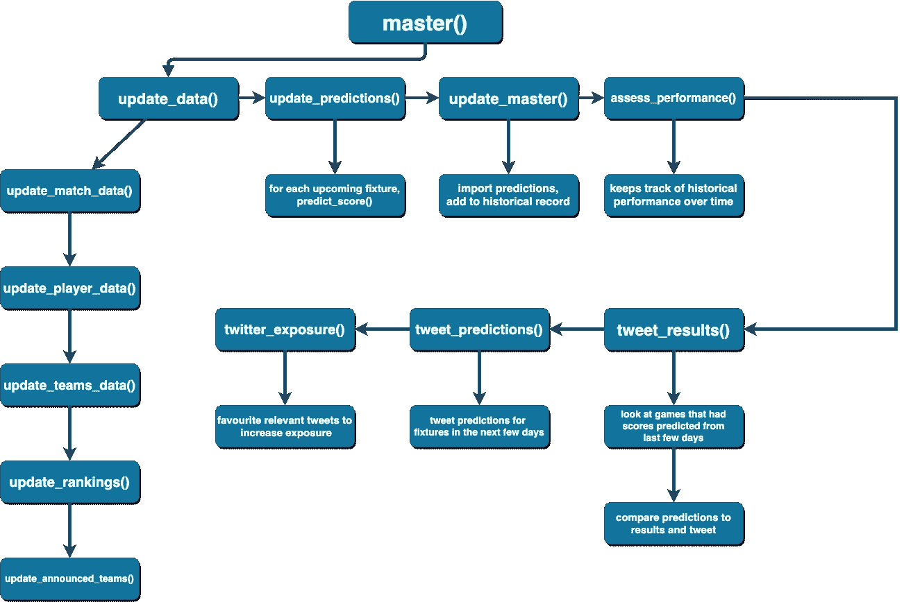

# 预测体育结果的自动化框架

> 原文：<https://towardsdatascience.com/creating-an-automated-framework-for-predicting-sports-results-5fe01623d74b?source=collection_archive---------11----------------------->

## 我如何建立一个自动化的机器学习框架来预测橄榄球比赛的结果，并在没有任何监督的情况下发布输出

我最近决定开始一个兼职项目，将我对橄榄球的热爱与我对数据科学的热爱结合起来——于是[梅尔橄榄球](http://twitter.com/mel_rugby)诞生了。Mel 是我用 R 编程语言创建的一个框架，它首先从网上的各种来源收集橄榄球比赛的数据，然后通过一组预先训练的机器学习模型运行这些数据，以产生最终比分的预测，最后将预测的输出和准确性发布到@mel_rugby twitter 帐户。

在这篇文章中，我将讨论一些我必须考虑的要点，我是如何开发这个框架的(作为一个非机器学习专家)，最后，我学到了一些经验。

## 动机

我从 4 岁开始玩橄榄球，所以当我大约一个月前想到一个潜在的项目时，这是我首先想到的话题之一。鉴于橄榄球世界杯(RWC)将于几周后开幕，这似乎是一个完美的时机。所以我着手做了一些关于如何最好地预测体育比赛结果的研究——大部分集中在足球或 NFL 上。根据以前的经验，我知道接下来要做的最好的事情就是开始，看看我能走多远，所以我就这么做了！

## 工具

在这个项目中，我使用了 R，因为它是我最精通的语言。使用 Python 可以获得相同的结果(也许更有效)，但就我个人而言，这会花费我更多的时间。我用的主要包有: *rvest* 、*XML 2*&*RSelenium*用于抓取数据； *dplyr* ， *tidyr* ，*stringr*&*lubridate*进行数据角力；*脱字符号* & *神经网络*用于训练模型；以及在推特上公布结果的 T21。在这一点上还值得注意的是，我着手使整个框架尽可能自动化。因此，整个项目本质上是一组嵌套的函数，它们依次相互调用。下面是当前流程的示意图:

Flowchart outlining the current process of the Mel Rugby framework

目前，所需要的是每隔几天运行一次“master()”——这可以被安排或在线托管以实现完全自动化。

## 获取数据

首先要克服的问题是获得一些我可以用来模拟橄榄球比赛的数据。我很早就决定，调查每一场橄榄球比赛将会大大增加所需的时间和精力，不仅因为它将包括用不同的结构收集数据，而且影响国际比赛和国内/俱乐部比赛的因素也不太可能相同，因此考虑两者可能需要不同的模型。随着世界杯的临近，国际比赛数据是最容易获得的，我决定只考虑国际比赛，如果可能的话，以后再把框架扩展到国内比赛。在网上搜索后，我找到了一个网站，里面包含了从 20 世纪早期开始的所有国际比赛的基本数据。

## 变量的选择

在考虑变量时，我可以使用两种通用方法——关注团队层面的变量或个人变量。在这里，我受到可用数据的限制:每场比赛的个人球员数据更难获得，也更不可靠(至少我使用的数据源是这样)。澄清一下，我这里指的是诸如身高、体重、近期表现等信息。在玩家层面。我能够获得每个球员之前为国家出场次数的信息，并将其整合到我的模型中。

一旦我决定专注于球队层面的变量，我就争论各种数据来源，以获得一支球队可能影响比赛结果的明显特征，包括:他们的总上限数(我最终分成前锋的总上限和后卫的总上限)；他们最近的表现(过去 5 场比赛)；他们目前的排名(为此我使用了我自己的——与 IRB 官方排名非常相似，但略有不同——以及他们是在主场、客场还是在中立场地比赛(大多数 RWC 奥运会都是如此),等等。

## 型号选择

过程的这一部分出乎意料的简单和快速。我目前正在改进现有的模型，并希望有“第二阶段”模型很快实施。我绝不是机器学习方面的专家，所以一旦我粗略地研究了以前是如何处理这个问题的，我就开始尝试不同的模型和模型组合，直到我找到一个相对更好的组合。对于那些感兴趣的人，我开始使用主成分神经网络(PCANNet)和线性支持向量机(LSVM)，两者都将两个团队的特征作为输入，然后输出每个团队的预测分数。然后我取了两个分数预测的简单平均值，因为这被证明是最准确的。

在第一阶段的模型被训练并在即将到来的几场比赛中测试后不久，很明显模型失败的一个方面是在一个球队“逃脱”的比赛中。在这些比赛中，一支球队获得了动力，并最终轻松获胜(超过 20 分)，这些比赛我称之为“大胜利”。我决定开发一些模型来解决这个问题，这导致了:

*   一个用于预测比分的套索回归模型，*假设其中一个队将以特别大的优势获胜*。
*   一种随机森林分类器，试图确定一个团队是否可能在给定的游戏中以特殊的优势获胜。

这意味着对于每场比赛，每支球队都会产生一个预测得分和一个预测的“大胜”得分。如果随机森林暗示比赛中的一个队会彻底消灭他们的对手，我用“大胜”分数作为预测。这产生了积极的影响——例如，在撰写本文时，新西兰最近以 63 比 0 击败了加拿大。最初的模型预测新西兰以 43–5 获胜，但是“大胜”随机森林模型将比赛分类为可能以大胜结束，因此选择了“大胜”得分预测，预测结果为 66–0，这大大提高了模型的性能。

## 交流输出

从这个项目一开始，我就想确保这个框架所做的预测有一个公开的记录，为了透明，也为了增加对这个项目的参与。我决定使用 Twitter 有几个原因，最重要的是因为 *rtweet* 软件包让自动化一个 Twitter 账户变得非常容易。因此，我建立了@mel_rugby twitter 账户，并编写了一些功能来获取预测并发布它们，包括根据预测的情况添加表情符号，以便让 mel 看起来更有感觉和更有吸引力。

## 经验教训

我现在每三天手动打开一次项目并运行主功能。我仍然这样做，以防意外出现错误(这种情况已经好几次没有发生了，所以祈祷继续发生吧！)，但实际上我可以设置我的笔记本电脑在预定的时间运行该框架，甚至付费让它在线托管，这样我就可以忘记它，它就可以运行了。我在这个项目中学到的一个关键教训是我从数据科学专家那里一次又一次听到的，但只是刚刚开始意识到:数据来源和清理比实际训练机器学习模型花费**更多的时间和精力。**

## 当前性能和未来添加

梅尔目前在预测方面是一个非常混杂的包，许多已经被 bang on 和其他人没有那么多。我对第二阶段模型投入生产感到兴奋，因为我相信这将大大改善预测。有关梅尔如何预测结果/分数的更多信息，请查看梅尔橄榄球推特账户！

就该项目的未来补充而言，我已经开始开发一个 web 应用程序，它将允许人们与 Mel 进行交互，并查看比分预测如何变化，例如:比赛日阵容中挑选的确切球员；从现在到正在讨论的游戏之间将要进行的游戏的结果；当天的天气；和其他变量。如上所述，我还在研究模型的第二阶段，我希望 a)提高用作输入的数据的质量和数量，b)提高对“冷门”的预测，即低排名球队击败高排名球队，以及 c)研究球员水平的表现模型，以及如何使用这种模型来增强得分预测。我还计划增加 Twitter 机器人 Mel 的复杂性，以便它可以与查询进行交互和响应。这可能最终会被托管在某个地方，所以我可以让它无限期地运行下去！

## 结论

感谢阅读，我希望你觉得这很有趣！如果你想让我再写一篇文章详细阐述以上任何一点，请在下面留下评论。我正在考虑一个更详细的帖子，要么是关于建立一个 Twitter 机器人，要么是关于数据转换过程的更多细节。如果你觉得这有用或有趣，请鼓掌，并与其他可能喜欢它的人分享！

页（page 的缩写）如果你想知道这个项目的名字，我最初把它叫做 rugbyML(机器学习),但是为了让它更有个性，我想给它取一个人类的名字，所以叫“ML”->“Mel ”!