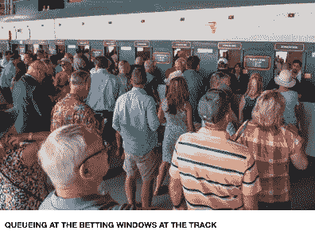
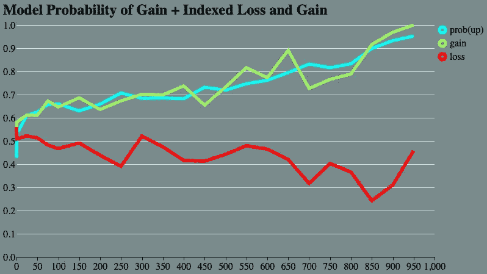
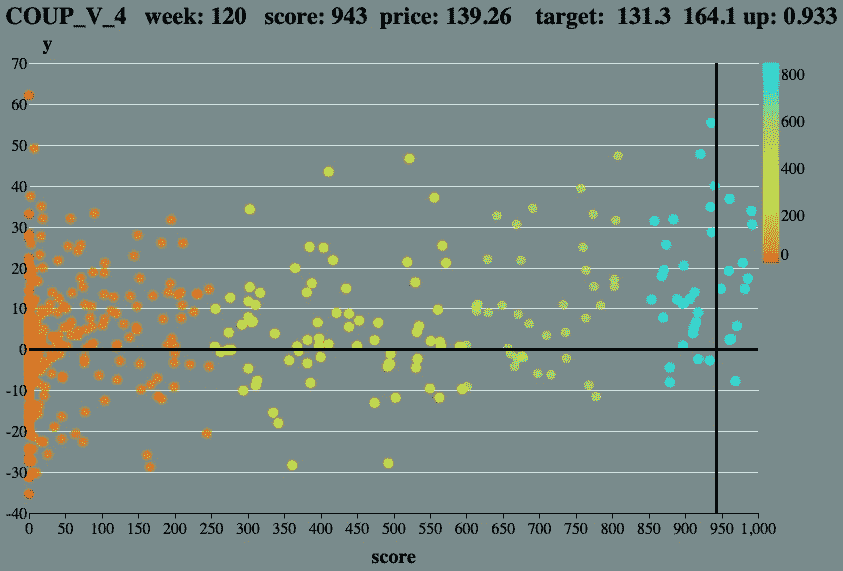

# 创建一个可解释的机器学习算法

> 原文：<https://towardsdatascience.com/creating-an-explainable-machine-learning-algorithm-19ea9af8231c?source=collection_archive---------12----------------------->

## 用选股结果构建一个可解释的机器学习算法是什么、如何做以及为什么

# 何必呢？

几年前，我开始学习 Python 和 R，目标是学习如何应用它们的优化、统计、数据科学、机器学习和数据可视化包和库。

我还购买了股票市场数据(赛马数据不可用),抱着测试各种模型的想法，我有几个目标:

1.  了解模型的工作原理
2.  学习 Python 和 R
3.  找出那些可能是好的投资对象的股票

我有运筹学(任何阅读本文的数据科学家都可以使用的规范分析)背景，并在各种行业中用 PL1、Fortran 和 Fortran 统计和优化库、C 和 SAS 进行了大量建模，以解决各种业务问题。所以目标(1)和(2)并不难实现。

对于我尝试过的所有算法来说，确定要投资的股票是非常具有挑战性的。这就是原因 1。

# ***开发自定义 ML 算法的原因包括:***

**理由 1:** 用现有软件为建模难题提供解决方案。

**理由 2:** 如果我要投资我的钱，参与这个游戏，我想知道为什么这个模型选择某一只股票作为投资候选，而不是另一只。什么样的特征组合在推动决策？

**原因 3:** 如果算法有效，我想将它应用于另一个问题，能够向最终用户解释它可以加快其接受程度并降低成本。模型开发成本不仅包括处理数据和估计模型权重、优化功能或模拟策略所花费的时间。它们还包括测试、监控和最终用户变更。变更&假设问题可以将宁滨数据包含到当前使用的区间、首选区间或更直观的区间，甚至可以从模型中添加或删除特征或决策变量。

**理由 4:** 通过创建自己的机器学习算法，组件和功能很容易修改，因为代码是自己写的。

**原因 5:** 在再次读到“机器学习模型在 X 行业没有用，因为它们缺乏透明度”后，我决定看看是否可以创建一个“透明的机器学习模型”。我喜欢尝试解决问题的挑战。

**原因六:**我喜欢编码。

# **建什么？**

当我想到这一点时，我决定瞄准最容易理解的有用模型— ***记分卡*** 。

**记分卡**

对于那些不熟悉记分卡的人来说，记分卡用于决定是否给申请人贷款。他们对违约风险进行排序——较高的分数比较低的分数风险更小，并且可以根据赔率或概率进行调整。

记分卡构建流程可能包括:

(1)宁滨连续变量(特征)变成一组 0/1 输入。

(2)使用一些度量来评估预测能力——通常是信息值，有时是比率。

(3)选择将用于估计模型的特征。这可以是自动化的，也可以由建模者来完成。

(4)使用线性回归、逻辑回归或数学规划来估计模型权重。

(5)通过将权重放大到整数，将分数缩放或校准到好/坏的赔率或概率。

(6)通过对每次观察的权重(现在是整数点)求和来对数据进行评分。在信用评分中，特征通常被称为特性，特征的 bin 是属性。每个特征只属于一个属性箱，因此评分要么是表查找和求和，要么是矩阵乘法。

一旦模型被估计，它就被呈现给终端用户，终端用户通常希望其他特征被用作预测器或以更直观、更合意或符合商业目标(例如针对特定人群)的不同方式将特征归入模型中。这是一个迭代的过程，如果很容易理解模型是如何工作的，这个过程可能会变得更容易。

# **何苦呢？**

为了提供一个详细的答案，我们去了赛马场，问了这样一个问题:一些赛马赌徒比银行家聪明吗？



赌马的人可能会考虑这些因素:

*   赛马获胜次数
*   马匹速度等级
*   骑师历史表演
*   比赛类型
*   赛跑距离
*   参加比赛的马的数量
*   支付赔率
*   等等。

可能的模型特征，如那些可能用于银行信贷风险模型或选股模型的特征。

银行通常不会直接优化回报。回报赔率不进入记分卡，而是在第二步进行估计，通常是对违约损失进行线性回归。尽管事实上有些违约的客户是有利可图的——他们在还清大部分贷款后才违约，而有些没有违约的账户是无利可图的——他们在所有初始化和处理成本被覆盖之前就还清了贷款。

老练的赛马投注者使用凯利标准来确定他们可用资金的最佳部分来投注一场比赛。

要下注的凯利分数= p 减(1-p) *亏损/盈利

其中 p 是获胜的概率，亏损/盈利是收益几率的倒数。

因此，与银行家不同，老练的赛马投注者在下注时有亏损和盈利，并在每次下注时将亏损和盈利比率融入他们的决策中。

**何苦呢？**

如果我们只是估计记分卡的权重，以获得概率估计值或对观察值进行分类，我们可以很容易地使用一个可解释的模型(逻辑回归或线性规划等)来完成。)或者更难解释的模型(神经网络、随机森林等)。).

所有这些模型都有一个共同点:

它们对整个人口进行预测。他们的目标函数不是针对最终目标的。

在选择候选股票进行投资的情况下，我们所追求的是每周考虑投资的 N 只股票的列表，并根据它们与凯利标准相关的预期回报进行调查。

我们根本不关心大多数的家畜。那么，为什么要在模型的损失函数中考虑它们呢？

***我们可以构建一个模型，让它根据案例的利润和损失，而不仅仅是成功的概率，计算出最大化或最小化案例数量的分数。***

这在看股票时尤其重要，因为回报率最高的股票可能看起来很像投资导致灾难的股票。

我们希望有一个算法，传递高回报的股票，其预测特征的配置文件也包括高风险的股票，我们希望有一个分数，而不是 2 个模型。

# **如何？**

我一直找不到一种[数字绘画](https://www.youtube.com/watch?v=kca5E3xk8II)(链接处伟大的音乐插曲)类型的算法来解决这个问题，我们希望生成一个分数，只识别观察的一个子集，并希望用更高的分数来优化选择。

**设置步骤:**

**第一步:**定义目标函数。在选股的情况下，上面已经做过了。具体来说，我们希望每周产生 10 只具有最高预期回报的股票。

**第二步:**计算模型开发样本中每只股票的表现。

**步骤 3:** 从模型开发样本中选择所有可能的预测特征。

**第四步:**将数据分割成模型、验证、测试和预测(超时)段。创建一个索引数组或列表，将每个观察值映射到它的段。

**步骤 5:** 使用模型数据，对每个特征进行分类，将任何缺失值放入它们自己的分类中。对于该特征，使用步骤 2 中的性能定义计算其交互信息值。如果需要，可以使用其他测量方法。箱应该有一些最小数量的观察值或最小百分比的观察值。宁滨过程通常不像人们假设的那样重要，因为优化在非常粗糙/宽的宁滨间隔下仍然工作良好。

**第 6 步:**根据第 5 步的结果，选择将进入模型的一组特征，去掉那些具有低信息值或其他预测能力度量的特征。

**步骤 7:** 在选择了特征之后，为步骤 5 中的每个箱建立具有 1 列的 X 矩阵。如果观察值不在箱中，则该列包含 0，如果在箱中，则该列包含 1。这将极大地增加 X 矩阵的大小，这也是不为一个特征创建大量条柱的另一个原因。所有线段都应在 X 矩阵中，每次观察一行。

# 学问

最后，我们到了学习的部分。这是你可以真正获得创意和测试想法的地方。

我采用的方法是实现一种改进的进化算法。有几个选择和定制的任何适应你想测试。

这里的基本思想是重复这些步骤:

(1)生成一个可能的解决方案(在这种情况下是一组整数记分卡权重)。

(2)使用 X 矩阵和权重对数据进行评分

(3)评估解决方案(在这种情况下，根据每周挑选的得分最高的股票数量计算预期回报)

(4)确定是否和/或如何记住好的解决方案并忘记较差的解决方案

(5)基于记忆中的好解集进行探索

(6)时常朝着更好的解决方案前进。当选择前 N 个评分观察值时，优化函数中有一个 if 语句，这使得情况变得复杂。这是通过评估内存中的解决方案，并通过调整搜索区域来确定要探索或收敛的区域来实现的。

**可以尝试的可用方法包括:**

*   遗传算法
*   粒子群优化
*   贝叶斯优化
*   随机搜索
*   禁忌搜索
*   基于上述内容或其他内容的其他定制方法

**可能并入算法的其他模型的组件:**

*   正规化
*   限制
*   批量标准化
*   最终模型的退出或其他特征选择
*   学习速度和/或动力

**超参数**

必须设置几个超参数:

*   每个要素的条柱数量-可以是所有要素的相同数量，也可以是每个要素的不同数量
*   一个箱中的最小观察数
*   如果 L1 和 L2 正则化都被使用
*   要做的最大迭代次数
*   没有改进的最大迭代次数
*   保留在学习者记忆中的最大观察次数
*   实施任何优化所需的其他参数

**合奏**

如果需要模型解的集合，当算法终止时，可以容易地从存储器中的模型解中产生。

***选股结果***

部门:技术

细分市场:高波动性

绩效范围:4 周

观察期:52 周

模型中的特征数量:30

X 矩阵的列数:134

唯一股票代码数量:535

限制:

*   一年中挑选的唯一股票报价机的最小数量= 40
*   这用于防止算法学习挑选特定的股票

学习模型:简单的概率搜索，每 100 次迭代学习更新一次

最大迭代次数:400 次

合奏:

*   生成了 10000 个不同的模型
*   每个模型选择由截止分数确定，截止分数设置为所有库存周模型分数的 90%，即库存周级别的 0/1 分数
*   库存周级别的得分=模型得分之和/ 10

**记分卡的部分样本**

下面显示了两个特性的样本特性得分和初始值。这里的下限是仓位的下限，第一个仓位是股票在过去一个季度中低于-31.54%的所有表现值，最后一个仓位高于 48.58%，缺失值为 0 分。

我们可以很容易地理解，该模型喜欢上个季度下跌很多的股票(它们得到 19 点)和上周上涨超过 1.66%的股票。它确实奖励了上周上涨超过 11.61%的账户，给他们 47 个点，而严重惩罚了那些下跌超过 5.93%的账户。

所有 30 个特性都有类似于表中 2 的分数，因为显示的记分卡是所有分数的平均分。

```
Performance (Quarter) 

        cut    points
     ------    ------
       -inf        19     0.38
     -31.54        -8    -0.13
     -12.02         0     0.01
      48.58         7     0.12
        nan         0     0.00

 Performance (Week) 

        cut    points
     ------    ------
       -inf       -56    -0.71
      -5.93        -6    -0.22
       1.66        27     0.43
      11.61        47     1.11
```

**剧情**

该图显示了不同的 50 分区间的综合预期收益和股价上涨的概率。整体方法导致以下分数分布:

42%的观察得分为 0。

24%的人得分在 1 到 25 分之间。

然后，每个分数仓中的观察值数量下降到 450–499 的范围是最后一个范围，至少有 1%的库存周观察值。

最后，950-999 的得分范围只有 0.45%的观察得分那么高。

有趣的是，模型在处理价格上涨的概率*价格上涨的百分比减去价格下跌的概率*价格下跌的百分比的乘积时，在分数范围内仍然具有几乎单调增加的概率(上涨),同时扩大了损益之间的差距。

通过将一个桶中的平均损耗和增益除以所有桶中的最大增益来计算预期损耗和增益的指数，以便于在同一图表上绘图。



最高评级股票 COUP 的回报与得分的关系图。

点数是在 52 周的模型开发样本中，第 120 周得分最高的 10 只股票的不同得分的观察值。

可以看出，随着得分的上升，回报分布(y 轴)的变化和风险降低。还要注意的是，前 10 名的最高回报在 0 分范围内——没有一个模型选择它，因为它看起来太像风险更高的股票周配置文件。基本上 0 分会有一个期望值< the population expected value since both the probability and gain to loss ratio are going up over the score range.

The vertical black line indicates the score for COUP in the current week when the model was run.

The model results can be used to estimate targets for individual observations by tabulating the outcomes in the ranges. The first number after target is the expectation if COUP goes down in price at the end of 4 weeks, the second if it goes up and the probability that COUP will go up.



**结论:**

机器学习可以被合并到一个灵活的简单易懂的模型中，即一个整数值记分卡。

这样做允许建模者通过直接计算结果来提供更适用的解决方案。没有必要估计分类概率，对它们进行排序，然后计算第二个模型来获得特定观察的影响大小。

关于使用什么组件、求解过程和正则化，有大量的选项。

对于那些有此倾向的人来说，创造的机会是敞开的。

像这样的模型可以用于:

*   识别投资机会，股票市场和其他。
*   在一天内可以调查的交易数量的任何操作限制内，确定一组预期欺诈损失最高的交易。
*   生成考虑财务回报的申请分数，对申请被接受的百分比或数量进行约束。
*   确定表现比预期差的 N 个客户的细分市场，同时最大限度地减少未来因拒绝具有此特征的申请而造成的收入损失。

**提问&建议**

如果您有任何问题、建议或问题，希望看到像这样的 ML 模型的结果，请随时给我发电子邮件:

bill.fite@miner3.com。

如果你感兴趣的话，我还希望在 minor3.com 的一个页面上更新模型选择和监控结果。