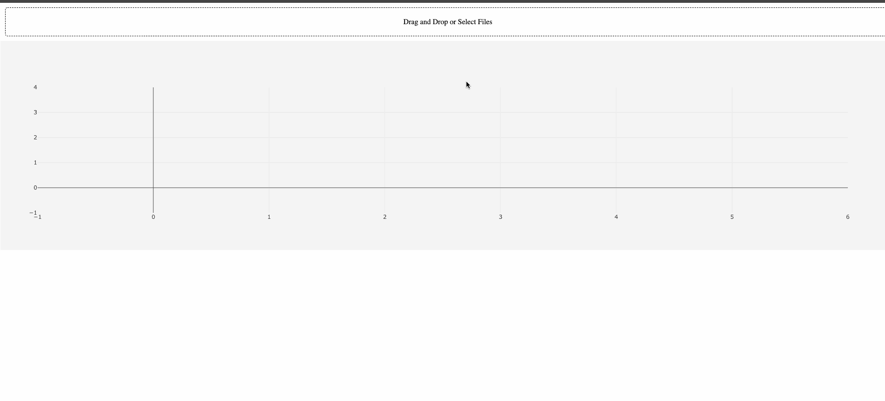

# 使用 Plotly 的 Dash 创建交互式数据应用程序

> 原文：<https://towardsdatascience.com/creating-an-interactive-data-app-using-plotlys-dash-356428b4699c?source=collection_archive---------2----------------------->

我们来做一个 app，自动出图数据文件。这是一个使用 plotly 的[破折号](https://plot.ly/products/dash/)在 python 中创建 web 应用程序的演练，其中有一个我们在 [Kyso](https://kyso.io) 创建的示例—现场版本可以在这里找到:

 [## 破折号

### 用 Plotly 的 Dash 编辑自动文件绘图应用程序

dash-app-dx9 g 2r 0 la 6-8000 . cloud . kyso . io](https://dash-app-dx9g2r0la6-8000.cloud.kyso.io/) 

Uploading Multiple File-Types & Automatically Generate Scalar Plots

这是一个用 xy，xyyy 等上传任何文件的应用程序。坐标，然后自动生成一个图。

Dash 是用于构建 web 应用程序的 Python 框架。它建立在 Flask、Plotly.js、React 和 React Js 之上。，使您能够使用纯 Python 构建仪表板和应用程序。在本教程中，我将向您介绍基础知识，并假设您之前有使用 Plotly 的经验。如果你是 plotly 的新手，请查看这些初学者指南:

[https://kyso.io/KyleOS/plotly-intro](https://kyso.io/KyleOS/plotly-intro)

[https://kyso.io/KyleOS/cufflinks-intro](https://kyso.io/KyleOS/cufflinks-intro)

# 装置

为了开始使用 Dash，你需要安装几个软件包。

1.  核心 dash 后端。
2.  仪表板前端
3.  Dash HTML 组件
4.  仪表板核心部件
5.  Plotly

***请注意，如果您想从 Kyso 启动您的应用程序，所有这些都已预装在 Kyso 的工作区中！***

```
pip install dash==0.21.1  
pip install dash-renderer==0.13.0  
pip install dash-html-components==0.11.0
pip install dash-core-components==0.23.0  
pip install plotly --upgrade
```

# Dash 应用程序布局

Dash 应用程序由两部分组成。第一部分是应用程序的“布局”,它描述了应用程序的外观。Dash 为应用程序的所有可视化组件提供了 Python 类，即使用 Python 生成 HTML 内容。为了使用这些类，让我们导入`dash_core_components`和`dash_html_components`库。用下面的代码创建一个名为`app.py`的文件:

```
import dash
import dash_core_components as dcc
import dash_html_components as html
```

像使用 [Flask](http://flask.pocoo.org/) 一样，我们可以通过调用 dash 的 Dash 类来初始化 Dash。一旦完成，我们就可以为我们的应用程序创建布局，使用来自`dash_html_components`的 Div 类来创建 HTML Divs。请注意，`dash_html_components`包含了所有的 HTML 标签，可以让你设计应用程序的布局。

为了在我们的布局中创建一个图表，我们使用了来自`dash_core_components`的图表类。Graph 使用 plotly.js 呈现交互式数据可视化。Graph 类需要一个包含要绘制的数据和布局细节的图形对象。Dash 还允许你改变背景颜色和文本颜色。您可以通过使用 style 属性并传递具有您的特定颜色的对象来更改背景。

```
external_stylesheets = ['https://codepen.io/chriddyp/pen/bWLwgP.css']

app = dash.Dash(__name__, external_stylesheets=external_stylesheets)

colors = {
    "graphBackground": "#F5F5F5",
    "background": "#ffffff",
    "text": "#000000"
}

app.layout = html.Div([
    dcc.Upload(
        id='upload-data',
        children=html.Div([
            'Drag and Drop or ',
            html.A('Select Files')
        ]),
        style={
            'width': '100%',
            'height': '60px',
            'lineHeight': '60px',
            'borderWidth': '1px',
            'borderStyle': 'dashed',
            'borderRadius': '5px',
            'textAlign': 'center',
            'margin': '10px'
        },
        # Allow multiple files to be uploaded
        multiple=True
    ),
    dcc.Graph(id='Mygraph'),
    html.Div(id='output-data-upload')
])
```

请注意，我们正在为我们正在创建的每个组件设置 id，我们将在一秒钟内完成这些。Dash 上传组件允许应用程序的查看者上传文件。该应用程序可以通过监听 dcc 的内容属性来访问上传文件的内容。上传组件，它是一个 base64 编码的字符串，包含文件的内容，与文件类型无关。

所以我们创建了上面的布局；带有一些样式的上传框，以及当我们放入文件时将创建的图形。

# 熊猫和袖扣

好了，现在我们需要做一些事情，我们需要为以下内容创建函数:

1.  读入任何文件，无论是 csv，excel 文件或 tsv，并将其转换成熊猫数据帧。
2.  放下新文件时创建图形。
3.  打印数据表。

为此我们需要几个库:

```
import base64
import datetime
import io
import plotly.graph_objs as go
import cufflinks as cf
import pandas as pd

import dash_table
```

因此，要解析我们的目标数据文件类型:

```
def parse_data(contents, filename):
    content_type, content_string = contents.split(',')

    decoded = base64.b64decode(content_string)
    try:
        if 'csv' in filename:
            # Assume that the user uploaded a CSV or TXT file
            df = pd.read_csv(
                io.StringIO(decoded.decode('utf-8')))
        elif 'xls' in filename:
            # Assume that the user uploaded an excel file
            df = pd.read_excel(io.BytesIO(decoded))
        elif 'txt' or 'tsv' in filename:
            # Assume that the user upl, delimiter = r'\s+'oaded an excel file
            df = pd.read_csv(
                io.StringIO(decoded.decode('utf-8')), delimiter = r'\s+')
    except Exception as e:
        print(e)
        return html.Div([
            'There was an error processing this file.'
        ])

    return df
```

使用袖扣——一种便于绘制熊猫和 plotly 的包装——来绘制我们的标量图:

```
def update_graph(contents, filename):
    fig = {
        'layout': go.Layout(
            plot_bgcolor=colors["graphBackground"],
            paper_bgcolor=colors["graphBackground"])
    }

    if contents:
        contents = contents[0]
        filename = filename[0]
        df = parse_data(contents, filename)
        df = df.set_index(df.columns[0])
        fig['data'] = df.iplot(asFigure=True, kind='scatter', mode='lines+markers', size=1)

        table = html.Div([
            html.H5(filename),
            dash_table.DataTable(
                data=df.to_dict('rows'),
                columns=[{'name': i, 'id': i} for i in df.columns]
            ),
            html.Hr(),
            html.Div('Raw Content'),
            html.Pre(contents[0:200] + '...', style={
                'whiteSpace': 'pre-wrap',
                'wordBreak': 'break-all'
            })
        ])
```

最后，为每次放入文件创建一个表:

```
def update_table(contents, filename):
    table = html.Div()

    if contents:
        contents = contents[0]
        filename = filename[0]
        df = parse_data(contents, filename)

        table = html.Div([
            html.H5(filename),
            dash_table.DataTable(
                data=df.to_dict('rows'),
                columns=[{'name': i, 'id': i} for i in df.columns]
            ),
            html.Hr(),
            html.Div('Raw Content'),
            html.Pre(contents[0:200] + '...', style={
                'whiteSpace': 'pre-wrap',
                'wordBreak': 'break-all'
            })
        ])

    return table
```

# 交互性— Dash 回调

Dash 应用程序的第二部分涉及定义应用程序交互性的回调。为此，我们需要从 dash.dependencies 导入输入和输出:

```
from dash.dependencies import Input, Output, State
```

在这个应用程序中，我们有两个回调:

```
@app.callback(Output('Mygraph', 'figure'),
            [
                Input('upload-data', 'contents'),
                Input('upload-data', 'filename')
            ])
```

因此，我们的输入是我们在开始时创建的上传组件，并将其绑定到一个回调，这样每当选择一个文件时，它都会实时更新我们的图形组件`Mygraph`。Dash 提供了一个 decorator @app，它使得将回调函数绑定到我们的组件成为可能。你会注意到在完整的`app.py`中，我们在声明 update_graph 函数之前使用了装饰器。

下面是我们的第二个回调，具有相同的输入(即，上传到我们的上传组件的文件，这次输出是包含文件数据的打印表格版本的 HTML Div。同样，装饰器在我们声明 update_table 函数之前被调用。

```
@app.callback(Output('output-data-upload', 'children'),
            [
                Input('upload-data', 'contents'),
                Input('upload-data', 'filename')
            ])
```

# 运行您的应用

为了查看我们的可视化，我们需要像在 Flask 中一样运行我们的 web 服务器。记住 Dash 是建立在烧瓶顶部的。Dash 包括“热重装”，当您使用`app.run_server(debug=True)`运行应用程序时，默认情况下会激活该功能。这意味着当你修改代码时，Dash 会自动刷新你的浏览器。

```
if __name__ == '__main__':
    app.run_server(debug=True, host='0.0.0.0', port=8000)
```

接下来，移动到终端，通过键入下面的代码启动服务器:`python app.py`——这将在`[http://localhost:8000/](http://localhost:8000/.)` [启动一个新的 web 服务器。](http://localhost:8000/.)

# 完整的应用程序

现在，把所有东西放在一起:

```
import base64
import datetime
import io
import plotly.graph_objs as go
import cufflinks as cf

import dash
from dash.dependencies import Input, Output, State
import dash_core_components as dcc
import dash_html_components as html
import dash_table

import pandas as pd

external_stylesheets = ['https://codepen.io/chriddyp/pen/bWLwgP.css']

app = dash.Dash(__name__, external_stylesheets=external_stylesheets)
server = app.server

colors = {
    "graphBackground": "#F5F5F5",
    "background": "#ffffff",
    "text": "#000000"
}

app.layout = html.Div([
    dcc.Upload(
        id='upload-data',
        children=html.Div([
            'Drag and Drop or ',
            html.A('Select Files')
        ]),
        style={
            'width': '100%',
            'height': '60px',
            'lineHeight': '60px',
            'borderWidth': '1px',
            'borderStyle': 'dashed',
            'borderRadius': '5px',
            'textAlign': 'center',
            'margin': '10px'
        },
        # Allow multiple files to be uploaded
        multiple=True
    ),
    dcc.Graph(id='Mygraph'),
    html.Div(id='output-data-upload')
])

def parse_data(contents, filename):
    content_type, content_string = contents.split(',')

    decoded = base64.b64decode(content_string)
    try:
        if 'csv' in filename:
            # Assume that the user uploaded a CSV or TXT file
            df = pd.read_csv(
                io.StringIO(decoded.decode('utf-8')))
        elif 'xls' in filename:
            # Assume that the user uploaded an excel file
            df = pd.read_excel(io.BytesIO(decoded))
        elif 'txt' or 'tsv' in filename:
            # Assume that the user upl, delimiter = r'\s+'oaded an excel file
            df = pd.read_csv(
                io.StringIO(decoded.decode('utf-8')), delimiter = r'\s+')
    except Exception as e:
        print(e)
        return html.Div([
            'There was an error processing this file.'
        ])

    return df

@app.callback(Output('Mygraph', 'figure'),
            [
                Input('upload-data', 'contents'),
                Input('upload-data', 'filename')
            ])
def update_graph(contents, filename):
    fig = {
        'layout': go.Layout(
            plot_bgcolor=colors["graphBackground"],
            paper_bgcolor=colors["graphBackground"])
    }

    if contents:
        contents = contents[0]
        filename = filename[0]
        df = parse_data(contents, filename)
        df = df.set_index(df.columns[0])
        fig['data'] = df.iplot(asFigure=True, kind='scatter', mode='lines+markers', size=1)

    return fig

@app.callback(Output('output-data-upload', 'children'),
            [
                Input('upload-data', 'contents'),
                Input('upload-data', 'filename')
            ])
def update_table(contents, filename):
    table = html.Div()

    if contents:
        contents = contents[0]
        filename = filename[0]
        df = parse_data(contents, filename)

        table = html.Div([
            html.H5(filename),
            dash_table.DataTable(
                data=df.to_dict('rows'),
                columns=[{'name': i, 'id': i} for i in df.columns]
            ),
            html.Hr(),
            html.Div('Raw Content'),
            html.Pre(contents[0:200] + '...', style={
                'whiteSpace': 'pre-wrap',
                'wordBreak': 'break-all'
            })
        ])

    return table

if __name__ == '__main__':
    app.run_server(debug=True)
```

要自己运行这个应用程序，只需将上面的代码复制粘贴到你的`app.py`文件中，然后从终端运行

```
python app.py
```

转到`[http://localhost:8000/](http://localhost:8000/)`

…

# 在 Kyso 上运行 Dash 应用程序

启动一个工作空间([参见此处的指南](https://kyso.io/docs/KyleOS/launching-a-workspace))并进入 Jupyterlab。您可以从笔记本上运行它(只需执行单元)，或者创建一个 app.py 文件并从终端上运行。

要查看正在运行的应用程序，请将工作空间的 URL 复制并粘贴到单独的选项卡中。移除`lab?`并将`-8000`(我们在上面启动应用的公共端口)附加到工作区 id 号，在`.cloud.kyso.io`之前。例如，如果我的工作空间在`[https://live-aymycm9bst.cloud.kyso.io/lab?](https://live-aymycm9bst.cloud.kyso.io/lab?)`运行

在一个单独的选项卡中，我可以转到`https://live-aymycm9bst-8000.cloud.kyso.io/`，我的应用将在那里运行。