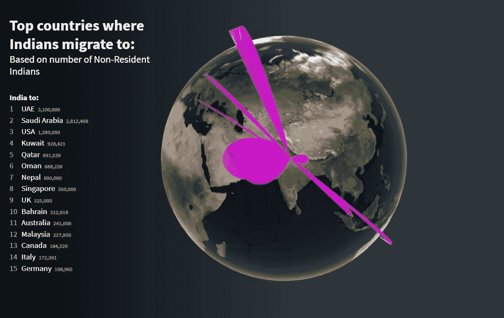
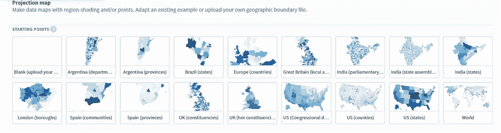

# 使用 fluore Studio 创建出色的地图数据可视化。

> 原文：<https://towardsdatascience.com/creating-awesome-map-data-visualizations-using-flourish-studio-6410a8e01c74?source=collection_archive---------16----------------------->

## 一个开源数据故事讲述平台

空间分析和可视化帮助我们从复杂的地理空间数据中获得易于理解的见解。我们以天气数据、谷歌地图、GPS 坐标和带地理标记的社交媒体帖子等形式生成大量地理空间数据，这些数据正在成为我们生活和业务不可或缺的一部分。麦肯锡的一项研究表明，到 2025 年，基于位置的传感器的加速扩散可能会带来每年超过 11 万亿美元的经济影响。可视化地图数据使见解更清晰、更直观，并获得受众的关注。但是许多人发现，与统计分析相比，空间分析和可视化非常难以执行。在这篇博客中，我们将讨论如何使用开源数据可视化和讲故事平台[的繁荣](https://flourish.studio/)来创建交互式地图数据可视化。

**为什么用花枝招展？**

有许多专用软件可用于地理空间分析和可视化。QGIS 和 [CARTO](https://carto.com/) 是一些广泛使用的地理空间分析软件，用于地理空间数据的高端分析。像 R 和 Python 这样的统计软件也有很多专门用于地理空间分析的包。但是，当您想要快速分析地理空间数据并创建交互式可视化时，这些工具就不那么用户友好了。除了您必须编写的代码之外，使在线出版的可视化交互有点棘手。

蓬勃发展来了六个预加载的模板，使交互式地图可视化。您可以在现有的地理地图模板上上传您的数据，或者上传您自己的地理边界文件。六个地图可视化模板如下:

1.投影地图

2.标记地图

3.弧形地图

4.3D 区域地图

5.连接全球

6.测量图

我们将看看如何根据地理空间数据的性质创建三种不同类型的地图可视化。

**如何创建针对不同地理区域的动画可视化？**

假设您有不同国家/地区的国家级数据，并且想要讲述一个侧重于表现良好的特定地理区域和表现不佳的地理区域的数据故事，那么您可以使用已经存在于 fluore 中的 **World** 的投影地图模板。当你打开世界模板，点击**‘数据’**标签，你可以通过查看已经可用的虚拟数据来理解数据应该是什么格式。以所需格式上传数据后，您可以点击**【预览】**数据选项卡，更改页面右侧的可视化设置。

蓬勃发展带来了这个惊人的选择，创建一个数据故事使用您创建的可视化。在可视化页面的右上角有**“创建一个故事”**链接，我们可以使用幻灯片模板讲述您的数据故事，就像 PowerPoint 演示一样。一旦你创建了你的故事，你就可以把它发布在 fluorescent server 上，并把它嵌入到任何在线资源中。这是我根据社交媒体关注度制作的可视化图片，展示了各大洲最受欢迎的足球俱乐部。

目前，fluorescent 没有从创建的可视化图像中创建 gif 或视频的选项。您可以使用一种可用的屏幕转 gif 软件来创建视频或 gif。用于 MAC 的 Giphy Capture 和用于 Windows 的 ScreenToGif[是常用的软件。gif 或视频可以通过以下步骤创建:](https://www.screentogif.com/)

打开您发布的可视化效果

调整屏幕的大小以适合可视化

录制屏幕相关部分的视频或 gif 截图，在幻灯片之间点击并放大地图的相关部分

根据需要将录像保存为 gif 或视频

与 gif 相比，视频是质量更好的输出，但文件大小会更大，上传时可能会有问题。

**如何创建 Connections Globe 地图？**

我们面临的情况是，我们希望可视化不同地理区域之间的人员和货物流动——无论是可视化国家之间的人员迁移还是可视化鸟类的迁移模式。大多数统计软件没有可视化分析移动数据的功能。蓬勃发展有这个**连接全球**模板，让您无缝可视化移动。拥有源和目的地的地理坐标就足以创建连接全球地图。这种可视化是高度交互式的，您可以根据需要旋转和缩放地球。您有许多设计和显示选项可用于自定义地图。

在这里，我创建了一个 connections globe 地图，根据居住在这些国家的非居民印度人的数量来可视化印度国民移民到的前 15 个国家。

**如何创建一个简单的气泡图可视化？**

使用 fluore 的**投影地图**模板可以非常容易地创建 choropleth 地图和 bubble 地图。对于某些地区，如世界、美国(州)、美国(县)、印度(州)、英国、西班牙、巴西等，fluorescent 有自己的内置模板。这是我创建的气泡图，显示了印度各邦的人均 GDP 值。

**当所需的地理边界文件不可用时该怎么办？**

蓬勃发展有限的地理文件，你可以上传你的数据到可视化。如果找不到您所在国家的地图，您可以选择上传自己的地理边界文件。有许多在线资源，你可以从那里下载不同国家的地理形状文件。GADM 是为所有国家和地区提供地图和空间数据的流行资源之一。你可以免费下载这些地理形状文件。

**结论**

蓬勃发展是一个用户友好的数据可视化平台，以创建强大的和交互式的数据故事。这是一个用最少的努力创建不同类型的地图数据可视化的完美媒介。探索 fluore，了解可以实现哪些其他类型的数据可视化。