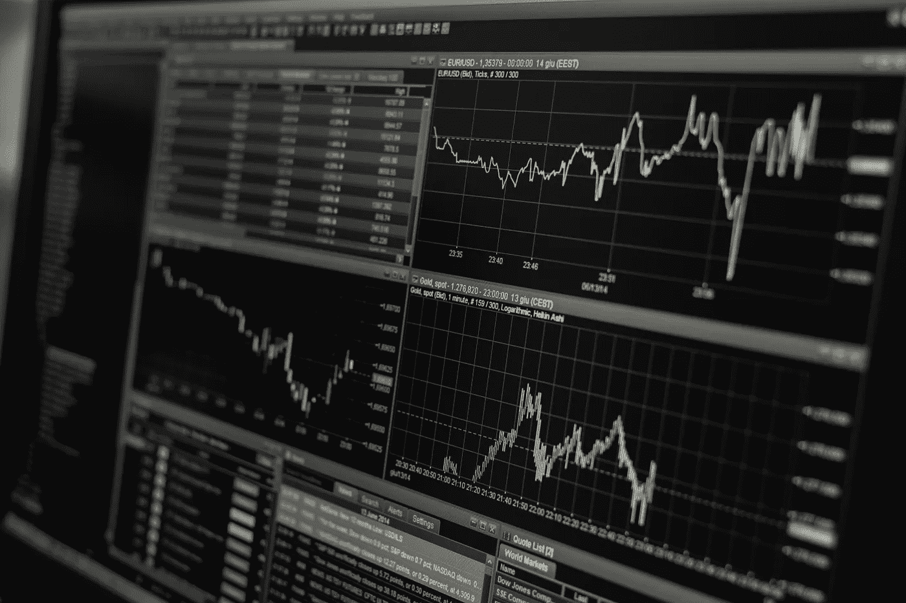

# 创造比特币交易机器人不赔钱

> 原文：<https://towardsdatascience.com/creating-bitcoin-trading-bots-that-dont-lose-money-2e7165fb0b29?source=collection_archive---------1----------------------->

## 让我们使用深度强化学习来制造加密货币交易代理

在本文中，我们将创建深度强化学习代理，学习如何通过比特币交易赚钱。在本教程中，我们将使用 OpenAI 的`gym`和来自`stable-baselines`库的 PPO 代理，后者是 OpenAI 的`baselines`库的一个分支。

这一系列文章的目的是试验最先进的深度强化学习技术，看看我们能否创造出盈利的比特币交易机器人。现状似乎是迅速关闭任何创建强化学习算法的尝试，因为这是“构建交易算法的错误方式”。然而，该领域的最新进展表明，在相同的问题域内，RL 代理通常能够比监督学习代理学习更多的东西。出于这个原因，我写这些文章是为了看看这些交易代理能给我们带来多大的利润，或者说现状的存在是有原因的。

非常感谢 OpenAI 和 DeepMind 在过去几年里为深度学习研究人员提供的开源软件。如果你还没有看到他们用像 [AlphaGo、OpenAI Five 和 AlphaStar](https://openai.com/blog/) 这样的技术完成的惊人壮举，你可能在过去的一年里一直生活在岩石下，但你也应该去看看他们。


AlphaStar Training ([https://deepmind.com/blog/alphastar-mastering-real-time-strategy-game-starcraft-ii/](https://deepmind.com/blog/alphastar-mastering-real-time-strategy-game-starcraft-ii/))

虽然我们不会创造任何令人印象深刻的东西，但每天交易比特币并从中获利仍然不是一件容易的事情。然而，正如泰迪·罗斯福曾经说过的，

> 任何值得拥有的东西都来之不易。

所以，与其学习交易我们自己，不如让一个机器人来替我们做这件事。

[](/trade-smarter-w-reinforcement-learning-a5e91163f315) [## 更明智地交易和投资——强化学习方式

### 深入探讨 TensorTrade——一个用于培训、评估和部署稳健交易的开源 Python 框架…

towardsdatascience.com](/trade-smarter-w-reinforcement-learning-a5e91163f315) 

> 当你读完这篇文章后，看看[TensorTrade](/trade-smarter-w-reinforcement-learning-a5e91163f315)——这篇文章中产生的代码库的后继框架。

# 这个计划


1.  为我们的代理创造一个学习的健身房环境
2.  呈现简单而优雅环境可视化
3.  培训我们的代理人学习有利可图的交易策略

如果你还不熟悉[如何从头开始创建一个体育馆环境](https://medium.com/@notadamking/creating-a-custom-openai-gym-environment-for-stock-trading-be532be3910e)，或者[如何呈现这些环境的简单可视化](https://medium.com/@notadamking/visualizing-stock-trading-agents-using-matplotlib-and-gym-584c992bc6d4)，我刚刚写了关于这两个主题的文章。在继续之前，请随意在此暂停并阅读其中任何一篇。

# 入门指南

对于本教程，我们将使用由 [Zielak](https://www.kaggle.com/mczielinski/bitcoin-historical-data) 生成的 Kaggle 数据集。如果你想下载代码跟随，我的 [**GitHub**](https://github.com/notadamking/RLTrader) repo 上也有`.csv`数据文件。好了，我们开始吧。

首先，让我们导入所有必需的库。确保`pip install`您遗漏了任何库。

```
**import** gym
**import** pandas **as** pd
**import** numpy **as** np
**from** gym **import** spaces
**from** sklearn **import** preprocessing
```

接下来，让我们为环境创建我们的类。我们将要求传入一个`pandas`数据帧，以及一个可选的`initial_balance`和一个`lookback_window_size`，它将指示代理在过去的每一步将观察多少时间步。我们将每次交易的`commission`默认为 0.075%，这是 Bitmex 的当前利率，并将`serial`参数默认为 false，这意味着默认情况下我们的数据帧将在随机切片中遍历。

我们还调用数据帧上的`dropna()`和`reset_index()`来首先删除任何带有`NaN`值的行，然后重置帧的索引，因为我们已经删除了数据。

```
***class*** BitcoinTradingEnv(*gym*.*Env*):
  *"""A Bitcoin trading environment for OpenAI gym"""*
  metadata = {'render.modes': ['live', 'file', 'none']}
  scaler = preprocessing.MinMaxScaler()
  viewer = None ***def*** __init__(*self*, *df*, *lookback_window_size*=50, 
                         commission=0.00075,  
                         *initial_balance*=10000
                         serial=False):
    *super*(BitcoinTradingEnv, self).__init__() self.df = df.dropna().reset_index()
    self.lookback_window_size = lookback_window_size
    self.initial_balance = initial_balance
    self.commission = commission
    self.serial = serial # Actions of the format Buy 1/10, Sell 3/10, Hold, etc.
    self.action_space = spaces.MultiDiscrete([3, 10]) # Observes the OHCLV values, net worth, and trade history
    self.observation_space = spaces.Box(*low*=0, *high*=1, *shape*=(10, 
                    lookback_window_size + 1), *dtype*=np.float16)
```

我们的`action_space`在这里被表示为一个由 3 个选项(买入、卖出或持有)组成的离散集合和另一个由 10 个数量(1/10、2/10、3/10 等)组成的离散集合。当选择买入动作时，我们将买入价值`amount * self.balance`的 BTC。对于出售行动，我们将出售价值`amount * self.btc_held`的 BTC。当然，hold 动作会忽略金额，什么都不做。

我们的`observation_space`定义为 0 和 1 之间的一组连续的浮点数，形状为`(10, lookback_window_size + 1)`。`+ 1`是为了说明当前的时间步。对于窗口中的每个时间步，我们将观察 OHCLV 值、我们的净值、买入或卖出的 BTC 金额，以及我们在这些 BTC 上花费或收到的美元总额。

接下来，我们需要编写我们的`reset`方法来初始化环境。

```
***def*** reset(*self*):
  self.balance = self.initial_balance
  self.net_worth = self.initial_balance
  self.btc_held = 0 self._reset_session() self.account_history = np.repeat([
    [self.net_worth],
    [0],
    [0],
    [0],
    [0]
  ], self.lookback_window_size + 1, *axis*=1) self.trades = [] **return** self._next_observation()
```

这里我们同时使用了`self._reset_session`和`self._next_observation`，我们还没有定义它们。让我们来定义它们。

## 交易时段



我们环境的一个重要部分是交易时段的概念。如果我们将这个代理部署到野外，我们可能永远不会一次运行超过几个月。出于这个原因，我们将在`self.df`中限制我们的代理在一行中看到的连续帧的数量。

在我们的`_reset_session`方法中，我们将首先将`current_step`重置为`0`。接下来，我们将把`steps_left`设置为`1`和`MAX_TRADING_SESSION`之间的一个随机数，我们现在将在文件的顶部定义它。

```
MAX_TRADING_SESSION = 100000  # ~2 months
```

接下来，如果我们是串行遍历帧，我们将设置要遍历的整个帧，否则我们将把`frame_start`设置为`self.df`内的随机点，并创建一个名为`active_df`的新数据帧，它只是从`frame_start`到`frame_start + steps_left`的`self.df`的一部分。

```
***def*** _reset_session(*self*):
  self.current_step = 0 **if** self.serial:
    self.steps_left = len(self.df) - self.lookback_window_size - 1
    self.frame_start = self.lookback_window_size
  **else**:
    self.steps_left = np.random.randint(1, MAX_TRADING_SESSION)
    self.frame_start = np.random.randint(
         self.lookback_window_size, len(self.df) - self.steps_left) self.active_df = self.df[self.frame_start -   
       self.lookback_window_size:self.frame_start + self.steps_left]
```

以随机切片遍历数据帧的一个重要副作用是，当我们的代理接受长时间训练时，将有更多的*独特的*数据要处理。例如，如果我们只是以串行方式(即从`0`到`len(df)`的顺序)遍历数据帧，那么我们只会拥有与数据帧中一样多的唯一数据点。我们的观察空间甚至只能在每个时间步呈现离散数量的状态。

然而，通过随机遍历数据帧的切片，我们实际上是通过创建帐户余额、进行的交易和我们初始数据集中每个时间步的先前看到的价格行为的更有趣的组合来制造更多独特的数据点。我举个例子解释一下。

在重置串行环境后的时间步骤 10，我们的代理将始终处于数据帧内的同一时间，并且在每个时间步骤将有3 个选择:买入、卖出或持有。对于这三种选择中的每一种，还需要另一种选择:可能金额的 10%、20%、……或 100%。这意味着我们的代理人可以体验(1⁰ ) ⁰所有州中的任何一个，总共可以体验 1⁰ ⁰所有独特的体验。

现在考虑我们的随机切片环境。在时间步长 10，我们的代理可以在数据帧内的任何`len(df)`时间步长。假设在每个时间步做出相同的选择，这意味着该代理可以在相同的 10 个时间步内经历任何`len(df)` ⁰可能的唯一状态。

虽然这可能会给大型数据集增加相当多的噪声，但我相信它应该允许代理从我们有限的数据量中了解更多。我们仍将以串行方式遍历我们的测试数据集，以更准确地理解算法对新鲜的、看似“活的”数据的有用性。

# 代理人眼中的生活

这通常有助于可视化环境的观察空间，以便了解您的代理将使用的功能类型。例如，这是我们使用 OpenCV 渲染的观察空间的可视化。


OpenCV visualization of the environment’s observation space

图像中的每一行代表我们的`observation_space`中的一行。前 4 行类似频率的红线代表 OHCL 数据，正下方虚假的橙色和黄色点代表容量。下面波动的蓝色条代表代理的净值，下面较亮的点代表代理的交易。

如果你眯着眼睛，你只能看到一个蜡烛图，下面是音量条，下面是一个奇怪的类似莫尔斯电码的界面，显示交易历史。看起来我们的代理应该能够从我们的`observation_space`中充分了解数据，所以让我们继续。这里我们将定义我们的`_next_observation`方法，我们将从 0 到 1 缩放 ***观察数据*** 。

> 重要的是，只缩放代理到目前为止观察到的数据，以防止前瞻偏差。

```
***def*** _next_observation(*self*):
  end = self.current_step + self.lookback_window_size + 1 obs = np.array([
    self.active_df['Open'].values[self.current_step:end],  
    self.active_df['High'].values[self.current_step:end],
    self.active_df['Low'].values[self.current_step:end],
    self.active_df['Close'].values[self.current_step:end],
    self.active_df['Volume_(BTC)'].values[self.current_step:end],
  ]) scaled_history = self.scaler.fit_transform(self.account_history) obs = np.append(obs, scaled_history[:, -(self.lookback_window_size
                                                     + 1):], *axis*=0) **return** obs
```

## 采取行动

现在我们已经建立了我们的观察空间，是时候写我们的`step`函数了，反过来，采取代理的规定动作。每当`self.steps_left == 0`我们当前的交易时段，我们将出售我们持有的任何 BTC，并调用`_reset_session()`。否则，我们将`reward`设置为我们当前的净值，并且仅在我们没钱的时候将`done`设置为`True`。

```
***def*** step(*self*, *action*):
  current_price = self._get_current_price() + 0.01
  self._take_action(action, current_price)
  self.steps_left -= 1
  self.current_step += 1 **if** self.steps_left == 0:
    self.balance += self.btc_held * current_price
    self.btc_held = 0
    self._reset_session() obs = self._next_observation()
  reward = self.net_worth
  done = self.net_worth <= 0 **return** obs, reward, done, {}
```

采取行动就像得到`current_price`，确定指定的行动，或者买入或者卖出指定数量的 BTC 一样简单。让我们快速编写`_take_action`以便测试我们的环境。

```
***def*** _take_action(*self*, *action, current_price*):
  action_type = action[0]
  amount = action[1] / 10 btc_bought = 0
  btc_sold = 0
  cost = 0
  sales = 0 **if** action_type < 1:
    btc_bought = self.balance / current_price * amount
    cost = btc_bought * current_price * (1 + self.commission)
    self.btc_held += btc_bought
    self.balance -= cost **elif** action_type < 2:
    btc_sold = self.btc_held * amount
    sales = btc_sold * current_price  * (1 - self.commission)
    self.btc_held -= btc_sold
    self.balance += sales
```

最后，用同样的方法，我们将把交易追加到`self.trades`，并更新我们的净值和账户历史。

```
 **if** btc_sold > 0 **or** btc_bought > 0:
    self.trades.append({
      'step': self.frame_start+self.current_step,
      'amount': btc_sold if btc_sold > 0 else btc_bought,
      'total': sales if btc_sold > 0 else cost,
      'type': "sell" if btc_sold > 0 else "buy"
    }) self.net_worth = self.balance + self.btc_held * current_price
  self.account_history = np.append(self.account_history, [
    [self.net_worth],
    [btc_bought],
    [cost],
    [btc_sold],
    [sales]
  ], *axis*=1)
```

我们的代理现在可以启动一个新环境，遍历该环境，并采取影响该环境的措施。是时候看他们交易了。

# 看着我们的机器人交易

我们的`render`方法可以像调用`print(self.net_worth)`一样简单，但这并不有趣。取而代之的是，我们将绘制一个简单的价格数据的蜡烛图，用量棒和一个单独的净值图来表示。

我们将从我写的最后一篇文章的[中提取`StockTradingGraph.py`中的代码，并重新利用它来渲染我们的比特币环境。你可以从我的](https://medium.com/@notadamking/visualizing-stock-trading-agents-using-matplotlib-and-gym-584c992bc6d4) [**GitHub**](https://github.com/notadamking/Stock-Trading-Visualization) 中抓取代码。

我们要做的第一个改变是将所有的`self.df['Date']`更新为`self.df['Timestamp']`，并删除所有对`date2num`的调用，因为我们的日期已经以 unix 时间戳格式出现。接下来，在我们的`render`方法中，我们将更新我们的日期标签以打印人类可读的日期，而不是数字。

```
**from** datetime **import** datetime
```

首先，导入`datetime`库，然后我们将使用`utcfromtimestamp`方法从每个时间戳获取一个 UTC 字符串，并使用`strftime`将该字符串格式化为`Y-m-d H:M`格式。

```
date_labels = np.array([datetime.utcfromtimestamp(x).strftime(
'%Y-%m-%d %H:%M') **for** x **in** self.df['Timestamp'].values[step_range]])
```

最后，我们将`self.df['Volume']`更改为`self.df['Volume_(BTC)']`以匹配我们的数据集，这样我们就可以开始了。回到我们的`BitcoinTradingEnv`，我们现在可以编写我们的`render`方法来显示图形。

```
***def*** render(*self*, *mode*='human', ***kwargs*):
  **if** mode == 'human':
    **if** self.viewer == None:
      self.viewer = BitcoinTradingGraph(self.df,
                                        kwargs.get('title', None)) self.viewer.render(self.frame_start + self.current_step,
                       self.net_worth,
                       self.trades,
                       *window_size*=self.lookback_window_size)
```

瞧啊。我们现在可以看到我们的代理商交易比特币。


Matplotlib visualization of our agent trading Bitcoin

绿色虚线标记代表 BTC 的买入，红色虚线标记代表卖出。右上方的白色标签是代理人的当前净值，右下方的标签是比特币的当前价格。简单，却不失优雅。现在，是时候培养我们的代理人了，看看我们能赚多少钱！

## 训练时间

我的第一篇文章受到的批评之一是缺乏交叉验证，或者将数据分成训练集和测试集。这样做的目的是为了测试您的最终模型在它从未见过的新鲜数据上的准确性。虽然这不是那篇文章关注的问题，但它确实在这里。由于我们使用的是时间序列数据，所以在交叉验证方面我们没有太多选择。

例如，一种常见的交叉验证形式称为 *k 重*验证，其中您将数据分成 k 个相等的组，并逐一挑出一组作为测试组，并将其余数据用作训练组。然而，时间序列数据高度依赖于时间，这意味着后期数据高度依赖于前期数据。所以 k-fold 是行不通的，因为我们的代理在交易之前会从未来的数据中学习，这是一个不公平的优势。

当应用于时间序列数据时，同样的缺陷也适用于大多数其他交叉验证策略。因此，我们只需简单地从整个数据帧中取出一部分，用作从帧的开头到某个任意索引的训练集，并使用其余的数据作为测试集。

```
slice_point = *int*(len(df) - 100000)
train_df = df[:slice_point]
test_df = df[slice_point:]
```

接下来，由于我们的环境仅设置为处理单个数据帧，因此我们将创建两个环境，一个用于训练数据，一个用于测试数据。

```
train_env = DummyVecEnv([*lambda*: BitcoinTradingEnv(train_df, 
                         *commission*=0, *serial*=False)])
test_env = DummyVecEnv([*lambda*: BitcoinTradingEnv(test_df, 
                        *commission*=0, *serial*=True)])
```

现在，训练我们的模型就像用我们的环境创建一个代理并调用`model.learn`一样简单。

```
model = PPO2(MlpPolicy,
             train_env,
             *verbose*=1, 
             *tensorboard_log*="./tensorboard/")
model.learn(*total_timesteps*=50000)
```

在这里，我们使用 tensorboard，这样我们可以轻松地可视化我们的 tensorflow 图，并查看有关我们的代理的一些定量指标。例如，下图显示了许多代理在 200，000 个时间步长内的折扣奖励:


哇，看起来我们的代理商非常赚钱！我们最好的代理人甚至能够在 200，000 步的过程中将他的平衡提高 1000 倍，而其他人平均至少提高 30 倍！

就在这一点上，我意识到环境中有一个错误…这是修复该错误后的新奖励图:


如你所见，我们的几个代理做得很好，其余的都破产了。然而，表现良好的代理最多只能达到初始余额的 10 倍甚至 60 倍。我必须承认，所有盈利的代理商都是在没有佣金的环境中接受培训和测试的，所以让我们的代理商真正赚钱仍然是完全不现实的。但是我们正在取得进展！

让我们在测试环境中测试我们的代理人(使用他们从未见过的新鲜数据)，看看他们对比特币交易的学习有多好。


Our trained agents race to bankruptcy when trading on fresh, test data

显然，我们还有相当多的工作要做。通过简单地将我们的模型切换到使用 stable-baseline 的 A2C，而不是当前的 PPO2 代理，我们可以大大提高我们在这个数据集上的性能。最后，我们可以根据 Sean O'Gorman 的建议稍微更新一下我们的奖励函数，这样我们就可以奖励净值的增长，而不仅仅是获得高净值并保持高净值。

```
reward = self.net_worth - prev_net_worth
```

仅这两个变化就大大提高了测试数据集的性能，正如您在下面看到的，我们最终能够在训练集中没有的新数据上实现盈利。


然而，我们可以做得更好。为了改善这些结果，我们需要优化我们的超参数，并对我们的代理进行更长时间的培训。是时候打开 GPU 开始工作了！

然而，这篇文章已经有点长了，我们还有相当多的细节要看，所以我们要在这里休息一下。在[我的下一篇文章](/using-reinforcement-learning-to-trade-bitcoin-for-massive-profit-b69d0e8f583b)中，我们将使用 [**贝叶斯优化**](https://arxiv.org/abs/1807.02811) 来确定我们问题空间的最佳超参数，并改进代理的模型以实现高利润的交易策略。

# 结论

在本文中，我们开始使用深度强化学习从零开始创建一个盈利的比特币交易代理。我们实现了以下目标:

1.  利用 OpenAI 的健身房从零开始创建了一个比特币交易环境。
2.  使用 Matplotlib 构建了该环境的可视化。
3.  使用简单的交叉验证对我们的代理进行培训和测试。
4.  微调我们的代理以实现盈利。

虽然我们的交易代理不像我们希望的那样有利可图，但它肯定有所进展。下一次，我们将通过先进的功能工程和贝叶斯优化来改进这些算法，以确保我们的代理能够持续击败市场。敬请关注[我的下一篇文章](/using-reinforcement-learning-to-trade-bitcoin-for-massive-profit-b69d0e8f583b)，以及[比特币万岁](//coinbase-consumer.sjv.io/c/1949163/626312/9251)！

[](/using-reinforcement-learning-to-trade-bitcoin-for-massive-profit-b69d0e8f583b) [## 利用强化学习交易比特币获取巨额利润

### 让我们教我们的深度 RL 代理通过特征工程和贝叶斯优化赚更多的钱

towardsdatascience.com](/using-reinforcement-learning-to-trade-bitcoin-for-massive-profit-b69d0e8f583b) [](/trade-smarter-w-reinforcement-learning-a5e91163f315) [## 更明智地交易和投资——强化学习方式

### 深入探讨 TensorTrade——一个用于培训、评估和部署稳健交易的开源 Python 框架…

towardsdatascience.com](/trade-smarter-w-reinforcement-learning-a5e91163f315) 

很重要的一点是要明白，本文中记录的所有研究都是出于教育目的，不应该作为交易建议。你不应该根据本文定义的任何算法或策略进行交易，因为你很可能会失去你的投资。

*感谢阅读！一如既往，本教程的所有代码都可以在我的* [*GitHub*](https://github.com/notadamking/RLTrader) *上找到。如果您有任何问题或反馈，请在下面留下评论，我很乐意收到您的来信！我也可以通过@notadamking 的*[*Twitter*](https://twitter.com/notadamking)*联系到。*

*您也可以通过下面的链接在* [*Github 赞助商*](https://github.com/users/notadamking/sponsorship) *或*[*Patreon*](https://www.patreon.com/join/notadamking)*上赞助我。*

[](https://github.com/users/notadamking/sponsorship) [## GitHub 赞助商

### 嗨，我是亚当。我是一名开发人员、作家和企业家，尤其对深度…

github.com](https://github.com/users/notadamking/sponsorship) 

> Github 赞助商目前正在 1:1 匹配所有捐款，最高可达 5000 美元！

[](https://patreon.com/notadamking) [## 亚当·金正在创造改变世界的内容

### 嗨，我是亚当。我是一名开发人员、作家和企业家，尤其对深度…

patreon.com](https://patreon.com/notadamking)