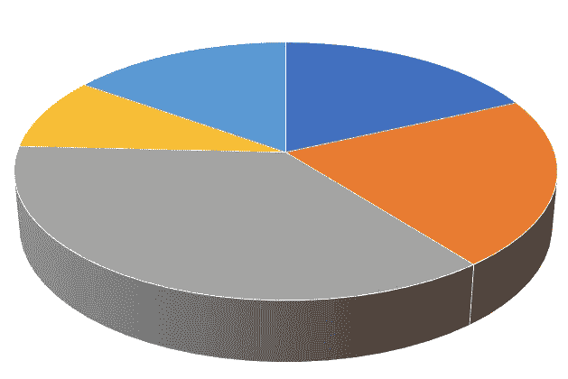
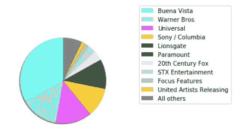
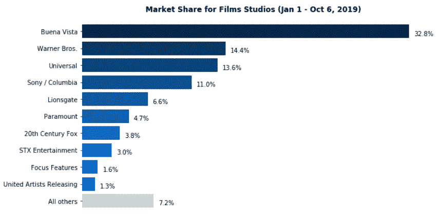
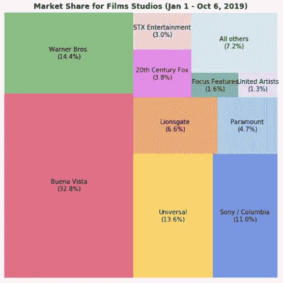
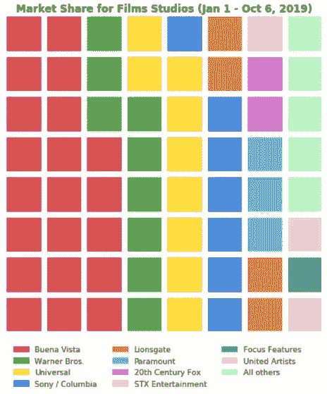
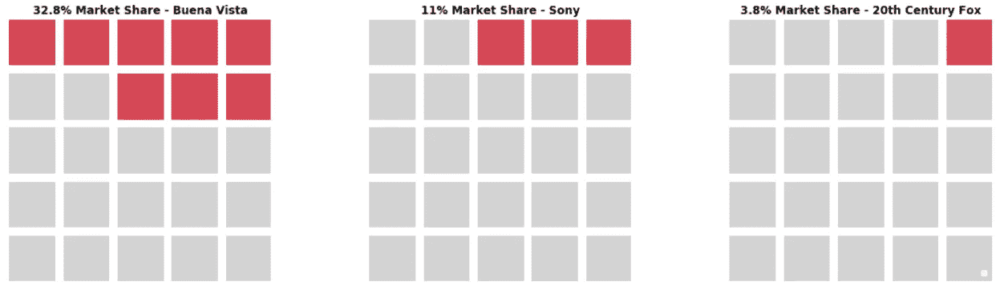

# 创建引人注目的饼图替代方案

> 原文：<https://towardsdatascience.com/creating-compelling-pie-chart-alternatives-3a1c2c2889b8?source=collection_archive---------17----------------------->

我最近完成了用数据讲故事，这是一个改善我们如何可视化数据的很好的例子。其中比较直白的一点就是**没有饼状图**。我以前听过这句话，知道这个话题有些争议。反对饼图的理由相当简单:它们不像人们想象的那样容易解释。人们不能轻易地以饼图的形式直观地分辨出数值之间的差异。角度并不特别适合人眼。你花多少时间挂一个没有水平仪的画框？).你也许能从视觉上分辨出 15 度和 90 度之间的区别，但是 20 度和 30 度之间的区别可能很棘手，这种区别可能很重要。尤其是当你开始在饼图上使用 3D 元素时，随着角度的进一步倾斜，这变得更加令人困惑。

让我们举个简单的例子，看看下面的图表，除了最大的比例，你有多大把握确定每个比例代表多少？



说“永远不要饼状图”感觉很容易！，但重要的是你如何替代它。仍然有这样的情况，我们想要传达整体的比例，用数据来讲述一个故事。你可能会被迫回到这种甜点形状的美丽，但让我们看看几个不同的选择。

这里有一个案例:你想创建一个主要电影制片厂当前市场份额的可视化。你从[票房魔咒](https://www.boxofficemojo.com/)中抓取数据，把它放进一个 Jupyter 笔记本里，然后你开始:



呃。这一切都在那里，但它显然不是超级可解释的或令人信服的，尤其是如果你想说的东西比“布埃纳 Vista 有很大的份额”。

## 条形图

是的，条形图！这是那种当它和你握手时会看着你的眼睛的图表。它一直是数据可视化的中流砥柱，尽管它可能不是最耀眼的，但它是可靠的，并且更容易理解。为了更清楚，你可以把它放在水平位置，这样便于区分值:



只是在直接比较中，你可以很快看出每个工作室之间的区别，而不仅仅是最大的工作室。那些在饼状图中看起来大小相同的电影公司(如华纳、环球和索尼)的比例要清晰得多。如果你喜欢的话，你也可以试试堆积条形图，但是一个基本的条形图做得好的话会有很大的帮助。

## 树形图

处理饼图角度读数问题的另一种方法是将数据分成方块，这样可以更清楚地理解。树状图主要用于显示数据的层次结构，最近作为饼状图的替代物受到青睐。你必须注意你的数据有多少段，因为标注可能会很棘手。我们的数据有 11 个值，您可以看出它们就在边缘，我通常会尽量保持在这 11 个值以下，但这里的示例是:



## 华夫饼图表

华夫饼图表本质上是树形图的一种变体。它不是大块的，而是把它分成美味的华夫饼干形状的均匀部分。基于我们的数据的一个总体示例可能是这样的:



我发现华夫格图在视觉上更有帮助的是对某些值的标注。这里有一个例子，列出三个不同的工作室进行比较:



像这样的小版本可以作为比较的快速展示，在我看来，有时比一大块华夫饼更有帮助。

## 只显示数字！

有时候，你所拥有的数据并不会显得可笑，即使这是你想要表达的观点。假设您经营一家电影院，拥有如下数据:

```
------------
Proportion of snack purchase sales at the movie theater
Popcorn: 98%
Fountain drinks: 1%
Candy: .5%
The super combo pack: .25%
Bottled water: .25%
------------
```

不是你特别想按比例比较的东西，因为它没有讲述一个伟大的故事。退后一步，想想是否有其他方法可以传达这些数据告诉你的信息。对于这个例子，也许只是指出爆米花销售的巨大数量:


你使用什么将最终取决于你的观众和你试图讲述的故事。尝试一些东西，也在其他人身上尝试。通过观察你创造的形象来思考别人可能回答的问题。如果你想找个地方玩玩，就从这里开始吧，这里有一本 [Jupyter 笔记本](https://github.com/jnawjux/pie_chart_alternatives_sample)，上面有这篇文章中用到的所有例子。