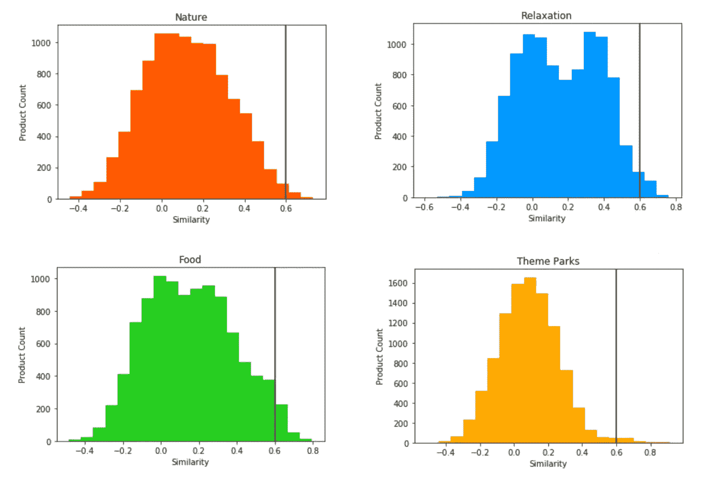

# 使用 Doc2Vec 创建产品标签

> 原文：<https://towardsdatascience.com/creating-great-product-tags-f3d2c7607dba?source=collection_archive---------16----------------------->

## 面向企业的实用方法


Too many tags. Photo Credit: [Adi Goldstein](https://unsplash.com/@adigold1?utm_source=unsplash&utm_medium=referral&utm_content=creditCopyText).

产品标签给用户一个期望的快照，并帮助他们探索相关产品。如果标签创建的准确度不高，用户会发现很难信任它们，交互也会受到限制。然而，随着产品数量的增加，创建准确的标签变得越来越困难。为了解决这个问题，我们可以利用各种机器学习技术。特别是，我们将讨论如何通过结合人工标记和机器学习技术来创建产品标签。

作为一个例子，我们将使用[www.govoyagin.com](http://www.govoyagin.com)，其中产品由活动表示。


As we can see, the tags used on these products need some work. Credit: [Voyagin](http://www.govoyagin.com).

# 选择标签

选择正确的标签并不一定是显而易见的。有多种方法:

*   **基于用户的**:用户最关心什么标签？对于这种方法，第一步是与用户交谈或进行调查，找出他们对哪些标签感兴趣，以及什么对他们有意义。
*   **机器学习**:数据中内置了哪些标签？聚类算法(如 k-means)可用于将产品分组在一起，然后主题建模技术可以得出代表聚类的标签。
*   市场调查:竞争对手在做什么？无论什么行业，都有可能找到以某种方式使用标签的竞争对手。通常，他们会做各种类型的研究和测试，以提出他们的标签，这些可以是一个很好的起点。它还可以表明用户期望的行业标准是什么。
*   **内功**:你觉得什么最好？在你的公司里应该有各种各样的业内专家，他们可能有很好的方法根据他们的经验来设置标签。这是另一个很好的起点，尽管你应该对基于少数人的想法做出产品决策保持警惕。

当然，这些只是其中的一些方法，有必要将它们结合起来以获得最佳效果。例如，你可以运行机器学习算法来计算出一组初始聚类，然后利用你的内部专家来选择精确的标签，最后从用户那里获得反馈，看看它们是否有意义，是否能与市场产生良好的共鸣。

在本例中，我们将使用与主要产品类别相对应的标签列表:

```
'Culture', 'Nature', 'Relaxation', 'Crazy', 'Celebration', 'Adventure', 'Food', 'Romantic', 'Socializing', 'Instagrammable', 'Family', 'Theme Parks'
```

一旦确定了标签列表，就必须给产品贴标签。

# 标记产品

对于拥有数百种产品的公司来说，手动标记产品是可行的，但是随着产品规模的扩大，维护起来就变得非常困难。在这种情况下，最好转向自动化流程。

下面详细介绍的方法是:

*   手动标记一些产品
*   将产品描述转换成机器可读的数字
*   建立对标签含义的理解
*   使用这种一般理解来给产品分配标签

这是监督学习的一个例子，我们提供输入-输出对的例子，模型学习在给定输入的情况下预测输出。

## 手动标记

第一步是手动标记一些产品。通过首先手动标记活动，我们引入了一些“专家指导”来提高性能。应该选择一组有代表性的产品来为模型提供最多的信息。对于所讨论的技术，我们将在每个类别中只标记 10 种产品。

手动标记也可以使用单词匹配来实现。例如，如果你的产品标签是衬衫，那么衬衫这个词很可能在产品描述中。这种技术在这种情况下工作得很好，但是对于更一般的标签将会失败。

例如，我们可以手动分配产品，如下所示:

```
34% OFF Robot Restaurant Shinjuku Tokyo Discount E-Tickets (899)
 => Crazy
Studio Ghibli Museum Tickets — Preorder & Last-Minute Tickets (186)
 => Culture
Tokyo Disneyland Tickets — Maihama Station Pickup (10069)
 => Theme Parks
Reservation for Sushi Jiro Roppongi Michelin 2-star Tokyo (1690)
 => Food
```

给我们一个最终的 JSON 对象，带有标签和产品 id:

```
{
  "Crazy": [123, 98, 899, etc.],
  "Culture": [186, 1200, 323, etc.],
  ...
}
```

虽然这些都是由一个人准备的，但至少有三个人来检查每个产品是有帮助的，这是为了消除任何可能存在的偏见。

## 标签的含义

一旦我们有了一套描述我们产品的标签，我们就需要弄清楚它们到底是什么意思。我们将用机器学习来做这件事。对于理解产品的机器学习算法来说，它需要一种方法来将这些产品简化为数字。在这种情况下，我们将这些数字称为向量，因为我们经常用一组数字来表示乘积。我们将输入模型的典型内容是产品描述或产品图片。对于产品描述，我们有一些技术可供选择，包括:

*   一袋单词
*   TF-IDF
*   Doc2Vec

Doc2Vec 是一项伟大的技术，使用 [Gensim](https://radimrehurek.com/gensim/models/doc2vec.html) 在 Python 中实现非常容易。这个模型将把产品描述简化为一个向量，其中有一定数量的数据点代表产品的质量。这些都是未知的，但往往可以看到与特定的质量，如颜色，形状，大小或在我们的情况下，标签或类别，我们正在使用。

```
from gensim.models.doc2vec import Doc2Vec# Create a model with some pre-defined parameters.
model = Doc2Vec(vector_size=50, min_count=2, epochs=40)# Build the vocabulary from some training data.
model.build_vocab(train_corpus)# Train the model.
model.train(train_corpus, total_examples=model.corpus_count, epochs=model.epochs)
```

> 在产品图像的情况下，可以应用图像识别技术。例如，根据每个像素的颜色将图像转换为数据，然后训练神经网络来预测某个图像属于哪个标签(类别)。这些模型可以与下面讨论的产品描述模型相结合。

随着产品描述被简化为向量，我们可以思考某个标签的定义意味着什么。对于独立标签(一个产品属于一个标签，但不属于另一个标签)来说，一种简单的方法是对具有某个标签的产品取向量的平均值。结果是一个向量，它表示该标签的平均乘积。

下面的图表显示了一些产品标签的示例。我们看到类似的标签，如庆典和 Instagrammable(中左)是如此相似，以至于几乎完全重叠。我们可能要重新考虑这些标签，因为它们太相似了。“疯狂”这个标签与其他标签明显不同，这是有道理的，这些产品一定非常独特！


The vertical and horizontal axis represent some underlying meaning, such that the tags closer together are most similar.

## 分配标签

现在我们有了平均产品，我们可以通过找到任何附近的向量来找到应该被相应标记的产品。如果一个向量在附近，它应该是相似的。我们可以限制距离，以确保我们只捕捉与相关标签足够相似的产品。这个距离可以被称为相似性度量。

在这一点上，绘制产品与标签相似性的直方图有助于了解什么是好的分界点。你要确保你标记了大量的活动，但不是每个产品都有特定的标签！

在下面显示的四个示例中，我们有:

*   **自然**:很多产品与这个标签不相关，峰值在 0.1 左右的相似度，然后自然相关产品稳步下降。
*   **松弛**:与自然相反，似乎有一个次高峰，许多产品的相似度在 0.4 左右。我们希望有一个比这更高的截止值，以避免捕获所有这些产品，这些产品必须有一些相似的方面，但并不完全相关。
*   **食物**:与张弛相似，我们可以看到第二个峰值，但这次相似度要高得多，在 0.6 左右。
*   主题 **公园**:在 0.5 之后的最右边有一个清晰的平台，因为我们看到相似性下降得相当快。这可能是因为主题公园的标签很简单，意思是某样东西可以很容易地被说成是主题公园或者不是。对比一下之前的一些标签，比如放松。

我们可以选择 0.6 作为一个分界点，以平衡好的含义，但不要有太多的产品标签。从图表中可以看出，这并不完美，我们应该能够做得更好。



Product similarities for different tags. The height of each column represents the number of products that have a certain range of similarity. Similarity of 0 means the products are completely unrelated, -1 means the products are actively different and 1 means the products are very similar. A solid line is shown at 0.6 representing a potential cutoff point for tagging.

# 验证标签

一旦准备好标签，下一步就是验证它们是否有意义。最简单的方法是浏览每个标签下的随机产品列表，并检查它们是否有意义。最终，这取决于用户如何回应你的标签。在线测试你的标签并观察用户如何与之互动是很有用的。他们在用标签研究产品吗？在这一点上，他们是否从标签或落客处查看许多产品？

# 后续步骤

在本文中，我们使用基本的数据处理和机器学习技术创建了一个标签产品列表。有了这些技术，就有可能快速建立并运行一个质量良好的标签系统。

我们有各种方法可以改进我们的方法。我们可以应用机器学习算法，如支持向量机(SVM)或多项式朴素贝叶斯，学习以更复杂的方式预测标签，而不是选择离我们的标签最近的产品。对于这些模型，需要更多的训练数据，但作为回报，我们将拥有更大的预测能力。