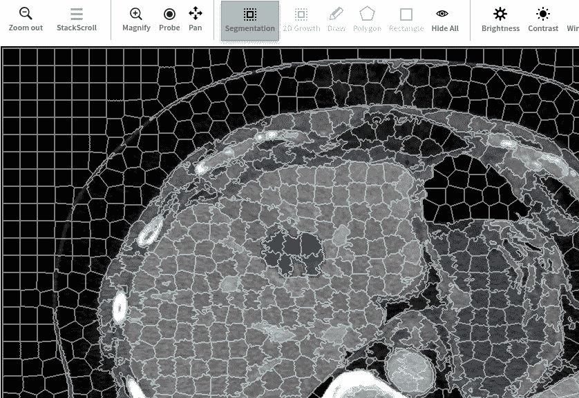
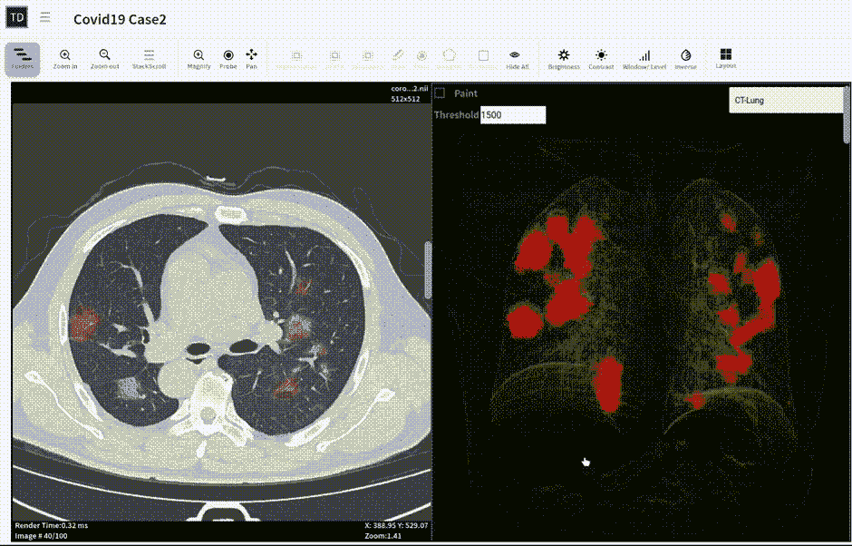
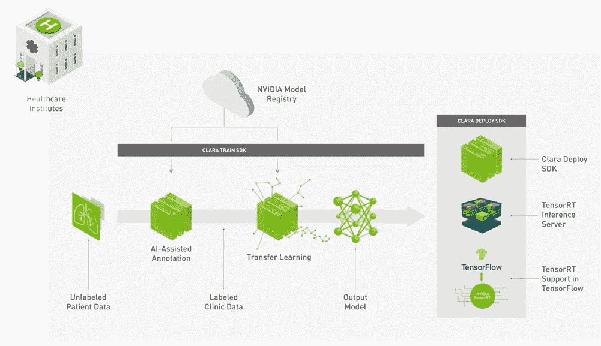
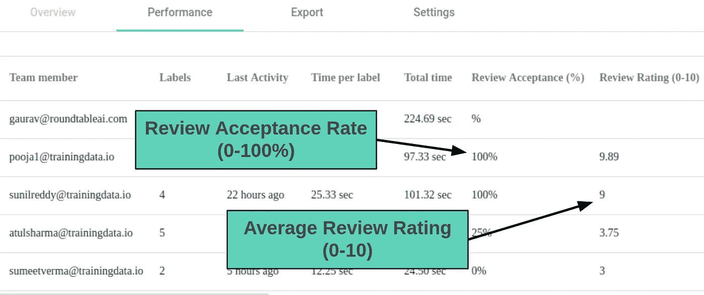
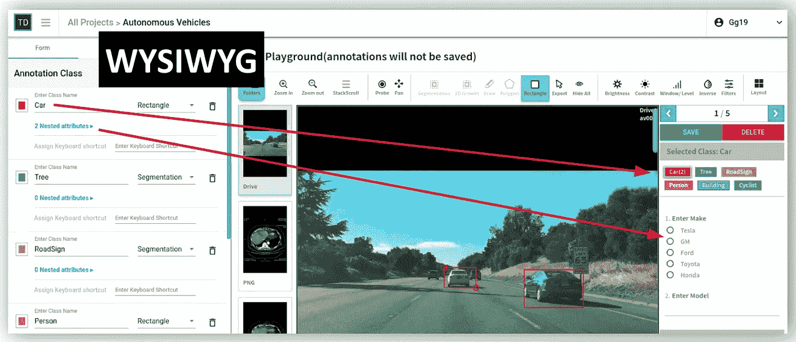
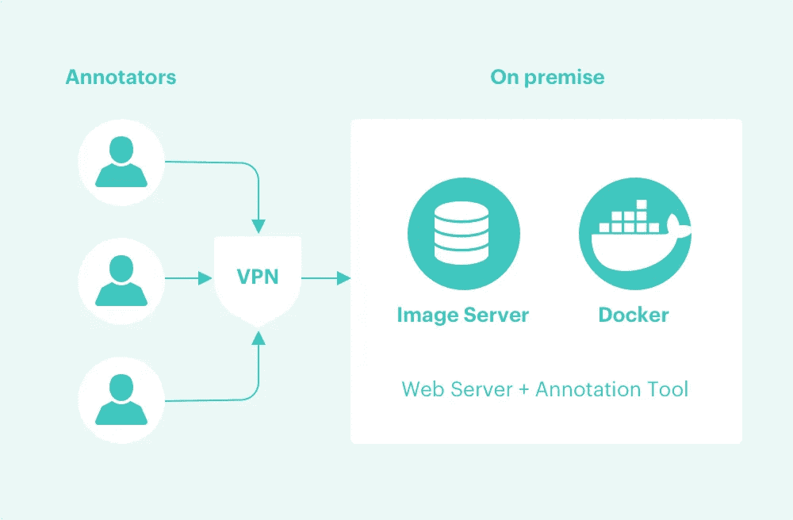

# 如何为放射学人工智能创建高质量的带注释的训练数据？

> 原文：<https://towardsdatascience.com/creating-high-quality-annotated-training-data-for-radiology-ai-d23ca4b85f00?source=collection_archive---------22----------------------->

使用神经网络的深度学习有可能对放射学的医学成像产生非常高的生产力提升影响。虽然人工智能可能永远不会取代放射科医生，但人工智能将有助于以一种非常深刻的方式提高放射科医生的生产力。

四种类型的组织参与在放射学中实现人工智能:

1.  通用电气、飞利浦、西门子、Nuance technologies、Teracon 等现有公司正在建立市场，以分发来自不止一家供应商的人工智能算法。
2.  人工智能初创公司正在建立深度学习算法，以将人工智能商业化用于放射学。
3.  像英伟达这样的 GPU 公司正在通过免费的软件开发工具包加速人工智能的开发，这使得所有其他玩家都可以使用他们的 GPU 硬件和 GPU 云。
4.  像[斯坦福机器学习小组](https://stanfordmlgroup.github.io/)、[俄亥俄州立大学医学院](http://aii.osu.edu/)和[梅奥诊所](https://www.mayoclinic.org/departments-centers/radiology/overview)放射科这样的研究小组正在给放射学人工智能带来最新的研究。

在医学成像领域，人工智能面临着一些重大挑战:

1.  放射学成像数据通常包含个人健康信息(PHI)。它要求遵守严格的法规和 HIPAA 合规法律。这里有一些[指导方针](https://cphs.berkeley.edu/hipaa/hipaa18.html)用于指导 HIPAA 合规性下的 PHI 构成，以及保护 PHI 的常见[策略](https://www.ncbi.nlm.nih.gov/pmc/articles/PMC2923159/)。
2.  由于数据的敏感性，数据需要存放在本地网络或 VPN 控制的网络中。

# 解决办法

人们普遍需要可扩展的数据管理基础设施。为了帮助这一努力，TrainingData.io 创建了一套工具，以帮助数据科学团队为放射学人工智能创建和管理大量训练数据。

# 一个好的培训数据管理平台是由什么组成的？

在 TrainingData.io，我们构建了世界上第一个注释工具，能够为 DICOM 格式的放射学图像创建像素精确的注释，如下图所示:

## 1.标签工具中的本地 Dicom 支持

Dicom 图像格式实际上是来自不同供应商的所有放射设备的标准。Dicom 数据损失少，信息丰富。它允许放射科医生查看捕捉到的图像中的细节。Web 浏览器不像支持 Png 和 Jpeg 那样支持 dicom 解码。标签工具需要支持 dicom 数据格式，具有窗口级预设、多平面视图等功能。

## 2.像素精确的注释工具

在 TrainingData.io，我们建立了世界上第一个注释工具，能够为 DICOM 格式的放射学图像创建像素精确的注释，如下图所示

## 3.网络浏览器中 MRI / CT / DICOM / NIFTI 的三维分割

放射学数据集有两种主要的文件格式 a) DICOM 和 b) NIFTI。一些 MRI / CT 研究包括成千上万的图像(切片)。很难单独注释每个切片。3D 可视化对于加速为大型数据集创建注释的过程非常重要。

3D-Segmentation in Web Browser

## 4.模型辅助注释

英伟达克拉拉:

NVIDIA Clara Model Training Framework

为了生成任何新数据集的自动分割， [TrainingData.io](https://www.trainingdata.io) 已经建立了一个用户界面，如下面的视频所示:

NVIDIA Clara web server 以虚拟化服务的形式提供了与 TensorRT 的接口，可以接收 DICOM 格式或 nifti 格式的数据，并返回注释的结果。

## 5.注释者的绩效管理

测量、记录和分析注释者在每个任务、资产和标签上的表现。比较多个注释者在同一任务上的表现。在多个贴标机之间分配贴标工作，并观察他们工作中的共识。黄金数据集的种子注释任务。报告注释器在黄金数据集上的性能。

Quality Management Workflow

## 6.标签说明管理

为了将标注任务交给自由注释者，数据科学团队需要定义标注任务的规范。这些规范需要转化为用户体验。在 TrainingData.io 应用规范生成器中称为标注指令。标签指令是数据科学家希望人类标签员在图像中找到的对象列表。对象可以有颜色、大小、形状等属性。Data-scientist 希望将这些属性以问答的 HTML 形式呈现给注释者。

Labeling Instruction Builder at TrainingData.io

## 7.数据安全和隐私:内部隐私保护托管

为了支持严格的安全要求，TrainingData.io 建立了一个混合工作流，其中成像训练数据和注释工具作为 Docker 映像在防火墙网络内运行。带有数据集管理的质量控制工作流托管在云中。这使得数据科学家可以与全球员工一起管理注释工作流，同时保证他们自己网络内的数据安全。

On-Premises Hosting with Docker Containers

这个故事最初发表在 [TrainingData.io 博客](https://www.trainingdata.io/blog/how-to-create-high-quality-annotated-training-data-for-radiology-ai/)上。