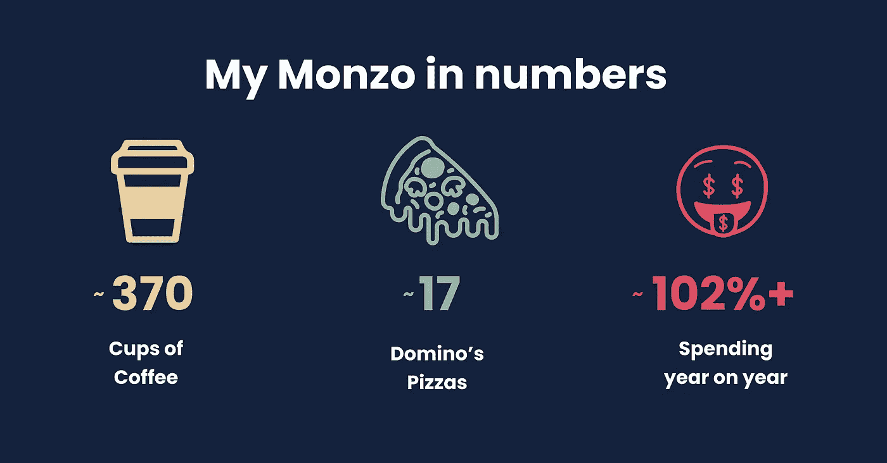
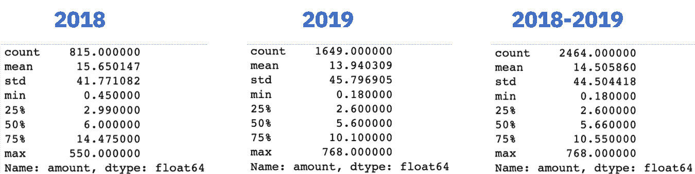
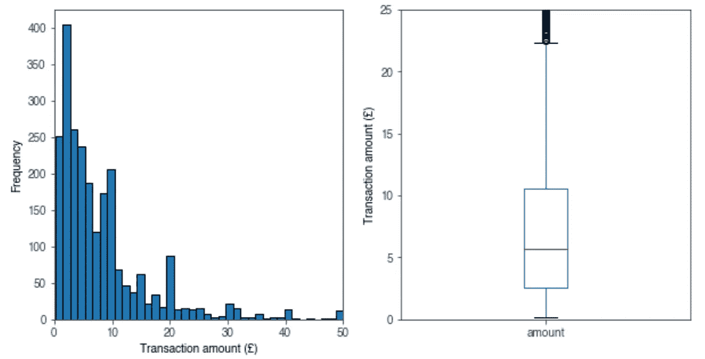
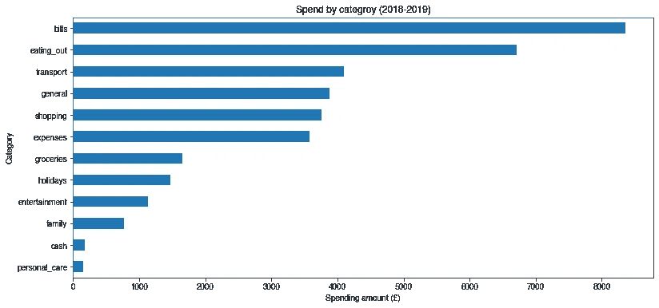
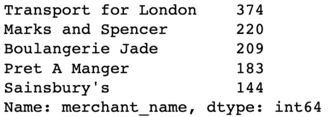
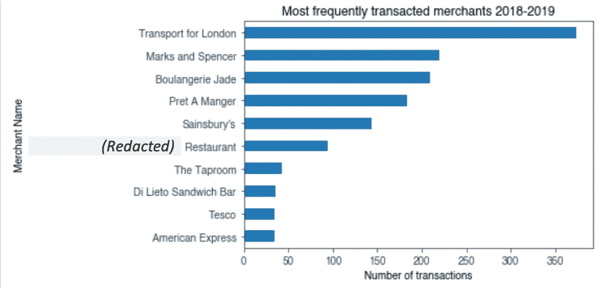
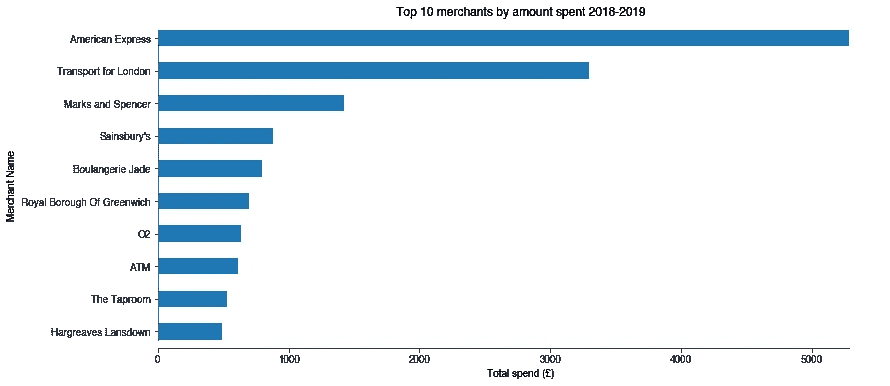
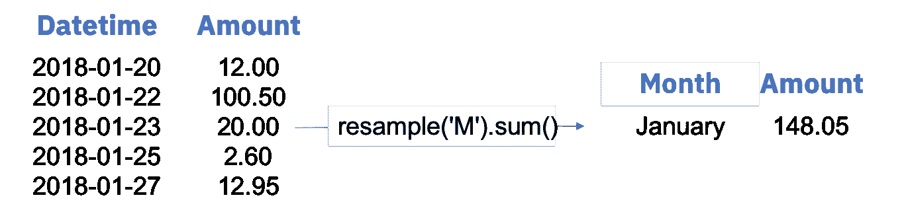
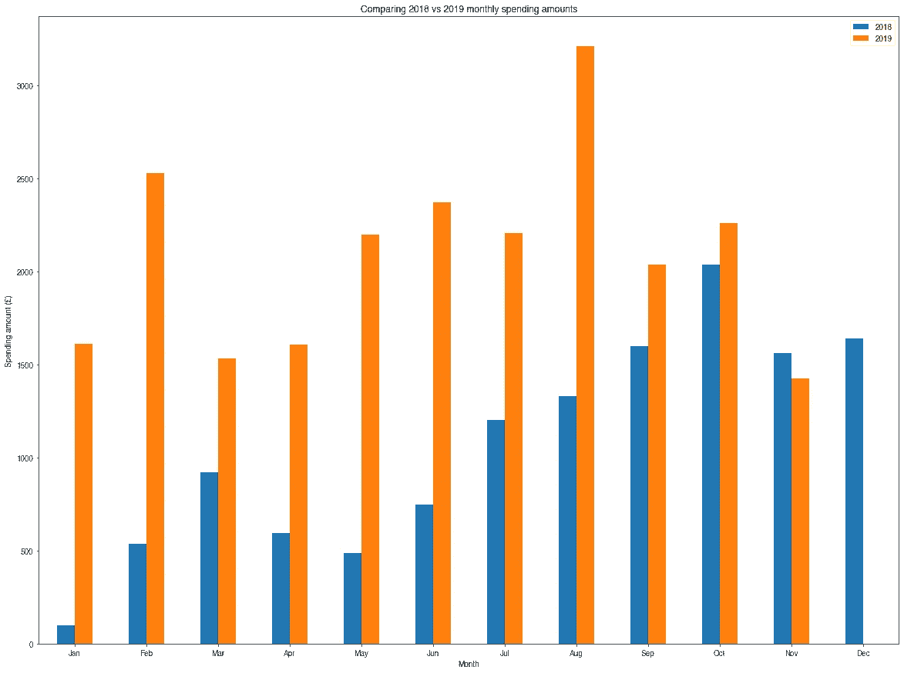

# 用蟒蛇和熊猫创造我自己的“蒙佐年”

> 原文：<https://towardsdatascience.com/creating-my-own-year-in-monzo-using-python-pandas-e866a17c3509?source=collection_archive---------37----------------------->

## **深入分析**



拥有 [Monzo](https://monzo.com/) 账户的 nyone 只需简单调用一个 API 就能访问他们的全部交易历史。交易历史数据集非常丰富，可以为您的消费习惯提供独特的见解，对于任何学习数据科学和分析的人来说都是一个很好的资源。在本文中，我将探索一些我自己的消费习惯统计数据，并向您展示如何使用一些基本的 Python 编程来做同样的事情。

## 数据科学工具包

在开始分析之前，先简单介绍一下我将使用的工具:

*   jupyter Notebook——一个在线笔记本，它使运行代码和探索数据比在一个大脚本中编写更容易。
*   python——一种具有许多自定义数据科学库的通用编程语言。
*   [Pandas](https://pandas.pydata.org/)——最强大、应用最广泛的数据科学与分析库。

我已经在我的 [GitHub](https://github.com/87bdharr/Monzo_data_exploration) 中嵌入了作为这个分析的一部分而编写的所有代码。

## **加载并清理数据**

首先，你需要将数据放入你的 Jupyter 笔记本，并以一种更友好的方式格式化，这可以通过 7 个步骤实现:

1.  登录 [Monzo for Developers](https://auth.monzo.com/?redirect_uri=https%3A%2F%2Fdevelopers.monzo.com%2Flogin%3Fredirect%3D%252Fapi%252Fplayground&client_id=oauthclient_000094PvINDGzT3k6tz8jp&response_type=code&state=3050f78d-8f76-4e04-8d2f-c7e46c166953&intent=login) 门户，并遵循 [API 文档](https://docs.monzo.com/#introduction)中的认证指南来访问您的数据。
2.  通过在本地机器上请求 JSON 形式的“事务列表”来点击 API，并将其保存为 JSON 文件。*重要提示:在您必须请求另一个访问令牌之前，您只有 5 分钟的时间来完成此操作，因此请在您访问门户时尽快完成。*
3.  在 Jupyter 笔记本中，导入 pandas 和 matplotlib(用于创建图表的库),然后将 JSON 数据文件加载到 dataframe 中。

4.扁平化数据框架，使数据分析更容易。

5.将列中的事务“created”转换为 datetime 序列，并将其设置为 dataframe 的索引。

6.将交易金额从便士转换为英镑，并强制正金额与购买相对应。这是通过对列应用 lambda 函数来实现的。

7.过滤数据框架，排除内部“现金”转账，因为我们只对实际支出感兴趣。

每个事务都存储为一个 JSON 对象(见下面的例子)，并包含许多键值对，我们稍后将使用它们来提取一些有趣的见解。

```
{
  "id": "tx_00009T3RKKR0B36laVzJh4",
  "created": "2018-01-28T12:33:46.54Z",
  "description": "TfL Travel Charge      TFL.gov.uk/CP GBR",
  "amount": -450,
  "fees": {},
  "currency": "GBP",
  "merchant": {
    "id": "merch_000092jBCaq2cHlL8pLVkP",
    "group_id": "grp_000092JYbUJtEgP9xND1Iv",
    "created": "2015-12-03T01:24:14.372Z",
    "name": "Transport for London",
    "logo": "https://mondo-logo-cache.appspot.com/twitter/@TfL/?size=large",
    "emoji": "🚇",
    "category": "transport",
    "online": true,
    "atm": false,
    "address": {
      "short_formatted": "The United Kingdom",
      "formatted": "United Kingdom",
      "address": "",
      "city": "",
      "region": "",
      "country": "GBR",
      "postcode": "",
      "latitude": 51.49749604049592,
      "longitude": -0.13546890740963136,
      "zoom_level": 17,
      "approximate": false
    },
```

## 探索性数据分析(EDA):交易金额

现在，数据作为数据帧加载到笔记本电脑中，我们可以开始进行一些探索性的数据分析(EDA)。EDA 有助于生成一些基本的数据统计摘要，并且是让自己熟悉新数据集的好方法。

我想知道关于我的数据集中 2，464 个*正交易*的交易金额( )的一些统计数据。(请记住，在第 6 步中，我强制正值表示购买，负值表示付款或退款。)

我过滤金额为正数的交易，并将它们分配到一个新的数据框`trans_pos_amount`:

```
trans_pos_amount = trans[trans['amount'] > 0]
```

然后使用内置的 Pandas 方法`.describe()`在新数据帧的金额列上获得 2018、2019 和 2018–2019(合并)的交易汇总统计数据:

```
trans_pos_amount.loc['2018'].amount.describe()
trans_pos_amount.loc['2019'].amount.describe()
trans_pos_amount.amount.describe()
```

生成的 3 个汇总表返回一些标准统计数据，包括平均值、中值、标准差、四分位距和最大值:



考虑到整个数据集(2018 年至 2019 年)，似乎我每笔交易的平均支出金额为 14.50，标准差为 44.50。这表明我的支出有很大程度的可变性，这是有道理的，因为我使用 Monzo 进行日常生活，如旅行和食物，但也支付大额项目，如账单，这通常是更大的交易金额。

有趣的是，我每笔交易的平均消费金额是 2.60 英镑，几乎等同于一杯咖啡的价格(在伦敦)。稍后，我将探索哪些是我最常去的商店，看看咖啡是否真的会影响中值交易额。但是，现在很清楚的是，我用我的 Monzo 账户进行许多小交易。

还可以使用 matplotlib 库来可视化这些统计数据。可视化形式的 EDA 通常比数字形式的 EDA 更容易理解。使用`.plot()`方法可从`trans_pos_amount`数据帧中获得直方图和箱线图:

```
#plot a histogram and boxplot side by side
fig, (ax1, ax2) = plt.subplots(nrows=1, ncols=2, figsize=(10,5))
trans_pos_amount.plot(kind='hist', bins=600, grid=False, edgecolor = 'black', ax=ax1)
trans_pos_amount.plot(kind='box', ax=ax2)
```



Histogram (left) and boxplot (right) of my transaction amounts over 2018 & 2019

正如数字数据所暗示的，我们可以看到，我的大多数交易通常金额较小，但少数大额交易会使整体平均交易金额偏高。

## **探索性数据分析(EDA):消费类别&商户**

通过了解我的消费习惯，我知道我可以在哪里改变我的生活方式，这样从长远来看我可以节省更多的钱。使用 Monzo 数据集的一种方法是按类别过滤我的交易，例如账单、外出就餐和交通。虽然我可能无法显著改变我在必要支出(如账单和交通)上的花费，但我可以调整可自由支配的支出，如外出就餐、购物和度假。

Pandas 中非常方便的`.groupby()`方法可用于按类别对交易进行分组。然后很简单地按该类别的总支出来绘制分组数据:

```
#plot the amount spent in each category over 2018 & 2019
trans_pos_amount.groupby('category').amount.sum().sort_values().plot(kind='barh')
```



Total amount spent by category over 2018 & 2019

正如我预料的那样，我花在账单上的钱最多，包括房租、电话费、市政税(你知道，所有无聊的成人用品)。让我感到惊讶和尴尬的是，外出就餐是我的第二大支出类别，在两年时间里高达 6700 英镑。外出就餐肯定是可自由选择的一类，因此，我可以减少下班后外出就餐和喝酒的次数。

通过调查我与哪些商家交易最多，我可以更深入地了解我的消费习惯。在可能的情况下，Monzo 会向我们提供详细的商家信息，包括名称、位置和社交媒体信息。我只对`merchant_name`字段感兴趣，它可以从 dataframe 中访问。我创建了一个名为`merch_freq`的新数据框架，并使用`.value_counts()`方法产生一个按交易数量排序的商家列表(调用`.head()`返回最后的前 5 个值):

```
merch_freq = trans['merchant_name'].value_counts()
merch_freq .head()
```



Top 5 merchants by number of transactions

直观地看这些信息会更容易理解，但我只想包括我的前 10 名商户，所以我在数据帧上使用了`.nlargest()`方法，然后按照频率顺序绘制出我的前 10 名商户:

```
merch_freq.nlargest(10).sort_values().plot(kind='barh')
```



Top 10 merchants by number of transactions

*注意:出于保密原因，我编辑了其中一个商家的名字*。

从这张图表中可以清楚地看出，我的前 10 名商户中有一半可以归为“外出就餐”一类。毫不奇怪，我最受欢迎的商家是伦敦交通局，因为我几乎每天都用我的 Monzo 进出 TfL 网络。

早些时候，我质疑我的平均消费金额 2.60 英镑(相当于伦敦一杯咖啡的价格)能否用我去咖啡店的次数来解释。事实上，从图表上看，有两家咖啡店(Boulangerie Jade & Pret A Manger)创下了令人震惊的 392 笔交易。我的交易中大约有 16%涉及咖啡！我认为假设我的咖啡瘾确实影响了我每笔交易的平均花费是公平的。

虽然我有 10 个最频繁交易的商家，但我想知道当我检查哪些商家我花了最多的钱时，列表是否会有很大变化？为了研究这一点，我创建了一个名为`merch_amount`的新数据帧，并再次使用`.groupby()`方法，这次按`merchant_name`字段分组。我计算了每个商家的总消费金额，然后首先按最大金额对数据框进行排序:

```
merch_amount = trans.groupby(trans['merchant_name'], sort=True).sum().sort_values('amount', ascending=False)
```

之后，创建一个情节就很简单了:

```
merch_amount['amount'].nlargest(10).sort_values().plot(kind='barh')
```



Top 10 merchants by amount spent

幸运的是，在我的金额排名前 10 名中，我看到了更多与账单和费用相关的商家。然而，令人失望的是，我无法使用这个数据集透露更多关于我的美国运通交易的信息。我使用我 Monzo 帐户来支付我的美国运通，因此关于这些交易的任何信息基本上都落入了黑洞(尽管我可以利用他们的 API 来获取数据)。

我还没探索完我的咖啡假说。当我合计在 Boulangerie Jade 和 Pret A Manger 的消费总额时，我发现两年多来我在咖啡因上浪费了 1037 英镑。分布在总共 392 个事务上，得出的平均值为 2.62，这几乎等于我在整个数据集上的中值事务量。

## **对比我的 2018 年和 2019 年**

最后，我想检查一下我对 Monzo 的使用在 2018 年和 2019 年之间发生了什么变化，并潜在地看看未来是否有我可以预期的特别昂贵的月份。我在这里的目标是创建一个条形图，比较 2018 年和 2019 年之间每月的支出总额。

在开始清理数据时，我确保用日期时间标记索引每个事务。这一步现在将开始得到回报，因为我可以更容易地过滤数据，并使用`.resample()`方法按月对每笔交易进行分组。

首先，我按年份过滤`trans_pos_amount`数据帧，然后在新的`df_2018`数据帧上使用`.resample()`和`.sum()`方法:

```
df_2018 = trans_pos_amount.loc['2018']
df_2018_monthly_resample = df_2018.resample('M').sum()
```

本质上，通过重采样然后求和，我得到了一个月内的所有交易(当我将‘M’解析到方法中时指定)，并将它们组合成一个数字。



Re-sampling allows me to group transactions by month

`df_2018_monthly_resample`数据框包含 2018 年每个月花费的总额。但是，这个数据帧的索引不是我想要的。数据帧不是被索引为有序的月份列表，例如“一月”、“二月”、“三月”，而是被索引为日期时间戳，例如“2018–01–31 00:00:00+00:00”**。不要担心，只要新索引的长度与数据帧的长度匹配，我可以将数据帧的索引设置为我想要的任何值。我简单地创建了一个月份列表(`labels_2018`和`labels_2019`)，然后将该列表解析为`set.index()`方法:**

```
df_2018_new_index = df_2018_monthly_resample.set_index([labels_2018])df_2019_new_index = df_2019_monthly_resample.set_index([labels_2019])
```

现在，我可以将新索引的 2018 年和 2019 年数据帧合并为一个，方法是创建一个新的数据帧，并使用键值对将年份与其各自的数据帧进行匹配:

```
df_2018_vs_2019 = pd.DataFrame({'2018':df_2018_new_index.amount, '2019':df_2019_new_index.amount}, index=labels_2018)
```

现在有了一个整洁的数据框架，我可以绘制数据来实现我的目标:

```
df_2018_vs_2019.plot(kind='bar')
```



Comparing 2018 and 2019 spending amounts

从图表中可以明确的是，2019 年我对 Monzo 的使用量远远高于 2018 年。这可能有两个原因:1 .我花了一些时间才把 Monzo 作为我的主要银行。2.我在 2019 年赚了更多的钱，这可能会反映在我花费的金额上。

就月度趋势而言，随着夏季(5 月至 9 月)的临近，2019 年的趋势肯定会有所上升，但随着我们进入冬季，这一趋势似乎会有所下降。这是合乎逻辑的，因为夏天有更长的白天，并且提供了更多的机会去做我根据我的数据最常做的事情:出去吃和喝！

## 最终外卖

在这个小项目开始时，我对如何花钱有一个粗略的想法，但现在我有了一些真正的见解。很明显，我需要减少我在外面吃饭和喝酒的习惯，但我也可能会寻找更具成本效益的方式在伦敦四处游览。伦敦的交通对我来说是一个巨大的支出，所以使用城市地图绘制者通行证或简单地获得月票可能是有益的。

Monzo 提供了一个非常干净和可访问的数据集，可以用来做比简单的 EDA 复杂得多的事情。在一个这样的[示例](https://medium.com/@_prkr/visualising-spending-behaviour-through-open-banking-and-gis-9e7045674538)中，商家位置信息用于创建吸引人的交易地图。虽然这些地图很吸引人，但也可以用来帮助用户识别欺诈活动，因为用户更有可能以这种新颖的格式与他们的数据进行交互。

事实上，这个数据集的潜在用例是无限的，这是为什么开放银行的黎明将为初创公司和现有金融服务提供商提供新的有价值的想法的一个例子。

## 自己试一试

我强烈推荐使用[数据营](https://www.datacamp.com/home)来提升自己在数据科学和分析方面的技能。通过跟随他们的视频，然后用他们的指导教程练习，我在几周的时间里从一个初学者变成了分析真实世界数据的人。

提醒:[链接](https://github.com/87bdharr/Monzo_data_exploration)到对您自己的数据进行分析所需的代码。