# 使用 Google 云平台创建 MySQL 实例

> 原文：<https://towardsdatascience.com/creating-mysql-instance-using-google-cloud-platform-353c36803cee?source=collection_archive---------13----------------------->

## 在谷歌云中创建和管理 MySQL 数据库。

在本文中，我们将总结如何使用 Google Cloud Platform 创建 MySQL 数据库实例，从 Google 的 cloud shell 连接到创建的实例以测试它，然后在我们的本地机器上使用 MySQL workbench 连接到同一个实例。有很多方法可以在云中的数据库中工作，类似于微软 Azure 或 AWS。在这种情况下，我们将专注于基本的 Google 云平台，不包括高级配置选项。

1-前往[https://cloud.google.com/](https://cloud.google.com/)，创建一个免费试用的谷歌云平台账户。这将给予 12 个月或 300 美元的免费积分(以先到者为准)

2-去 https://cloud.google.com/的[然后去你的控制台。](https://cloud.google.com/)

3-转到 SQL 仪表板部分，并选择创建实例。

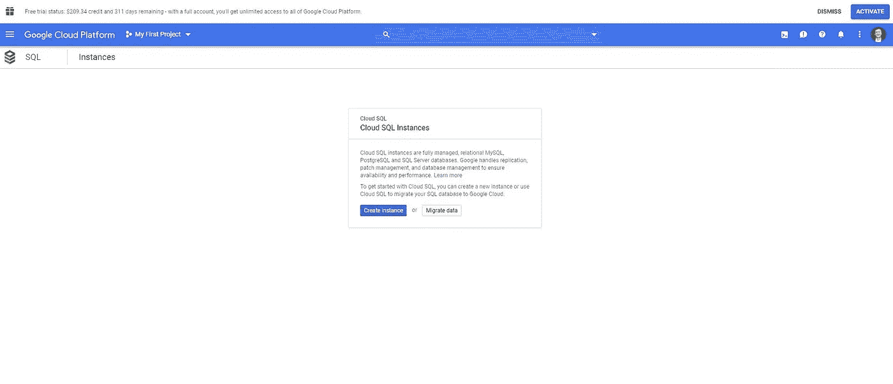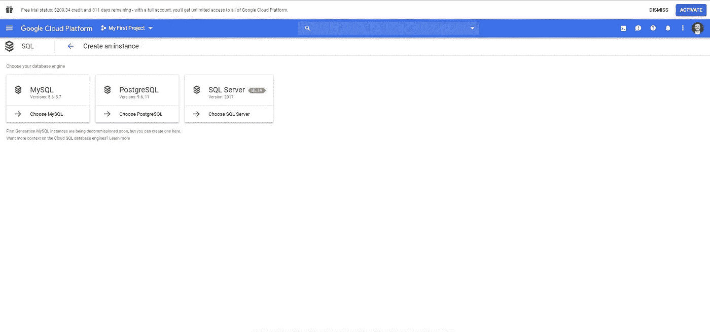

4-选择选择第二代(推荐)

5-创建实例 id 和 root 密码。

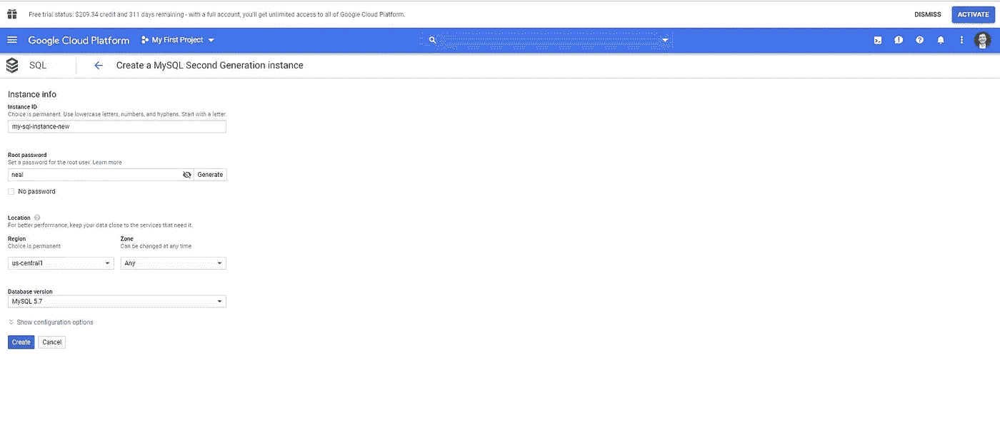

6-选择创建。这将需要一些时间，但在谷歌云平台中创建 MYSQL 实例。

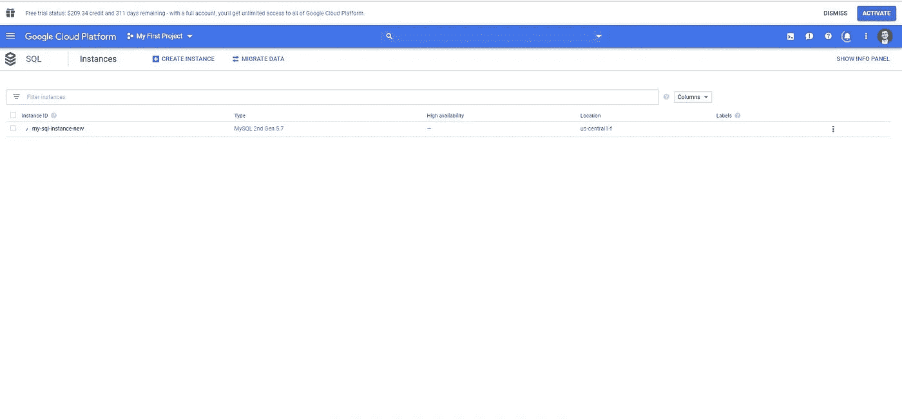

8-完成后，实例 ID 旁边会有一个复选标记。

9-单击创建的 MSQL 实例。

10-记下服务器 IP 地址并使用云外壳进行连接。将客户端 IP 地址列入白名单需要一些时间。

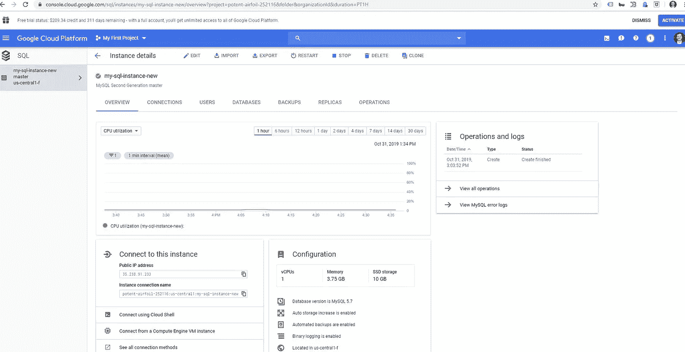

11-云壳会提示你输入密码。输入密码后，实例连接将完成。我们可以进一步执行 SQL 语句，并通过云外壳访问 MYSQL 实例。

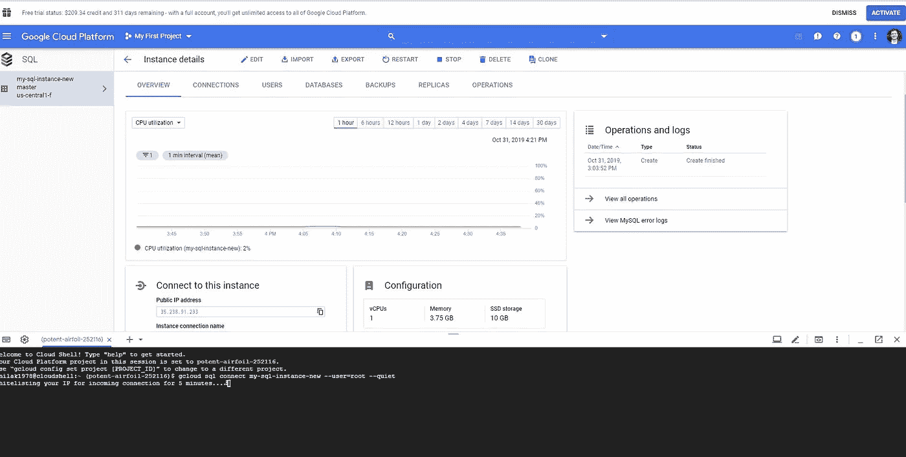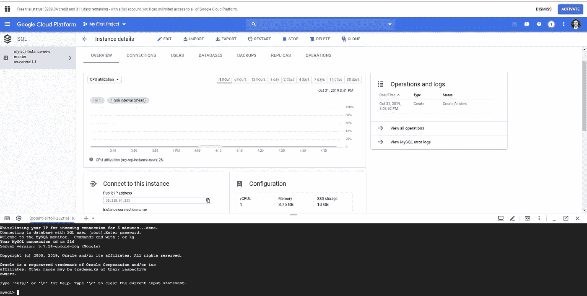

12-去 google.com 并获得公共 IP 地址。

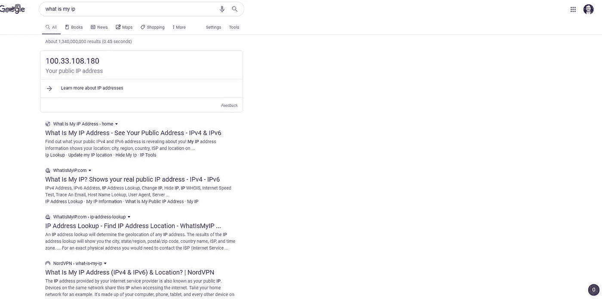

13-转到实例详细信息/连接，添加一个网络，并在网络名称下添加此 IP 地址，然后单击保存。

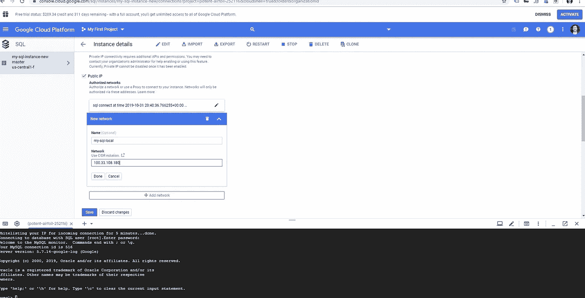

14-转到本地机器上的 MYSQL workbench。

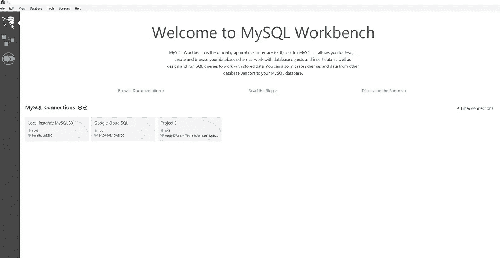

15-创建新连接。

16-添加连接名称。

17-使用步骤 10 中记录的服务器 IP 地址更新主机名。

18-创建用户名和最佳实践来创建非 root 密码。

19-保留默认模式。

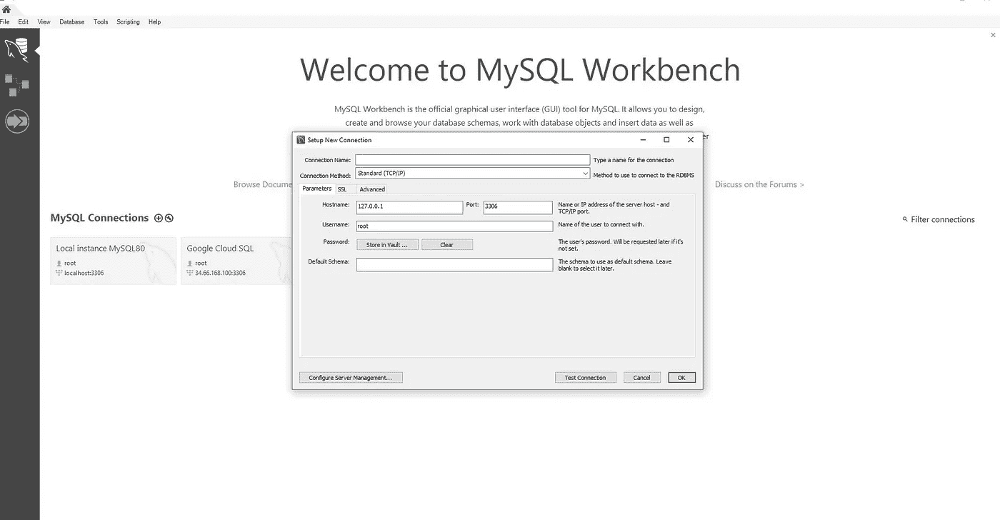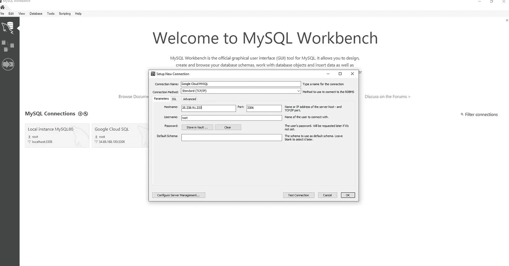

20-测试连接将提示您输入密码。输入您的实例密码。

21-成功地建立了 MySQL 连接。单击确定。

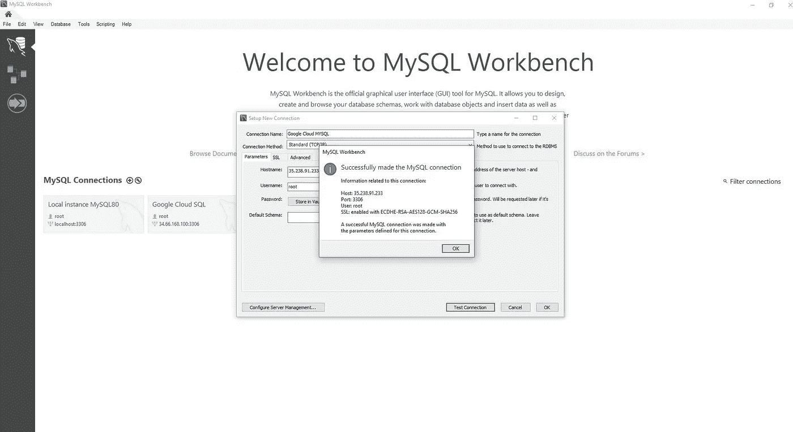

22-Google 云平台 MYSQL 创建并连接到本地 MySQL workbench。

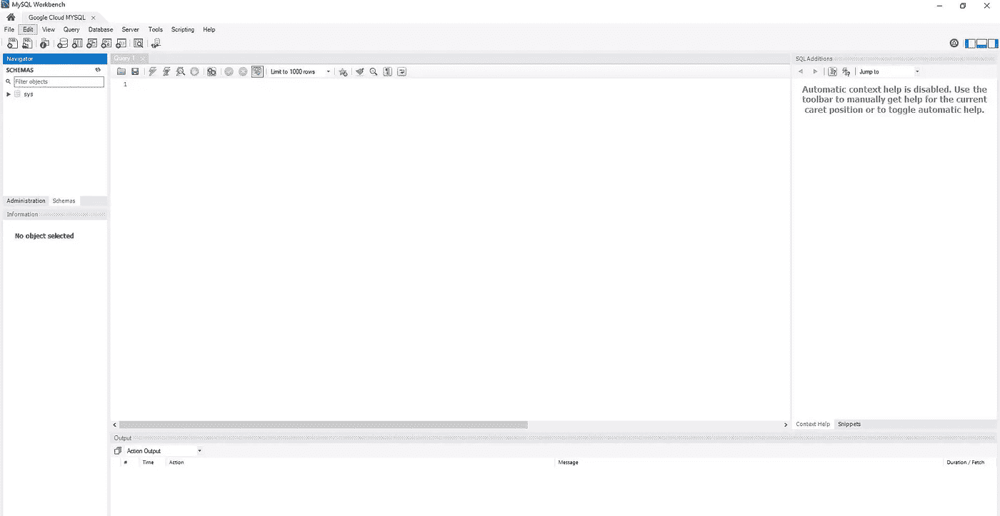

这个过程非常简单易懂。我们可以进一步创建关系数据库和表，使用 GCP 实例从本地 MySQL 工作台执行查询。我们还可以将数据库中创建的任何表加载到我们的本地 R 或 Python 中，并执行分析。