# 使用 StyleGAN 创建新脚本

> 原文：<https://towardsdatascience.com/creating-new-scripts-with-stylegan-c16473a50fd0?source=collection_archive---------8----------------------->

我将 StyleGAN 应用于 Unicode 字符的图像，看看它是否能发明新的字符。我发现了一些有趣的结果:

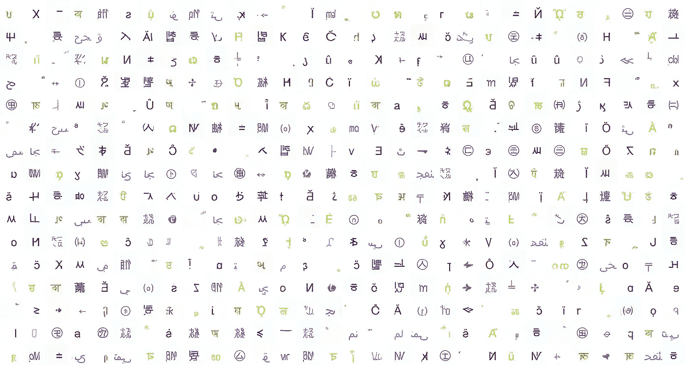

New characters generated by StyleGAN from Unicode

# 世界的剧本

世界上的语言使用大约 400 种不同的书写系统。这包括今天使用最广泛的拉丁文字:

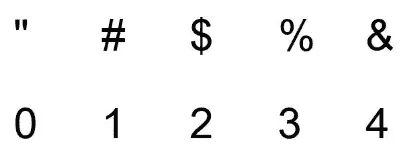

Simple Latin Characters

The Unicode Consortium aims to map every character in the world to an underlying number so that they can be easily used across different computer systems. For example, hash “#” is mapped to the number 35, a-acute “á” is 225, and the Chinese character for fog “雾” is mapped to 38,654\. The first ~65,000 characters in Unicode cover most scripts in current use and are divided into ~140 blocks, with Simple Latin being one of those blocks. See the [Wikipedia Page on Unicode Blocks](https://en.wikipedia.org/wiki/Unicode_block) for the full list.

我在 Unicode 协会工作过一段时间。我被美国语言学会任命为候补委员，关注那些未被充分代表的语言。我着迷于亲眼目睹脚本如何被形式化和编码的过程，以便世界上的每个人都可以利用信息时代，无论他们选择如何交流。我在 Unicode Consortium 的时候，表情符号第一次被添加到 Unicode 中，这可能是他们最有争议的决定。你可以在这里阅读我关于见证表情符号被添加到 Unicode 的文章:

 [## 艾萨克·牛顿 vs 数百万日本青少年

medium.com](https://medium.com/@robert.munro/isaac-newton-vs-millions-of-japanese-teens-6d952801f6f2) 

最困难的决定之一是在 Unicode 标准中如何命名给定的脚本。按照 Unicode 的定义，简单拉丁语包括常见的标点符号、字符和数字。显然，使用这种文字的语言比拉丁语多，你可以争论标点符号是否是文字的一部分。你指出除了 0 以外的所有数字都来自阿拉伯语也是对的。因此，Unicode 中的“块”试图映射到脚本中有意义的部分，承认边界可能是模糊的，并且脚本通常会有多个可能具有政治含义的名称。因此，这些名称对于 Unicode 中的块来说是方便的简写，但并不打算成为使用该语言的人的主要或唯一的名称。

带着这个警告，这里有一些有趣的 Unicode 脚本，我用它们作为用 StyleGAN 创建新脚本的基础:

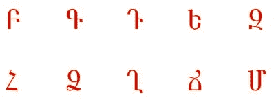

Armenian

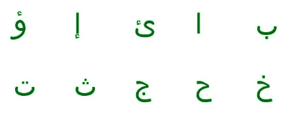

Arabic

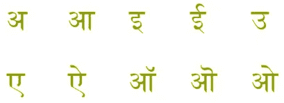

Devanagari

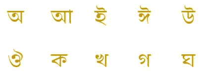

Bengali

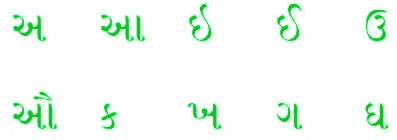

Gujarati

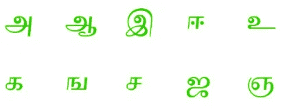

Tamil

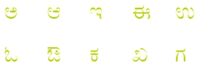

Kannada

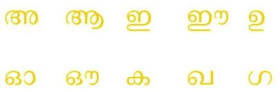

Malayalam

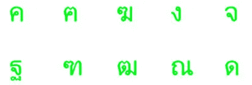

Thai

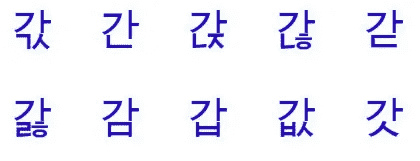

Hangul Symbols

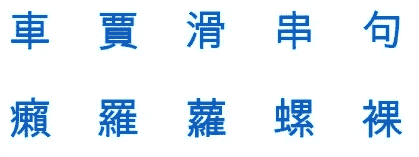

CJK Compatibility Ideographs (CJK = Chinese Japanese Korean)

我承认在我上面的例子中，我过分强调了南亚的语言。在早起观看[印度和巴基斯坦在板球世界杯](https://www.cricketworldcup.com/match/8213)中的比赛后，我写了这篇文章，所以我强调了他们国家内部的多样性，可能也包括了他们球队内部的多样性。如果你对语言和体育感兴趣，你也应该在这里看到我对足球世界杯球员名字的分析:

 [## 世界杯人物

medium.com](https://medium.com/@robert.munro/world-cup-characters-6c8d003b0274) 

# 数据准备

我用 python Pillow 库和 MAC 自带的“Ariel unicode”字体为每个 Unicode 字符生成了一个 JPG 图像。如果你想重新创建这个，让我知道，我会分享我的代码。

*更新:代码在这里:*【https://github.com/rmunro/unicode_image_generator】T2

我用不同的颜色对每个区块(与一个脚本相关的每个字符范围)中的图像进行编码，这样我就可以很容易地看到最终字符集中的最大影响。上面图像中的颜色反映出:拉丁语是黑色，泰米尔语是亮绿色，等等。

最初，这产生了大约 40，000 张图像。这是 65，000 个字符中有多少经过 Ariel Unicode 字体的某种渲染。尝试一种覆盖面更大的字体会很有趣，尤其是在不再使用的旧字体和表情符号等其他字符之间。使用多种不同的字体生成字符也是很有趣的。如果你这样做，让我知道！

在这 40，000 个汉字中，大部分是中国和日本汉字。我很快放弃了一个实验，在这个实验中，StyleGAN 只生成看起来像中国和日本汉字的新字符。

对于每个超过 256 个字符的块，我随机选择了 256 个字符的子集。这使得数据从 40，000 个字符增加到大约 7，000 个字符。我用这 7000 来训练这个模型，我在本文中分享了它的结果。

为了查看每个区块的前 20 个字符及其颜色，我在我的个人网站上列出了它们:

*   【http://robertmunro.com/research/unicode/show.html 

# StyleGAN

StyleGAN 是一个在 TensorFlow 中实现的图像生成系统，它使用生成式对抗网络(GANs)。它是由 NVidia 开发的，并在此作为开源代码发布:

*   [https://github.com/NVlabs/stylegan](https://github.com/NVlabs/stylegan)

有关他们方法的更多信息，请参见本文:

*   *一种基于风格的生成式对抗网络生成器架构。泰罗·卡拉斯、萨穆利·莱恩和蒂莫·艾拉。[http://stylegan.xyz/paper](http://stylegan.xyz/paper)*

StyleGAN 最著名的用途是为实际不存在的人创建“逼真”的照片:

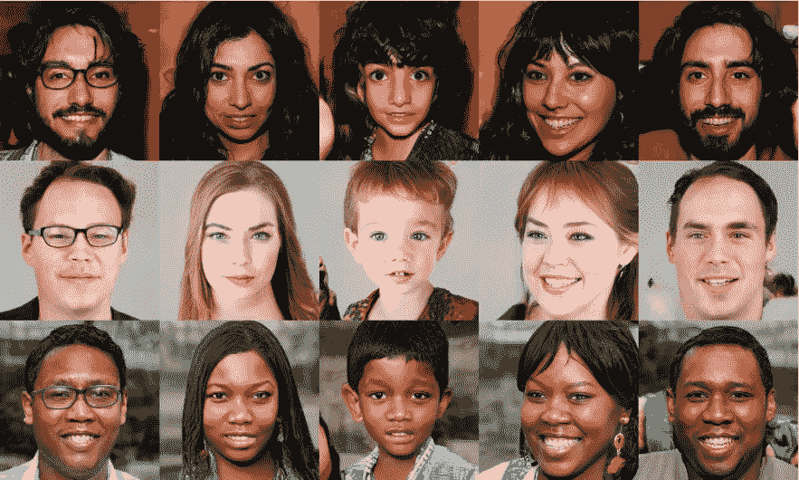

Examples of fake faces generated by styleGAN, from [https://github.com/NVlabs/stylegan](https://github.com/NVlabs/stylegan)

人们一直在用这个来生成其他的假图像，我受到了其中一些的启发，包括迈尔斯·布伦戴奇使用 StyleGAN 来创建新的《太空堡垒卡拉狄加》图像:

Because Cylons look like people, but they are not real people?

# 实验

我对 7000 张图片进行了分层采样，并根据它们的 Unicode 编码进行了颜色编码，我在 P2 AWS 实例上运行了 styleGAN 整整一周。我使用了深度学习 AMI，我需要安装的唯一附加库是用于从字体生成图像。

同样，如果你感兴趣，让我知道，我会上传代码。这是对 styleGAN 代码的一个小修改。最困难的部分是让图像和字体库在 python 中运行良好，这样我就可以以编程方式为每个 Unicode 字符生成图像并给图像着色。

# 结果

理想情况下，结果应该看起来像实际的字符，但是*而不是*看起来像当今 Unicode 中的任何字符。

下面是系统训练过的一些真实的例子:

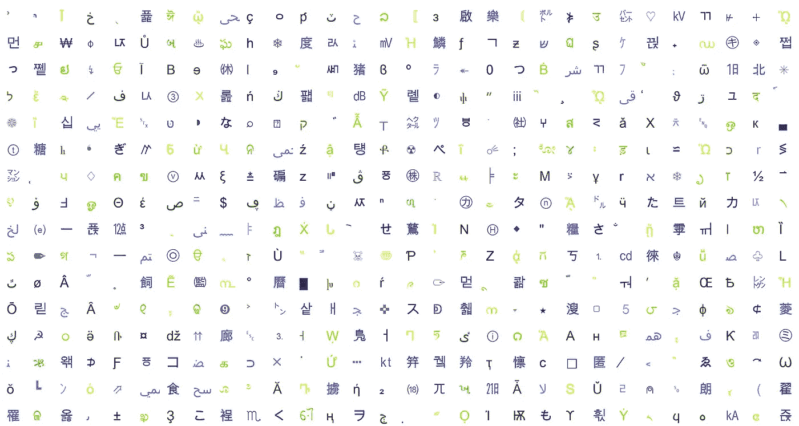

首先，结果不太令人信服。在 10 个样本图像(styleGAN 系统中的“刻度”)之后，它们变得模糊不清:

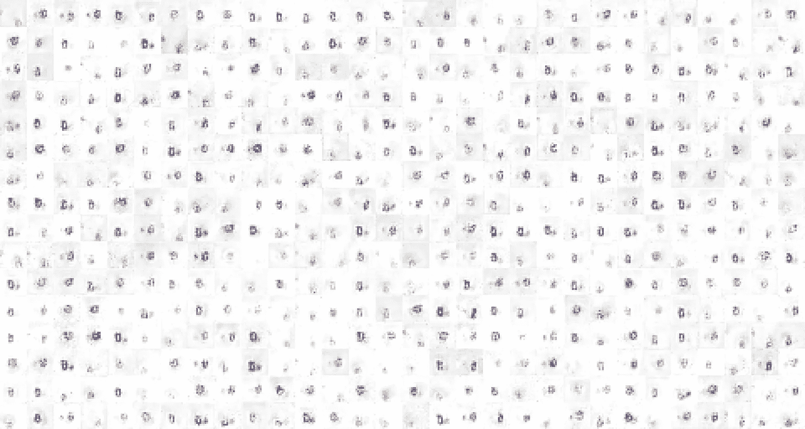

Example fakes after 10 ticks

但是在 30 次滴答之后，我们开始看到一些清晰的例子:

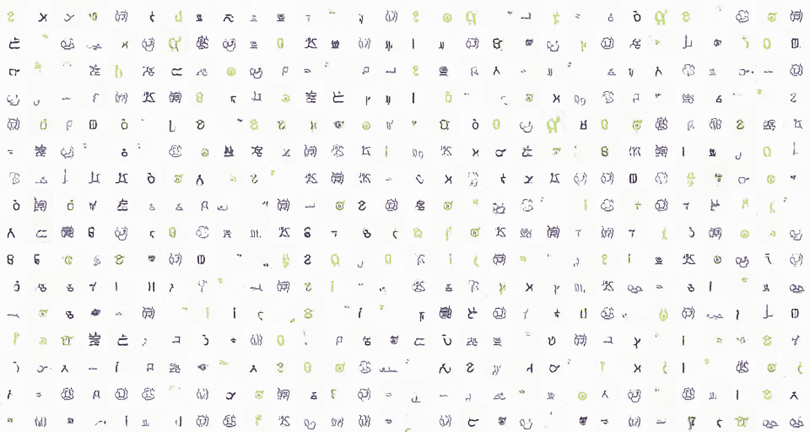

Example fakes after 30 ticks

30 个刻度后的示例在缩小时看起来很真实，但在放大时有点奇怪，因为直线和曲线之间没有明显的区别:

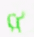

Alien-looking character after 30 ticks

这也是本文开头的图片，是在 78 次滴答之后，现在有了一些非常清晰的例子:

Example fakes after 78 ticks

直线和曲线之间的区别现在很明显，重音和音调符号现在与字符本身更加明显。在 StyleGAN 的训练中，分辨率增加了一倍，在 30 到 78 个刻度之间，这也有所帮助。

以下是我最喜欢的《78 滴答》,颜色告诉我们它们的影响来自哪里:

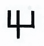

Latin influenced

Arabic influenced

Thai influenced

CJK (Chinese Japanese Korean) influenced

Enclosed CJK influenced

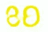

Malayalam influenced

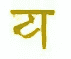

Devanagari influenced

Tamil influenced

我真的对这些角色的逼真印象深刻！除了几个例外，看起来它们都属于某种语言的脚本。

有一些例子表明*已经是 Unicode 中的*字符。这些例子可能不是随机选择的 256 块中的一部分，或者它们可能以不同的方式偏移或缩放。我还没有研究为什么这些会错误地出现。

到第 78 个滴答时，训练还没有完成。我把这限制在一周的训练中，主要是为了适应我的个人时间表。我敢肯定，如果它能持续更长时间，它会创造出更有趣、更有说服力的角色。

只花了半天时间进行实验，花了几个小时进行分析和记录。或者用板球世界杯的术语来说，它花了一局时间来编写代码和启动流程，然后花了 27 局时间来分析结果和写这篇博文。如果你也是一个喜欢板球的程序员，这是一个在观看世界杯时进行多任务处理的好方法！

只有一个方面的结果没有达到我的预期:我希望一些新角色会是彩虹色的，并同时显示出来自多个剧本的影响。经过思考，我明白了为什么情况不是这样:在训练数据中没有彩色的例子，因此彩色的例子不会是令人信服的对立例子。

# 为什么要生成新字符？

除了有趣的因素，这里还有一些实际的使用案例:

*   为新脚本识别新字符。世界上只有一半的语言采用了文字。对于一个语言社区来说，采用前殖民者或入侵者的文字往往是有争议的。这种方法可以提供一个候选字符列表，我们已经知道这些字符并不存在，但是在风格上与世界范围内的文字一致。
*   **理解文字的视觉属性。**生成的赝品都告诉我们一些关于文字视觉属性的有趣事情:曲线和线条的选择，字符空间不同部分的信息分布，等等。因此，它们告诉我们一些有趣的事情，关于我们如何在不同的脚本中以相似或不同的方式编码信息。
*   **为创造性用例创建新的脚本。从《指环王》到《星际迷航》,在书籍和电影中有许多有趣的假剧本例子。如果你没有预算雇用大卫·J·彼得森，这种方法可以产生比你有时在低成本科幻电影中看到的随机符号更真实的剧本。**

如果你知道 StyleGAN 的任何其他有趣的应用，或者其他生成新字符的方法，请告诉我！

*更新:代码在这里:*[https://github.com/rmunro/unicode_image_generator](https://github.com/rmunro/unicode_image_generator)