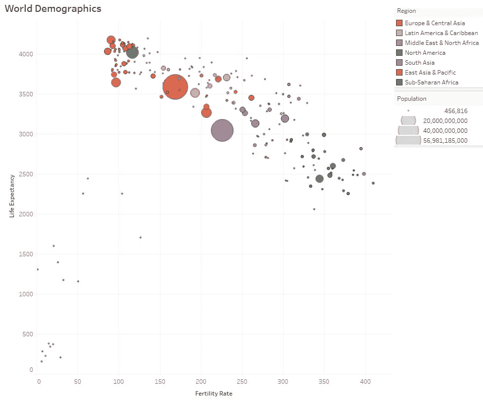
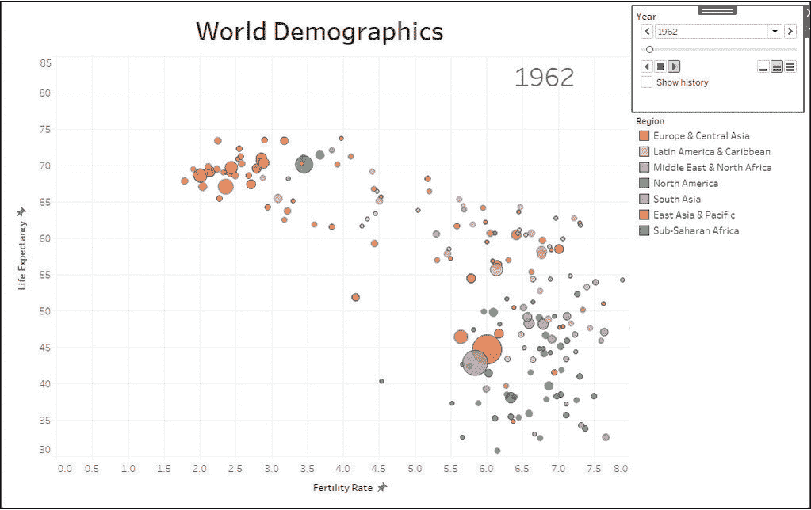
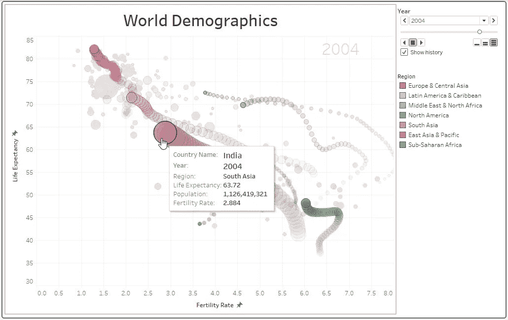

# 在 Tableau 中创建强大的动画可视化

> 原文：<https://towardsdatascience.com/creating-powerful-animated-visualizations-in-tableau-ff30a0d861c2?source=collection_archive---------24----------------------->

Tableau 是一个很好的数据分析和可视化工具。它有一些强大的工具，使可视化的吸引力和互动性。其中一个很棒的功能是动画数据可视化。让我们通过一个有趣的案例研究来探索这是如何实现的(*礼貌:Udemy* )。

> 我们将分析世界人口统计数据(*礼貌:Udemy* )来理解 Tableau 中的动画可视化。这一分析的目的是通过可视化了解 53 年来全球生育率和出生时预期寿命的变化。数据因国家而异，并进一步按地区分类。分析所考虑的时间段在 1960 年至 2013 年之间。

第一步是创建一个基本图表。我制作了一个气泡图，根据不同地区绘制了特定人群的出生时预期寿命与生育率之间的关系。

在此图表中，颜色用于识别不同的区域，分为 7 个类别。气泡大小用来表示人口。这张图表显示了整个 53 年间的总体生育率和出生时的预期寿命。**同样的可视化可以转换成令人惊叹的 5 维动画图表，显示给定时间段内的动态数据。**

为了实现这一点，需要将所需的维度(Year)从主数据源中拖出来，放在“Pages”网格中。所有年份字段都会自动映射到图表中。年份图例与视频控件一起出现，用于管理动画速度和其他属性。

可以添加许多有趣的功能来增强动画可视化。他们中的一个在图表中留下了痕迹。通过选择“显示历史”复选框，用户可以显示给定时间段内的数据轨迹。将鼠标悬停在每个踪迹点上，用户可以看到特定年份的人口统计信息。这个特性对于只标记选定区域的历史数据非常方便。

可以添加注释来指示动画图表中变化的时间段。动画速度可以控制在 3 个级别之间。也可以循环连续播放。可以修改工具提示数据，使图表对用户一目了然。可以增强气泡颜色和大小等图表元素，使图表在视觉上更具吸引力。动画图表现在可以添加到仪表板中了。**它可用于制作强大且令人印象深刻的演示文稿，因为它将所有必需的分析信息打包在一个图表中。**

在从一年到下一年的气泡运动过程中，随着气泡尺寸的变化，用户可以容易地看到和理解人口统计的变化。历史线索有助于更清楚地分析数据。

这就是简单的图表如何在 Tableau 中在几分钟内转换成美丽的动画可视化效果。