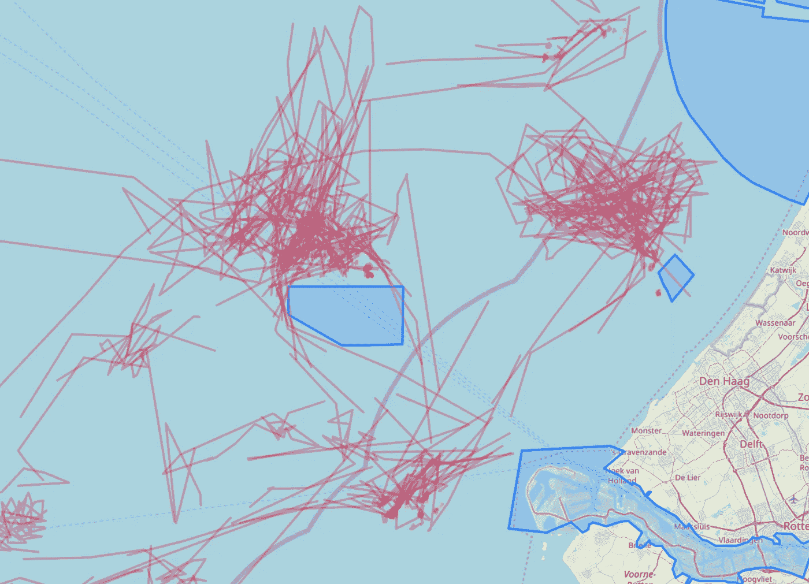
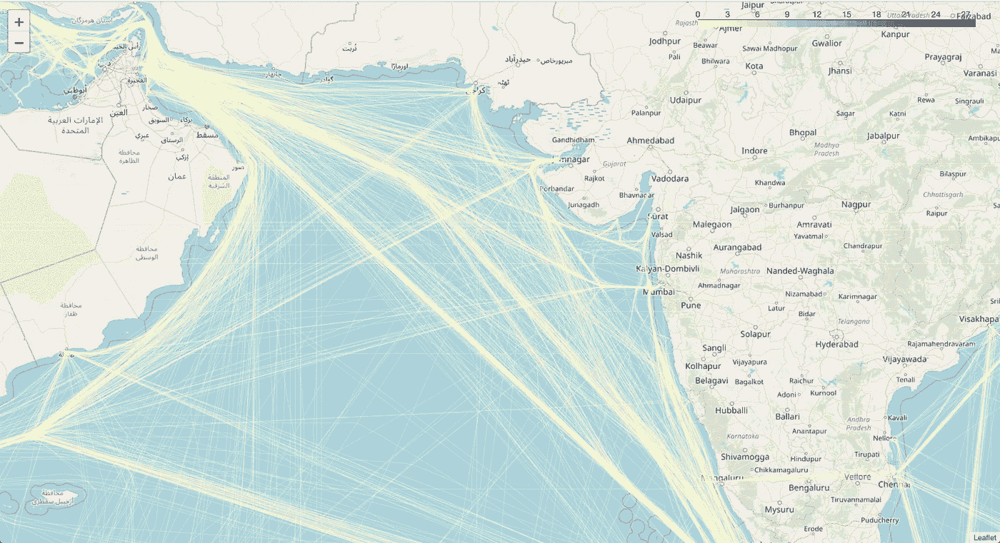

# 从 AIS 数据的海洋中创建海上航线。

> 原文：<https://towardsdatascience.com/creating-sea-routes-from-the-sea-of-ais-data-30bc68d8530e?source=collection_archive---------11----------------------->


海上航线是海上运输的重要特征。有时它们被官方指南[“交通分隔方案”](https://en.wikipedia.org/wiki/Traffic_Separation_Scheme)明确定义，有时它们更多的是建议。国际海事组织负责航道系统，包括分道通航制，并在国际海事组织出版物*船舶航道* —目前为 2013 年版中发布。不幸的是，它们没有被数字化。

一些商业和免费增值产品是可用的，它们提供距离，有时在每条路线的基础上提供港口之间的路线。在撰写本文时，我们无法找到一个全面的离线路线库。所以[我们](http://mariquant.com)决定建造自己的。

[**自动识别系统** ( **AIS** )](https://en.wikipedia.org/wiki/Automatic_identification_system) 使用的是几乎所有船只上安装的应答器。船只的唯一标识、位置、航向和速度通常定期发送。这些信号可以被附近的船只、卫星和地面天线接收到。有几家公司收集、清理和出售这些数据。

从 2016 年初到 2018 年年中，Mariquant 拥有来自 AIS 数据提供商之一的散货船和油轮的每小时数据。该数据包含来自约 19 000 艘有记录的独特船只的信息，作为未压缩的拼花文件大约占用 100 Gb。

我们有一个多边形库，有大约 8 000 个港口和 20 000 个锚地和等候区。大多数时候，锚泊多边形位于端口多边形之外，我们使用图形算法来确定哪个锚泊属于哪个端口。有了这些数据，我们开始构建路线。

## 抛锚和游荡。

我们将使用轨迹间距离的概念来构建路线的最佳表示，并在同一路线上分离不同的轨迹。大多数距离计算算法使用轨迹上的点之间的距离。我们发现一些噪音阻止我们获得有意义的结果来计算轨迹之间的距离。查看数据，我们发现船只花费大量时间(导致轨迹上的大量点)在港口附近停泊或移动。



Anchoring and ‘loitering’ near Belgium and Netherlands ports.

为了找到轨迹上的至少一些点，我们使用了随机森林分类器的 [scikit learn](https://scikit-learn.org/stable/modules/generated/sklearn.ensemble.RandomForestClassifier.html) [1]实现。有各种方法来寻找血管轨迹上的不同聚类，参见例如[2]和其中的参考文献。我们更喜欢使用稍微简单的方法，因为它易于实现，并为我们提供足够精确的结果。我们使用到港口的距离、到前一个港口的距离、船的速度、船的径向速度(好像绕着港口转)和在到港口的方向上的速度作为分类器的特征。我们人工构建了训练和测试集，分别标记‘游荡’、锚泊、进港和一般航行点。我们在训练中得了大约 6 400 分，在测试集中得了 1600 分。锚点在集合中较少出现，因为它们在距离计算中产生的问题较少。手动标记的困难导致了集合的小尺寸。

[混淆矩阵](https://www.google.com/url?sa=t&rct=j&q=&esrc=s&source=web&cd=1&cad=rja&uact=8&ved=2ahUKEwjr54bNq-jhAhWJMewKHcHjBX8QFjAAegQIARAB&url=https%3A%2F%2Fen.wikipedia.org%2Fwiki%2FConfusion_matrix&usg=AOvVaw1sC8cquKC7ZuBe4qQXFbe5)显示待机、进场和一般航行点被很好地定义。即使进场点和一般航次点被错误识别，错误识别也是在它们之间，而不是兴趣点。

Confusion matrix of the Random Tree Classifier

Precision and recall

[精度和召回率](https://www.google.com/url?sa=t&rct=j&q=&esrc=s&source=web&cd=1&cad=rja&uact=8&ved=2ahUKEwjutMu5rOjhAhVCC-wKHftwAjEQFjAAegQICBAC&url=https%3A%2F%2Fen.wikipedia.org%2Fwiki%2FPrecision_and_recall&usg=AOvVaw23JQgYucFrrlGvYcDKGHER)，以及 F1 评分表明结果是好的，但分类器还有进一步改进的空间。我们必须重申，锚定点对于计算轨迹之间的距离来说不那么麻烦，我们将继续这些结果。

我们发现到港口的距离、到前一个港口的距离、船的速度是最重要的[特征](https://en.wikipedia.org/wiki/Feature_selection)，相应地得分为 0.42、0.21 和 0.28，径向速度和到港口方向的速度得分为 0.04 和 0.05。

可以使用标准的 Scikit-learn 函数来计算上面提到的分数。

```
**from** sklearn.metrics **import** classification_report, confusion_matrix
**from** sklearn.ensemble **import** RandomForestClassifier
**from** sklearn.model_selection **import** train_test_split
X_train, X_test, y_train, y_test = train_test_split(X, y, test_size=0.2, random_state=0)clf = RandomForestClassifier(n_estimators=20, max_depth=6, random_state=0)
clf.fit(X_train, y_train)
y_pred = clf.predict(X_test)print(confusion_matrix(y_test, y_pred))
print(classification_report(y_test, y_pred))
print(clf.feature_importances_)
```

我们发现，无论分类器的得分如何，我们的大数据集都需要额外的清理。有时，进港轨迹的一小部分被错误地识别为游荡部分，我们不得不进行保守检查，要求轨迹的锚泊和游荡部分足够长，或者是自相交的，或者在进港方向上行驶的距离应小于行驶的总长度。

在所有这些检查之后，我们对轨迹的游荡和锚泊部分的船只位置进行平均。

## 路线建设。理论。

我们的方法受到了菲利普·贝斯、布伦丹·吉尤、让-米歇尔·卢贝斯和弗兰克·̧ois·罗耶等人工作的启发[3]。在最初的工作中，作为 Kaggle 竞赛的一部分，作者提出了一种称为“对称段-路径距离”的新方法，用于计算轨迹之间的距离，以聚类滑行航程，预测最终目的地点[4]。文章[3]对轨迹距离计算的各种方法进行了深入描述。

简而言之，我们的方法是

1.  使用某种度量来计算轨迹之间的距离
2.  根据轨迹的距离对轨迹进行聚类。
3.  以选择集群中的“最佳”轨迹。

## 路线建设。练习。

我们测试了不同的距离计算方法，并决定使用带实际惩罚的编辑距离(ERP) [5]。该方法是一种扭曲距离方法，并且允许在不同长度的轨迹之间进行比较，在计算它们之间的距离期间对准轨迹。它在 O(n)时间内运行。该方法的实现是由[3]的作者创建的 [trajectory_distance](https://github.com/bguillouet/traj-dist) 包的一部分。我们稍微修改了这个包来加速 python 部分的计算，并添加了对并行计算的 [DASK](https://dask.org) 支持。由于内存和计算时间的限制，我们最多选择 50 个随机轨迹，因为热门路线上的计算可能会处理数百个轨迹。这将我们引向 43847 条不同的路线，这些路线将从近一百万次旅行中重建。

同一条路线上的不同行程可以有完全不同的轨迹。因此，如果需要的话，我们需要对这些轨迹进行聚类。[相似性传播](https://en.wikipedia.org/wiki/Affinity_propagation)聚类算法是该任务的自然选择，因为它既不需要聚类数量的初始知识，也不需要距离的三角形不等式(并非所有距离计算方法都生成满足该不等式的距离)。我们使用[scikit learn](https://scikit-learn.org/stable/modules/generated/sklearn.cluster.AffinityPropagation.html)【1】实现了亲和传播算法。

## 轨迹的重建

由于 AIS 协议的限制，卫星收集的数据通常会丢失点。我们必须找到解决这个问题的办法。

首先，我们使用考虑轨迹之间的距离(我们使用简单平均)和轨迹中缺失点的数量的成本函数来定义“最佳”轨迹。

第二，我们迭代地更新轨迹:

1.  我们仅使用可用数据找到“最佳”轨迹
2.  我们使用“最佳”轨迹点来增强带有缺失点的轨迹。找到离“最佳”轨迹最近的点，并且将“最佳”轨迹段添加到增强轨迹中。
3.  我们用附加数据迭代 1 -2，直到“最佳”轨迹保持稳定并且成本函数值减小。

在轨迹增强之后，我们将轨迹集合在不同的聚类中进行分割。使用上述迭代方法找到每个聚类内的“最佳”轨迹。我们使用这些轨迹作为港口之间的路线。

## 结果



结果是亚马逊 s3 桶【http://worldroutes.s3.amazonaws.com。在[知识共享署名 4.0 许可](https://creativecommons.org/licenses/by/4.0/legalcode)下，你可以出于任何目的获得和使用它们。你可以在这里获得关于许可证[的信息。](https://creativecommons.org/licenses/by/4.0/)

数据由四个文件组成:

1.  沿路线计算的港到港距离( [distances.csv](http://worldroutes.s3.amazonaws.com/distances.csv) )。
2.  如上所述的港到港路线( [routes.csv](http://worldroutes.s3.amazonaws.com/routes.csv) )。
3.  我们不能为您提供端口多边形，但是，我们提供由我们的内部**索引**、[世界端口索引](https://msi.nga.mil/NGAPortal/MSI.portal?_nfpb=true&_pageLabel=msi_portal_page_62&pubCode=0015)、**索引 _ 编号**和**端口 _ 名称**组成的参考数据(如果有的话，或者我们拥有的任何可用名称)和端口多边形代表点的一个坐标元组。使用 geopandas representative_point()方法( [ports.csv](http://worldroutes.s3.amazonaws.com/ports.csv) )获得港口多边形的代表点。
4.  带世界地图的 HTML 文件([WorldRoutes.html](http://worldroutes.s3.amazonaws.com/WorldRoutes.html))

## 关于 Mariquant

[Mariquant](http://mariquant.com) 是一家专注于分析工具开发的公司。我们相信，在海事行业持续广泛地采用数据驱动的分析方法将会产生巨大的价值。然而，较差的数据质量、覆盖范围和庞大的数据量对许多人来说是一个障碍，导致他们经常走上自上而下的分析之路，其中涉及大量的手动工作。

在 Marquant，我们通过采用亚马逊(Amazon)和谷歌(Google)等公司开发的尖端技术来挑战这些障碍，但同时保持对海事行业需求的高度关注。引入全自动、数据驱动的分析允许扩展到海事中发现的单个案例的数量级，从而允许及时、准确和慎重的商业决策。

## 参考

1.  Pedregosa *等人*，[sci kit-learn:Python 中的机器学习](http://jmlr.csail.mit.edu/papers/v12/pedregosa11a.html)，JMLR 12，第 2825–2830 页，2011 年。
2.  盛、潘、尹静波。[“基于自动识别系统数据的轨迹聚类模型提取航线模式”](https://www.mdpi.com/2071-1050/10/7/2327/htm) *可持续性* 10.7 (2018): 2327。
3.  页（page 的缩写）Besse，B. Guillouet，J.-M. Loubes 和 R. Francois，[“基于距离的轨迹聚类的回顾和展望”](https://arxiv.org/abs/1508.04904) arXiv 预印本 arXiv:1508.04904，2015 年。
4.  [ECML/PKDD 15:滑行轨迹预测(一)](https://www.kaggle.com/c/pkdd-15-predict-taxi-service-trajectory-i/overview/)
5.  长度陈和 R. Ng，“论 LP-规范和编辑距离的结合”，*第三十届国际超大规模数据库会议论文集-第 30 卷*。VLDB 基金会，2004 年，第 792-803 页。