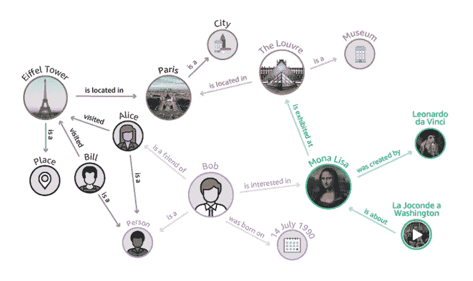
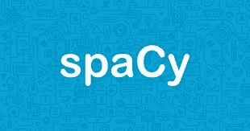

# 使用高级 NLP 库创建智能知识库系统(KBS)

> 原文：<https://towardsdatascience.com/creating-smart-knowledge-base-systems-kbs-using-advanced-nlp-library-b5c21dfafcd1?source=collection_archive---------11----------------------->

Creating and Sustaining Large Knowledge Base Systems(KBS) can be a daunting exercise even for the largest corporations in the world.

企业、机构或任何大型组织通过将知识记录为书籍、期刊/文章、文档等，在其存在的几年中积累了知识。员工、学生、教学/研究团体持续获取这些知识对于持续运营至关重要。市场上的 KM(知识管理)工具通过创建各种知识库并允许访问它，在一定程度上帮助解决了这种需求。知识管理工具要求对文档进行标记(手动或自动),以便用户可以方便地搜索到它。虽然这些工具有其用途，但组织在数字时代面临着新的挑战-

1.  获取知识库中的上下文和语义信息
2.  即时获取信息的能力。
3.  需要一种自动化和持续的方法来创建这样一个系统

## 现状场景

A search result like this may not serve the purpose all the time

企业知识管理解决方案可以根据用户的查询帮助用户找到所有相关文档。但是这很难满足用户的需求，因为现在用户已经(比如说)访问了 10 个文档，他必须通读它们才能得到他正在寻找的信息。对于实时项目、研究社区等中的用户来说，这可能仍然是一项乏味且令人沮丧的任务，因为它会导致获取信息的延迟。

## 未来情景

What information can I get for you today?

从知识库中获取信息的未来场景可能就像向聊天机器人询问所需的确切信息一样简单。例如，“某项技术在多少个项目实施中使用过？”类型的查询会立即返回一个答案。虽然这对大多数人来说可能听起来太好了，不像是真的，但深度学习和自然语言处理框架的技术进步已经使这样的解决方案变得可行。此外，由于人工智能技术的民主化和人工智能开源项目的健康生态系统，这样一个未来的解决方案现在已经在小型和大型企业的掌握之中。

## 聊天机器人背后的精灵是谁？

很明显这一切背后并没有什么精灵。但我认为，象征性地说，一大群不懈地为 NLP 的 ML & AI 前沿工作做出贡献的研究科学家和研究机构是使这成为可能的天才，我们都应该集体感谢他们的努力。解决方案是这样的。

Knowledge Graph (Illustration)

聊天机器人被集成到一个巨大的图形数据库中，该数据库捕获关于各种实体的信息，例如作为节点的个人、公司、位置、技术名称等，以及作为边的所有实体之间的关系和关联。例如，在句子“公司 X *使用 XYZ*技术”中，“使用”是存在于实体 X & XYZ 之间的关系，并且被存储为边缘。此外，关于实体和关系的所有其他相关信息分别存储为节点和边的属性。我们受到谷歌如何使用知识图表来存储和检索信息的启发。从本质上来说，这个解决方案可以被认为是在大量知识上构建一个类似于语义搜索引擎的 google，用于即时检索。

Open source library from Explosion.ai

解决方案的最关键部分或核心是从自然语言中确定哪些是实体以及它们之间的关系。这是由 spacy.io 等 NLP 库提供的，这些库使开发人员能够在任何自然语言文本上训练定制的 NER(命名实体识别)和依赖解析器模型。这些模型的结果是良好识别的实体和它们的关系，捕获文档中实体和关系之间的语义上下文。实体之间的这种语义知识然后被馈送到知识图。

一旦上述流程流被自动化到管道中，知识图就可以在处理后续文档时吸收未来的添加或重叠。当它识别同一个实体时，它会重用它，并且只有当它对知识图来说完全是新的时候才创建新的实体。通过这种方式，知识库可以在未来以可持续的方式为所有后续添加内容进行有机增长，同时保留与现有知识的关系。

## 挑战和其他考虑

如同任何技术一样，实施智能知识库系统(KBS)有其自身的一系列挑战。

1.  *变革管理* —该解决方案需要企业中文档数字化和处理的新流程，需要组织中知识型中小企业的积极参与，更不用说这可能还需要在组织中创建新的角色
2.  *垃圾进垃圾出*——这是一句著名的谚语。因此，确保文档的数字化和信息的准确提取对于该计划的成功至关重要。此外，需要准确标记实体&关系
3.  *并非所有组织都需要这种解决方案*，因为信息提取的延迟不是一个巨大的障碍，所以投入时间&资源可能会被证明是违反直觉的
4.  *数据科学团队* —必须有一个经验丰富的数据科学团队来监督实施，即使这意味着从外部聘请专家
5.  *技术基础设施* —该解决方案需要在本地或云技术基础设施上进行合理的重大投资。如果您已经与任何云服务提供商建立了持续的关系，那么针对这一需求的供应将是无缝的
6.  *最后*，甚至在设计阶段就让最终用户参与到解决方案中，以鼓励大规模采用，并避免在后期出现任何不匹配的期望

*喜欢我的文章吗？请点击拍手按钮帮助其他人也找到它，请查看我的*[*Raj Kumar Kaliyaperumal*](https://medium.com/u/dfa0bc4e05aa?source=post_page-----b5c21dfafcd1--------------------------------)*下面的其他热门帖子*

1.  [*从商业智能到数据科学&机器学习*](/from-business-intelligence-to-data-science-94a1fd866231)
2.  [ML&DL 学习路径 ](/ml-dl-learning-path-66edc2e5bd91)

*我在*[*Linkedin*](https://www.linkedin.com/pulse/creating-smart-knowledge-base-systemskbs-using-nlp-kaliyaperumal/)*上发表了这篇文章。*