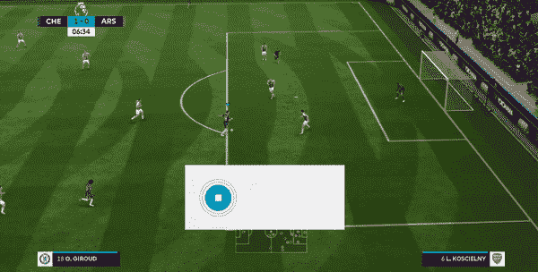

# 为游戏创建语音助手(国际足联教程)

> 原文：<https://towardsdatascience.com/creating-voice-assistant-for-games-tutorial-for-fifa-71cfbe428bd1?source=collection_archive---------21----------------------->

## 使用深度学习驱动的唤醒词检测引擎，通过语音命令玩游戏。


Enabling the “rainbow flick” skill in the game by giving voice command “flick right”.

像亚马逊 Alexa 和谷歌 Home 这样的语音助手已经广泛流行，用于自动化和简化日常任务的执行。它们允许用户通过使用他们的声音快速完成事情，而不必通过他们的手机或电脑进行多次交互。

它们越来越受欢迎，最近被广泛采用，这在很大程度上要归功于语音识别技术的进步，这是由深度学习的进步推动的。


Popular voice assistants: Amazon Echo, Anki Vector and Google Home Mini.

我想探索我们如何利用这项技术，通过添加一种新的输入方法来配合传统的游戏手柄控制系统，从而改善我们的游戏体验。因此，我为足球/橄榄球模拟游戏 FIFA 创建了一个语音助手，它可以改变你的球队的战术，或者在比赛中表演技巧动作和庆祝进球，所有这些都只需要语音命令。

在本教程中，我将介绍如何为 FIFA 重新创建相同的命令，但你也可以按照相同的步骤创建自己的自定义语音命令，并将其添加到任何你喜欢的游戏中！

# 动机:我为什么选择国际足联？

如果你像我一样多年来一直在玩国际足联，你会知道为了改变游戏中的战术你需要记住不同的组合键。要在游戏中改变阵型或替换球员，你需要暂停游戏并进入菜单，这打破了游戏的流程，变得非常烦人，尤其是在在线模式下。此外，对于不同的目标庆祝，需要记住更多的组合键，而你通常只能记住其中的几个。游戏技巧也是如此，给出了近百种不同的组合键来记忆。


What if you could simply activate these skill moves by speaking out their names to a voice assistant without having to remember the 100 different key combinations?

我们先来看看语音识别引擎在语音助手中是如何工作的。

# 语音识别算法是如何工作的？

假设我们想要检测唤醒词“Okay EA”。


Converting raw audio to text using an RNN.

我们从麦克风捕捉原始音频，并将其转换为声音中不同频率频谱的可视化表示，称为声谱图。这是受人类的耳朵如何捕捉音频的启发。接下来，我们将该谱图的薄片作为连续时间步长馈送给递归神经网络模型。该模型被训练来预测在该时间范围内说出字符的可能性。将这样的可能性放在一个序列中给我们音频输入中所说的单词的文本形式，从而将语音转换为文本。

我们将使用名为 [Porcupine](https://github.com/Picovoice/Porcupine) 的库，该库声称利用这样的深度学习模型来执行对关键词的实时检测，我们可以使用这些关键词来识别语音命令。克隆下面的库，我们将使用它来创建自定义语音命令。

[](https://github.com/Picovoice/Porcupine) [## 皮科语音/豪猪

### 由深度学习支持的设备上唤醒词检测。-皮科语音/豪猪

github.com](https://github.com/Picovoice/Porcupine) 

# 辅导的

在本教程中，我将展示我们如何创建一个自定义的唤醒词(如“Alexa”或“Okay Google”)，然后发出命令在游戏中执行技能移动。

## 步骤 1:创建自定义语音命令

从克隆的 porcupine 存储库的主目录，在终端中运行以下命令，创建一个唤醒词检测文件来激活助手。我用的是“Okay EA”(因为 EA 是 FIFA 系列的发行商)。该命令生成的文件将存储在名为 output 的目录中。

```
tools/optimizer/windows/amd64/pv_porcupine_optimizer -r resources/ -w "Okay E A" -p windows -o output/
```

接下来，创建执行“彩虹轻弹”技能移动的命令。

```
tools/optimizer/windows/amd64/pv_porcupine_optimizer -r resources/ -w "flick right" -p windows -o output/
```

这会给我们两个*。输出目录中的 ppn* 文件。

## 步骤 2:设置豪猪检测引擎

## 步骤 3:从麦克风设置实时命令检测

从[这里](https://github.com/ChintanTrivedi/DeepGamingAI_FIFAVA/blob/master/directkeys.py)下载帮助文件 directkeys.py。这个文件帮助模拟键盘按键，以便 python 脚本可以与游戏交互。然后，执行以下命令，在连续循环中检测关键字，并在检测到适当的命令时激活相关的技能移动。

请注意，第 38 行到第 48 行需要匹配游戏中执行技能移动所需的按键。您可以通过使用它们各自的组合键来添加更多这样的移动。

这就是全部，你现在可以使用这个脚本来检测语音命令并激活游戏中的技能！在我的 GitHub 库下面找到更多支持动作的完整代码。

[](https://github.com/ChintanTrivedi/DeepGamingAI_FIFAVA) [## ChintanTrivedi/DeepGamingAI _ FIFA va

### 国际足联(windows 平台)游戏的语音助手，用你的声音控制游戏动作。…

github.com](https://github.com/ChintanTrivedi/DeepGamingAI_FIFAVA) 

# 结果

## 进球庆祝:



Using the command “work out” to perform a goal-scoring celebration.

## 在比赛中改变战术:


Using the command “high pressure” to change tactics of how the team plays the match.

更多这样的结果可以在我的 [YouTube 频道](http://youtube.com/c/DeepGamingAI)上找到，视频嵌在下面。

## 结论

如果 EA 能在未来的 FIFA 版本中加入这样的语音助手就太好了。发出类似于*“用佩德罗替换威利安”*或*“将阵型改为 4–4–2”*的命令，就可以立即看到比赛中的变化，而不必进入暂停菜单。此外，制作这样的语音助手可以简化游戏中的控制，并可以作为休闲游戏玩家的完美补充输入方法。

你们是怎么想的，是想用语音作为一种额外的输入方式来控制游戏，还是对现有的游戏手柄控制感到满意？下面让我知道！

感谢您的阅读。如果你喜欢这篇文章，请在[媒体](https://medium.com/@chintan.t93)、 [GitHub](https://github.com/ChintanTrivedi) 上关注我，或者订阅我的 [YouTube 频道](http://youtube.com/c/DeepGamingAI)。哦，还有 2019 新年快乐！