# 用 D3 Observable 创建 Web 应用程序

> 原文：<https://towardsdatascience.com/creating-web-applications-with-d3-observable-d5c53467ff12?source=collection_archive---------11----------------------->

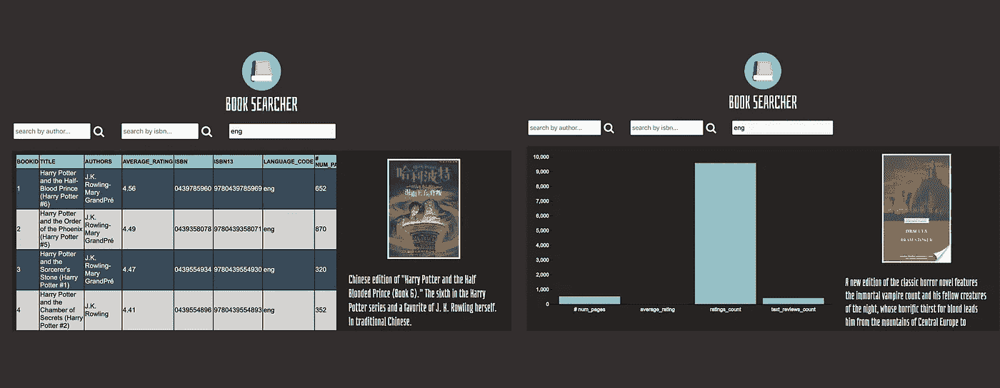

# 什么是 D3 可观测？

我以前写过关于将 D3 引入 web 应用程序的文章[这里](/combining-d3-with-kedion-graduating-from-toy-visuals-to-real-applications-92bf7c3cc713)，看看如何将 D3 视觉效果绑定到 UI 元素。目的是鼓励超越独立的视觉效果，让人们原型化更完整的应用程序。真正的应用程序会征求反馈，因为它们使用了*，帮助我们验证超出常规统计方法的分析。在我看来，如果你没有在构建一个真正的产品，你就没有真正在学习/做数据科学。*

*前一篇文章仍然有效，但是 D3 正朝着它所谓的**可观察**(正式名称为 d3.express)的方向转变。Observable 提供了一个各种各样的游乐场，允许用户在一个*笔记本*中在线修改 D3 代码。对于那些使用 Jupyter 笔记本的人来说，你会发现体验是相似的。它本质上是一个做 D3 的 REPL。*

*Observable 向真正的开发开放了 D3，因为它现在提供了*下载您定制的 D3 visual 作为一个独立的“包”*(一个 tarball 文件)，您可以将它嵌入到您的应用程序中。Observable 自带[运行时](https://github.com/observablehq/runtime)和[标准库](https://github.com/observablehq/stdlib)，为使用 **HTML** 、 **SVG** 、**生成器**、**文件**和**承诺**提供了有用的功能。*

*以下是可观察到的**文档**:*

*[](https://observablehq.com/@observablehq/user-manual) [## 可观察:用户手册

### 可观察:用户手册👋欢迎来到 Observable -网络神奇笔记本之家！有很多东西要学…

observablehq.com](https://observablehq.com/@observablehq/user-manual) 

…以及一篇关于他们方法的自以为是的文章:

[](https://medium.com/@mbostock/a-better-way-to-code-2b1d2876a3a0) [## 更好的编码方式

### 介绍 d3.express:集成发现环境。

medium.com](https://medium.com/@mbostock/a-better-way-to-code-2b1d2876a3a0) 

你可以在这里找到**视觉效果** [的例子，你可以立即在你的浏览器中开始玩。当您希望创建新的可视化效果时，请访问以下网站，选择一个项目，根据需要编辑可视化效果，并嵌入到您的应用程序中。](https://observablehq.com/)

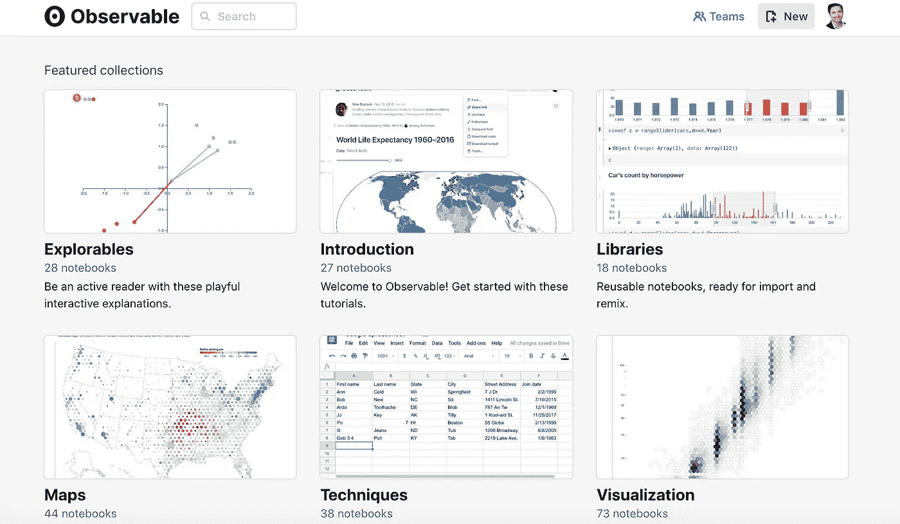

# 概观

在本文中，我们将探讨以下主题:

*   创建一个快速的应用程序**布局**基于 2 个简单的样机；
*   为我们的应用程序的 UI 元素制作组件；
*   **在我们的 app 内嵌入** **可观察**；
*   **在我们的 app 和 Observable 之间发送** **数据**；
*   使用**谷歌的图书 API** 。

你可以在这里查看简单应用[。](https://collaboratescience.com/stack/medium/d3_obs_medium/)

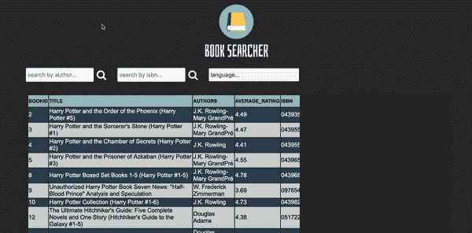

Figure 1

让我们开始吧。

# 应用程序

让我们制作一个简单的应用程序，它使用 Kaggle 上托管的 [**Goodreads 数据集**](https://www.kaggle.com/jealousleopard/goodreadsbooks) 来允许人们探索书名。数据集列出了书名、作者、ISBNs 和一些简单的特性，比如评级。

## 模型

我们将允许用户查看原始数据的表格，并提供过滤功能，以便用户可以通过**作者**、 **ISBN** 号和**语言**来搜索表格。

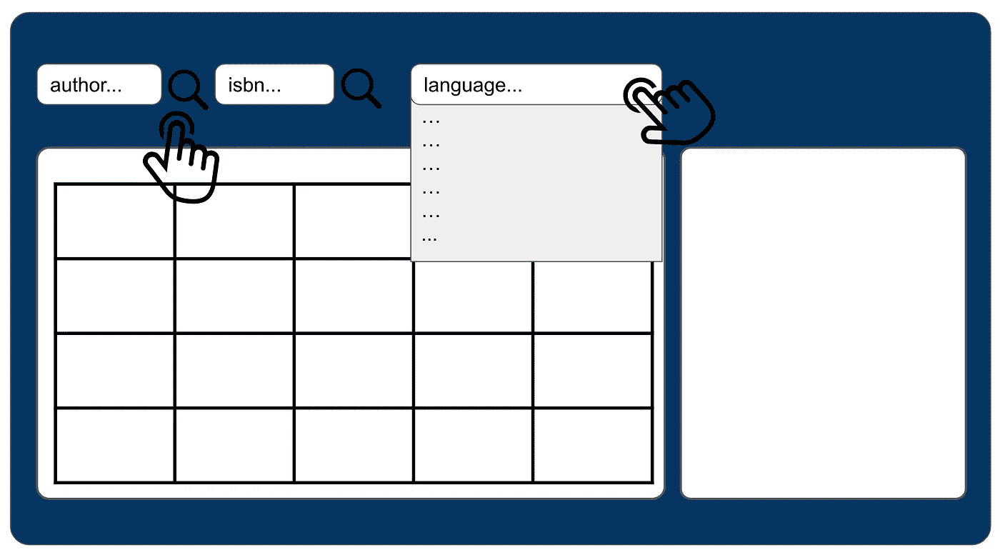

Figure 2

我们还将从[谷歌的图书 API](https://developers.google.com/books/) 中获取图书属性，并在条形图中展示它们。该 API 还提供了所选图书的图片 URL，因此当用户通过 ISBN 搜索时，我们将显示图书封面:

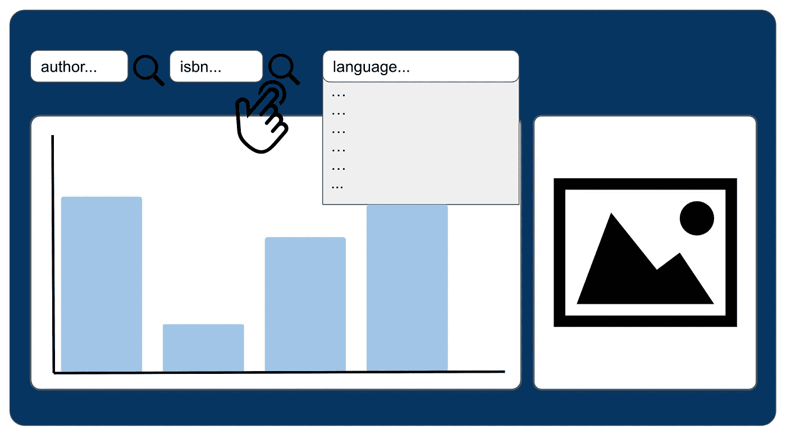

Figure 3

我们将使用 [Azle](https://azlejs.com) 把 Observable 和 Google 的 Book API 缝合成一个真正的应用程序。

## 目录结构

我们首先为我们的应用程序创建下面的**目录结构**:

```
**app**
├── **data** ├── **scripts** ├── **d3_visuals** ── **table** ── **bar_chart** ├── index.html
```

粗体名称是空文件夹，index.html 文件是通常的 Azle 起点:

codeblock 1

我们将在本文中添加所需的文件。现在**通过在终端会话中运行以下命令，在 **app** 文件夹中启动一个简单的 web 服务器**:

```
python3 -m http.server
```

…然后将您的浏览器指向**本地主机**:

```
[http://localhost:8000](http://localhost:8000/)
```

# 步骤 1:创建应用程序布局

我将使用 Azle 来创建我的应用程序的框架。我创建 Azle 是因为它使用快速、易于理解、轻量级、灵活且免费，并且使得将库和框架缝合在一起变得容易。但是你可以使用任何你喜欢的 JS 工具。

## 1.1 创建应用程序布局

我们使用 Azle 的 **az.add_layout** 函数创建布局。这就是我们如何在页面上创建网格。我将把我的布局代码放在 Azle 的 index.html 文件中:

codeblock 2

通读上面的代码，你可以很容易地知道页面是如何构建的。每个 Azle 函数都带一个“ **target_class** 和 **target_instance** 来向 DOM 添加元素。它还接受一个具有*属性*的对象。如果我们添加一个元素，它是一个**内容对象**，如果我们设计一个元素，它是一个**样式对象**(通常的 CSS 样式)。

上述代码产生以下内容:

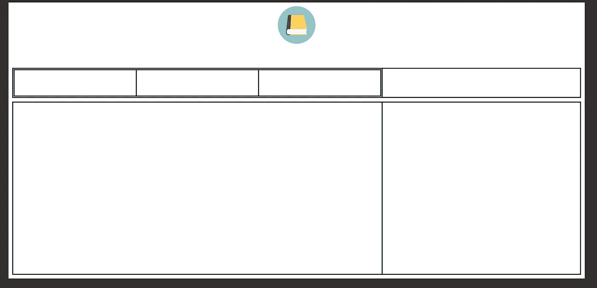

Figure 4

我们可以看到布局如何允许我们通过在屏幕上划分区域来定位元素。让我们给我们的主体部分涂上颜色，这样它就能和身体的颜色融为一体了。我们将通常的 CSS 样式作为属性传递给样式对象:

```
**az**.**style_sections**('my_sections', 1, {
  "background": "rgb(51, 47, 47)",
  "height": "auto"
 })
```

让我们也添加一个深色的背景，我们的视觉 _ 布局:

```
**az.style_layout**('visual_layout', 1, {
  "align": "center",
  **"background": "rgb(39, 36, 36)"**,
  "border-radius": "4px",
  "height": "460px",
  "margin-top": "10px",
  "column_widths": ['65%', '35%'],
  "border": 3
 })
```

现在我们的应用程序看起来像这样:

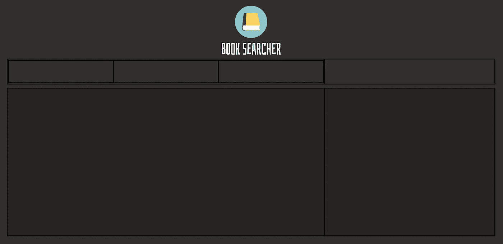

Figure 5

我们所有的布局单元格都在等待它们的内容。这就是组件出现的地方。

## 1.2 创建应用程序组件

组件由 UI **元素**、**样式**和**事件**组合而成。这就像将创建应用程序特定部分所需的所有代码打包在一起。例如，如果我们想在我们的应用程序中有一个日历，我们将创建一个日历组件，并将其放置在我们的布局单元格之一。

创建组件使我们的代码模块化，易于重用，易于维护，并使我们能够在想法改变时更容易地调整应用程序。虽然我们将在 Azle 中创建我们的组件，但这些也可能是添加到 Azle 布局中的 [React](https://reactjs.org/docs/add-react-to-a-website.html) 组件。

从上面的模型中，我们知道我们需要搜索栏、图标、下拉菜单、图像和 D3 视觉效果。展示我们如何为这个应用程序创建每个组件超出了本文的范围。你可以在这里查看**完整应用代码** [。我们将在本文中创建几个主要的。](https://github.com/sean-mcclure/book_searcher)

我们将所有组件代码放在 **az.components** 对象中:

```
az.components = {}
```

创建一个名为 **component.js** 的文件，并添加以下代码:

codeblock 3

看起来很多，但读起来很容易。注意我们如何首先添加和样式化一个**布局**，就像我们上面做的一样，这一次是为了保存我们的输入框和搜索图标。然后，我们将一个**输入**元素添加到第一个布局单元格中，并将搜索**图标**添加到第二个布局单元格中。最后，我们将一个**事件**添加到我们的搜索图标中，这样当用户点击它时，就会发生一些事情。

不要担心在我们的点击事件中发生的所有事情，我们会在嵌入 D3 视觉效果后解决这些问题。现在让我们创建组件，为我们的应用程序添加 D3 视觉效果。下面是**表**的例子:

codeblock 4

它看起来有点*回调地狱*，但它是可读的。我们添加并样式化一个 iframe，等待 iframe 完成加载，确保完整的数据集可用，然后将我们的消息发送到 iframe。消息发布是我们与 D3 交流的方式。我们将在下一节讨论这一点。

添加组件的方式与 Azle 向应用程序添加元素的方式相同:

```
**az.components.d3_table**(target_class, target_instance)
```

因此，上面的代码行将我们的 iframe 添加到我们的应用程序框架的一个单元中。这些框架中还没有任何视觉效果可以显示，所以让我们去抓取我们可观察到的视觉效果，然后我们将它们定位到它们适当的单元格中。

# 步骤 2:在应用程序中嵌入 D3

嵌入 Observable 非常简单，只需下载所需视觉对象的 tarball，然后在 iframe 中托管其 index.html 文件。这并不是将 Observable 引入应用程序的唯一方法，但是它很快，并且对于快速原型开发很有效。

## 2.1 从可观察的事物中获得视觉效果

我们需要一张**表**和**条形图**。这些都可以在网上搜索到:

[](https://observablehq.com/@pstuffa/tables-with-nested-data) [## 带 D3 的基本表

### 普斯塔法的可观察的笔记本。

observablehq.com](https://observablehq.com/@pstuffa/tables-with-nested-data) [](https://observablehq.com/@d3/bar-chart) [## 条形图

### 条形图这个图表显示了英语中字母的相对频率。这是一个垂直条形图…

observablehq.com](https://observablehq.com/@d3/bar-chart) 

我们**通过点击右上角的 3 个点下载** **他们的** **tarballs** :

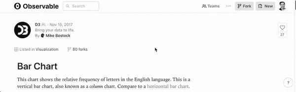

Figure 6

下载完成后，解压压缩包并**放入各自的文件夹:**

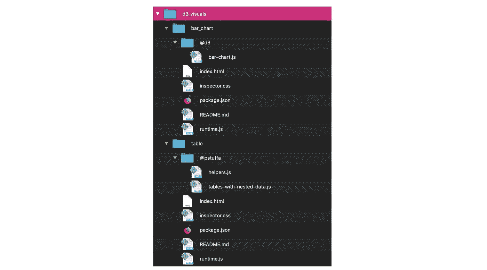

## 2.2 在 App 和 D3 之间建立通信

我们需要我们的应用程序与我们可观察到的视觉效果进行交流。在上一节中，我们提到了使用**az . post _ message _ to _ frame**来做这件事。下面是函数:

codeblock 5

Azle 的 post_message_to_frame 允许我们的应用程序在 iframe 内部发送数据和函数(只要所有东西都在同一个服务器上，就不会有 CORS 问题)。

**main.redefine** 来自可观察本身，也是我们如何*在 D3 可视化*中重新定义变量和数据。D3 表以名为“fakeData”的数据对象开始，因此我们需要用 Kaggle 数据集中的图书数据替换它。你会注意到我们传入了一个名为 *filter_by_author* 的父函数，而不是数据本身。我们稍后会讨论这个问题。

这个等式的另一半是 D3 如何接受发布的消息。为了让托管的可观察对象接受来自应用程序的传入消息，我们必须**向可观察对象的 index.html 文件**中添加一个事件监听器:

codeblock 6

Azle 图书馆在最上面:

```
<script src='[https://azlejs.com/v2/azle.min.js'](https://azlejs.com/v2/azle.min.js')></script>
```

所以我们的 D3 表 index.html 文件应该是这样的:

codeblock 7

为了清楚起见，我们将向该文件添加:

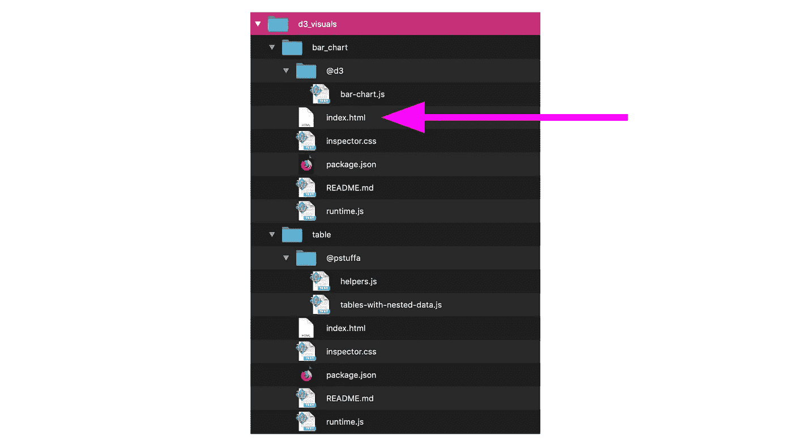

这种通信是可行的，因为我们使用 Azle 的 **post_message_to_frame** 在我们的框架内发送 Observable 的 **main.redefine** ，此时我们的框架接受该消息并执行 **parent.filter_by_author** 函数(如代码块 5 所示)。下图描述了这个概念:

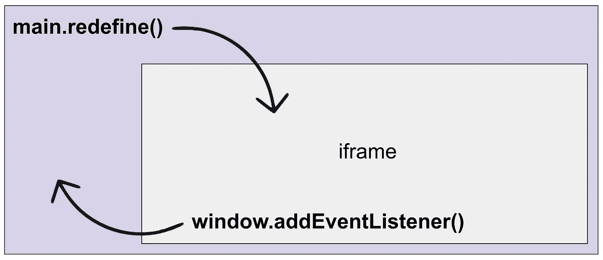

Figure 7

在我们讨论父函数之前，让我们来设计一下 D3 的视觉效果。

## 2.3 向 D3 Observable 添加样式

因为我们下载了整个笔记本，所以会有我们不希望在应用程序中出现的笔记本单元格(它们用于将视觉效果调整为 REPL)。我们应该移除那些细胞。

我们可以通过**删除【Observable 的**index.html 文件中的下面一行:****

```
const main = runtime.module(define, Inspector.into(document.body));
```

包含以下内容:

```
const main = runtime.module(define, name => {
  if (name == 'chart') {
    return new Inspector(document.body)
  }
});
```

这样只会画出图表。

我们也可以**设计 D3 视觉效果**让它看起来更现代。检查表文件夹中的**table-with-nested-data . js**文件。比较原始文件和我在这里准备的文件，看看我添加的样式。

codeblock 8

区别在于:

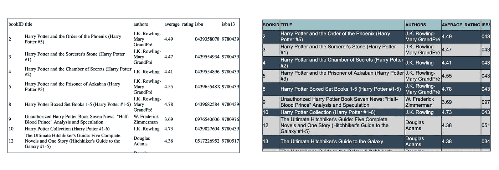

如果您检查 bar_chart 文件夹中的 **bar-chart.js** 文件，您会看到类似的变化。

# 步骤 3:创建父函数

我们上面提到了父函数的使用。在图 7 中，我们看到了我们的应用程序和 Observable 之间的双向通信。父函数是我们在应用程序中从可观察对象调用函数*的方式。*

我们希望 Observable 使用新的、经过过滤的数据重新绘制它的 D3 视图。因此，我们将使用从 iframes 内部调用的函数来过滤原始数据集(我们之前读到的)。

**创建一个名为 **parent_functions.js** 的文件**，放在 scripts 文件夹中:

```
**app**
├── **data** ├── **scripts** ── parent_functions.js
├── **img** ├── **d3_visuals** ── **table** ── **bar_chart** ├── index.html
```

下面是前 3 个父函数，它们返回完整的数据集、按语言过滤的数据或按作者过滤的数据。

codeblock 9

我们的框架将通过代码块 6 调用这些函数，并用新返回的数据替换默认的可视化数据集。

# 步骤 4:定位我们的组件

至此，我们已经基于实体模型构建了一个简单的应用程序布局，精心制作了组件，在包含 main.redefine 的组件中设置了单击事件，向 D3 索引文件添加了事件处理程序，并创建了用于返回完整和过滤数据的父函数。此外，我们有我们的 D3 可视图像在他们的文件夹中等待。

D3 部分剩下的就是**将我们的组件放入它们的目标单元**。我们像任何其他 Azle 函数一样，使用目标布局单元格的 *target_class* 和 *target_instance* 来定位我们的组件。

首先，我们需要将数据集加载到应用程序中。

我下载了 CSV 格式的 Kaggle Goodreads 数据集，然后使用在线转换器将其转换成 JSON。然后我下载了新的 JSON 文件，并保存到我们的 app 目录的 data 文件夹中，命名为 **books.json** 。

现在我们可以使用 Azle 的 **read_local_file** 函数来读取我们的数据集。将它放在 index.html 文件的顶部:

codeblock 10

我将数据保存为一个名为 az.hold_value.full_dataset 的新对象。可以使用 az.hold_value。[变量名称]使任何变量或对象在 Azle 名称空间内全局可用。请注意，我还对数据进行了“切片”，以限制应用程序中显示的行数。您可以删除它以显示所有数据(或者更好的是，创建一个允许用户控制加载多少行的组件:)

现在，我将使用 Azle 的 **call_once_satisfied** 函数来确保在调用我们的组件之前已经加载了完整的数据集:

codeblock 11

一旦定义了现有数据对象的条件，这将把所有组件添加到我们的应用程序布局中。

我们的**表**看起来是这样的:

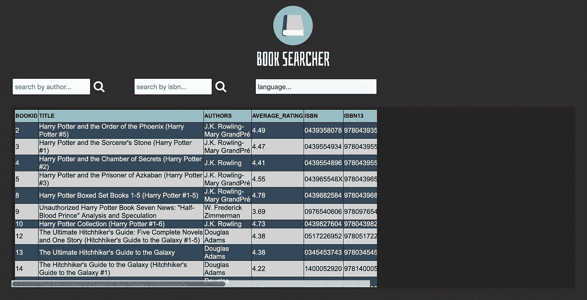

如果你玩[应用](https://collaboratescience.com/stack/medium/d3_obs_medium/)，你会看到用户可以通过作者姓名和语言过滤 D3 表格。许多 B2B 应用程序受益于这种功能。

当用户通过 ISBN 搜索时，我们仍然需要实现我们的原型承诺，显示信息的条形图和书的封面。让我们现在做那件事。

# 步骤 5:调用 Google 的图书 API

如前所述，我们可以使用免费的谷歌图书 API 从 ISBNs 获取图书封面。快速的谷歌搜索会让我们看到显示如何使用它的堆栈溢出答案(通常比通常的文档更快):

[](https://stackoverflow.com/questions/7908954/google-books-api-searching-by-isbn) [## 通过 ISBN 搜索谷歌图书 API

### 我试图弄清楚如何使用谷歌图书 API 通过 ISBN 搜索一本书。我需要写一个程序…

stackoverflow.com](https://stackoverflow.com/questions/7908954/google-books-api-searching-by-isbn) 

我们希望条形图和图书封面出现在用户通过 ISBN 搜索后。如果您查看 components.js 中的 **search_by_isbn** 函数并检查它的 click 事件，您将会看到这是如何处理的。

当用户粘贴 ISBN #并点击搜索图标时，会发生 4 种情况:

*   调用 **fetch_book_cover** 组件；
*   使用 **az.style_iframe** 中的 CSS display 属性切换 iframe 的显示；
*   一条**消息被发送**到保存条形图的 iframe，数据由 ISBN 过滤；
*   伴随条形图调用 **add_chart_buttons** 组件。

**fetch_book_cover** 组件解析从 Google 的 Book API 返回的数据，并检索所需的图片 URL:

```
data.items[0].volumeInfo.imageLinks.thumbnail
```

…在我们将图书封面添加到应用程序时，我们可以将它用作图片 URL:

```
**az.add_image**('visual_layout_cells', 2, {
     "this_class": "cover_img",
     "image_path": data.items[0].volumeInfo.imageLinks.thumbnail
})
```

如果你查看应用程序代码的 **component.js** ，你会看到一个调用谷歌图书 API 的函数。它使用 Azle 的 **call_api** 函数以及以下 URL:

```
"https://www.googleapis.com/books/v1/volumes?q=isbn:" + **az.grab_value**('search_isbn_bar', 1)
```

这只是将 API url 和用户添加的 ISBN 连接到类名为“search_isbn_bar”的输入字段。

用户因此可以从表格中复制一个 ISBN 号，并将其粘贴到*通过 isbn* 输入字段进行搜索，这将绘制**条形图**并显示该书的**封面**:

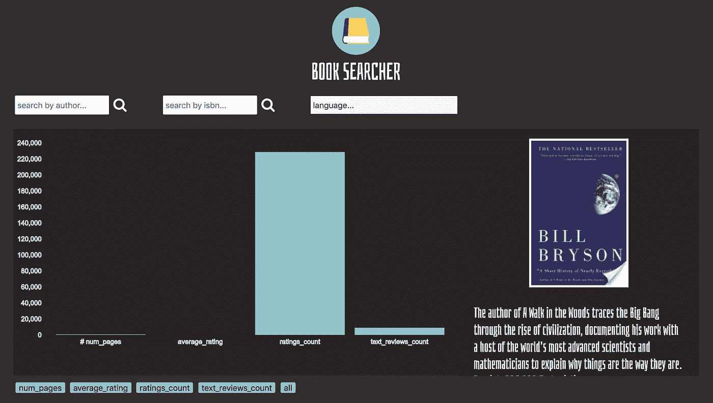

用户还可以使用条形图下方的细按钮来更改条形图视图。这里又是 app gif:


如前所述，您可以通读完整的代码库，看看完整的应用程序是如何构建的。如果你看到一个看起来不熟悉的函数，参考 Azle 的[文档](https://azlejs.com)。本文想要展示将 D3 Observable 引入一个真正的 web 应用程序所需的核心部分。

# 摘要

在本文中，我们研究了在 web 应用程序中嵌入 D3 Observable。我们使用 Azle 将 Observable 和 Google 的 Book API 结合在一起，创建了一个真正的应用程序，允许用户搜索和浏览书名。

我们的任务包括基于 2 个简单的**实体模型**创建一个快速布局，制作并定位**组件**，在框架中嵌入一个可观察的**表格**和**条**图表，使用**消息** **发布**和**事件** **处理程序**在应用程序和可观察对象之间进行通信，最后使用 Google 的 Book **API**

我们只讨论了将 D3 连接到应用程序所需的主要部分。您可以在 GitHub 项目上探索更多代码。我鼓励你创建自己的应用程序，并通过真实的产品将你的分析带给用户。

**如果你喜欢这篇文章，你可能也会喜欢**:

[](/learn-to-build-machine-learning-services-prototype-real-applications-and-deploy-your-work-to-aa97b2b09e0c) [## 学习建立机器学习服务，原型真实的应用程序，并部署您的工作…

### 在这篇文章中，我将向读者展示如何将他们的机器学习模型公开为 RESTful web 服务，原型真实…

towardsdatascience.com](/learn-to-build-machine-learning-services-prototype-real-applications-and-deploy-your-work-to-aa97b2b09e0c) [](/gui-fying-the-machine-learning-workflow-towards-rapid-discovery-of-viable-pipelines-cab2552c909f) [## 机器学习工作流的 GUI 化:快速发现可行的流水线

### 前言

towardsdatascience.com](/gui-fying-the-machine-learning-workflow-towards-rapid-discovery-of-viable-pipelines-cab2552c909f) [](/step-by-step-guide-to-creating-r-and-python-libraries-e81bbea87911) [## 创建 R 和 Python 库的分步指南(在 JupyterLab 中)

### r 和 Python 是当今机器学习语言的支柱。r 提供了强大的统计数据和快速…

towardsdatascience.com](/step-by-step-guide-to-creating-r-and-python-libraries-e81bbea87911) [](/combining-d3-with-kedion-graduating-from-toy-visuals-to-real-applications-92bf7c3cc713) [## 用 D3.js 从玩具视觉过渡到真实应用

### 我们经常孤立地学习技术和方法，与数据科学的真正目标脱节；至…

towardsdatascience.com](/combining-d3-with-kedion-graduating-from-toy-visuals-to-real-applications-92bf7c3cc713)*