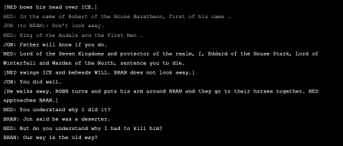
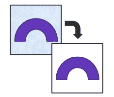
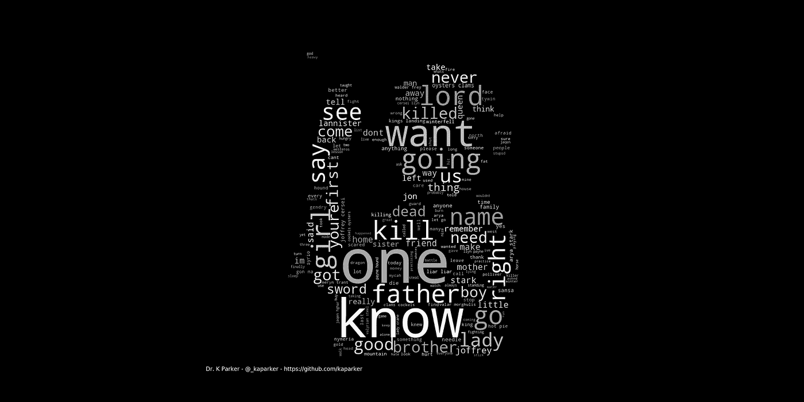
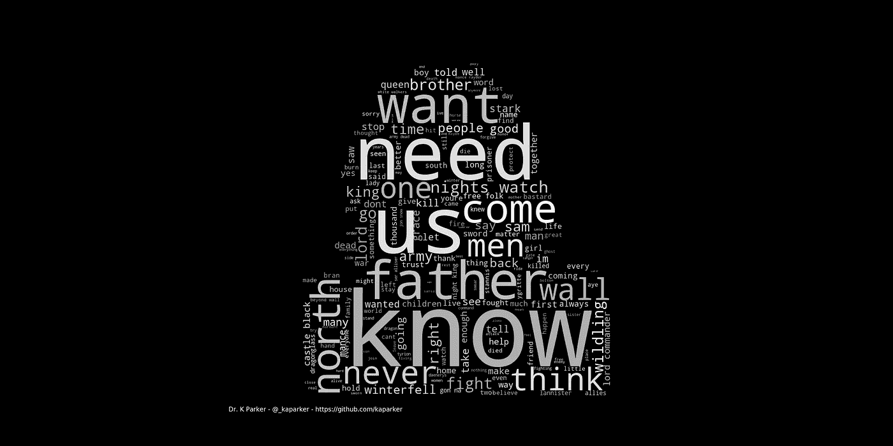
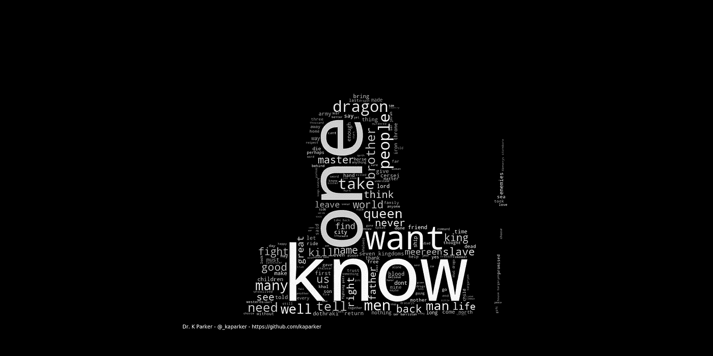
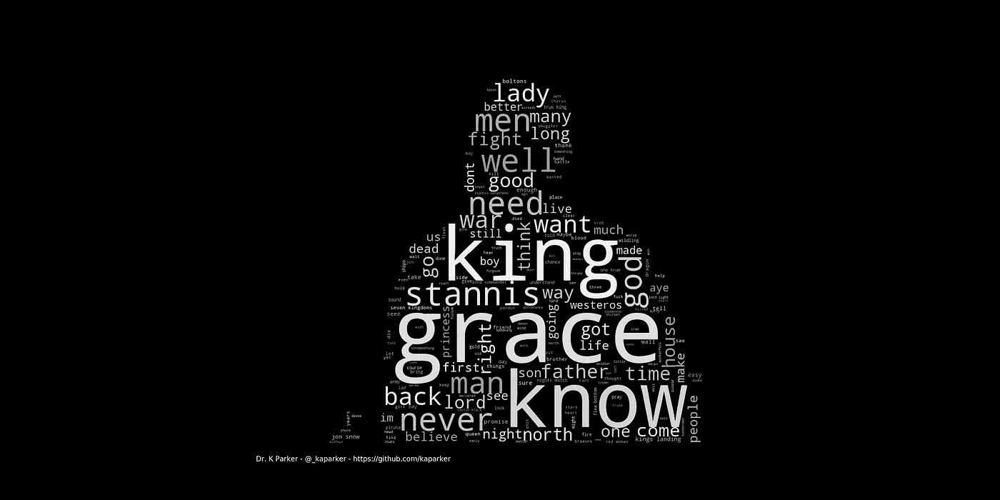
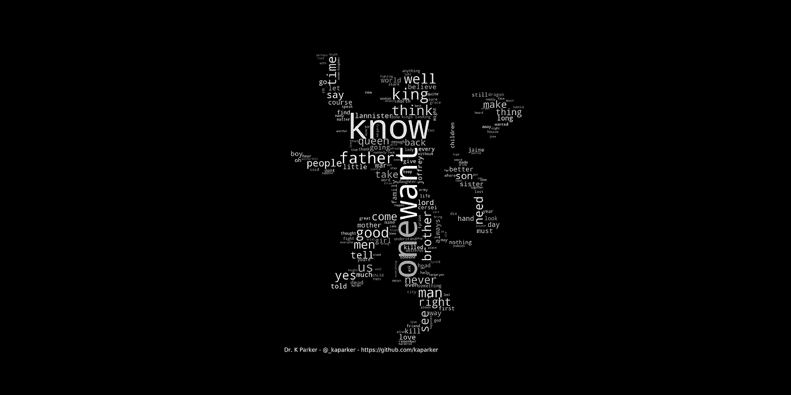
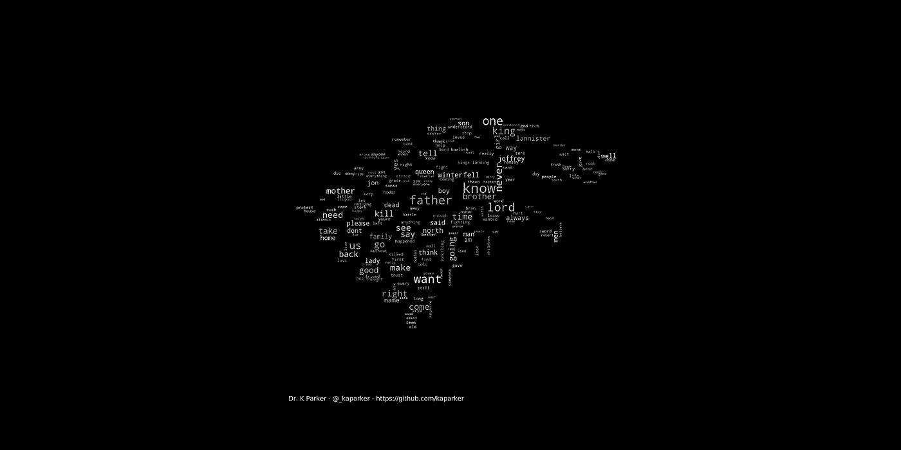
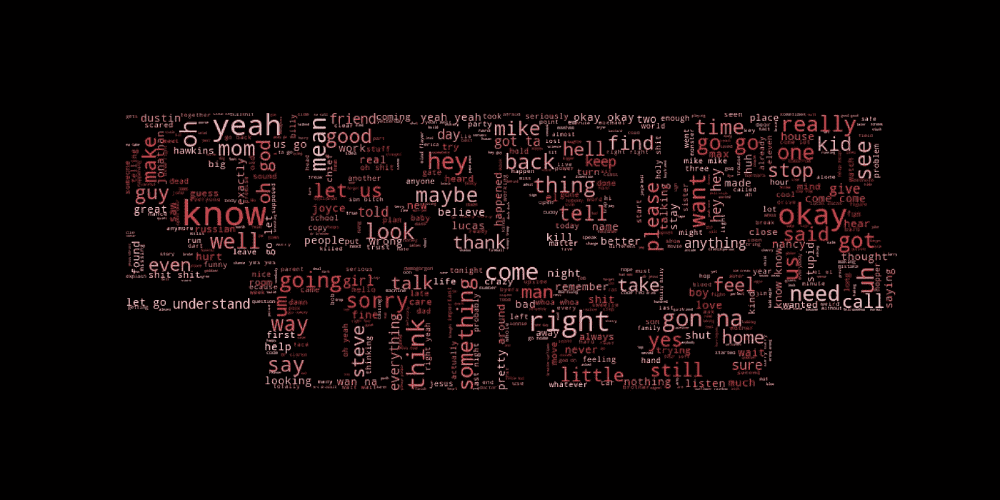

# 用 python 创建单词云

> 原文：<https://towardsdatascience.com/creating-word-clouds-with-python-f2077c8de5cc?source=collection_archive---------5----------------------->


Image from [culturacolectiva](https://culturacolectiva.com/movies/game-thrones-season-8-opening-map-astrolabe)

在最近的一个 NLP 项目中，我看到了一篇文章，文章中用美国总统就职演说中的单词创建了单词云。虽然我使用了单词云来可视化文档中最常见的单词，但我没有考虑过使用它和遮罩来表示主题。这让我开始思考...

几个月前，在《权力的游戏》第一季到第七季的最后一集播出前不久，我急切地等待着大结局——以至于我去寻找任何我能在网上找到的《权力的游戏》数据，以预测谁将在第八季的混乱中幸存下来，以及 7 个王国将会发生什么。不幸的是，我没有时间了，但我确实找到了人们收集的大量[数据](https://www.reddit.com/r/datasets/comments/769nhw/game_of_thrones_datasets_xpost_from_rfreefolk/)和可视化。当我偶然发现就职词云时，我想知道我是否可以使用《权力的游戏》的数据，特别是剧本，以及角色的图像遮罩来创建一些非常酷的可视化效果。在本文中，正如[在最近的一次技术会议上展示](https://github.com/kaparker/gameofthrones-wordclouds/blob/master/WordClouds_CodeUPXTechNomads_240719.pdf)一样，我将逐步使用 python 创建《权力的游戏》单词云。

# 入门指南

在处理基于文本的数据时，遵循与就职词云文章相似的方法，涉及几个步骤。这些步骤是:

1.  查找相关数据
2.  清理数据
3.  从图像创建遮罩
4.  生成单词云

因为我将在本教程中使用 python，所以有许多库可以帮助完成上述步骤，另外 [Dipanjan Sarkar 的自然语言处理指南](/a-practitioners-guide-to-natural-language-processing-part-i-processing-understanding-text-9f4abfd13e72)提供了文本分析技术的全面介绍，如果你正在寻找关于该主题的进一步阅读。

在开始第一步之前，我定义了项目的目标，以确保不会遗漏任何重要步骤，并对目标有一个清晰的愿景。

**项目目标:**为《权力的游戏》中被图像掩盖的角色创建文字云。

# 1.查找相关数据

网上有大量的《权力的游戏》数据——我通常首先在 GitHub 和 [Kaggle](https://kaggle.com) 上搜索数据集——我很快找到了一个包含[脚本](https://github.com/shekharkoirala/Game_of_Thrones/tree/master/Data)的数据集。

为了实现项目目标，每个角色的台词都需要陈述——第一个问题是:角色台词可用吗？



Snippet of Game of Thrones script

看第一集的一个片段，人物数据是有的！然而，在探索下一集和下一季时，角色名字的格式会有所不同。

在上面的例子中，只使用了角色的名字，而且都是大写的，而在其他季节中，角色的全名都是大写的。舞台指示也可以包含在角色名称中。

因此，通过字符名称搜索所有行，可以使用带有字符名称的正则表达式:

```
re.findall(r'(^'+name+r'.*:.*)', line, re.IGNORECASE)
```

这个表达式搜索一行的开始(^)，后面是我们作为变量输入的字符名，后面是任何文本(。*)，然后是一个冒号，表示这是一个字符行(:)，后跟任何文本(。*).通过将该正则表达式包含在括号中，返回整行。最后忽略大小写，所以角色名可以是大写/小写/字母大小写。

使用下面的函数将返回一个字符的所有行:

```
# final_data taken from:  
# [https://github.com/shekharkoirala/Game_of_Thrones](https://github.com/shekharkoirala/Game_of_Thrones)# get data for characters
def get_char_lines(char):    
    output = []          
    print('Getting lines for', char)        

    with open('final_data.txt', 'r') as f:
        for line in f:
            if re.findall(r'(^'+char+r'.*:.*)',line,re.IGNORECASE):
                output.append(line)
    f.close()
    print(char, 'has ', len(output), 'lines')return output# get lines using
get_char_lines('arya')
```

# 2.清理数据

现在我们有了角色的线条，这些需要被清理。

以下技术用于清洁生产线，这些相同的技术也在上面提到的 [NLP 指南](/a-practitioners-guide-to-natural-language-processing-part-i-processing-understanding-text-9f4abfd13e72)中详细描述。正则表达式在替换或删除字符时也很有用:

*   移除线路信息，例如`JON:`

```
re.sub(r'.*:', '', text)
```

*   删除括号—从字符行中删除任何舞台方向

```
re.sub('[\(\[].*?[\)\]]', ' ', text)
```

*   删除重音字符，并使用`unicodedata`库进行规范化

```
unicodedata.normalize('NFKD', text).encode('ascii', 'ignore').decode('utf-8', 'ignore')
```

*   扩展任何缩略词，例如，不要→不要
    这里有一个 python 库，将`contractions.py`复制到您的工作目录，来自:
    [https://github . com/dipanjanS/practical-machine-learning-with-python/](https://github.com/dipanjanS/practical-machine-learning-with-python/blob/master/bonus%20content/nlp%20proven%20approach/contractions.py)

*   (可选):在一个单词被词干化为字典中的一个词根的情况下应用词条解释，例如 is，are → be
    当前没有使用词条解释，因为它不能很好地处理一些单词，例如 Stannis → Stanni
*   将所有文本转换为小写

```
text.lower()
```

*   删除特殊字符(*、。！？)以及删除数字的选项—默认设置为 false

```
pattern = r'[^a-zA-Z0-9\s]' if not remove_digits else r'[^a-zA-Z\s]'    re.sub(pattern, '', text)
```

*   删除停用词，使用`nltk`库中的停用词，首先对文本进行标记，将字符串分割成子字符串列表，然后删除所有停用词

```
stopword_list = stopwords.words('english')    
tokens = nltk.word_tokenize(text)    
tokens = [token.strip() for token in tokens]    
' '.join([token for token in tokens if token not in stopword_list])
```

这些清洁技术基于几种不同的来源，并且这些步骤有许多变化以及可以使用的其他清洁技术。这些初始清洁步骤已经在这个[项目](https://github.com/kaparker/gameofthrones-wordclouds/blob/master/gotwordcloud.py)中使用。

# 3.从图像创建遮罩

基于就职词云，`PIL`库用于打开图像，从图像创建`numpy`数组以创建遮罩。

```
char_mask = np.array(Image.open("images/image.jpeg"))    image_colors = ImageColorGenerator(char_mask)
```

可选地，`numpy`阵列可以和`wordcloud.ImageColorGenerator`一起使用，然后`recolor`单词云代表图像的颜色，或者其他。这将在下一节中讨论。

在最初将一幅图像作为文字云遮罩进行测试后，图像中的背景产生了太多的噪声，以至于字符的形状没有被很好地定义。为了避免这种情况，移除图像背景并替换为白色背景会很有用。



Remove background from image and replace with white background

# 4.生成单词云

最后一步是使用`generate()`函数创建单词云。

```
wc = WordCloud(background_color="white", max_words=200, width=400, height=400, mask=char_mask, random_state=1).generate(text)# to recolour the image
plt.imshow(wc.recolor(color_func=image_colors))
```

单词云将被图像掩盖，文本的大小将基于词频。

可以调整单词云的参数——尝试增加`max_words`来查看一些不常用的单词，注意，这应该少于文档中唯一单词的数量。

如前一节所述，`recolor`步骤是可选的，这里用于表示原始图像颜色。

# 权力的游戏单词云

对《权力的游戏》角色的图像使用上述步骤，生成的单词云呈现如下:

## **艾莉亚**



Arya word cloud

## **琼恩·雪诺**



Jon Snow word cloud

## 丹妮莉丝



Daenerys word cloud

## 达沃斯爵士



Ser Davos word cloud

这也被扩展到基于房屋生成单词云:

## 兰尼斯特家族



Lannister word cloud

## 史塔克家族



Stark word cloud

有了这些单词云，项目的最初目标就达到了！

# 丰富

有几种方法可以改进这些单词云。

*   **常用字:**在所有的汉字书写中，都有一些重复出现的常用字。目前，词云是基于词频生成的，然而，另一种方法是 TFIDF，它基于词在文档中的频率和相对于语料库的频率对词进行加权。或者，可以生成一个自定义停用词表来删除其他常用词
*   **词汇匹配/词干匹配**:词汇匹配在上面的例子中没有使用，因为一些《权力的游戏》特有的单词在测试时被缩短了(Stannis → Stanni)，然而这确实意味着来自同一个词根的单词没有联系，并且在单词云中出现了几次，例如 say，said。可以使用替代的引理方法或词干技术。
*   **文本清理:**还可以使用进一步的清理或数据准备步骤
*   **单词云功能:**我用不同的单词颜色、背景颜色和单词云参数进行了测试，灰色和黑色背景在这种情况下可以工作，但一些参数可以进一步优化
*   **进一步的文本分析:**从这个数据集中可以得出很多真知灼见。更大的分析范围！

# 延伸——陌生的事物

通过进一步观察，我最终发现了[更奇怪的东西脚本](https://www.springfieldspringfield.co.uk/episode_scripts.php?tv-show=stranger-things-2016)——尽管它们缺少字符行，但数据仍可用于[生成单词云](https://github.com/kaparker/stranger-things)……



Stranger Things word cloud

# 摘要

在这篇文章中，我已经完成了生成单词云的基本步骤，这些单词云被一个图像所掩盖。

这只是我尝试单词云的开始！该项目还有很大的发展和改进空间，我希望您能按照步骤使用 word clouds 创建自己的项目！\

感谢您的阅读！如果你喜欢我的文章，那么[订阅](https://kaparker.substack.com/)我的每月简讯，在那里你可以将我的最新文章和顶级资源直接发送到你的收件箱！

你可以在 [Medium](https://medium.com/@_kaparker) 上关注我以获取更多文章，在 [Twitter](https://twitter.com/_kaparker) 上关注我或者在我的[网站](http://kaparker.com/)上了解更多关于我正在做的事情。