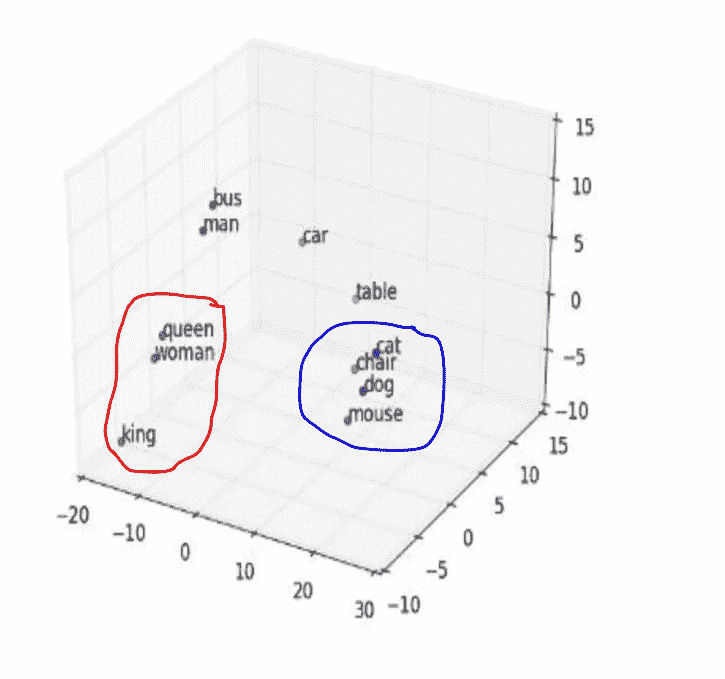
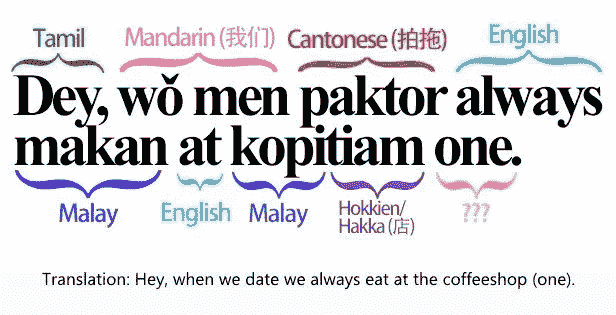
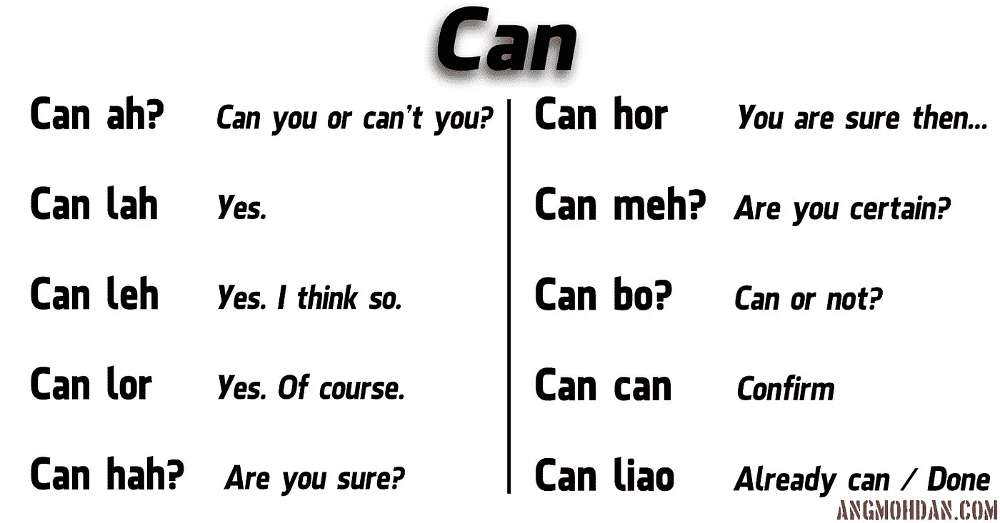
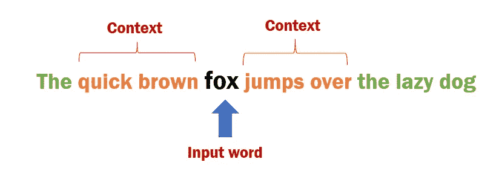
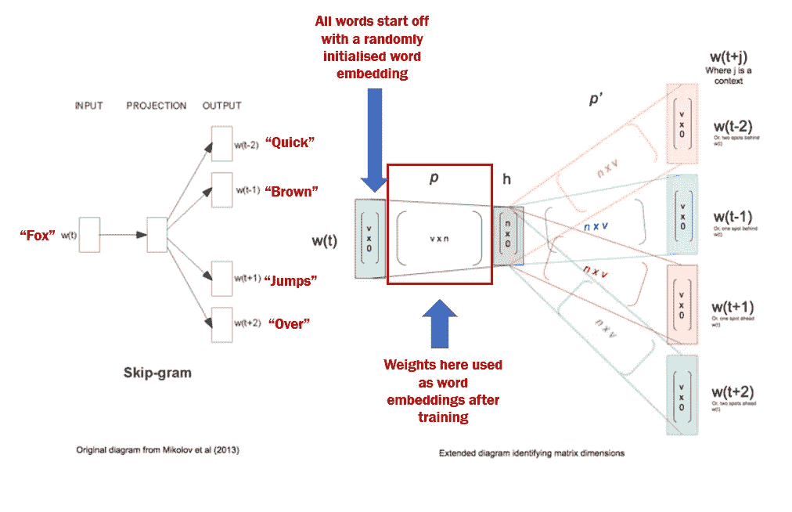
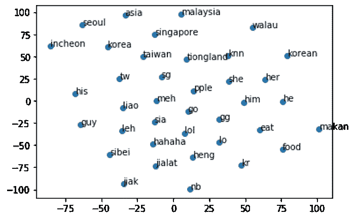
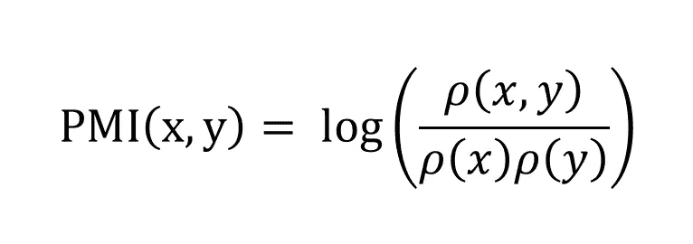

# 为不在词汇表中(OOV)的单词(如新加坡英语)创建单词嵌入

> 原文：<https://towardsdatascience.com/creating-word-embeddings-for-out-of-vocabulary-oov-words-such-as-singlish-3fe33083d466?source=collection_archive---------7----------------------->


Photo by [Dmitry Ratushny](https://unsplash.com/@ratushny?utm_source=medium&utm_medium=referral) on [Unsplash](https://unsplash.com?utm_source=medium&utm_medium=referral)

# 介绍

在这篇文章中，我将分享我如何创建用于下游自然语言处理(NLP)任务的新加坡英语单词嵌入。

但是**为什么**你可能会问？

要理解我做这个任务的动机，你首先需要理解什么是单词嵌入以及它们在 NLP 中的重要性。

谈到自然语言理解(NLU)，这需要一台机器来理解人类语言。为了完成这样的壮举，机器需要将语言(用文字书写)转换成最能代表特定单词的含义、关系和上下文的数值。

这些“数值”可以被视为 NLP 中的单词嵌入——单词映射到 n 维空间中的实数向量。

简而言之，想象一个三维窗格(x 轴、y 轴和 z 轴)上的散点图。图上的每个点代表一个英语单词，即“国王”、“王后”。您还会注意到，这些点彼此距离非常近。此外，这些点也离“猫”或“狗”之类的词相当远。



Figure 1 — Word Embeddings for “King”, “Queen”, “Cat” and “Dog”. Source: [https://arxiv.org/ftp/arxiv/papers/1901/1901.07176.pdf](https://arxiv.org/ftp/arxiv/papers/1901/1901.07176.pdf)

为了实现这样的情节，单词“国王”、“王后”、“猫”和“狗”被赋予了单词嵌入(X、Y 和 Z 数值)，以最好地表示它们之间的关系。

在图 1 中，我们可以看到与人类相关的单词被分组在一起(红色)，而与动物相关的单词被分组在一起(蓝色)。为什么？因为生成这些单词嵌入的机器已经**通过遍历大型文本语料库的多次迭代学习了**这些复杂的关系。它给所有它见过和训练过的单词赋予了数字表示。

这就像一台机器在说:

> “哎！我已经多次通读了你的文本语料库，以下是我认为最能代表每个单词的数值！”

作为一个人，我们需要证实这样的说法？一种方法是在向量空间中可视化这些单词，即散点图，以查看这些单词在该窗格中的位置。

如果相关的单词有点像图 1 中那样彼此靠近，那么我们可以验证机器确实已经学习了足够多的知识来将单词表示为数字。

简而言之…

单词嵌入是允许机器**基于上下文理解单词之间的关系或含义的值。**即“国王”和“王后”彼此相似(更接近)，而与“猫”和“狗”等词不同(更进一步)。

当然还有比我上面给出的例子更多的单词嵌入，但是…

我想强调的一点是。

> 机器和数字而不是单词一起工作。单词嵌入很重要，因为它们是单词的数字表示，这是进行任何下游 NLP 任务之前需要的第一步。

自然语言处理任务，如实体提取、文本摘要、情感分析、文本分类、语音转文本、图像字幕、语音转文本以及许多其他下游任务，都需要良好的单词嵌入来获得准确的结果。

到目前为止有意义吗？

既然我们已经了解了单词嵌入及其重要性，那么我们就来简单谈谈新加坡式英语吧。

## 新加坡式英语？什么是新加坡式英语？

对于我的非新加坡读者来说，“新加坡式英语”本质上是新加坡口语。它是英语、马来语、泰米尔语、普通话和许多其他方言如闽南语的混合体。

我在网上找到的最好的例子之一就是这个。



Figure 2 — Example of Singlish

我一直以来最喜欢的新加坡式英语的另一个例子是这个。



Figure 3 — The power of “Can”. Source: www.Angmohdan.com

你看，新加坡式英语不仅仅是不同语言的混合。从普通话改编而来的新加坡英语单词的使用可以根据新加坡英语术语的语调改变前一个单词的意思。即“我能吗？”vs“残博？”

在英语中,“Can”这个词就是“能够”。在新加坡式英语中，这个意思根据随后用某种语调说的新加坡式英语术语而变化。

你可以明白为什么在 NLP 中使用新加坡式英语是一件痛苦的事情。

那好吧。

既然介绍已经结束了，**让我们进入正题**打败匈奴…开个玩笑！(我希望你能从《花木兰》中找到参考文献……)

接下来的几个部分是我所做的事情的基本细节。这可能是也可能不是技术性的，但我会尽力用简单的术语解释我所做的事情。

但首先，总结一下。

## 摘要

1.  机器看不懂文字，但看得懂数字。因此，单词嵌入很重要，因为它们是文本的数字表示。
2.  许多下游 NLP 任务都是从单词嵌入开始执行的。
3.  新加坡英语是一种非常本地化的语言。据我所知，新加坡英语没有任何现成的单词嵌入。有必要为任何未来的 NLP 作品创建新加坡英语单词嵌入。

# 方法学

在这一节中，我将首先解释我从哪里得到这些数据。然后，我将谈论用于创建新加坡式英语单词嵌入的模型。之后，我将回顾我的初步发现，我从这些发现中意识到的问题，在最终揭示我的最终结果之前，我是如何纠正这个问题的。

## 数据收集—硬件区域论坛

这些数据是从我们一直最喜欢的新加坡论坛“硬件区”(【https://forums.hardwarezone.com.sg/】T2)上删除的。这是一个最初以信息技术为导向的论坛，但和所有论坛一样，它已经偏离成为许多新加坡人谈论世界上任何事情的地方。

最精彩的部分？

他们在论坛上大多使用新加坡式英语。非常适合任何深度学习任务。下面是一个线程注释的例子。

```
['got high ses lifestyle also no use treat chw like a dog if me i sure vote her she low ses man take people breakfast ask people buy ckt already dw pay up tsk tsk tsk\n',
 '                                                                                                                                                                                                                                                                                                                                                                                                                                                                                                                                                                                                                                                                                                                                                                                                                                                                                                                                                                                                                                                                                                                                                                                                                                                                                                                                                                                                                                                                                                                                                                                                                                                                                                                                                                                                                                                                                                                                                                                                                                                                                                                                                                                                                                                                                                                                                                                                                                                                                                                                                                                                                                                                                                                                                                                                                                                                                                                                                                                                                                                                                                                                                                                                                                                                                                                                                                                                                                                                                                                                                                                                                                                                                                                                                                                                                                                                                                                                                                                                                                                                                                                                                                                                                                                                                                                                                                                                                                                                                                                                                                                                                                                                                                                                                                                                                                                                                                                                                                                                                                                                                                                                                                                                                                                                                                                                                                                                                                                                                                                                                                                                                                                                                                                                                                                                                                                                                                                                                                                                                                                                                                                                                                                                                                                                                                                                                                                                                                                                                                                                                                                                                                                                                                                                                                                                                                                                                                                                                                                                                                                                                                                                                                                                                                                                                                                                                                                                                                                                                                                                                                                                                                                                                                                                                                                                                                                                                                                                                                                                                                                                                                                                                                                                                                                                                                                                                                                                                                                                                                                                                                                                                                                                                                                                                                                                                                                                                                                                                                                                                                                                                                                                                                                                                                                                                                                                                                                                                                                                                                                                                                                                                                                                                                                                                                                                                                                                                                                                                                                                                                                                                                                                                                                                                                                                                                                                                                   children big liao no need scare tio pok\n',
 'she low ses man take people breakfast ask people buy ckt already dw pay up tsk tsk tsk i dont get her thinking actually if she is rich she could even fly over to kl to eat buffet and then fly back in 1 hour dunno why want to save over this kind of small thing to ppl like her like food\n']
```

这看起来像是蹩脚的英语，但实际上，对于一个新加坡人来说，我们理解这里使用的俚语和英语的隐含意义。

数据收集方面，废弃了 46 个主线程，共有 7，471，930 个条目。以下是按条目分列的线程数量。

```
Eat-Drink-Man-Woman                                    1640025
Travel and Accommodation                                688253
Mobile Communication Technology                         582447
Mass Order Corner                                       574927
MovieMania                                              451531
Gaming Arena                                            426976
Campus Zone                                             322146
General Merchandise Bazaar                              286604
Money Mind                                              264523
Internet Bandwidth & Networking Clinic                  243543
Music SiG                                               227198
Hobby Lovers                                            224994
Headphones, Earphones and Portable Media Devices        206141
Notebook Clinic                                         184116
HomeSeekers and HomeMakers                              153683
Apple Clinic                                            139810
Hardware Clinic                                         133421
Cars & Cars                                             115286
The Tablet Den                                          108793
Fashion & Grooming                                       98211
Electronics Bazaar                                       75192
Degree Programs and Courses                              49734
Football and Sports Arena                                47769
Software Clinic                                          43553
Health & Fitness Corner                                  21665
The "Makan" Zone                                         21358
National Service Knowledge-Base                          16545
Current Affairs Lounge                                   16259
Home Theatre & Audiophiles                               14888
The House of Displays                                    13987
Employment Office                                        12146
Other Academic Concerns                                   9927
Tech Show Central (IT Show 2018)                          9895
Parenting, Kids & Early Learning                          9756
Pets Inner Circle                                         6525
Wearable Gadgets and IoT                                  5735
The Book Nook                                             5238
Digital Cameras & Photography                             4714
Ratings Board                                             3858
IT Garage Sales                                           3549
Diploma Programs and Courses                              2348
Certified Systems, IT Security and Network Training       1798
Post-Degree Programs & Courses                            1724
Online Services & Basic Membership Support/Feedback        876
Design & Visual Art Gallery SiG                            246
HardwareZone.com Reviews Lab (online publication)           18
```

手动审查每个线程的数据质量后，一些线程(如“差旅和住宿”)主要用于销售，因此被排除在分析之外。

我最终只使用了来自“MovieMania”的数据，其中不包括任何形式的广告，也不包括线索中的销售。我还认为 451，532 个条目足以训练合适的单词嵌入。

这个帖子中每个条目的平均长度是 27.08 个单词。这给了我 12，675，524 个单词的语料库。就使用的独特词汇数量而言，这个数字下降到 201，766 个。我根据频率保留了前 50，000 个单词，并用“未知”标记来标记剩余的单词进行训练。

> 保留不常用的单词用于训练是没有意义的。如果这个单词只出现了几次，就没有学习的机会。因此，我用一个“未知”标记替换了所有不常用的单词。

我还通过简单地删除所有形式的标点符号和通过小写来标准化大小写来清理数据。

**技术总结:**

字数:12675524
句数:427735
平均。每句话字数:27.05
使用的独特词汇字数:5 万

既然数据已经出来了，下一部分将讨论用于训练单词嵌入的实际模型。

## 介绍跳跃图！

skip-gram 模型是一种无监督的机器学习技术，用于查找与给定单词最相关的单词。

以这个短语为例，



Figure 4 — Skip-gram example

跳过语法模型试图预测给定输入单词的上下文单词。在这种情况下，给定单词“狐狸”，预测“快”、“棕色”、“跳跃”和“结束”。

现在想象一下，模型从硬件区扫描我的整个训练语料库。对于每个句子(427，735 个句子)，遍历每个单词，提取出它的上下文单词，并使用输入单词来预测这些上下文单词。

还计算每个句子的误差函数。该模型的目标是通过缓慢调整模型内的权重，通过多次迭代来最小化该误差函数。

我重复这种“学习”,直到误差函数开始稳定，然后用模型作为我的单词嵌入来提取权重。

我上面试图解释的，本质上是神经网络是如何工作的。从体系结构上来说，它看起来会像这样:



Figure 5- Skip-Gram Architecture.

跟了这么远？

太好了！在得出结果之前，让我们回顾一下模型构建过程中的一些技术规范。

**技术规格:** Context size = 3
学习率= 0.025
学习率衰减= 0.001
历元数= 25
字数= 100
负样本数= 3
总训练时间= 17 小时 05 分钟(每个历元约= 41 分钟)

对于那些想知道这些技术术语指的是什么的人来说，**上下文大小**指的是要预测的单词数，即“quick”、“brown”、“jumps”、“over”是 2 的上下文大小，即输入单词前两个单词，“Fox”后两个单词。

**学习率**和**衰减**指的是模型如何在迭代过程中调整其权重。即每次迭代学习了多少。

**历元**指整个训练集要循环多少次。例如，在我的训练集中有 427，735 个句子，我循环了 25 次。

**单词尺寸**是指最能代表一个单词的数值个数。在我介绍的例子中，我用了 3 个维度来保持简单易懂。事实上，我们可以到达 300 个维度。

**负样本量**是一个来自负采样的参数，负采样是一种用于训练机器学习模型的技术，与正观测相比，机器学习模型通常具有更多的负观测。回想一下，我保留了 50，000 个词汇以供使用。

如果我用“狐狸”来预测“快”，只有一个正确答案，而有 49，999 个错误答案。获得“快速”正确预测的概率会低得惊人。

因此，为了加快学习过程，使用负采样来减少负水平的数量。即，我只查看 3 个随机错误答案，而不是查看 49，999 个错误答案。因此，阴性样本数= 3。

还和我在一起吗？太棒了。让我们继续吧！

## 初步结果

这是第一次尝试为新加坡式英语生成单词嵌入的结果。

你在下面看到的是词对之间的相似性得分(0 到 1)和最接近感兴趣的词的前 10 个词。数字越高，单词在上下文方面越相似。

在研究新加坡英语单词之前，作为初步测试，我决定看看像“她”对“她”和“他的”对“他”这样的单词的分数。如果这些分数不高，我会认为模型训练得不够好。

令人欣慰的是，分数相当高，相当不错。

```
Similarity between 'her' & 'she': 0.9317842308059494
Closest 10:
her 0.9999999999999994
she 0.9317842308059496
who 0.8088322989667506
face 0.7685887293574792
and 0.731550465085091
hair 0.7196624736651458
shes 0.7191209881379563
when 0.7119862209278394
his 0.7107795929496181
that 0.7091856776526962
********************************************************
Similarity between 'his' & 'he': 0.897577672968669
Closest 10:
his 1.0
he 0.8975776729686689
him 0.8446763202218628
who 0.775987111217783
was 0.7667867138663951
that 0.7528368024154157
father 0.749632881268601
son 0.7281268393201477
become 0.7264880215455141
wife 0.711578758349141
********************************************************
Similarity between 'jialat' & 'unlucky': 0.011948430628978856
Closest 10:
jialat 1.0
sia 0.8384455155248727
riao 0.8266230148176981
liao 0.8242816925791344
sibei 0.814415592977946
hahaha 0.8064565592682809
ya 0.8045512611232027
meh 0.7954521439129846
lol 0.7936809689607456
leh 0.7920613014175707
********************************************************
Similarity between 'jialat' & 'bad': 0.6371130561508843
Closest 10:
bad 1.0
quite 0.8823291887959687
good 0.8762035559199239
really 0.8758630577100476
very 0.8731856141554037
like 0.8728014312651295
too 0.8656864898051815
damn 0.8599010325212141
so 0.8486273610657793
actually 0.8392110977957886
********************************************************
Similarity between 'bodoh' & 'stupid': 0.1524869239423864
Closest 10:
bodoh 0.9999999999999998
628 0.4021945681425326
u4e3au56fdu5148u75af 0.3993291424102916
beck 0.39461861903538475
recieve 0.39110839516564666
otto 0.3839416132228821
gaki 0.34783948936473097
fapppppp 0.3418846453140858
bentley 0.3344963328126833
hagoromo 0.3331640207541007
********************************************************
Similarity between 'bah' & 'ba': 0.5447425470420932
Closest 10:
bah 0.9999999999999998
lei 0.7051290703273838
nowadays 0.698360482336586
dun 0.6968374466521237
alot 0.6767383433113785
type 0.6745085658120278
cos 0.6711909808612231
wat 0.6682283480973521
ppl 0.6675756452507112
lah 0.6671682261049516
********************************************************
Similarity between 'lah' & 'la': 0.8876189066755961
Closest 10:
lah 1.0
meh 0.8877331822636787
la 0.8876189066755962
dun 0.8865821519839381
mah 0.8793885175949425
leh 0.8723455556110296
cannot 0.8686775338961492
ya 0.8661596706378043
u 0.8549447964449902
wat 0.8542029625856831
********************************************************
Similarity between 'lah' & 'leh': 0.8723455556110294
********************************************************
Similarity between 'lah' & 'ba': 0.6857482674200363
********************************************************
Similarity between 'lah' & 'lor': 0.8447135421839688
********************************************************
Similarity between 'lah' & 'hor': 0.722923046216034
********************************************************
Similarity between 'lor' & 'hor': 0.6876132025458188
Closest 10:
lor 1.0
u 0.8925715547690672
cannot 0.865412324252327
dun 0.8509787619825337
leh 0.8508639376357423
lah 0.8447135421839689
ya 0.8438741042009468
la 0.8403252240817168
meh 0.8356571743730847
mah 0.8314177487183335
********************************************************
Similarity between 'walau' & 'walao': 0.4186234210208167
Closest 10:
walau 1.0
nv 0.6617041802872807
pple 0.6285030787914123
nb 0.6248358788358526
la 0.6207062961324734
knn 0.6206045544509986
lah 0.6158839994483083
lo 0.6102554356797499
jialat 0.6079250154571741
sibei 0.6076622192051193
********************************************************
Similarity between 'makan' & 'eat': 0.6577461668802116
Closest 10:
makan 1.0
jiak 0.7007467882204779
go 0.6911439090088933
pple 0.65857421561786
eat 0.6577461668802115
food 0.6575154915623017
kr 0.6545185140294344
sg 0.6473315303433985
heng 0.6422265572697313
beo 0.6354614594882941
********************************************************
Similarity between 'makan' & 'food': 0.6575154915623018
********************************************************
Similarity between 'tw' & 'sg': 0.7339666801539345
Closest 10:
tw 0.9999999999999997
tiong 0.7723149794376185
sg 0.7339666801539344
lidat 0.7330705496009475
hk 0.7258329008490501
taiwan 0.7195021043855226
tiongland 0.7171170137971364
pple 0.7130953678674011
yr 0.7017495747955986
mediacorpse 0.6954931933921777
********************************************************
Similarity between 'kr' & 'sg': 0.7889688950703608
Closest 10:
sg 1.0
go 0.7940974860875252
kr 0.7889688950703608
tiongland 0.7675846859894958
ongware 0.7674045119824121
yr 0.7584581119582794
pple 0.7536492976456339
time 0.7533848231714694
buy 0.751509500730294
tix 0.743339654154326
********************************************************
```

从上述结果中，我想指出一些有趣的发现。

总的来说，我认为这个模型在理解新加坡英语单词方面已经学得很好，表现也相当不错。

**不是最好的，但还过得去。**

毫不奇怪，模型已经了解到“马侃”(马来语，意为“吃”)，“食物”和“吃”被发现是相似的。但有趣的是，“Jiak”这个词——方言中“吃”的意思，常用于新加坡式英语句子中——被选中，并被认为与“食物”、“马侃”和“吃”相似。

在我看来，这位模特确实很好地学会了一些新加坡英语单词。

下一个有趣的结果来自于国家名称的缩写。当人们阅读结果时，我们知道“sg”指的是“新加坡”，“kr”-韩国，“tw”-台湾，“hk”-香港。然而对于一台机器来说，这并不那么简单，模型并没有这些先验知识。然而，它设法将这些术语组合在一起。

确实非常有趣！

这是另一个验证点，告诉我该模型在新加坡英语单词上训练得相当好。

现在，有一种方法可以帮助我们在向量空间中可视化单词，而不仅仅是盯着数字。这被称为 T 分布随机邻居嵌入(TSNE)。

TSNE 可以粗略地看作是一种将高维数据可视化的降维技术。即 100 维的单词嵌入。其思想是以尊重点之间相似性的方式将高维点嵌入到低维中。

用英文把 100 个维度转换成 2 或 3 个维度，尽可能保留嵌入的信息。

如果我在上面的一些结果上运行 TSNE (n=2 维),并在散点图上显示它，它将看起来像这样:



Figure 6 — TSNE results displayed on a scatter plot

不算太差的结果。

虽然上述结果看起来很有希望，但仍有一些问题需要解决。

我只是在回顾结果时才意识到这一点。下一节将进一步解释。

## 结果有问题

首先，正如你所看到的，像“lah”，“lor”，“meh”这样的新加坡式英语单词看起来很相似，但是…

> **那又怎样？它实际上意味着什么？！**

想了想，也不完全有用。

新加坡式英语短语通常以双字母(2 个单词)的形式出现，它实际上概括了使用它的上下文的意思。一个很好的例子是图 3——“能”的力量。“我能吗？”vs“残啦！”有着非常不同的含义。

如果我们把“can”和“meh”这两个词分开来看，这个意思就失去了。

**因此，单独拥有单词“meh”和“lah”的向量表示在这里并不完全有用。**

为了解决这个问题，我需要一种方法将这些单词组合在一起。unigrams 上的 Skip-Gram 火车，是的。但是如果我可以先把这些二元模型转换成一元模型呢？即“Can meh”->“Can _ meh”*注意下划线。

第二个问题没有第一个严重，但值得花些时间来讨论。

这是 TSNE 等降维技术的固有问题。你看，从 100 维缩减到 2 维的信息损失是不可避免的。尽管我喜欢视觉效果，但我意识到我只能通过看数字而不是视觉效果来真正理解结果。

这里没什么好解决的。

只是精神食粮。

现在让我们来看看我解决第一个问题的尝试。

## 问题的纠正:将二元模型转换为一元模型——引入逐点相互索引(PMI)



Figure 7 — Point-wise Mutual Index (PMI) formula

在意识到新加坡式英语的问题后，我需要一种方法将我的双字母词转换成单字母词，同时保留这些词的信息或意思。

我可以通过计算语料库中所有可能二元模型的 PMI 来做到这一点。

例如，图 7 中的公式表示，取成对单词(即“can meh”)出现的概率的对数，除以每个单词出现的概率。

我的流程分解如下:

如果 x = can，y = meh，

1.  统计“can meh”一起出现的次数。
2.  数一数“can”单独出现的次数。
3.  数一数“meh”单独出现的次数。
4.  应用 PMI，得到一个分数。
5.  设置一些阈值参数。如果分数高于阈值，则将所有出现的“can meh”转换为“can_meh ”,即，将二元语法转换为一元语法。
6.  重新训练整个跳格模型。

从 1 到 5 的步骤实际上就是构建一个**短语模型**。

> 所以…我开始寻求重新训练我的 17 小时模型…

我计算了所有可能二元模型的 PMI 分数，并设置了一个阈值变量。我实际上使用了上述 PMI 公式的标准化版本进行计算，但概念是相同的。

**归一化 PMI 短语模型技术规范:**

1.  最小字数= 5
2.  阈值= 0.5(范围从-1 到 1)

```
['as we are left with just 2 days of 2017 hereu2019s a song for everyone here edit to weewee especially lol',
 'good_morning click here to download the hardwarezone_forums app']['wah_piang . why every time lidat one . siao liao can meh . wah_lau . can lah . can la . of course medicated_oil . can anot']
```

正如您所看到的，阈值影响了有多少二元模型被转换为一元模型。我没有成功地将“can meh”的二元模型转换为二元模型，因为如果我将阈值设置得更低，许多其他非二元模型相关的单词将开始转换为二元模型。

可悲的是，这里有一个权衡。

## 新加坡英语单词嵌入的最终结果

在解释了二元模型之后，我重新训练了这个模型(现在我花了 18 个小时来训练),得到了下面的结果。

注意有多少不相关的二元模型变成了二元模型？即“为了她”，“和她在一起”。这就是我所说的建模步骤中的权衡。

因为所有这些不相关的二元模型，一些分数下降了。

```
Similarity between 'her' & 'she': 0.8960039000509769
Closest 10:
her 1.0
she 0.8960039000509765
when_she 0.7756011613106286
she_is 0.7612506774261273
with_her 0.7449142184510621
who 0.7348657494449988
for_her 0.7306419631887822
shes 0.7279985577059225
face 0.7192153872317455
look_like 0.718696491400789
********************************************************
Similarity between 'his' & 'he': 0.8129410509281912
Closest 10:
his 1.0
he 0.8129410509281914
him 0.804565895231623
he_was 0.7816885610401878
when_he 0.7747444761501758
that_he 0.7724774086496818
in_the 0.7622871291423432
himself 0.7611962890490288
was 0.7492507482663726
with_his 0.7241458127853628
********************************************************
Similarity between 'jialat' & 'unlucky': 0.1258840952579276
Closest 10:
jialat 0.9999999999999996
den 0.7104029620075444
liao 0.7050826631244886
chiu 0.6967369805196841
heng 0.686838291277863
hahaha 0.6860075650732084
riao 0.6810071447192776
la 0.6804775540889827
le 0.676416467456822
can_go 0.6756005150502169
********************************************************
Similarity between 'jialat' & 'bad': 0.4089547762801133
Closest 10:
bad 1.0
but 0.8388423345999712
good 0.8244038298175955
really 0.8192112848219635
i_think 0.7970842555698856
very 0.7965053100959192
like 0.785966214367795
feel 0.783452344516318
too 0.7788218726013071
i_feel 0.7721110713307375
********************************************************
Similarity between 'bah' & 'ba': 0.5793487566624044
Closest 10:
bah 1.0
say 0.6595798529633369
lah 0.6451347547752344
dun 0.6449884617104611
sure 0.627629971037843
bo_bian 0.6251418244527653
this_kind 0.6223631439973716
ppl 0.6196652346594724
coz 0.61880214034487
mah 0.6146197262236697
********************************************************
Similarity between 'lah' & 'la': 0.8863959901557994
Closest 10:
lah 0.9999999999999998
la 0.8863959901557996
meh 0.8739974021915318
mah 0.8641084304399245
say 0.8589606487232055
lor 0.8535623035418399
u 0.8304372234546418
leh 0.8275930224011575
loh 0.8189639505064721
like_that 0.8170752533330873
********************************************************
Similarity between 'lah' & 'leh': 0.8275930224011575
********************************************************
Similarity between 'lah' & 'ba': 0.7298744482101323
********************************************************
Similarity between 'lah' & 'lor': 0.8535623035418399
********************************************************
Similarity between 'lah' & 'hor': 0.7787062026673155
********************************************************
Similarity between 'lor' & 'hor': 0.7283051932769404
Closest 10:
lor 1.0
u 0.8706158009584564
lah 0.8535623035418399
mah 0.8300722350347082
meh 0.8271088070439694
or_not 0.8212467976061046
can 0.8202962002027998
la 0.8136970310629428
say 0.8119961813856317
no_need 0.8113510524754526
********************************************************
Similarity between 'walau' & 'walao': 0.37910878579551655
Closest 10:
walau 0.9999999999999998
liao_lor 0.595008714889509
last_time 0.5514972888957848
riao 0.5508554544237825
no_wonder 0.5449206686992254
bttorn_wrote 0.5434895860379704
hayley 0.5418542538935931
y 0.5415132654837992
meh 0.5397241464489063
dunno 0.5377254112246059
********************************************************
Similarity between 'makan' & 'eat': 0.6600454451976521
Closest 10:
makan 0.9999999999999998
go 0.7208286785168599
den 0.697169918153346
pple 0.6897361126052199
got_pple 0.6756029930429751
must 0.6677701662661563
somemore 0.6675667631139202
eat 0.6600454451976518
lo 0.6524129092703767
there 0.649481411415345
********************************************************
Similarity between 'makan' & 'food': 0.4861726118637594
********************************************************
Similarity between 'tw' & 'sg': 0.6679227949310249
Closest 10:
tw 1.0
tiong 0.7219240075555984
taiwan 0.7034844664255471
hk 0.7028979577505058
tiongland 0.6828634228902605
mediacock 0.6751283466015426
last_time 0.6732280724879228
sg 0.6679227949310248
this_yr 0.6384487035493662
every_year 0.6284237559586139
********************************************************
Similarity between 'kr' & 'sg': 0.7700608852122885
Closest 10:
sg 1.0
in_sg 0.8465612812762291
kr 0.7700608852122885
pple 0.7599772116504516
laio 0.7520684090232901
go 0.7509260306136896
sure 0.7156635106866068
come 0.7116443785982034
tiongland 0.7015439847091592
ongware_wrote 0.6974645318958415
********************************************************
Closest 10:
wah_piang 1.0
tsm 0.4967581460786865
scourge_wrote 0.4923443232403448
aikiboy_wrote 0.4887014894882954
sian 0.4871567208941815
ah_ma 0.48058368153798403
lms 0.4790804214522433
ruien 0.47420796750340777
xln 0.46973552365710514
myolie 0.4682823729806439
********************************************************
```

简而言之，上面的结果比以前的结果更糟糕。

我认为这个问题来自于数据的缺乏。如果我有更多人们使用“can meh”或“can lah”的例子，短语模型会在没有我设置低阈值的情况下挑选出这些二元模型。0.5 门槛在我看来真的很低。

**我抓到了太多的假阳性。**

> 垃圾进，垃圾出，对吗？这正是这里发生的事情。

## 未来作品

正如你所想象的，我仍然有办法调整我的模型，为我未来的作品获得像样的新加坡式英语单词嵌入。

我会有不同的做法:

1.  重新编写我的脚本来运行分布式。或者更好的是，在 GPU 中运行的代码。这将允许我在更大的语料库上运行，即整个硬件区域，而不仅仅是其中的一个线程。
2.  训练一个更好的短语模型。即 PMI 部分。

现在，我将为第一个模型保留单词 embeddings。

> **编辑**:如果你对如何处理语料库中的拼写错误、缩写或其他 OOV 单词感兴趣，我已经写了另一篇关于它的文章[这里](/using-a-generalised-translation-vector-for-handling-misspellings-and-out-of-vocabulary-oov-words-494cd142cd31)！

## 结尾注释

我确实从这个练习中学到了很多，我希望通过我分享我的方法、思维过程和结果，你们也能够用你们各自的当地语言做同样的事情。

就这样，再见了，朋友们！

希望你和我一样喜欢阅读这篇文章！

如果这篇文章对任何人有帮助，请随意分享！

**如果您正在寻找 NLP 数据集，请点击这里** [**查看我创建的精选列表！:)**](https://medium.com/@timothyguang/12-free-nlp-datasets-to-work-on-to-tide-you-through-this-pandemic-de58996e182a)

LinkedIn 简介:[蒂莫西·谭](https://www.linkedin.com/in/timothy-tan-97587190/)