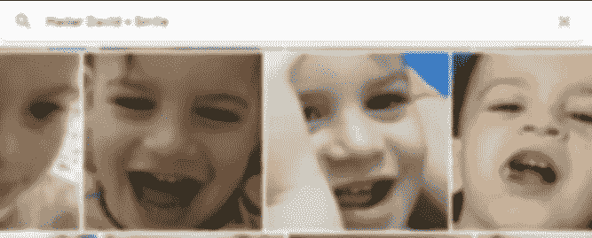

# 创建您独特的图像数据集

> 原文：<https://towardsdatascience.com/creating-your-unique-image-data-set-90f7d58d3a4d?source=collection_archive---------25----------------------->

## 使用谷歌视觉和谷歌照片创建我自己的数据集

Photo by [Alice Achterhof](https://unsplash.com/photos/FwF_fKj5tBo?utm_source=unsplash&utm_medium=referral&utm_content=creditCopyText) on [Unsplash](https://unsplash.com/?utm_source=unsplash&utm_medium=referral&utm_content=creditCopyText)

在进行我的第一个 ML 项目时，我需要一个特定的数据集。我用我两个女儿的面部图像做了一个二元分类模型。

我开始手工裁剪我的私人照片目录。这既乏味又怪异(坐在会议上剪小女孩的照片)

在网上搜索人脸识别和裁剪代码，我找到了不同的解决方案。但是因为我的主要目标是体验机器学习，所以我寻找一种更优雅的方式——一种利用 ML 能力的方式。

谷歌视觉 API 是我的答案。对我来说，这是一个有点棘手的开始，所以我想我应该写下我的经历。

如果你想直接进入代码，它就在[这里](https://github.com/alonlavian/FaceCrop)。

# 从阴霾的心到阴霾的心

为了使用谷歌云平台(GCP)，我必须设置一些小的环境先决条件:

1.  [打造一个 GCP 项目](https://cloud.google.com/resource-manager/docs/creating-managing-projects)——小菜一碟。
2.  [启用视觉应用编程接口](https://cloud.google.com/vision/docs/before-you-begin) —简单易行。
3.  [启用计费](https://cloud.google.com/billing/docs/how-to/modify-project) —无需动脑筋。
4.  [创建服务帐户](https://cloud.google.com/docs/authentication/production#obtaining_and_providing_service_account_credentials_manually) —漫步公园。

太好了，一次性搞定。它也可能在未来的项目中有用。时间花得值。

# 一个有远见的合作实验室

我喜欢使用 google colab，这是一个云中的 jupyter 笔记本，甚至可以给你一个免费的 GPU。它有 Python 2 或 3 和一堆原生预装库，如果你不知道，看看这篇可爱的文章。让我们开门见山:

1.  安装视觉

2.安装 google drive:

3.通过设置环境变量 GOOGLE_APPLICATION_CREDENTIALS，为您的应用程序代码提供您之前获得的身份验证凭证。你也可以使用代码来完成，但我发现这种方式更容易，我已经将文件上传到我的驱动器，并且我正在以这种方式使用它，而不是直接上传到 colab。

现在是有趣的部分。

The fun part

# 像热的一样修剪它

[vision 客户端 API](https://googleapis.github.io/google-cloud-python/latest/vision/gapic/v1/api.html) 很大，所以我将把重点放在这个任务所需的最低限度上。我的裁剪代码是来自 vision 教程网站的两个例子的合并。[人脸检测教程](https://cloud.google.com/vision/docs/face-tutorial)和[裁剪提示教程](https://cloud.google.com/vision/docs/crop-hints)。

我们先来看看人脸检测代码。这非常简单:我们创建一个服务对象，然后从 *Image* 资源请求 face_detection 注释。

返回值是一个*面标注*对象的数组。这些对象包含[大量的](https://cloud.google.com/vision/docs/reference/rest/v1/images/annotate#FaceAnnotation)数据，但是我们感兴趣的是[*BoundingPoly*](https://cloud.google.com/vision/docs/reference/rest/v1/projects.locations.products.referenceImages#BoundingPoly)*对象(有两个版本:bounding poly 和 fdBoundingPoly，它是多边形的一个更紧凑的版本，只有皮肤)。*

*现在你已经有了检测到的人脸的坐标，你可以做任何你想做的事情，在它们周围画一个矩形，裁剪它们或者添加胡子。*

*我们在这里有一个任务，所以让我们看看作物代码。我们使用枕头库根据我们从检测方法中得到的顶点来裁剪面，并将每个面保存在不同的文件中。*

# *用照片标记照片*

*创建我们的数据集现在很容易，我们需要做的就是将一个装满图片和代码的库流式传输，我们很快就会有一个很好的数据集。*

*但是，唉，许多不同的面孔。我的照片不仅仅是我孩子的照片。有时候一张友好的脸是你最不想看到的。我们需要把小麦从谷壳中分离出来等等。*

**

*I just need this one.*

*让谷歌再一次帮助我们。使用 Google 相册强大的 ML 功能，我们可以轻松地标记我们的数据。请注意，我将所有裁剪的面保存到了我驱动器上的一个文件夹中。这样，照片可以自动索引并标记它们。*

*例如，如果我只想要我儿子的微笑，我只需要在搜索框中搜索组合。*

**

*name + smile*

*就这样，你现在可以选择所有带标签的图片并一次性下载。瞧——很快(很短的时间)就有了一组带标签的图像。*

*你可以很容易地安排它，并把它送给 Keras ImageDataGenerator [例如](https://medium.com/@lavian.alon/binary-classification-a-naive-approach-b38ce6e718f5?source=friends_link&sk=828572a0cca4ace721d2711496bd8cff)。*