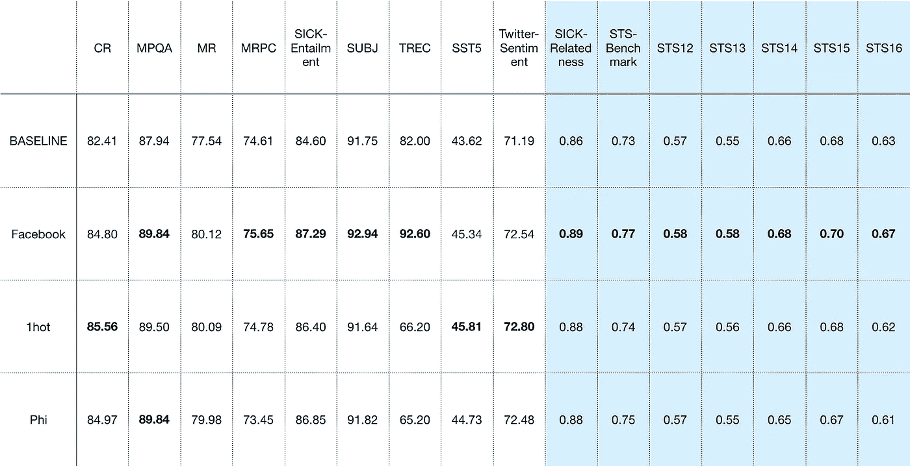

# 基于主题词表征的句子嵌入的创建

> 原文：<https://towardsdatascience.com/creation-of-sentence-embeddings-based-on-topical-word-representations-d325d50f99e?source=collection_archive---------16----------------------->

## 走向普遍语言理解的途径

我研究单词和句子嵌入已经一年多了，最近还写了这方面的硕士论文。我现在正在展示的成果也在这里发表了，并且是与 [SAP](http://sap.com) 和[列支敦士登大学](http://uni.li)合作的成果。在下面的博文中，我不会详细解释嵌入。这篇文章是概念性的，总结了我的发现。

Photo by [Romain Vignes](https://unsplash.com/@rvignes?utm_source=medium&utm_medium=referral) on [Unsplash](https://unsplash.com?utm_source=medium&utm_medium=referral)

# 基础

单词向量是高维空间中在语义上表示相应单词的位置。在那个空间里，意思相近的单词彼此靠得更近。因此，同义词具有几乎相同的向量，并且彼此靠近。

相同的概念可以应用于句子，而相似的句子在高维空间中彼此靠近。

为了创建单词向量，存在几种方法。两个非常常见的算法是 Word2Vec [2]和 GloVe [3]。两者都根据单词出现的上下文将单词编码成任意维度。对于 Word2Vec，上下文是周围单词的窗口。对于 GloVe，它是整个句子或文档。

因为一个单词是通过拼写来识别的，所以每个单词只存在一个向量。使用这些方法，同形异义词，即拼写相同但意义不同的词，不会被认为是彼此不同的。因此，当在烹饪食谱中谈论苹果时，如果在大型和多样化的语料库上训练，水果的相应词向量将引入关于技术公司的不适当的知识。

脸书研究中心[的一个句子嵌入器](https://research.fb.com/downloads/infersent/)，叫做 infer sent【2】，使用了 GloVe，因此也忽略了同形异义词。这种无知方法的使用也给句子向量引入了不适当的知识。因此，我们创造了一种新的方法来解决这个问题。

# 建议

我们建议使用能够区分同形异义词的话题感知词向量，而不是使用无知的和已经训练好的手套向量。我们的工作面向主题词嵌入论文[3]，但稍微修改了他们的方法。

主题感知词向量是使用 Word2Vec 创建的。但是在 Word2Vec 运行训练语料库之前，我们通过使用带有 Gibbs 采样的 LDA [4]主题建模器对其进行了修改。

LDA 用于根据文档中出现的单词，在给定数量的主题中对文档进行聚类。一个很好的副作用是，LDA 不仅给整个文档分配主题，而且给所有单个单词分配主题，然后使用这些单词来区分文档的主题。下面的例子展示了一个语料库经过 LDA 处理后的样子。

LDA assigns topics to words based on their surroundings

因此，我们不再有常用词，而是包括主题的新伪词，例如 apple:1，其中 1 是主题“水果”的 ID。这些新单词充当我们的数据，我们从这些数据中创建单词向量。因此，对于苹果的每个版本——apple:1，apple:2 等等——我们都有自己的向量，而不是只有一个。

我们有两种不同的方法从前面提到的伪单词中创建单词向量…

## 整体单词嵌入

The vectors for apple:0 and apple:1 do not share any information.

这种创建主题词向量的方式简单地将伪词视为与具有相同词的其他伪词不相关的完整词，例如，apple:1 和 apple:2 被认为没有任何共同点。这是实现起来最简单、最快速的方法，因为大多数 Word2Vec 库只是简单地获取这个转换后的文本，并学习每个单词(这里是每个伪单词)的单词向量。

## 串联单词嵌入

The vectors for apple:0 and apple:1 share a common vector for apple (black) and have a appended topical vector for topic 0 (blue) and topic 1 (green), respectively.

另一种方法是连接两个向量，一个单词和一个主题向量，以创建主题单词向量。单词向量是通过 Word2Vec 在原始的、无差别的数据集上学习的。然而，主题向量需要一个更复杂的过程。我们提出的所有不同方法都在[1]中进行了描述。最有希望的是使用加权平均值(也称为 *Phi* 方法)。

加权平均方法获取词汇表中所有单词的向量，并对它们进行平均，以生成主题向量(向量的附加部分)。在平均之前，每个单词向量被加权一个关于该单词对于相应主题的重要性的数字。这个数字是一个介于 0 和 1 之间的值。对于一个主题，所有的重要性数字总和约为 1。这些数字实际上是概率 *p(w|t)* 告诉我们一个单词在一个主题中被提及的可能性。它们是在训练 LDA 时计算的。

示例:想象一个语料库，其中包含词汇{"apple "，" pie "，" computer"}，主题{"fruits "，" technology"}，训练词向量{"apple": [1，0，0]，" pie": [0，1，0]，" computer": [0，0，1]}，以及概率{"fruits": [0.5，0.5，0.0]，" technology": [0.5，0.0，0.5]}。主题向量的计算如下。v("水果")= v("苹果")*0.5 + v("馅饼")*0.5 + v("电脑")*0.0 = [0.5，0.5，0.0]。v("科技")= v("苹果")*0.5 + v("馅饼")*0.0 + v("电脑")*0.5 = [0.5，0.0，0.5]。因此，主题“水果”中单词“苹果”的向量是[1.0，0.0，0.0，0.5，0.5，0.0]，主题“技术”中的向量是[1.0，0.0，0.0，0.5，0.0，0.5]，而苹果的基本向量分别与“水果”和“技术”的主题向量连接。

# 实验

为了对主题和非主题版本的推断方法进行公平的比较，我们创建了一个基线模型，它是一个使用 Word2Vec 单词嵌入的推断模型，该单词嵌入是我们在训练主题单词嵌入的相同数据上创建的。然后将使用这些主题词向量作为基础的主题版本的推断与基线模型进行比较。这确保了在实验开始之前，许多其他的不确定性被消除。

对于基线和局部模型都获得了以下结果:

BASELINE vs. Topical versions — bold is best for the respective task, underlined is better than baseline

如第一个表所示，基线模型在有关联任务(蓝色背景)时明显更好。但是，对于分类任务，主题区分的版本显示出优势。在 9 个分类任务中的 7 个中，我们的主题版本超过了基线。这有力地证明了主题区分确实提高了分类任务的性能。

此外，我们通过向单词向量添加主题部分，扩展了原始推理的手套模型，甚至可以超过最先进的结果:

BASELINE vs. original InferSent (Facebook) vs. extended (topical) GloVe — bold is best for the respective task

即使扩展模型(1hot 和 Phi)采用第一个表中较小数据集训练的主题向量，结合预训练的手套向量，它们也能够在某些任务中取得比脸书的原始推断模型更好的结果。

# 结论

通过我们进行的实验，有可能表明词向量中的歧义是有问题的，并且降低了大多数分类任务的性能。为了解决真正的机器文本理解，还需要更多的研究。然而，该项目表明人类语言具有更高的复杂性，并为进一步的文本嵌入研究提供了方向。

在从事这个项目的过程中，一些技术，如 ELMo [5]和 BERT [6]已经发布，它们可以创建上下文单词表示。这也是正确理解文本需要语境的证据。

# 参考

[1] Wenig，P. (2018)。基于主题词表征的句子嵌入的创建。[https://doi.org/10.13140/rg.2.2.10288.00007](https://doi.org/10.13140/rg.2.2.10288.00007)

[2]t .米科洛夫，陈，k .，科拉多，g .，&迪安，J. (2013 年)。向量空间中单词表示的有效估计。*ArXiv:1301.3781【Cs】*。从 http://arxiv.org/abs/1301.3781[取回](http://arxiv.org/abs/1301.3781)

[3]j .潘宁顿、r .索彻和 C. D .曼宁(2014 年)。GloVe:单词表示的全局向量。在*自然语言处理中的经验方法(EMNLP)* (第 1532–1543 页)。借鉴于[http://www.aclweb.org/anthology/D14-1162](http://www.aclweb.org/anthology/D14-1162)

[4] Conneau，a .，Kiela，d .，Schwenk，h .，Barrault，l .，和 Bordes，A. (2017 年)。来自自然语言推理数据的通用句子表示的监督学习。 *arXiv 预印本 arXiv:1705.02364* 。从 https://arxiv.org/abs/1705.02364[取回](https://arxiv.org/abs/1705.02364)

[5]刘，杨，刘，钟，蔡东生，孙，米(2015).主题词嵌入。在 *AAAI* (第 2418–2424 页)。检索自[http://www . aaai . org/OCS/index . PHP/AAAI/aaai 15/paper/download/9314/9535](http://www.aaai.org/ocs/index.php/AAAI/AAAI15/paper/download/9314/9535)

[6]布雷博士、Ng、A. Y .、乔丹博士(2003 年)。潜在狄利克雷分配。

[7] Peters，M. E .，Neumann，m .，Iyyer，m .，Gardner，m .，Clark，c .，Lee，k .，& Zettlemoyer，L. (2018)。深层语境化的词语表达。*ArXiv:1802.05365【Cs】*。从 http://arxiv.org/abs/1802.05365[取回](http://arxiv.org/abs/1802.05365)

[8] Devlin，j .，Chang，m-w .，Lee，k .，& Toutanova，K. (2018 年)。BERT:用于语言理解的深度双向转换器的预训练。*ArXiv:1810.04805【Cs】*。从 http://arxiv.org/abs/1810.04805[取回](http://arxiv.org/abs/1810.04805)