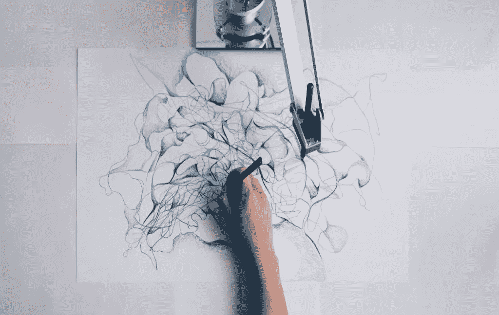

# 创造性自动化是新的媒介

> 原文：<https://towardsdatascience.com/creative-automation-is-the-new-medium-20935d9fb6ed?source=collection_archive---------28----------------------->

在自动化焦虑的新浪潮中，创意人员开始意识到自动化提高效率的潜力，一些人利用技术创造新的表达形式，反映数字时代及其所有可能性。

# 自动化创造力

近年来，我们已经看到人工智能能够创造出值得在[主流画廊](https://news.artnet.com/exhibitions/ai-generated-art-gallery-show-1339445)展示的艺术；我们已经看到他们的画被佳士得以高达 432，500 美元的价格拍卖掉[，我们也读过他们的](https://www.christies.com/features/A-collaboration-between-two-artists-one-human-one-a-machine-9332-1.aspx)[获奖小说](https://www.smithsonianmag.com/smart-news/ai-written-novella-almost-won-literary-prize-180958577/)讲述了一个机器人决定开始写作的那一天(谁不想看呢？).创造性自动化的这些新进展创造了一种独特的“自动化焦虑”，将人类创造力的价值置于其中心——如果人工智能可以创造艺术，那么我们作为有意识的智能生物的价值还剩下什么？

目前，许多创意专业人士认为，创意自动化只会有助于而不是有害的，尤其是艺术家和设计师经常发现自己必须完成的重复过程。在 Adobe 委托的一份 [2018 报告](http://www.pfeifferreport.com/essays/creativity-and-technology-in-the-age-of-ai/)中，他们发现超过一半的创意专业人士受访者事实上对人工智能和机器学习能够给他们的创意过程带来什么非常感兴趣，只有 12%的人声称完全不感兴趣。Adobe 人工智能战略发展高级经理克里斯·达菲(Chris Duffey)在接受 CMO.com 采访时说:“就在几个月前，创意人员还在观望。”。“今天，他们意识到人工智能存在于他们已经在使用的许多技术中，它让事情变得比以前更直观。”

Duffey 认为，通过自动化阴影背景、标记文件和一般组织等日常任务，创意专业人士将“能够继续发展——向新的和更复杂的创意学科发展，如 3D 和沉浸式设计，并在原创性和破坏性思维方面取得新的突破。”

尽管人工智能和计算机艺术正在引发关于人类创造力是否可以被取代的讨论，但重要的是要记住，当今大多数创造性自动化工具最常被用于非创造性能力。虽然计算机可以记忆和处理比人脑多得多的信息，但它们并不真正理解它们为什么要做这些事情，也不理解自由意志的概念。尽管它们很快，但 AI 没有认知、意识，也没有同理心来做出人类定期做出的相同决定。

人工智能的发展还有很长的路要走，但计算机算法不太可能在短期内取代我们的创造力和表达能力。相反，在创造力的世界里，机器的价值将是尽可能地补充人脑，而不是取代它。

前面提到的 Adobe 报告的主要作者 Andreas Pfeiffer 同样认为，“创造力不仅仅是你创造了什么，而是你为什么创造它，”而自由艺术总监 Christoph Gey [解释道](https://theblog.adobe.com/what-ai-advances-mean-for-creators-the-creative-process/):“不是因为你知道工具，你才是设计师。”“自动化”这个词有完全取代工作的含义，但它实际上是一种和其他技术一样的技术:它旨在通过加快我们工作中看似平凡和重复的部分，给我们更多的时间。毕竟，就其能力和命令而言，人工智能仍然是由我们设计的，它将帮助我们做我们需要帮助做的任何事情，但它将无法实现真正的人类创造力，这种创造力是由自然的必要性产生的(即。冲动和决策)、经验和情绪。

# 电脑音乐与电脑辅助音乐

虽然人工智能确实渗透到许多创作领域，但它在音乐领域表现得最为明显。还记得 Spotify 的“假艺人”争议吗？Spotify 被指责为了支付更低的版税而提供假冒艺术家创作的歌曲。据报道，从那时起，这些冒牌艺术家已经在[积累了超过 1 亿次的播放量，每个月大约有 100 万的听众。因此，钢琴乐器和爵士乐在这些播放列表中卷土重来，但社区怀疑(并暗示)没有人在另一端接受表扬。如果你是一名音乐家，自然你会担心你辛苦获得的创造力现在被人工智能算法大量取代；你不敢苟同，你是对的。](https://www.rollingstone.com/music/music-features/fake-artists-have-billions-of-streams-on-spotify-is-sony-now-playing-the-service-at-its-own-game-834746/)

加州大学圣克鲁斯分校荣誉退休教授、音乐技术公司 Recombinant Inc .的联合创始人 David Cope 早在 1981 年就已经将数千行 LISP 代码编织成音乐生成算法。他的电脑程序涉足“音乐智能”的实验(你可以在 Spotify 上找到他的电脑合成歌曲[)；具体来说，能够理解音乐风格并相应地复制它，同时仍然遵守音乐规则的程序(关键词:*复制*)。类似地，](https://open.spotify.com/artist/2e4gmURRiGni4WWyuiXIoO) [MuseNet](https://openai.com/blog/musenet/) 是一个深度神经网络，可以生成“用 10 种不同乐器创作的 4 分钟音乐作品，可以结合从乡村音乐到莫扎特到披头士的风格。”这两个例子都非常成功地实现了他们的提议，即*复制*现有的“真正的”艺术家和作曲家的音乐风格，但还需要一点时间，人们才能期待计算机根据自己的思想和情感创作音乐。

虽然有些人将他们的算法集中在复制音乐风格上，但其他人已经将机器学习的优势作为他们作曲过程的一部分。一个最显著的例子是谷歌的[项目 Magenta](https://magenta.tensorflow.org/) ，该项目于 2016 年启动，旨在推动“机器学习作为创意过程中的一种工具”的边界。作为一个开源研究项目，Magenta 是音乐家、艺术家和开发人员的游乐场，允许他们将机器学习作为当今和未来最重要的乐器进行探索。通过 Magenta 创建的一些特色项目包括使用神经网络的钢琴转录，用机器学习生成的声音制作音乐，以及用机器学习模型进行交互式干扰。与音乐创作项目不同，Project Magenta 专注于技术和人类创造力之间的整合，强调当我们将两者结合起来时，可能性是多么的无限。

# 一起更好

在音乐领域之外，当自动化被用作人类创造力的工具或延伸时，仍有许多实例证明其价值。早在 2012 年，威廉和弗洛拉·休利特基金会(William and Flora Hewlett Foundation)发起了一项奖励，欢迎程序员设计一种自动化软件，帮助在州测试中给论文评分。为了降低成本和增加周转时间，这种竞争还将有助于确保学校系统不会在考试中排除论文问题，而采用选择题，选择题更不能体现学生的批判性推理和写作技能。虽然人们可能会认为给论文评分需要人类思维的经验和创造性思维，但这次比赛的结果证明并非如此:159 份参赛作品中最好的一份产生了与人类评分几乎相同的分数。这些评分程序的关键是，他们不评估文章的价值；更确切地说，他们是在模仿一个训练有素的教育者如何给文章打分。通过采用与经验丰富的教育工作者相同的评分标准，该计划在完成任务时充当该教育工作者的扩展或克隆，这直接减少了时间和相关成本。

Sougwen Chung, Drawing Operations Unit: Generation 2 (Mimicry), 2016 — — NTT InterCommunication Center [ICC], Tokyo Japan — — Courtesy of the Artist — — [sougwen.com](https://sougwen.com/press)

在创意机器的一个更具协作性的应用中，Sougwen Chung 的机器人绘图臂，称为 [DOUG 2(绘图操作单元:第 2 代)](https://sougwen.com/project/drawingoperations-memory)，利用在 Chung 的绘图手势上训练的神经网络来学习艺术家的绘图风格。在每一次展览中，钟都强调这个项目的合作性，当她在画布上画画时，她把道格 2 放在自己旁边。该项目的核心是“探索人类和机器人合作的艺术潜力”。使用计算机视觉算法，DOUG 2 从艺术家的手中学习，并展示了一种受艺术家启发的风格，以开发一种“人和机器的复合行为”。其结果不仅是复杂线条和图案的惊人集合，也是一台机器与人类一起创造原创和其他无法实现的东西的现场演示。

# 我们定义创造力

通过了解在创造性过程中机器可以取代什么，我们越来越多地发现，我们所做的许多创造性工作涉及到可以轻松自动化的重复性任务。不能自动化的事情也是我们努力为自己定义的事情。例如，趋势和品味的短暂定义是由人类的方向决定的，即使是最发达的机器算法或数学公式也无法预测。

以亚马逊的时尚助手 [Echo Look](https://www.amazon.com/Amazon-Echo-Look-Camera-Style-Assistant/dp/B0186JAEWK) 为例，根据其亚马逊页面，这是一款“带 Alexa 的免提相机和时尚助手”。通过 Echo Look，用户可以拍摄照片和视频，然后根据当前趋势向 Alexa 寻求造型建议。然而，正如[凯尔·查卡发现的](https://https/www.vox.com/2018/4/17/17219166/fashion-style-algorithm-amazon-echo-look)，Alexa 缺乏自发性和有助于主导时尚趋势的创新思维。相反，Alexa 试图将你的衣服与盒子里已经有的衣服搭配起来。趋势，尤其是时尚，是由人类随意决定的；其实很多时候，最成功的设计师都是颠覆潮流的人。从这个意义上说，Echo Look 只不过是第二种意见——不是帮助你创造自己的风格，而是确保你看起来不像*那么糟糕。*

尽管人工智能在排序和组织数据以产生一致的分析结果方面非常有帮助，但它们仍然远远没有创造力——即创造和决定趋势和品味的能力。这并不是说机器在创造力中没有位置——很可能它们很快就会成为我们创造过程的工具，但也许会把创造方向的角色留给人类来完成，因为创造力毕竟是我们自己定义和联系的东西。这是一个谨慎的概念，许多人认为它定义了人类，它已经变得与人类思维如此相关，以至于两者几乎不可分。

当我们赞美艺术时，它证明了人类创造和创新的能力，而不一定是所说的创造力的结果。因此，在我们能够接受和识别非人类创造力的迹象之前，还需要一些时间，我怀疑这场关于机器人和算法是否真的可以“有创造力”的激烈辩论将持续一段时间，但这并不意味着计算机不能在此期间帮助我们进一步实现自我表达的目标。有了明确的目标，自动化可以帮助简化、实现甚至发明曾经不存在的表达形式。通过将技术与艺术相结合，我们正在定义人类创造力的新时代，其标志是科学的进步和我们从环境中创造一切的能力。

*原载于 2019 年 7 月 10 日*[*https://automtd.co*](https://automtd.co/2019/07/10/creative-automation-is-the-new-medium/)*。*