# 信用卡欺诈检测

> 原文：<https://towardsdatascience.com/credit-card-fraud-detection-a1c7e1b75f59?source=collection_archive---------5----------------------->

## 在虚拟世界中保持警惕

Photo by [Ales Nesetril](https://unsplash.com/@alesnesetril?utm_source=unsplash&utm_medium=referral&utm_content=creditCopyText) on [Unsplash](https://unsplash.com/search/photos/credit-card?utm_source=unsplash&utm_medium=referral&utm_content=creditCopyText)

> 本文的代码可以在我的 [Github](https://github.com/rmacaraeg/CC_Fraud) 上找到。

在今天的世界里，我们正坐在通往无现金社会的快车上。根据[世界支付报告](https://worldpaymentsreport.com/wp-content/uploads/sites/5/2018/10/World-Payments-Report-2018.pdf)，2016 年非现金交易总额比 2015 年增长了 10.1%，达到 4826 亿笔交易！这是巨大的！此外，预计未来几年非现金交易将稳步增长，如下所示:

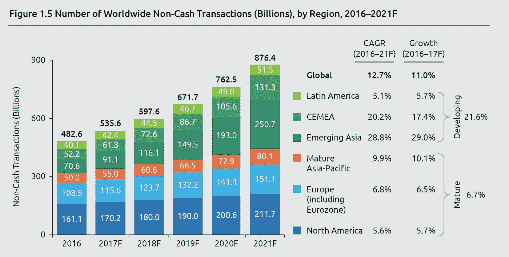

World Payments Report Forecast

现在，虽然这可能是令人兴奋的消息，但另一方面，欺诈交易也在上升。即使实施了 EMV 智能芯片，我们仍会因信用卡欺诈损失大量资金:

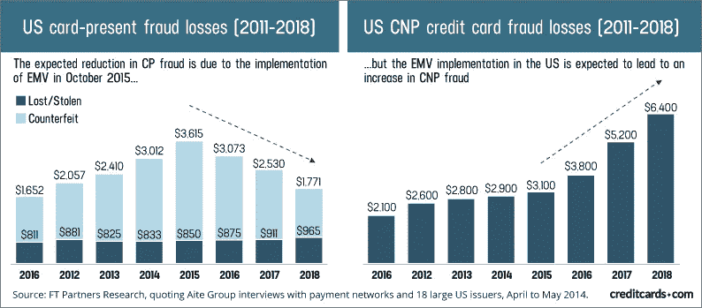

[CC Fraud Report from CreditCards.com](https://www.creditcards.com/credit-card-news/credit-card-security-id-theft-fraud-statistics-1276.php)

我们能做些什么来降低风险？虽然有很多方法来限制损失和防止欺诈，但我会向你介绍我的过程，并向你展示我的发现。

# **收集数据**

首先，我从包含 285，000 行数据和 31 列数据的 [Kaggle 数据集](https://www.kaggle.com/mlg-ulb/creditcardfraud)中收集数据。在所有的列中，唯一最有意义的是时间、金额和类别(欺诈与否)。为了保护用户身份，其他 28 列使用似乎是 PCA 降维的方法进行了转换。

从时间上来说，数据本身很短(只有 2 天)，这些交易是由欧洲持卡人进行的。

# 探索性数据分析

现在我们有了数据，我想对我前面提到的三个列(时间、数量和类别)进行一些初步的比较。

**时间**

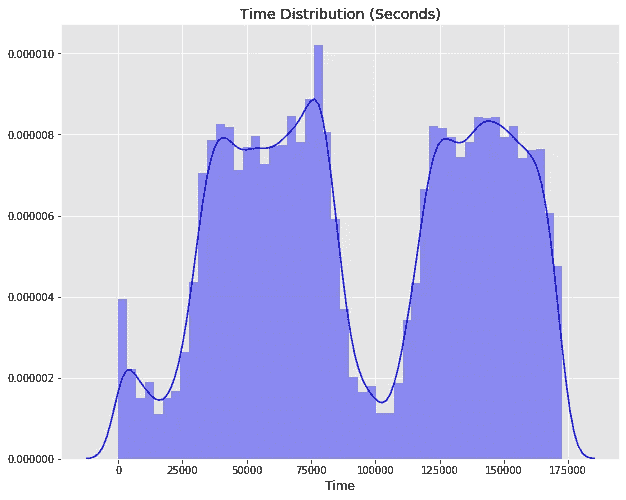

Time Distribution of Credit Card Data

鉴于这个分布是两天的数据，它将遵循我期望看到的普通消费者的趋势。大多数购买是在白天进行的，随着人们下班/放学回家，购买量会减少，直到第二天。

**金额**

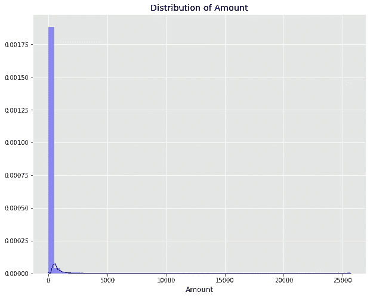

Amount Distribution of Credit Card Data

虽然绝大多数交易量很低，但这种分布也是意料之中的。大多数日常交易不是非常昂贵(大多数是

**类(欺诈/非欺诈)**

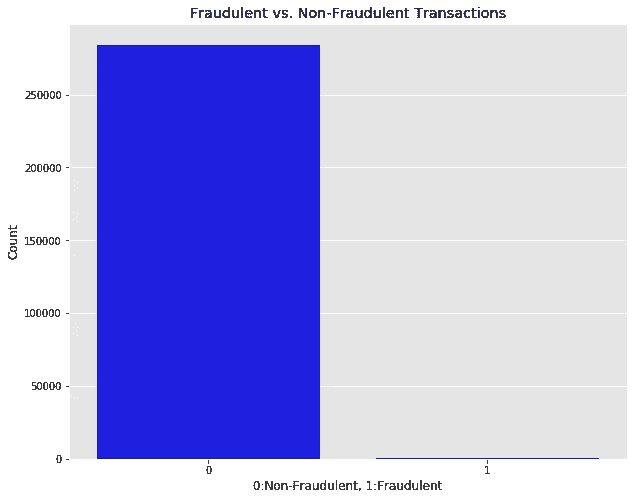

Fraudulent and Non-Fraudulent Distribution

在这个数据集中，只有 492 个欺诈交易。这只占该数据集中所有交易的 0.173%！不过，我的目标是尽可能多地抓住那些讨厌的骗子。

# **数据处理**

我首先通过使用热图来确保数据中没有任何强烈的共线性。

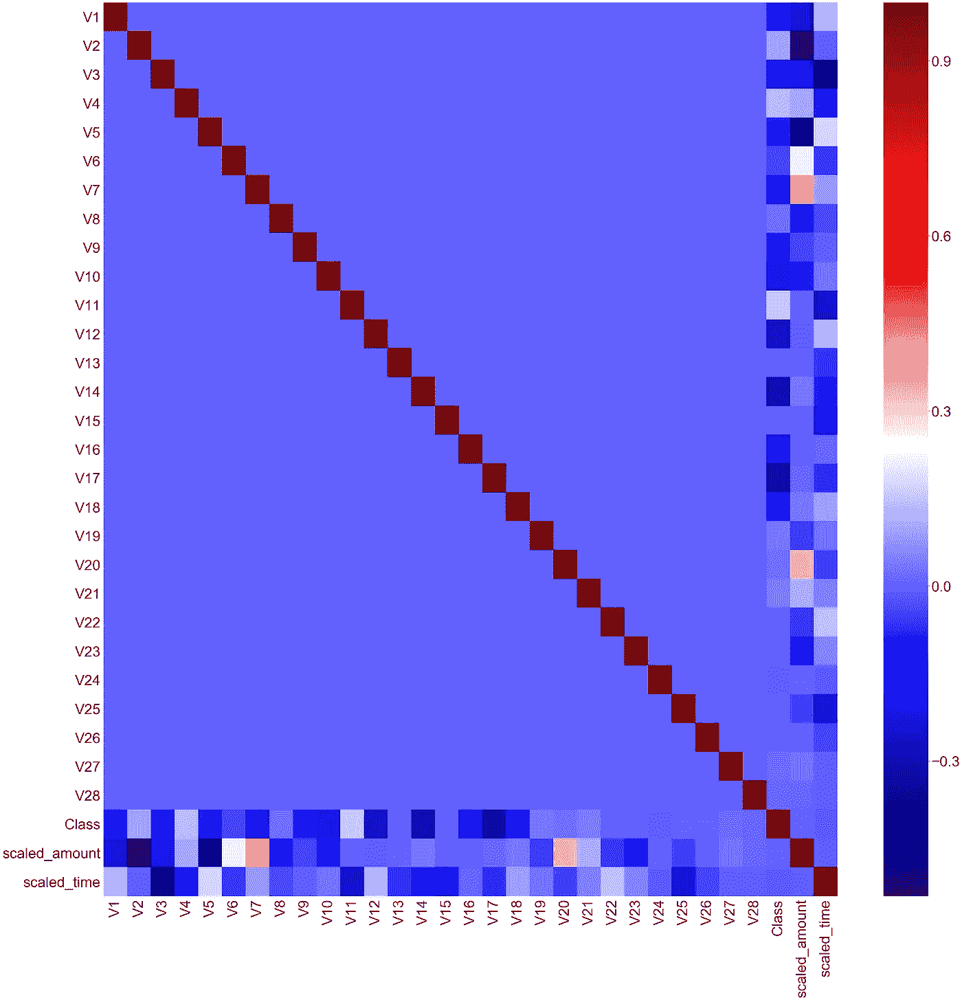

Feature Heatmap

在这个例子中，我没有添加任何数字，因为这对读者来说很难看到。我在寻找任何表现出高度相关性的东西，我发现了一些:

*   时间和 V3 (-0.42)
*   金额和 V2 (-0.53)
*   金额& V4 (0.4)

虽然这些相关性与其他相关性相比相对较高，但我不认为它高到足以冒多重共线性的风险。

**标准定标器开启时间和数量**

在处理这类分类问题时，StandardScaler 是一个常用工具。它将数据转换为平均值为 0、标准差为 1 的数据，从而将数据标准化为正态分布。特别是在如此大范围的数量和时间上工作，我发现在运行测试之前缩放我的数据提供了更好的结果。

我使用训练集初始化了 fit，然后在将所有内容运行到模型中之前，对训练集、验证集和测试集进行了缩放。

# 构建模型

现在是有趣的事情！有这么多数据点要处理，我决定在创建任何模型之前进行 60%的训练/20%的验证/20%的测试。

另一个需要解决的问题是高度不平衡的数据集。有了这么多的非欺诈性交易，我实现了随机欠采样来减少非欺诈性交易的数量，并使其与欺诈性交易的数量相匹配。

有了这个设置，我现在可以通过一些模型运行数据了！

## 逻辑回归和随机森林

> 特别大喊到和他的[逻辑回归](/understanding-logistic-regression-using-a-simple-example-163de52ea900)和[随机森林](/understanding-random-forest-58381e0602d2)博客！这些博客是很好的资源，帮助我了解每一个是如何工作的。

通过逻辑回归和随机森林模型，我试图确定这些数据是否有助于模型发现欺诈交易。

**逻辑回归是一种统计模型，试图将预测错误的成本降至最低。随机森林是决策树的集合，它们共同预测交易是否是欺诈性的。**

我通过这两个模型运行我的数据，得到了一些非常好的结果。

# 准确度、召回率、精确度和 F1 分数

对于本节，我将在公式中使用这些缩写:

TP =真阳性。**欺诈性**交易模型预测为**欺诈性**。

TN =真阴性。**正常**交易模型预测为**正常**。

FP =假阳性。**正常**交易模型预测为**欺诈**。

FN =假阴性。**欺诈性**交易模型预测为**正常**。

## 准确(性)

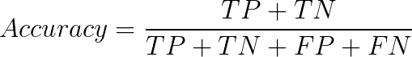

准确性是评估分类模型的一个度量标准。这是模型预测正确的比例。虽然准确性似乎是衡量模型性能的一个很好的指标，但在这种不平衡的数据集中使用它会有很大的负面影响。如果我说所有的 285，000 笔交易都是正常交易(没有欺诈)，我会有 99.8%的准确率！然而，这里的问题是所有欺诈交易的明显缺失。特别是对于不平衡的数据集，有更有效的指标可以使用。

## **回忆**

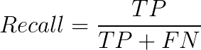

Recall 回答问题:**在欺诈交易中，我们的模型能正确识别的交易占多少百分比？在我们最好的模型中，我们的召回率是 89.9%。这意味着在所有数据中，它能正确识别 89.9%的欺诈交易。这可以改进，但我觉得这是一个很好的起点。**

## **精度**

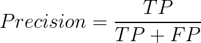

Precision 回答了以下问题:**在所有被预测为欺诈性的交易中，实际上有多少百分比是欺诈性的？**在我们的最佳模型中，97.8%的欺诈交易被捕获。这是一个非常好的指标！

## **F1 得分**

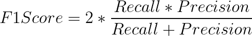

F1 分数将召回率和精确度合并为一个指标，作为两者的加权平均值。与召回率和精确度不同， **F1 同时考虑了误报和漏报。**在像这样的不平衡类中，F1 在确定模型性能方面比准确性更有效。

## **结果**

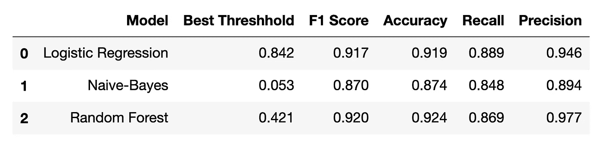

Model Results

在训练每个模型之后，这些是最终结果。逻辑回归和随机森林模型的所有分数对我们的数据集来说都非常有希望！每个模型都有很高的真阳性率和很低的假阳性率，这正是我们要找的。

最后，我将查看 ROC 曲线、混淆矩阵以及每个模型的累积情况。

# 接收机工作特性(ROC)和混淆矩阵

## 接收机工作特性(ROC)

ROC 是在各种阈值下对分类问题的性能测量。它本质上是一条概率曲线，曲线下面积(AUC)得分越高，该模型预测欺诈性/非欺诈性交易的能力就越强。

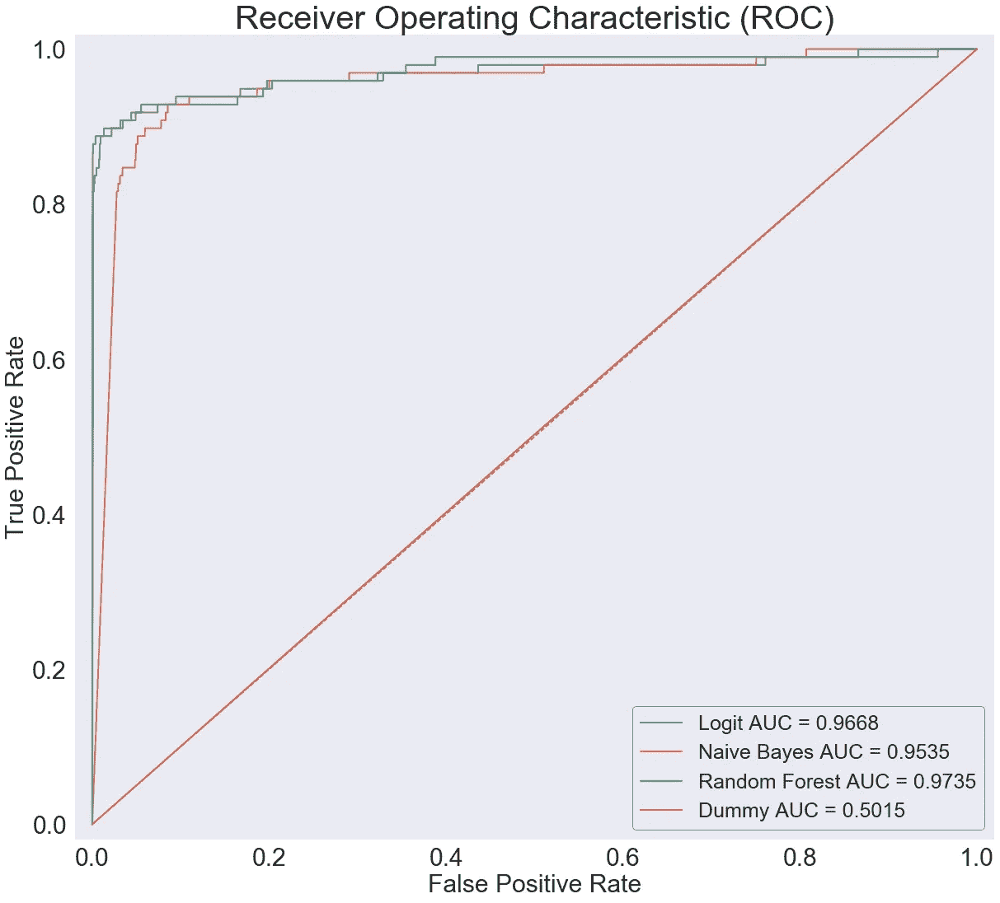

Out-of-sample ROC Curve

在上图中，逻辑回归和随机森林的 AUC 分数相当高，这是我们希望看到的。值得注意的是，曲线上的每个点都表示一个阈值。随着我们沿着曲线进一步向右移动，我们捕获了更多的真阳性，但也招致了更多的假阳性。这意味着我们捕获了更多欺诈交易，但也将更多正常交易标记为欺诈交易。根据上一节中的表格，找到的理想阈值是:

*   逻辑回归:0.842
*   随机森林:0.421

在这些阈值下，我们捕获欺诈交易的最佳数量，同时尽可能降低误报率。有了这些阈值，我们可以使用混淆矩阵来可视化每个模型的效果:

## 混淆矩阵—逻辑回归

Logistic Regression Confusion Matrix

在这个样本外测试集中，阈值为 0.842，我们捕获了 98 个欺诈性交易中的 88 个，并错误地将 1，669 个交易标记为欺诈性交易。我可以想象这些情况就像当我去另一个州而没有告诉我的银行我在旅行，当我用我的卡买了一些咖啡后，他们给我发短信要求确认。

## 混淆矩阵——随机森林

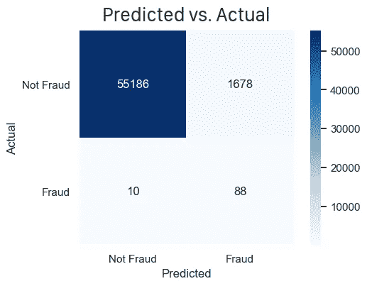

Random Forest Confusion Matrix

在阈值为 0.421 时，随机森林模型与逻辑回归模型具有相似的结果。随机森林模型捕获了 88/98 的欺诈性交易，但与逻辑回归相比，它表明 9 个正常交易是欺诈性的。这两种模式都很有前途，最终都给出了很好的结果。

# 结论

发现欺诈性信用卡交易非常重要，尤其是在当今社会。有很多方法来捕捉这些实例，看到公司如何在日常基础上处理这些问题真的很酷。

我喜欢发现异常，所以完成这个项目对我来说是一大乐趣。我希望我能够很好地解释我的发现，非常感谢阅读！