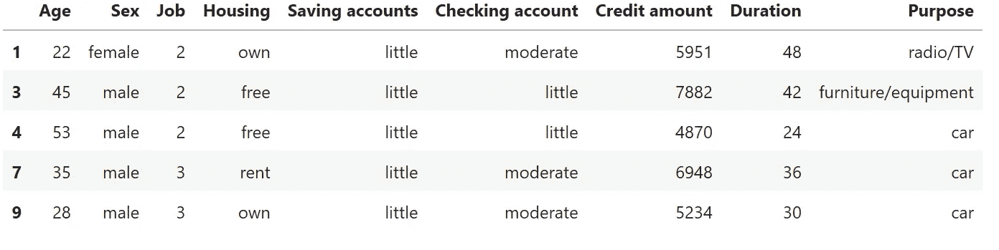
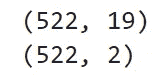
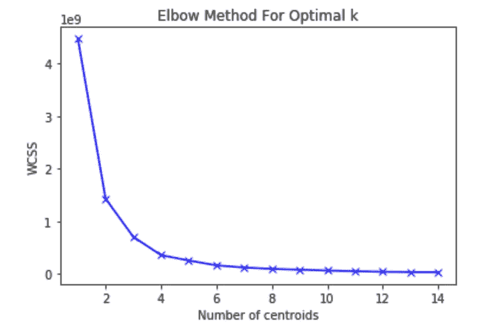
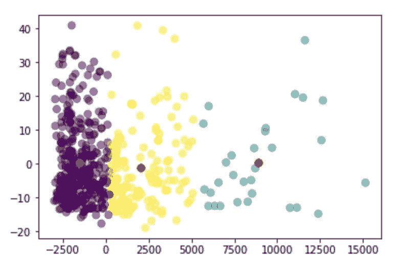

# 信用风险:无监督的客户聚类

> 原文：<https://towardsdatascience.com/credit-risk-unsupervised-clients-clustering-9eacae6807a0?source=collection_archive---------8----------------------->


大量使用机器学习解决方案的行业之一是银行业。特别是，让我们暂时集中在消费信贷领域:它是指任何涉及私人行为者(可能是一个人而不是一个家庭)和银行的业务。消费信贷的理念是，只有在客户不会违约(也就是说，不会偿还债务)的情况下，银行才会从提供信贷中获益。事实上，一旦被认为是有信誉的并获得信贷，客户将与银行一起计划一个分期偿还计划，根据该计划，他不仅必须偿还债务，而且必须偿还利息。

因此，如果从一个角度来看，发放信贷是银行的收入之一(因为利息)，从另一个角度来看，它包含了相当大的风险。这就是为什么大量的时间和金钱被投入到分析客户的历史，习惯和偿还债务的可能性。

为此，银行一直依赖统计模型(尤其是评分模型)，然而今天，在机器学习算法的帮助下，它们对未来还款的预测要可靠得多。

第一种方法可能是根据银行客户的历史数据训练一种算法，看看哪些是偿还债务的人和没有偿还债务的人的特征。然后，当一个新客户来到银行时，算法会对他进行评估，并说明他是否会偿还债务。

正如你所看到的，我们正在讨论监督学习:历史数据带有标签(可信或不可信)，因此算法将在训练集上训练，并在测试集上评估。

然而，在这篇文章中，我将提出这个问题的非监督方式:想象我们被提供了相同的数据，但没有任何标签。我们想做的是对我们的客户进行聚类，看看我们是否能从这个过程中获得一些关于他们信誉的相关信息。

那我们开始吧。我要用的数据集是德国信用风险数据集，可以在 Kaggle [这里](https://www.kaggle.com/uciml/german-credit)找到。

```
import pandas as pd
df=pd.read_csv(r'german_credit_data.csv')
df=df.dropna()
df=df.drop(['Unnamed: 0'],axis=1)
```



在导入和清理数据集之后，我必须对它进行一点修改。事实上，我们被提供了分类列，如“性别”或“目的”，然而算法是数学运算，它们需要数字，而不是字符串。因此，我将继续进行 OneHot 编码过程。我不打算在这里解释背后的想法，但是我在这篇文章中用例子[提供了一个完整的解释。](https://datasciencechalktalk.com/2019/08/01/features-engineering-behind-the-scenes-of-ml-algorithms/)

```
df=pd.get_dummies(df,prefix=['Sex','Housing','Saving Account','Checking account','Purpose'], drop_first=True)
```

现在，在应用我们的聚类算法之前，我们必须记住，一般来说，我们喜欢简单的模型。这里，我们有 19 个特征(最初是 10 个，但是随着 OneHot 编码变成了 19 个)来描述我们的客户，但是我们需要所有的特征吗？难道我们不能在不破坏模型的情况下减少特征的数量吗？

这个问题的答案依赖于主成分分析，其目的确实是通过创造新的变量来降低模型的复杂性而不丢失信息。后者有一个特点:信息主要存储在第一个组件中，因此，如果你想减少问题的维数，你可以只使用第一个组件，信息损失最小(如果你想了解更多关于 PCA 的知识，你可以阅读我以前的文章[这里](/pca-eigenvectors-and-eigenvalues-1f968bc6777a))。

现在，假设我们想要将维度从 19 减少到 2:

```
from sklearn.decomposition import PCA 
pca = PCA(2)  
projected = pca.fit_transform(features)
print(features.shape)
print(projected.shape)
```



如你所见，在 19 个特性中，我们现在只处理 2 个。

现在是时候应用我们的算法了。出于这个目的，我将使用 K-means，这是一个强大的无监督算法，我在这里写了关于它的功能[的完整解释](/unsupervised-learning-k-means-vs-hierarchical-clustering-5fe2da7c9554)。此外，为了确定质心的正确数量，因此也是标签的正确数量，我将使用肘方法技术:

```
import matplotlib.pyplot as plt
from sklearn.cluster import KMeans
wcss = []
K = range(1,15)
for k in K:
    km = KMeans(n_clusters=k)
    km = km.fit(projected)
    wcss.append(km.inertia_)plt.plot(K, wcss, 'bx-')
plt.xlabel('Number of centroids')
plt.ylabel('WCSS')
plt.title('Elbow Method For Optimal k')
plt.show()
```



如你所见，最佳 k 值介于 3 和 4 之间。为了模型简单起见，我们设 k=3。让我们看看我们的算法是如何工作的:

```
#converting our projected array to pandas df
pca=pd.DataFrame(projected)
pca.columns=['First component','Second Component']#build our algorithm with k=3, train it on pca and make predictions
kmeans = KMeans(n_clusters=3, random_state=0).fit(pca)
y_kmeans = kmeans.predict(pca)#plotting the results 
plt.scatter(pca['First component'], pca['Second Component'], c=y_kmeans, s=50, alpha=0.5,cmap='viridis')
centers = kmeans.cluster_centers_
plt.scatter(centers[:, 0], centers[:, 1], c='red', s=50)
plt.scatter(centers[:, 0], centers[:, 1], c='red', s=50)
```



如您所见，我们的算法根据客户的特征(主要存储在前两个主成分中)将客户分为三类。

分析师的下一步可能是询问这种细分背后的原因，以及这些原因可能如何影响银行向特定集群的客户提供信贷的决策。

聚类技术的强大之处在于，它们能够在几秒钟内产生相关的结果，而手动分析所有客户端则需要花费大量的时间。