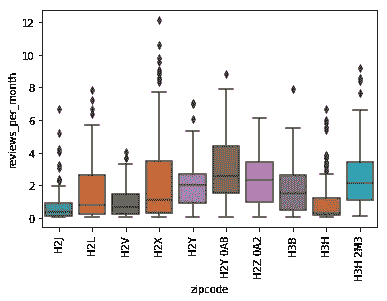

# 嘿 Airbnb，你想要更多的美钞吗？

> 原文：<https://towardsdatascience.com/crisp-dm-process-for-data-analysis-ed89db32cc88?source=collection_archive---------19----------------------->

## 应用 CRISP-DM 流程解决业务问题。

这篇文章围绕 CRISP-DM 过程展开，CRISP-DM 过程是数据挖掘的跨行业标准过程，有助于理解数据。它有 6 个短语:

*   发展商业理解
*   发展数据理解
*   准备要分析的数据
*   数据建模
*   评估结果
*   部署更改

所以在这里，我们将讨论 Airbnb 如何通过使用 CRISP-DM 流程分析他们的蒙特利尔数据来增加利润。

# 商业理解

Airbnb 是一个住宿提供平台，数百万人可以在这里列出他们的空间并预订世界任何地方的独特住宿。

Airbnb 帮助分享这些住宿。每当有住宿交易时，Airbnb 都会收取一定比例的交易费用，这是他们的主要收入来源。因此，预订数量越多，利润越高。

Business Model [Credit: [Dyimage](http://www.dyimage.org/what-is-sharing-economy-business-model/)]

## 我们怎样才能增加利润？

所以，我遇到了这三个问题，基于我对增加利润的直觉。

*   **哪个季节最适合 Airbnb 的推广和广告？** 由于气候不利、费用高昂或其他未知原因，旅游旺季有时会变得不旺。所以，我们能做的就是在这个淡季推广我们的计划和折扣券。

*   **蒙特利尔哪个地区有最好的客房？**
    人们在游览任何一个地方时，都会寻找最好的地方停留。所以在这里，我们可以向他们展示蒙特利尔最好的区域和最好的房间。

*   有类似的房源吗？
    人们不会只着眼于一个住宿选择，他们需要根据住宿选择有几个类似的选择。所以在这里，我们将向他们推荐类似类型的房源。

# 数据理解

在这篇博客中，我们将讨论蒙特利尔 Airbnb 数据，我在这里使用了 [listings.csv](http://data.insideairbnb.com/canada/qc/montreal/2019-03-11/data/listings.csv.gz) 和 [calendar.csv](http://data.insideairbnb.com/canada/qc/montreal/2019-03-11/data/calendar.csv.gz) 。要查看与分析相关的工作，请查看我的 [Github repo](https://github.com/rajatsharma369007/montreal_airbnb) 。

Snippet of calendar.csv

Small part of listings.csv

## **哪个季节最适合 Airbnb 的推广和广告？**

在分析 calendar.csv 数据时，我们发现整个赛季的预订需求有两次下降。

正如你所看到的，这个季节在:

*   2019 年 4 月下旬至 2019 年 6 月下旬
*   2019 年 7 月初至 2019 年 9 月末

我们无法判断后一部分，因为我们不知道这是否是一个饱和趋势。我们也需要更多的数据来得出结论。

现在，我们根据预订需求的下降将整个赛季分为 3 个亚赛季。

*   子赛季 1: 2019 年 3 月 11 日至 2019 年 6 月 8 日
*   第二季:2019 年 6 月 9 日至 2019 年 9 月 6 日
*   第三季:2019 年 9 月 7 日至 2020 年 3 月 9 日

现在，我们将使用 violinplot 来查看每个工作日的预订数量分布。

Sub Season 1: The demand for bookings is low for [‘Monday’, ‘Tuesday’, ‘Wednesday’, ‘Sunday’]

Sub Season 2: The demand is low for [‘Monday’, ‘Tuesday’, ‘Wednesday’, ‘Sunday’]

Sub Season 3: The demand is low for [‘Wednesday’, ‘Thursday’]

总体而言，我们需要重点关注“2019–04”至“2019–09”期间的广告和促销活动。在此期间，我们只能针对['周一'，'周二'，'周三'，'周日']的受众。

## 蒙特利尔哪个地区有最好的房间？

在这一部分，我从 listings.csv 中发现了以下功能，可以帮助我们提供最好的区域和最好的房间。

*   邮政编码
*   主机是超级主机
*   每月评论数

Snippet of dataframe (reviews_per_month)

Snippet of dataframe (host_is_superhost)

## **第一法**

我们将分析数据，并试图找出拥有**最多评论**的前 10 个邮政编码。

H2X area has the highest number of reviews

然后，我们将绘制排名前 10 位的邮政编码的点评分数分布图。

H2X area has high review scores

根据柱状图和箱线图，我们可以得出结论,“H2X”具有最高数量的评论(大多数评论被认为是异常值，但它是有用的)。根据评论数量，“H2Y 0A8”位居第二，“H3H”位居第三。

## **第二种方法**

我们将尝试找出排名前 10 位的邮政编码，它们的评论得分总和最大。

‘H2Y 0A8’ has highest sum of review scores

然后，我们将绘制排名前 10 位的邮政编码的点评分数分布图。

‘H2Y 0A8’ has high number of good reviews

在这种情况下，boxplot 将发挥主要作用。在柱状图中，看起来“H2Y 0A8”得分最高，但在箱线图中，“H2X”有一些评论得分很高。“H2Y 0A8”的好评数很高。对于(H2Y 0A6，H2Y 1S6)，他们有很多好评。

## 第三种方法

在这种情况下，我们将考虑超级主机的数量以获得最佳可用区域。随着 superhost 的可用性越来越高，从主人那里获得良好的便利设施和服务的机会也越来越多。

(H2Y, H3B, H2X, H2Y 0A8, H2L) area have high number of superhost.

总的来说，我们可以说 H2X，H2Y 0A8，H3B 是一些邮政编码区，任何人都可以根据客户评论和超高的可用性找到最好的房间。

## 有没有类似的房源？

这里，我再次使用 listings.csv 来考虑相关的特性，如 listing_id、name、description，以便推荐相似的列表。

Snippet of the Dataframe

首先，我将两列(名称、描述)合并为一列(内容),因为对两个相似类型的内容进行相同的操作是不值得的。

Snippet of new Dataframe

一旦我们有了一列内容，我们就试图找出一个列表的内容与所有其他列表的内容之间的相似性。我们对所有的列表都这样做。

This dictionary helps us to find the best recommended listing

现在，我们将推荐具有最高相似性的前 k 个列表 id。这里，k 是用户想要看到的推荐列表 id 的数量。

First para is user selected listing and rest are the recommended listings

# 摘要

下面是整个分析的总结:

*   **哪个季节最适合 Airbnb 的推广和广告？** 整个赛季的预订需求有两次下降，分别是 2019 年 4 月下旬至 2019 年 6 月下旬和 2019 年 7 月上旬至 2019 年 9 月下旬。我们还观察了周一、周二、周三和周日的下跌。所以如果我们在这些时段给 Airbnb 用户一些促销打折券会更好。
*   **蒙特利尔哪个地区有最好的客房？**
    通过分析，我们发现 H2X、H2Y 0A8 和 H3B 是一些邮政编码区，在那里人们可以根据客户评论和超高的可用性找到最好的房间。
*   有类似的房源吗？
    从主机列表的描述部分检索洞察，总有一些列表我们可以推荐给用户。

祝你有美好的一天…

[Credit: [Giphy]](https://giphy.com/gifs/the-end-gif-KINAUcarXNxWE)