# 作物:使用移动应用程序进行植物病害识别。

> 原文：<https://towardsdatascience.com/crop-plant-disease-identification-using-mobile-app-aef821d1a9bc?source=collection_archive---------4----------------------->

> 植物疾病可以通过利用深度学习的力量来检测。

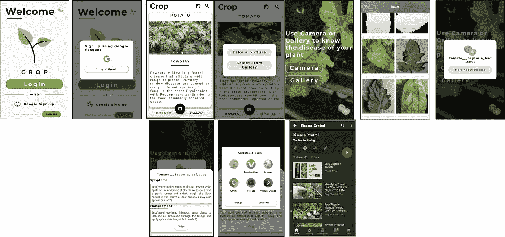

Demo of Crop App.

在这篇文章中，我将解释我们如何使用深度学习模型来检测和分类植物的疾病，并通过视频指导农民，并给出即时补救措施，以克服植物和田地的损失。首先，我们必须了解

1.  原因是什么，如何克服原因？

2.这样做有什么好处？

3.我们能用**“深度学习技术”解决这个问题吗？**

4.在深度学习“**中，哪个算法“**被用来解决这个问题？如何做到这一点？。

> 注意:我只对番茄和土豆植物这样做。你可以通过收集该植物的数据来为其他植物做这件事。

# 它也部署到 Web 应用程序。查看下面的链接。

[](https://cropify.herokuapp.com/) [## 作物:植物病害标识符

### 想知道你的植物感染了什么类型的疾病，然后上传(番茄、土豆)植物的图片并进入…

cropify.herokuapp.com](https://cropify.herokuapp.com/) 

# 1.起因及简介。

> 过去和现在，农民通常用肉眼检测作物病害，这使得他们在使用哪种肥料上做出艰难的决定。它需要疾病类型的详细知识和大量经验来确保实际的疾病检测。一些疾病看起来和农民很相似，经常让他们感到困惑。请看下图以获得更多的理解。

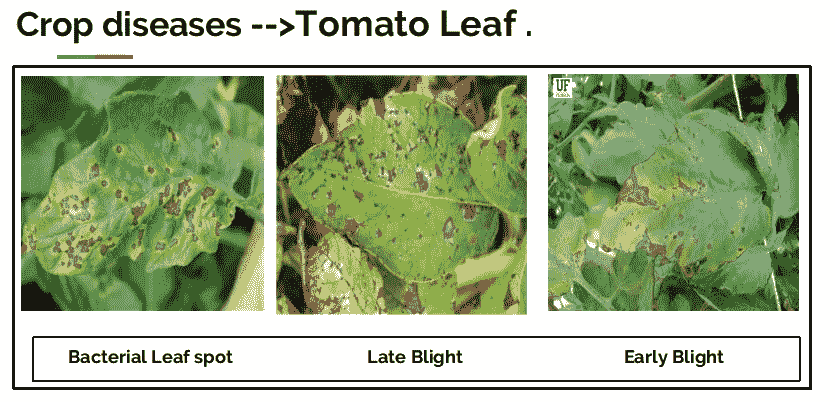

**Similar Symptoms but different diseases.**

他们看起来一样，几乎相似。如果农民作出错误的预测，使用错误的肥料或超过正常剂量(或)阈值或限制(每种植物都有一些阈值肥料喷洒要遵循)，它将搞乱整个植物(或)土壤，并对植物和田地造成足够的损害。

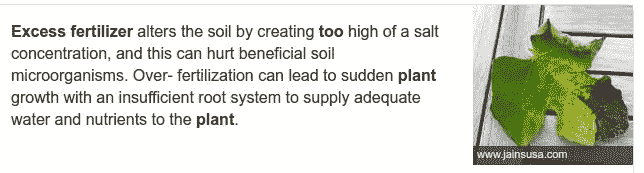

Cause of overdose of fertilizers. (Source: jainsusa.com)

## 那么，如何防止这种情况的发生呢？

为了防止这种情况，我们需要更好和更完善的指导来使用哪种肥料，以正确识别疾病，并能够在视觉上区分两种或更多种相似类型的疾病。

这就是人工神经网络派上用场的地方。简言之，安

# 2.安是什么？

> 人工神经网络是基于生物神经网络结构的计算模型，设计用于模拟存在于我们大脑中的生物神经网络的实际行为。


Combining the Multiple ANN’s.

所以我们可以分配一些东西给它，它完成我们的工作。人工神经网络帮助我们对疾病做出正确的识别，并指导正确的施肥量。

只有一个安不能完成我们的工作。因此，我们将它们一个接一个地堆叠起来，形成一个层，我们可以在输入层(给出权重和数据)和输出层(结果)之间形成多个层，这些多个层称为隐藏层，然后它会形成一个 ***深度神经网络，对它的研究称为深度学习。***

# 2.1 深度神经网络看起来怎么样。

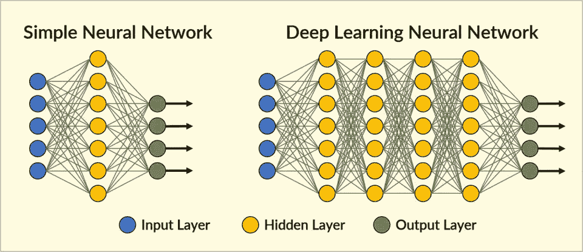

Simple vs Deep Neural Nets.

简单的神经网络善于学习输入和输出层之间的一个隐藏层的权重。但是，它不擅长复杂的特征学习。

另一方面，深度学习神经网络，输入和输出层之间的一系列层被称为隐藏层，可以执行特征识别，并从数据中创建新的一系列特征，就像我们的大脑一样。我们推进的层越多，它将学习和执行复杂操作的功能就越多。输出图层组合所有要素并进行预测。

因此，简单的神经网络用于简单的任务，不需要大量数据来训练自己。而在深度学习中，神经网络可能很昂贵，并且需要大量数据集来训练自己。我不想讨论这个话题，因为它超出了本文的范围。

> 如果你是深度学习概念的绝对初学者，下面的链接将有助于获得所有基础知识。

[](/the-basics-of-deep-neural-networks-4dc39bff2c96) [## 深度神经网络的基础

### 随着 Tensorflow 2.0 和 Fastai 等库的兴起，实现深度学习已经变得触手可及

towardsdatascience.com](/the-basics-of-deep-neural-networks-4dc39bff2c96) 

# 2.2 什么类型的深度学习模型最适合这种场景？？

这就是**卷积神经网络(CNN 或 Conv 网)**。它被广泛应用于图像和视频识别、推荐系统和自然语言处理等领域。然而，**卷积**比**更**有效，因为它减少了参数的数量，这与其他深度学习模型不同。

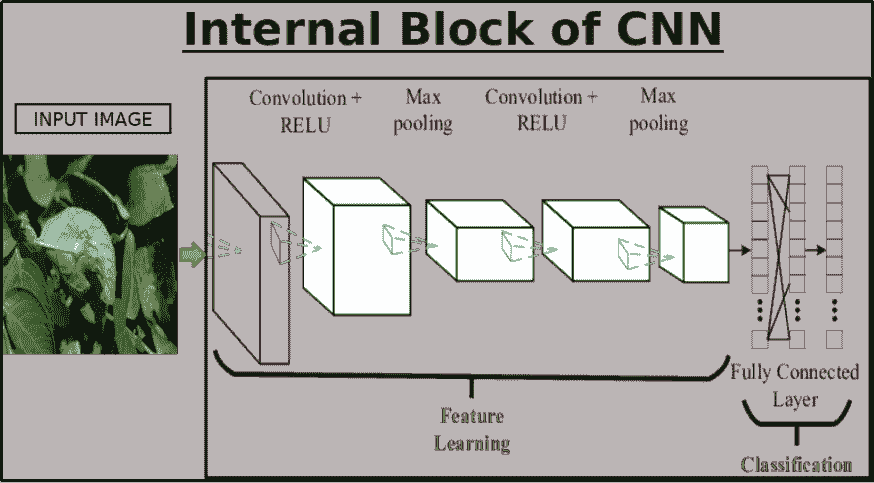

**CNN Architecture.**

为了简单起见，我将仅解释对该模型的简要理解以及用于构建卷积神经网络的步骤。

# 构建 CNN(或)Conv 网络的主要步骤:

1.  卷积运算
2.  ReLU 层(整流线性单元)
3.  池层(最大池)
4.  变平
5.  全连接层

开始写代码。

**1。卷积**是从输入图像中提取特征的第一层，它使用输入图像的**内核或过滤器**来学习特征之间的关系。

2. **ReLU 层:** ReLU 代表非线性操作的整流线性单元。输出为***(x)= max(0，x)。*** 我们用这个是因为要给 CNN 引入非线性。

3.**池层:**通过下采样减少参数数量，只保留有价值的信息做进一步处理。共有几种类型:

*   最大池(选择此项)。
*   平均池和总和池。

4.**展平:**我们将整个矩阵展平成一个垂直的向量。因此，它将被传递到输入层。

5.**完全连接层:**我们将展平后的矢量传递给输入层。我们将这些特征结合起来创建了一个模型。最后，我们有一个激活函数，如 softmax 或 sigmoid 来对输出进行分类。

# 3.了解了 CNN 的运作。接下来呢？？

1.  **收集数据(图像)**

收集尽可能多的数据集，包括受疾病影响的图像和健康的图像。您应该需要批量数据。


**2。建设 CNN。**

使用一些流行的开源库构建 CNN，用于开发人工智能、机器学习和深度学习。

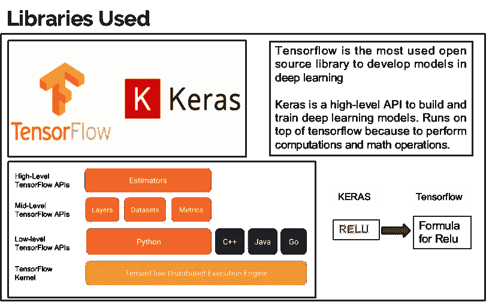

Open Source Libraries.

**3。选择任何基于云的数据科学 IDE。**

在云中训练模型是很好的，因为它需要巨大的计算能力，我们的普通机器笔记本电脑和计算机无法承受。如果你有一个好的 GPU 配置笔记本电脑，你可以在你的本地机器上训练。我选择 Google colab 你可以选择任何你喜欢的云。

**谷歌 Colab:**

> Google colab 是一个免费的云服务，提供免费的 GPU(12Gb 内存)。这是训练我们的模型的最便捷的方法，不需要在我们的机器上安装任何库。它完全在云上工作。它预装了所有的依赖项。


Google Colab offers free GPU.

登录 colab 并创建一个新的 python 笔记本(ipynb)切换到 GPU 模式并开始编写代码。

## 4.开始写代码。

> 在编写代码之前，数据应该存储在 Google drive 中。

源代码可以在这里找到我的 GitHub [链接](https://github.com/Manikanta-Munnangi/CROP---Plant-Disease-Identification-Using-App)。

> ***第一步:从 google drive 挂载数据*。**

```
from google.colab import drive
drive.mount(‘/content/your path’)
```

> ***第二步:导入库。***

```
# Import Libraries
import os
import glob
import matplotlib.pyplot as plt
import numpy as np# Keras API
import keras
from keras.models import Sequential
from keras.layers import Dense,Dropout,Flatten
from keras.layers import Conv2D,MaxPooling2D,Activation,AveragePooling2D,BatchNormalization
from keras.preprocessing.image import ImageDataGenerator
```

> ***第三步:将训练和测试数据加载到单独的变量中。***

```
# My data is in google drive.
train_dir ="drive/My Drive/train_set/"
test_dir="drive/My Drive/test_data/"
```

> ***第四步:获取训练和测试数据中图像数量的函数。***

```
# function to get count of images
def get_files(directory):
  if not os.path.exists(directory):
    return 0
  count=0
  for current_path,dirs,files in os.walk(directory):
    for dr in dirs:
      count+= len(glob.glob(os.path.join(current_path,dr+"/*")))
  return count
```

> ***第五步:查看每张中的图片数量。***

```
train_samples =get_files(train_dir)
num_classes=len(glob.glob(train_dir+"/*"))
test_samples=get_files(test_dir)
print(num_classes,"Classes")
print(train_samples,"Train images")
print(test_samples,"Test images")
```

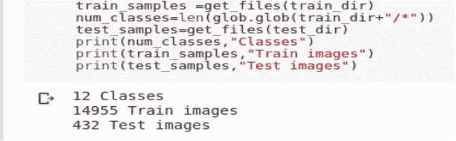

5.Output.

*   收集 12 类= 12 种类型的疾病图像。
*   14955 张火车图片
*   432 张测试图片(我只错拍了几张图片测试)。
*   为了预测，我只从看不见的数据中提取了一些样本。我们可以使用作为训练数据一部分的验证数据进行评估。

> ***第六步:将我们的原始数据预处理成可用的格式。***

```
# Pre-processing data with parameters.
train_datagen=ImageDataGenerator(rescale=1./255,
                                   shear_range=0.2,
                                   zoom_range=0.2,
                                   horizontal_flip=True)
test_datagen=ImageDataGenerator(rescale=1./255)
```

*   在(0–1)之间重新调整图像值称为标准化。
*   无论您对训练做什么预处理，都应该进行并行测试。
*   所有这些参数都存储在变量“ **train_datagen 和 test_datagen”中。**

> ***步骤 7:从训练和测试目录中生成扩充数据。***

```
# set height and width and color of input image.
img_width,img_height =256,256
input_shape=(img_width,img_height,3)
batch_size =32train_generator =train_datagen.flow_from_directory(train_dir,
                                target_size=(img_width,img_height),                                                    batch_size=batch_size)
test_generator=test_datagen.flow_from_directory(test_dir,shuffle=True,target_size=(img_width,img_height),                                               batch_size=batch_size)
```

*   获取一个目录的路径，并生成批量的扩充数据。在无限循环中无限期生成批次。
*   批量指的是在一次迭代中使用的训练样本的数量。

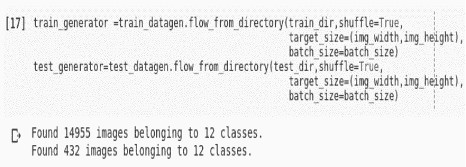

7.Output.

> ***第八步:获取 12 个疾病名称/类别。***

```
# The name of the 12 diseases.
train_generator.class_indices
```

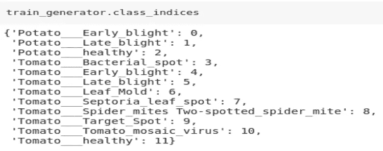

8.Disease Names.

> ***第九步:建立 CNN 模型***

```
# CNN building.
model = Sequential()
model.add(Conv2D(32, (5, 5),input_shape=input_shape,activation='relu'))
model.add(MaxPooling2D(pool_size=(3, 3)))
model.add(Conv2D(32, (3, 3),activation='relu'))
model.add(MaxPooling2D(pool_size=(2, 2)))
model.add(Conv2D(64, (3, 3),activation='relu'))
model.add(MaxPooling2D(pool_size=(2, 2)))   
model.add(Flatten())
model.add(Dense(512,activation='relu'))
model.add(Dropout(0.25))
model.add(Dense(128,activation='relu'))          
model.add(Dense(num_classes,activation='softmax'))
model.summary()
```

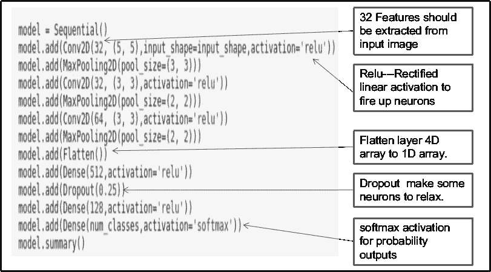

9.Summary of layers.

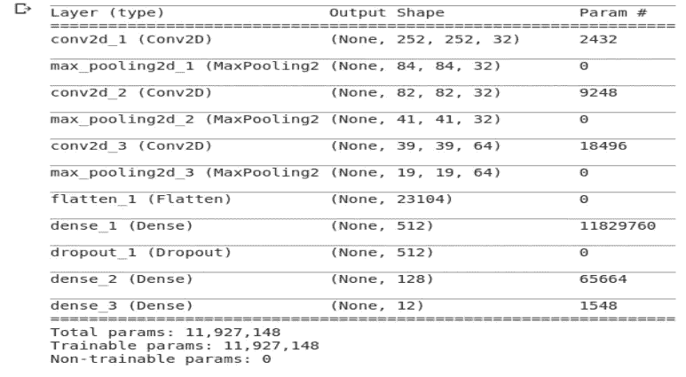

9\. Output.

CNN 收缩参数，学习特征，存储有价值的信息，输出形状在每一层后递减。**我们能看到每一层的输出吗？是啊！！我们可以。**

> ***步骤 10:每一层之后的图像可视化。***

```
from keras.preprocessing import image
import numpy as np
img1 = image.load_img('/content/drive/My Drive/Train_d/Tomato___Early_blight/Tomato___Early_blight/
(100).JPG')
plt.imshow(img1);
#preprocess image
img1 = image.load_img('/content/drive/MyDrive/Train_d/
Tomato___Early_blight/Tomato___Early_blight(100).JPG', target_size=(256, 256))
img = image.img_to_array(img1)
img = img/255
img = np.expand_dims(img, axis=0)
```

*   从训练数据集获取样本图像，并在每一层后可视化输出。
*   **注意:新样本图像需要预处理。**

```
from keras.models import Model
conv2d_1_output = Model(inputs=model.input, outputs=model.get_layer('conv2d_1').output)
max_pooling2d_1_output = Model(inputs=model.input,outputs=model.get_layer('max_pooling2d_1').output)conv2d_2_output=Model(inputs=model.input,outputs=model.get_layer('conv2d_2').output)
max_pooling2d_2_output=Model(inputs=model.input,outputs=model.get_layer('max_pooling2d_2').output)conv2d_3_output=Model(inputs=model.input,outputs=model.get_layer('conv2d_3').output)
max_pooling2d_3_output=Model(inputs=model.input,outputs=model.get_layer('max_pooling2d_3').output)flatten_1_output=Model(inputs=model.input,outputs=model.get_layer('flatten_1').output)conv2d_1_features = conv2d_1_output.predict(img)
max_pooling2d_1_features = max_pooling2d_1_output.predict(img)
conv2d_2_features = conv2d_2_output.predict(img)
max_pooling2d_2_features = max_pooling2d_2_output.predict(img)
conv2d_3_features = conv2d_3_output.predict(img)
max_pooling2d_3_features = max_pooling2d_3_output.predict(img)
flatten_1_features = flatten_1_output.predict(img)
```

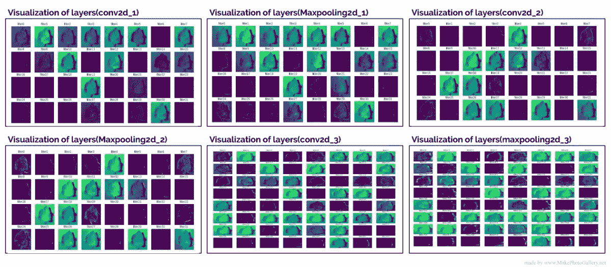

10\. Visualization

> ***第十一步。开始用参数训练 CNN。***

```
validation_generator = train_datagen.flow_from_directory(
                       train_dir, # same directory as training data
                       target_size=(img_height, img_width),
                       batch_size=batch_size)opt=keras.optimizers.Adam(lr=0.001)
model.compile(optimizer=opt,loss='categorical_crossentropy',metrics=['accuracy'])
train=model.fit_generator(train_generator,nb_epoch=20,                             steps_per_epoch=train_generator.samples//batch_size,                        validation_data=validation_generator,nb_val_samples=validation_generator.samples // batch_size,verbose=1)
```

*   Adam 优化器与学习率=0.001 一起使用
*   损失函数 categorical _ crossentropy 用于我们的**多类分类问题**。度量标准是**“准确性”。**
*   Fit_generator 用于训练 CNN 模型。使用验证数据参数对**模型进行微调。**

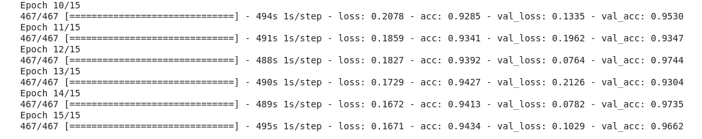

11\. Train and validation Accuracy and Loss.

> **第 12 步:保存模型权重。**

*   保存模型权重以防止模型的重新训练。

```
# Save model
from keras.models import load_model
model.save('crop.h5')
```

> **步骤 13:从保存的权重加载模型。**

```
# Loading model and predict.
from keras.models import load_model
model=load_model('crop.h5')# Mention name of the disease into list.
Classes = ["Potato___Early_blight","Potato___Late_blight","Potato___healthy","Tomato___Bacterial_spot","Tomato___Early_blight","Tomato___Late_blight","Tomato___Leaf_Mold","Tomato___Septoria_leaf_spot","Tomato___Spider_mites Two-spotted_spider_mite","Tomato___Target_Spot","Tomato___Tomato_mosaic_virus","Tomato___healthy"]
```

*   提到这个名字是因为我们的输出是**数字格式。我们把它铸造成字符串。**

> ***第十四步:预测***

```
import numpy as np
import matplotlib.pyplot as plt# Pre-Processing test data same as train data.
img_width=256
img_height=256
model.compile(optimizer='adam',loss='categorical_crossentropy',metrics=['accuracy'])from keras.preprocessing import imagedef prepare(img_path):
    img = image.load_img(img_path, target_size=(256, 256))
    x = image.img_to_array(img)
    x = x/255
    return np.expand_dims(x, axis=0)

result = model.predict_classes([prepare('/content/drive/My Drive/Test_d/Tomato_BacterialSpot/Tomato___Bacterial_spot (901).JPG')])
disease=image.load_img('/content/drive/My Drive/Test_d/Tomato_BacterialSpot/Tomato___Bacterial_spot (901).JPG')
plt.imshow(disease)
print (Classes[int(result)])
```

*   我们需要预处理我们的图像，以传入一个模型来预测
*   首先，我们调整图像的大小=== >图像(150，150)
*   将图像转换为数组，这将增加通道=== >图像(150，150，3) RGB
*   Tensorflow 处理批量图像我们需要指定图像样本===>(1，150，150，3)。
*   Predict_classes 帮助预测新图像属于各自的类。

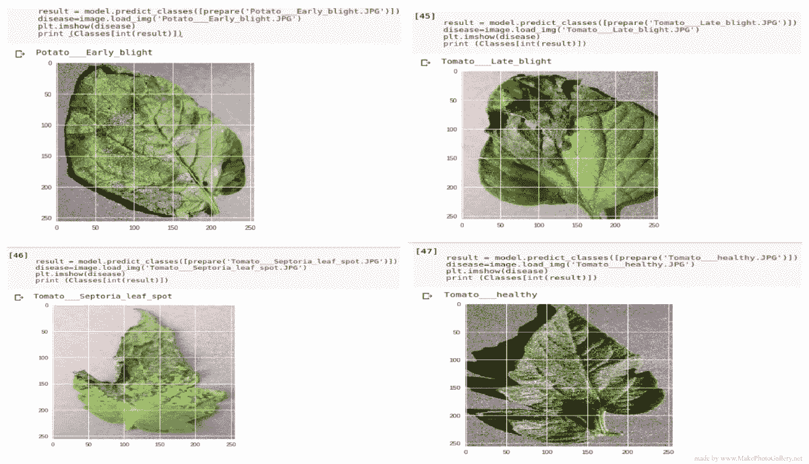

14.Predictions on test data, different diseases.

> ***最后一步:将模型转换成“tflite”。***

```
from tensorflow.contrib import lite
converter = lite.TFLiteConverter.from_keras_model_file( 'crop.h5' ) 
model = converter.convert()
file = open( 'output.tflite' , 'wb' ) 
file.write( model )
```

*   为了让我们的模型与应用程序通信，我们必须转换为 TensorFlow lite 版本，tflite 是为移动版本而设计的。
*   因此，您可以构建或创建一个移动应用程序，并使该应用程序与模型进行通信。

你可以使用 Google flutter 框架来构建具有漂亮用户界面的应用程序。


Google flutter framework.

> **在**进入 App 部分之前，您需要从 [**官网将颤振环境安装到您的机器上。**](https://flutter.dev/docs/get-started/install)

打开 flutter 编辑器，无论是 Android studio 还是 visual studio，都可以进行编码。


Editors of Flutter.

> 创建一个新的 flutter 项目，并将项目文件中的一个文件夹拖放到我们的 flutter 项目的 assets 文件夹中。以下名称已更改，但 tflite 文件是相同的。

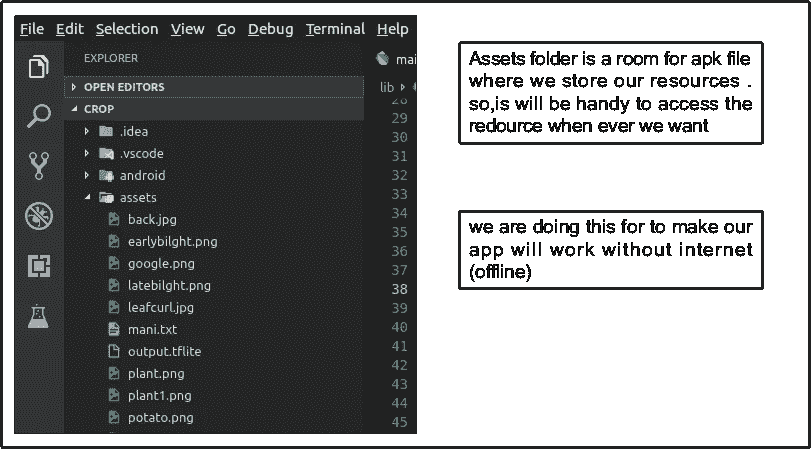

Flutter Assets folder.

App 用户界面可以自己选择，可以通过学习 flutter 做一个，也可以直接用我的 flutter app 界面。可以在我的 Github 里找到。

完成将“output.tflite”放入 assets 文件夹后，开始在仿真器和**测试模型中运行应用程序，使用测试文件夹中的一些图片以及模型之前未见过的真实图像。**

# 结论:

植物疾病是主要的食物威胁，在它导致整个田地的进一步损失之前，应该被克服。但是，通常情况下，制定者不能区分相似的症状，但面对不同的疾病。这将误导错误或过量施肥。在这里，我们采用卷积神经网络(CNN)多层人工神经网络，称为深度学习算法，以减少这种损失，并通过视频课程指导农民。这可以通过手机应用程序来完成，“不是所有的农民，但有些人确实使用它。”

> 我希望以上内容对阅读这篇文章的每个人都有用。我肯定会提出与数据科学、ML 和 DL 相关的话题。快乐学习:)

# 感谢您的阅读…

[我的 Github 个人资料。](https://github.com/Manikanta-Munnangi)