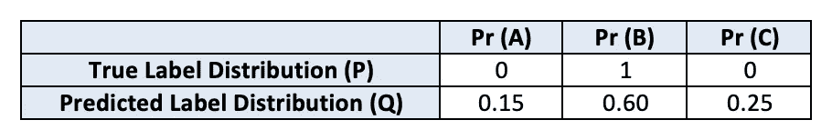

# 假人的交叉熵

> 原文：<https://towardsdatascience.com/cross-entropy-for-dummies-5189303c7735?source=collection_archive---------4----------------------->

## 为数据科学家简单直观地解释信息、熵和交叉熵


交叉熵通常被用作分类问题的损失函数，但由于历史原因，大多数交叉熵的解释都是基于数据科学家可能并不熟悉的通信理论。不理解熵就不能理解交叉熵，不知道什么是信息就不能理解熵。本文以一种易于理解的方式构建了交叉熵的概念，而不依赖于其传播理论背景。

# 信息

让我们考虑三个说明性的实验。

(1)我扔硬币，我给你一个信息，硬币正面朝上。这条消息向你传达了一些信息。多少信息？假设您从这条消息中获得了一点信息。

```
Coin came up heads (probability=0.5) | Information = 1 bit
```

(2)早上我叫醒你，告诉你*太阳升起*。你耸耸肩，生气地回去睡觉，因为这个消息很明显，没有给你新的信息。

```
Sun rose (probability=1) | Information = 0 bits
```

(3)早上我叫醒你，告诉你*太阳没有升起*。你震惊地走出来，看到这个世界变得疯狂。这是突发新闻——大量的信息。

```
Sun did not rise (probability=0) | Information = ∞ bits
```

从上面的例子中，你可能已经推断出包含在关于事件的消息中的信息与事件的不确定性和惊奇值有关。不太可能发生的事件比可能发生的事件给你更多的信息。克劳德·香农在他关于信息论的开创性著作中正式提出了信息背后的这种直觉。他将信息定义为:

```
I(x) = -log₂P(x) ..where P(x) is probability of occurrence of x
```

信息量化了单一事件中的不确定性。

# 熵

如果你感兴趣的不是一个单一的事件，而是一系列的事件呢？考虑下面的例子。一个箱子里有 2 个红色球、3 个绿色球和 4 个蓝色球。现在，我不是扔硬币，而是随机挑出一个球给你。每次我选一个球，你会收到多少信息？我们将*挑选一个球*建模为由随机变量 X 表示的随机过程。然后，X 的熵被定义为 X 中的结果所传达的信息的*期望值*。使用我们上面的信息定义，我们得到:

```
P(red ball) = 2/9; I(red ball) = -log₂(2/9)
P(green ball) = 3/9; I(green ball) = -log₂(3/9)
P(blue ball) = 4/9; I(blue ball) = -log₂(4/9)Entropy = E[I(all balls)] 
= -[(2/9)*log₂(2/9) + (3/9)*log₂(3/9) + (4/9)*log₂(4/9)]
= 1.53 bits.
```

**随机变量 X 的期望值或期望，记为 E[X]，是 X 的所有值按其出现的概率加权后的平均值。*

换句话说，每次我从垃圾箱里拣出一个球，你平均可以得到 1.53 比特的信息。

形式上，随机变量的概率分布的熵 H 被定义为:


上式中的 x~P 表示 x 取的值来自分布 P，在我们的例子中，P = (2 红，3 绿，4 蓝)。

# 交叉熵

交叉熵度量同一组事件的两个概率分布之间的相对熵。直观地说，要计算 P 和 Q 之间的交叉熵，只需使用 P 的概率权重计算 Q 的熵。形式上:


让我们考虑具有两个仓的相同仓例子。

Bin P = {2 红色，3 绿色，4 蓝色}

Bin Q = {4 红色，4 绿色，1 蓝色}

```
H(P, Q) = -[(2/9)*log₂(4/9) + (3/9)*log₂(4/9) + (4/9)*log₂(1/9)]
```

# 作为损失函数的交叉熵

取代上面的人为例子，让我们来看一个机器学习的例子，其中我们使用交叉熵作为损失函数。假设我们建立一个分类器，预测三类样本:A，B，c。

设 P 是真实的标签分布，Q 是预测的标签分布。假设一个特定样本的真实标签是 B，我们的分类器预测 A，B，C 的概率为(0.15，0.60，0.25)



交叉熵 H(P，Q)将为:

```
H(P, Q) = -[0 * log₂(0.15) + 1 * log₂(0.6) + 0 * log₂(0.25)] = 0.736
```

另一方面，如果我们的分类器更有信心，预测概率为(0.05，0.90，0.05)，我们将得到交叉熵为 0.15，低于上面的示例。

# 与最大似然的关系

对于分类问题，使用交叉熵作为损失函数相当于最大化对数似然。考虑下面的二元分类情况，其中 a、b、c、d 表示概率:


```
H(True, Predicted)
= -[a*log(b) + c*log(d)]
= -[a*log(b) + (1-a)*log(1-b)]
= -[y*log(ŷ) + (1-y)*log(1-ŷ)]
..where y is true label and ŷ is predicted label
```

这与最大似然估计的等式相同。

# 结论

由于历史原因，您经常会发现交叉熵是在通信理论的背景下定义的，例如:*交叉熵是当我们使用模型 q 时，对来自分布为 p 的源的数据进行编码所需的平均位数。*大多数数据科学家从未研究过通信理论。我希望他们会发现上面的文章很有用。

*如果你喜欢这篇文章，可以在* [*中型*](https://medium.com/@diningphilosopher) *上查看我的其他作品，在*[*LinkedIn*](https://www.linkedin.com/in/kulkarniviraj/)*或*[*Twitter*](https://twitter.com/VirajZero)*，查看我的* [*个人网页*](https://virajkulkarni.org/) *，或发邮件给我*[*viraj@berkeley.edu*](mailto:%20viraj@berkeley.edu)