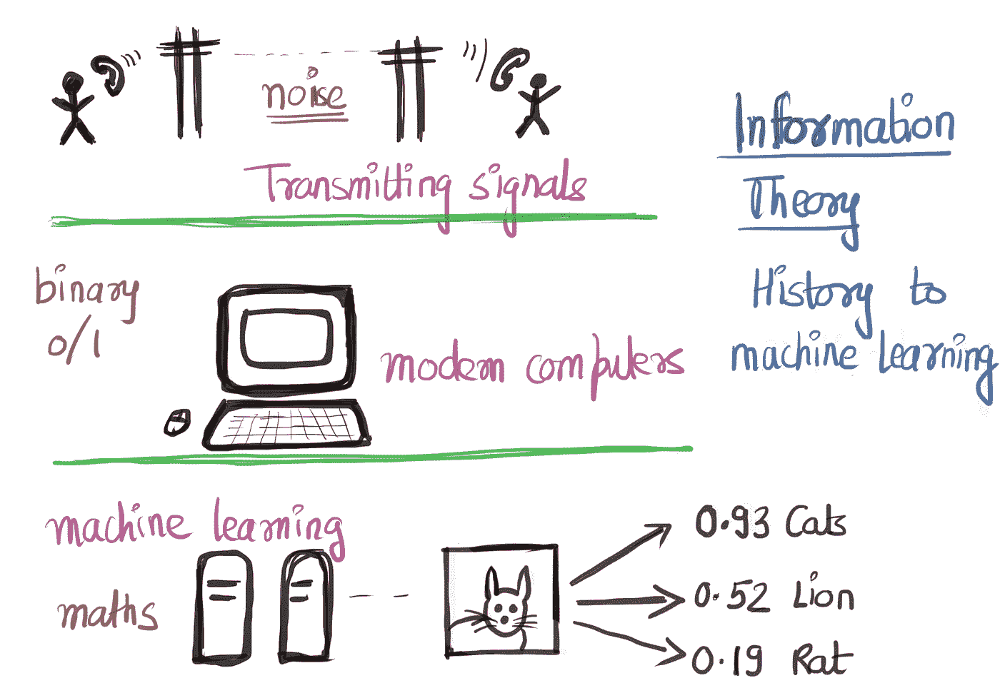

# 交叉熵:从信息论的角度

> 原文：<https://towardsdatascience.com/cross-entropy-from-an-information-theory-point-of-view-456b34fd939d?source=collection_archive---------10----------------------->

交叉熵是分类问题机器学习中广泛使用的损失函数。信息论被广泛使用，但是在课堂上并没有解释使用它背后的基本原理。在这篇博客中，我们对信息论进行了直观的理解，并最终将其与交叉熵函数联系起来。

**历史:**电信是通过不可靠的信道实现的，在这些信道中，传输的信号往往不等于接收的信号，因为它们被噪声破坏了。Shannon 提出，可以开发一种编码器-解码器系统，该系统可以在讹误量不确定的情况下以最小讹误检索传输信号。这可以通过冗余来实现，即如果一个信号是 aaa，发送三个信号，每个 aaa，如果一个被破坏为 aab，另两个可以通过*共识来确认传输的信号是 aaa。*所有这些都是以比特和信道速率**发送的*r*=发送的有用比特数/总比特数。香农证明了误差可能是 0，即使 ***r*** 是> > 0(他证明了它是 0.5)。**

香农在等式(1)中定义了信号 ***的**信息内容**和信息***x*。他声称这是测量信息内容的正确方法。从(1)可以看出，对于一个不确定事件，信息量是最大的。等式(2)给出了发射信号总体的信息内容。Shannon 声称 h(x)应该是压缩文件的长度，我们应该渴望对信息进行编码，以便唯一识别。他证明了我们不能将信息编码成许多比特。更高的不确定性=更高的 h(x)值，这意味着需要更多的冗余来编码信息(这是有道理的，对吧)。例如，通过研究一座倒塌的桥(一种罕见的事件)来了解为什么一座桥会倒塌，比研究完美的桥要多得多。*

***(1)***x = h(x = a)= ln(1/P(x = a))的信息内容**

***(2)** h(x) = *求和超过所有 a*(**P(x = a)ln(1/P(x = a))**)*

*当所有人都具有**相等的概率**时，h(x)对于系综是最大的。在我们继续之前，让我们举一个例子。例如，如果我在想一个介于 1-100 之间的数字，并要求您在最少的尝试次数中猜出它，“最佳优先”问题是“如果该数字小于 50”。这是最好的问题，因为它给出了关于我的号码的最大信息(排除了 50 个选项)。如果你的第一个问题是“这个数字是否小于 1”，如果答案是“否”，你很可能没有获得足够的信息(因为你只剩下 99 个选项)。因此，当我们选择一个数字 50 将集合分成**等概率时，信息内容最大化。**根据香农原理，提供 1 比特的信息可以将不确定性降低 1/2。*

***熵:**定义为期望的信息量(等式 2)。它也是信息不确定性的一种度量。如果不确定性高，熵就高。例如，如果我们有一个装满的硬币，每次都是正面朝上，那么熵为 0，因为没有来自硬币投掷的信息(因为它总是正面朝上)。*

*如果我们必须编码一条长度为 *l* 的信息，我们不能用比熵少的位数来编码它(等式 2)。用于传递信息的代码的平均长度不能少于所发送信息的“比特数”。为了唯一识别长度为 *l、*的信号，我们可以使用 2^ *l* 位(0 或 1)。一条信息的理想长度 *i* 如等式(3)所示。为了唯一可识别(基于 Kraft 不等式)，编码的长度如等式(4)所示。*

***(3)***l _ I = h(x _ I)= ln(1/p _ I)**

***(4)***l _ I = ln(1/q _ I)-ln(Z)*其中 Z 为归一化常数> 0 且≤ 1*

*所需总位数之和 ***L*** =所有位之和*I*(*p _ I*x*L _ I*)。使用来自(4)的 *l_i* 值，我们得到***L≥***h(X)+KL(p||q)其中 KL(p | | q)是 Kullback-Liebler 散度。因此，KL 散度是表示一组信息相对于理想编码位所需的额外编码长度。现在我们已经了解了 KL 背离背后的历史，让我们来看一下统计数据。*

***Kullback-Liebler** 散度是“*P 与 Q 的不同程度的度量”*。它是使用等式(2)的两个分布中包含的信息之间的差异，通常从期望分布的角度来测量(分类问题中的真实类别)。从真实分布的角度来看，KL 散度是对新分布进行编码所需的信息内容+额外比特。现在，设置好这些部分后，我们来看看交叉熵。*

***交叉熵** = ***总和超过所有 I****(****Y _ I****x***ln(Y _ I/Y _ hat _ I****)***。**对所有 *i* 求和，并通过分离和丢弃 *ln()* 项内的常数分子进行简化，交叉熵保持在***sum over all I****(****Y _ I***x***ln(1/Y _ hat _ I)***)**

**如果真实分布是 *Y* 预测是 *Y_hat，*和 *Y 不等于 Y_hat，*由于我们永远不知道真实分布，交叉熵不等于熵。**

**差=***-对所有 I 求和(Y _ I(log(Y _ hat _ I)-log(Y _ I))= KL(Y | | Y _ hat)*****

**因此，交叉熵实际上是真实分布和来自机器学习模型的分布之间的熵+ KL 散度的度量。**

****参考文献:****

1.  **大卫·麦凯教授信息论系列讲座**
2.  **[关于 KL 散度+交叉熵的 Youtube 视频](https://www.youtube.com/watch?v=ErfnhcEV1O8)**