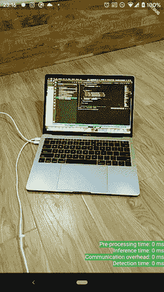
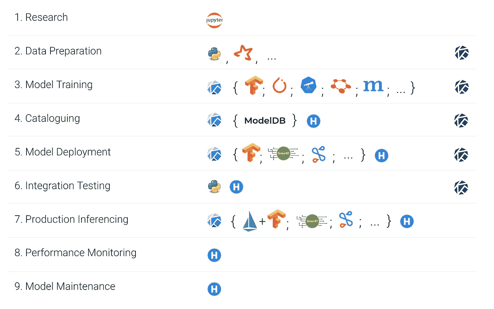

# 跨平台的设备上 ML 推理

> 原文：<https://towardsdatascience.com/cross-platform-on-device-ml-inference-a55b67e306b3?source=collection_archive---------9----------------------->

## 张量流建兴英尺。摆动

随着 [Flutter 1.9 和 Dart 2.5](https://medium.com/dartlang/announcing-dart-2-5-super-charged-development-328822024970) 的发布，有太多令人兴奋的东西可以尝试，但真正引起我注意的是 Dart 的 ML Complete。它使用`[tflite_native](https://github.com/dart-lang/tflite_native)`，T0 又通过 [Dart FFI](https://dart.dev/guides/libraries/c-interop) 使用 [TensorFlow Lite C API](https://github.com/tensorflow/tensorflow/blob/master/tensorflow/lite/experimental/c/c_api.h) 。

它立即在我的脑海中引发了一个疯狂的想法，为多个平台(iOS，Android，Mac，Windows，Linux，甚至 Web)上的应用程序提供一个单一的代码库，可以进行低延迟的本地机器学习推理。

以前，它不是真正的单一代码库，即使是使用 Flutter，因为必须有一些来自使用[平台通道](https://flutter.dev/docs/development/platform-integration/platform-channels)的平台端的代码，但是使用 FFI，我们现在可以说它是真正的单一代码库。

经过几次试错迭代，我终于用`tflite_native`得到了 TensorFlow 物体检测的原型。源代码是 MIT 许可的，可以在 [my Github](https://github.com/truongsinh/flutter_ssd_mobilenet/) 上找到。请注意，如果您在 iOS 上运行这个源代码示例，请使用来自开发频道(`flutter channel dev; flutter upgrade`)的 Flutter 1.10.x，因为`DynamicLibrary.process()`在 1.9.1 稳定版中被删除，后来又被重新添加([参考](https://groups.google.com/d/msg/dart-ffi/dyFDpRq2I4E/Aj-ozil7AwAJ))。

这是一个漫长而多事的旅程，所以我将把它分成一系列文章，每篇文章都独立工作，没有额外的上下文，可能有不同的受众。

*   这篇文章是关于使用`tflite_native`来加载模型和标签，创建解释器，预处理输入到模型，并解释来自模型的输出数据。
*   一篇即将发表的关于制作没有任何平台通道的`tflite_native`、Flutter 插件的文章。
*   即将发布的一篇关于 TensorFlow Lite 范围之外的应用程序的 Dart/Flutter 基础架构的文章，例如依赖项隔离以及 FFI 如何用于在 Dart 中执行不安全的并行线程。

# 1.配置依赖关系和资产

要加载 tflite 模型，首先，我们需要在我们的资产中有这个模型。下载 [zip 文件](https://storage.googleapis.com/download.tensorflow.org/models/tflite/coco_ssd_mobilenet_v1_1.0_quant_2018_06_29.zip)，解压到 Flutter 项目的`assets`文件夹中，然后在`pubspec.yaml`中声明资产。

有两个资产，`model.tflite`和`labels.txt`，它们都已被重命名。第一个文件是预先训练好的 ML 模型，我们可以用它来做预测，但是输出只是数字，其中有标签的索引，存储在第二个文件中。

对于这个原型，我们还需要`path_provider`、`camera`、`image`，当然还有`tflite_native`。`path_provider`用于从资产中加载模型，`camera`用于获取实时(原始)图像流，`image`用于将原始图像处理成可用的 RGB 格式，以便提供给我们的模型。对于`tflite_native`，现在我们将使用我的分叉版本。

我们还需要配置`ios/Runner/Info.plist`来获得摄像机访问的许可。

# 2.加载 tflite 模型和标签

现在，直接从资产中加载 tflite 模型并不直接。当前的 C API 既可以从字节加载模型，也可以从可访问的文件加载模型。建议从可访问的文件中加载模型，因为在本质上，TfLite C API 使用了[内存映射文件](https://en.wikipedia.org/wiki/Memory-mapped_file) ( [mmap](https://en.wikipedia.org/wiki/Mmap) )，如果您需要在内存受限的设备上加载大型模型，这是至关重要的。不幸的是，来自平台端的 Flutter[没有任何从 bundle](https://github.com/flutter/flutter/issues/31501) `assets`中读取的简单方法，所以我们不得不解决这个问题，从`assets`中读取模型并写入一个临时文件，然后让 TfLite C API 从中读取。之后，我们创建一个`InterpreterOption`，设置我们想要的线程数量，加载模型并分配张量，然后返回准备使用的解释器。理想情况下，使用`InterpreterOption`，我们应该可以选择使用 GPU 或 NNAPI，这将显著减少推理时间，但目前这些 API 在 TfLite C API 中还不可用。

加载标签很简单(不一定很简单)，只需从`labels.txt`中读取文本，用新行分隔，然后[移位 1](https://en.wikipedia.org/wiki/Off-by-one_error) ，(我猜`labels.txt`中的第一个元素是为列表长度保留的)

# 3.预处理输入

快速回顾一下，一个模型可能有一个或多个`input tensors`(例如 SSD MobileNet 有 1 个输入张量，但是[艺术风格转移](https://codelabs.developers.google.com/codelabs/tensorflow-style-transfer-android/index.html)的转移模型有 2 个输入张量，1 个用于风格，1 个用于内容)。每个输入`tensor`都有一个[形状](https://www.tensorflow.org/api_docs/python/tf/shape)，是一个`int`的列表，例如`[1, 480, 640, 4]`，以及一个期望的输入类型，通常要么是 float32(非量化)，要么是 u_int8(量化)，但还有[其他](https://www.tensorflow.org/api_docs/java/reference/org/tensorflow/DataType)。了解形状和预期的输入类型对于为张量准备正确的输入非常重要。在我们的例子中，输入张量期望 [300 宽 x 300 高 x 3 通道颜色(RGB)，并且输入类型是 u_int8](https://www.tensorflow.org/lite/models/object_detection/overview#input) 。

取决于平台，我们从流中得到不同的原始图像。从相机流中获取原始图像的方法将在另一篇文章中介绍。在 Android 上，`camera`用 [YUV_420](https://developer.android.com/reference/android/graphics/ImageFormat#YUV_420_888) 返回 raw 图像，转换成 RGB 格式需要一点努力。

在 iOS 上，`camera`在 [BGRA](https://github.com/flutter/plugins/blob/master/packages/camera/lib/camera_image.dart#L64) 中返回 raw 图像，在`image`包的帮助下，我们可以轻松转换成 RGB。

现在我们已经有了 RGB 格式的图像，但不一定是正确的尺寸，因此我们需要调整大小并将其裁剪为 300x300 的正方形(在 Android 上，我们还必须旋转 90°，这是一个[已知问题](https://github.com/flutter/flutter/issues/16587))。最后，获取原始字节和原始图像大小(因为取决于我们是在 Android 还是 iOS 上，在条件旋转后可能是 640x480 或 480x640)

# 4.输入、调用模型、解释输出

来自前面的原始字节现在可以输入到我们的模型中，这个模型只有一个输入张量。我们只需要掌握它来设置数据和调用模型。

与只有 1 个张量的输入不同，这个模型的输出有 [4 个张量](https://www.tensorflow.org/lite/models/object_detection/overview#output):

我们将输出(从原始字节)解析为相应的近似数据类型。通过近似，我的意思是，如果输出是一个类似于`List<List<Float32>>`的 2D 列表，我们仍然将它解析为一个 1D 列表`List<Float32>`，并且稍后将解释为 2D 列表。

现在，我们有分散在 3 个不同变量中的检测结果，第一个是矩形位置的有序列表，第二个是分类索引的有序列表，其索引对应于我们的标签图，第三个是概率分数的列表(另外第四个是检测结果的数量)。我们需要将这 3 个有序列表合并成一个新列表，其元素具有检测到的英文类名(例如“bicycle”或“laptop”)、概率分数和矩形位置。

通常，我们只是做一个`for`循环，处理我们感兴趣的每个元素属性。对于检测到的英文类名，我们只需将其从`double`转换为`int`，并在我们之前加载的标签映射中查找它(并且已经移位 1)。对于概率分数，原始输出在 0.0 (0%)到 1.0 (100%)之间，所以我们直接用原始输出就好了。

矩形位置稍微复杂一点。如前所述，这个张量形状是一个矩形位置的列表，它本身是 4 个坐标点(上、左、下、右)的列表，每个坐标点都在 0.0(对应我们 300x300 输入图像的 0)和 1.0(对应我们输入图像的 300)之间。因此，如果其他列表有 10 个元素(10 个检测到的类名和概率分数)，这个 2D 列表，当展平到 1D 时，有 40 个元素。

换句话说，假设`i`是元素的索引

然后嘣💥，你有它！每当有来自相机流的图像时，它都会被处理，我们会得到一个检测结果列表，每个结果都有检测到的对象名称、概率分数(从 0.0 到 1.0)和矩形位置。要叠加这些位置，我们需要缩放它们的坐标以匹配底层图片，但这超出了本文的范围。从技术上讲，这段代码可以在所有的 Flutter 平台(iOS、Android、Linux、Windows、Mac)上运行，除了 web(但是如果 Flutter Web 和 TensorFlow.js 之间存在集成，我们也可以在以后使用)。然而，现在我们受到其他插件而不是`tflite_native`的限制，比如`camera`或`path_provider`。值得提醒的是`tflite_native`本身是用来给桌面上的 Dart 的 ML Complete 供电的。

# 最后的想法

机器学习不仅仅是下降梯度、二进制分类、加速线性代数(XLA)或其他令人生畏的术语。其实机器学习工作本身就相当宽泛，这里只做工作流的“产生式推理”。

Credit [hydrosphere.io](https://medium.com/hydrosphere-io/train-and-deliver-machine-learning-models-to-production-with-a-single-button-push-a6f89dcb1bfb)

更具体地说，产生式推理可以在功能强大的服务器上远程进行，和/或在用户的本地设备上进行。具体来说，对于 TensorFlow Lite 和`tflite_native`,我们做的是后者。尽管本地检测结果的准确性可能不如远程强大的服务器集群上的结果，但是本地推断具有其他优势，例如低延迟、不需要连接、不消耗互联网带宽，并且没有数据(潜在的个人和/或敏感性)离开用户的设备。事实上，本地推理和远程推理可以结合在一起，两全其美。在这个具体的例子中，我们可以进一步扩展，使本地应用程序可以检测到分数相当高的交通标志，并只将图像的这一部分发送到服务器，以进一步识别这是哪个交通标志(停止标志、速度限制、警告等)。)

做这个例子有助于你打开机器学习世界的大门。对于一个新的软件工程师来说，这并不太难，但也不太容易。完成这些，您将了解预训练的 ML 模型的通信方式(输入和输出)，并渴望了解更多有关使用 GPU(而不是 CPU)进行推理、量化与非量化训练模型的信息，或者将 a 从一种预训练模型转换为另一种模型( [pb vs chkpt vs tflite](https://www.tensorflow.org/guide/saved_model) )。

最后，随着[联合学习](https://ai.googleblog.com/2017/04/federated-learning-collaborative.html) (FL)越来越受欢迎，让我们希望 [TensorFlow 联合](https://www.tensorflow.org/federated) (TFF)将支持移动(FL 已经被用于训练[移动键盘的预测模型](https://arxiv.org/abs/1811.03604))，或者更疯狂，让我们希望 TFF 首先飘起😉

同样，源代码是 MIT 许可的，可以在 [my Github](https://github.com/truongsinh/flutter_ssd_mobilenet/) 上找到。