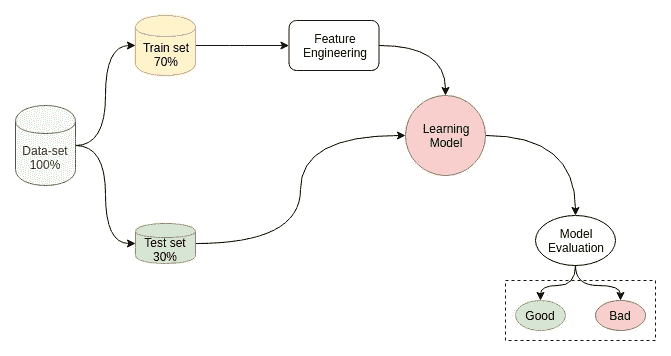
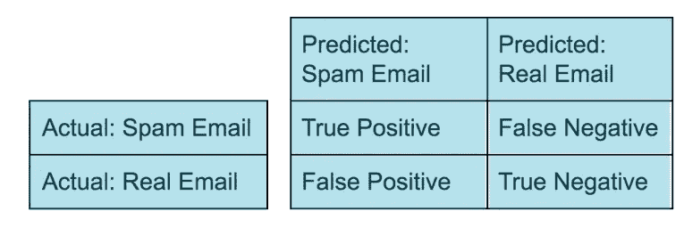
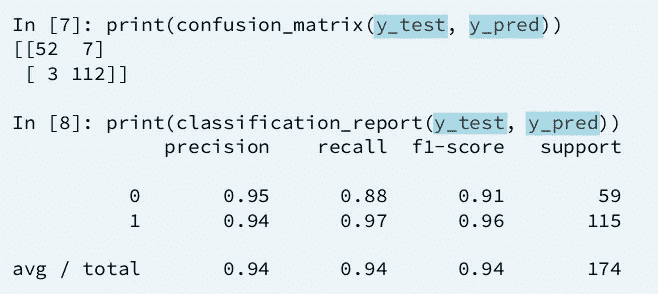
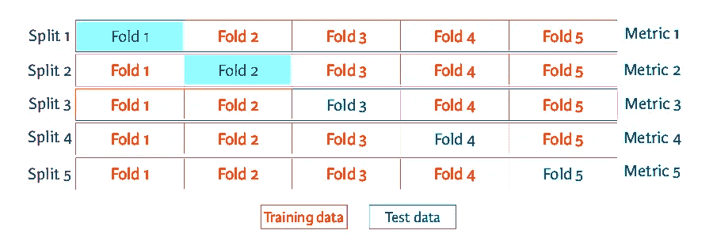

# 交叉验证—为什么和如何

> 原文：<https://towardsdatascience.com/cross-validation-430d9a5fee22?source=collection_archive---------1----------------------->


所以，你已经在一个不平衡的数据集上工作了几天，尝试了不同的机器学习模型，在你的数据集的一部分上训练它们，测试它们的准确性，你欣喜若狂地看到分数每次都超过 0.95。你真的认为你的模型达到了 95%的准确率吗？

# 需要评估

我假设您已经对数据集执行了顶级的预处理，并且已经移除了任何缺失值或分类值和噪声。无论你用什么最先进的算法来构建你的假设函数和训练机器学习模型，你都必须在前进之前评估它的性能。

现在评估一个模型最简单快捷的方法就是把数据集分成训练集和测试集，用训练集数据训练模型，用精度来检验它的精度。并且不要忘记在执行分割之前打乱数据集。但是这种方法根本不是一种保证，简单地说，在最终确定一个模型时，你不能依赖这种方法。你可能想知道——为什么？

让我们考虑一下，你正在处理一个*垃圾邮件*数据集，其中包含 *98%* 的垃圾邮件和 *2%* 的非垃圾邮件有效邮件。在这种情况下，即使您不创建任何模型，而只是将每个输入分类为垃圾邮件，您也将获得 0.98 的精确度。这种情况叫做 [***精度悖论***](https://en.wikipedia.org/wiki/Accuracy_paradox) *。*

想象一下，如果这是一个用于肿瘤细胞或胸部 x 光分类的模型，并且你已经将一个 98%准确的模型推向市场，会发生什么。也许这会杀死数百名病人，你永远不知道。


不要担心，拿一杯热的东西。在下面的文章中，我将解释评估你的机器学习模型的整个过程。作为先决条件，您只需要知道一些基本的 Python 语法。

# 模型评估

我们最初将获得的全部数据分成两组，一组用于**训练**模型，另一组作为**维持组**保存，用于检查模型在完全看不见的数据下的表现。下图总结了执行拆分的整个想法。



A very high-level view of the model building and evaluation pipeline

请注意，训练测试比率可以是 80:20、75:25、90:10 等等。这是机器学习工程师必须根据数据量做出的决定。一个好的经验法则是使用 25%的数据集进行测试。

您可以使用一些 Python 和开源 Sci-kit Learn API 轻松做到这一点。

```
from sklearn.model_selection import train_test_split
X_train, X_test, y_train, y_test = train_test_split(X, y, test_size = 0.3, random_state = 42, shuffle = True, stratify = y)
```

x 是原始的整个要素集，y 是对应的整个真实标注集。上述函数将整个集合分为训练集和测试集，测试集的比率为 0.3。参数`shuffle` 被设置为真，因此数据集将在分割前被随机打乱。参数`stratify`是最近从 *v0.17、*添加到 Sci-kit Learn 中的，它在处理不平衡数据集时是必不可少的，例如垃圾邮件分类示例。它进行了一次分割，使得产生的样本中的值的比例与提供给参数`stratify`的值的比例相同。
例如，如果变量`y`是具有值`0`和`1`的二元分类变量，并且有 10%的 0 和 90%的 1，`stratify=y`将确保您的随机分割有 10%的`0`和 90%的`1`

正如我们所讨论的，由于类不平衡等因素，仅仅检查测试集中有多少例子被正确分类并不是检查模型性能的有用指标。我们需要一个更强大、更细致的指标。

## 混淆矩阵

向混乱矩阵问好。诊断模型性能的一种简单而普遍的方法。让我们通过垃圾邮件分类的场景来理解这一点。混乱矩阵会是这样的。



从混淆矩阵中可以推导出几个指标，例如—

```
**Accuracy** = (TP + TN) /(TP + TN + FP + FN)
**Precision** = (TP) / (TP + FP)
**Recall** = (TP) / (TP + FN)
**F1 Score** = (2 x Precision x Recall) / (Precision + Recall)—  where ***TP*** is True Positive, ***FN*** is False Negative and likewise for the rest.
```

精确基本上是你说的所有相关的事情，而回忆是所有实际相关的事情。换句话说，召回也被称为您的模型的**灵敏度**，而精度被称为**正预测值**。这里有一张一页纸的备忘单来总结这一切。

现在您已经掌握了这个概念，让我们了解如何使用 Sci-kit Learn API 和几行 Python 代码轻松地完成它。

```
from sklearn.metrics import confusion_matrix, classification_report
y_pred = model.predict (X_test)
print(confusion_matrix(y_test, y_pred))
print(classification_report(y_test, y_pred))
```

假设您已经使用 ***准备好了模型。fit()*** 方法在训练集上(我可能改天再写)，然后使用 ***计算预测的标签集。*预测()**模型的方法。在 ***y_test*** 中有这些数组的原始标签，然后将这两个数组传递给上面的两个函数。您将得到一个二乘二的混淆矩阵(因为垃圾邮件分类是二进制分类)和一个返回所有上述指标的分类报告。

*注意:真值作为第一个参数传递，预测值作为第二个参数。*



You can pass an extra parameter to the classification report known as **target_names.** [Refer the docs](https://scikit-learn.org/stable/modules/generated/sklearn.metrics.classification_report.html).

# 交互效度分析

> 交叉验证是一种评估统计分析如何推广到独立数据集的技术。它是一种评估机器学习模型的技术，通过在可用输入数据的子集上训练几个模型，并在数据的互补子集上评估它们。使用交叉验证，我们很有可能轻松检测到过度拟合。

```
There are several **cross** **validation techniques** such as :-1\. K-Fold Cross Validation
2\. Leave P-out Cross Validation
3\. Leave One-out Cross Validation
4\. Repeated Random Sub-sampling Method
5\. Holdout Method
```

在本帖中，我们将讨论其中最流行的方法，即 K 折交叉验证。其他的也很有效，但是不常用。

因此，让我们花点时间问问自己，为什么我们需要交叉验证—
我们已经将数据集分成了训练集和测试集(或维持集)。但是，准确性和指标在很大程度上取决于分割是如何执行的，这取决于数据集是否被打乱，哪一部分被用于训练和测试，多少，等等。此外，它并不代表模型的概括能力。这导致我们交叉验证。

## k 倍交叉验证

首先，我要向您介绍一条黄金法则— *“永远不要混淆训练和测试数据”*。您的第一步应该始终是**隔离测试数据集**，并仅将其用于最终评估。因此，将在训练集上执行交叉验证。



5 Fold Cross-Validation

最初，整个训练数据集被分成 *k* 个相等的部分。第一部分保留作为支持(测试)组，剩余的 *k-1* 部分用于训练模型。然后，在维持集上测试已训练的模型。上述过程重复 k 次，每次我们都不断改变维持组。因此，每个数据点都有同等的机会被包含在测试集中。

通常，k 等于 3 或 5。它甚至可以扩展到更高的值，如 10 或 15，但它在计算上变得极其昂贵和耗时。让我们看看如何用几行 Python 代码和 Sci-kit Learn API 实现这一点。

```
from sklearn.model_selection import cross_val_score
print(cross_val_score(model, X_train, y_train, cv=5))
```

我们传递**模型**或分类器对象、特征、标签和参数 **cv** ，其指示用于 K-Fold 交叉验证的 **K** 。该方法将为每次迭代返回 k 个精度值的列表。一般来说，我们取它们的平均值，并将其用作合并的交叉验证分数。

```
import numpy as np
print(np.mean(cross_val_score(model, X_train, y_train, cv=5)))
```

尽管交叉验证在计算上可能很昂贵，但它对于评估学习模型的性能是必不可少的。

请随意查看我在本文末尾的参考资料部分中包含的其他交叉验证分数评估方法。

# 结论

机器学习模型的准确性要求因行业、领域、需求和问题陈述而异。但是，在没有评估所有基本指标的情况下，不应该确认最终模型。

顺便说一下，一旦你完成了评估并最终确认了你的机器学习模型，你应该重新使用最初仅为测试目的而隔离的测试数据，并用你拥有的完整数据训练你的模型，以便增加更好预测的机会。

感谢阅读。这是一个高层次的主题概述，我试图尽最大努力以一种简单的方式解释手头的概念。请随时对文章进行评论、批评并提出改进建议。还有，掌声鼓励我多写！敬请关注更多文章。

[用 PyTorch](/handwritten-digit-mnist-pytorch-977b5338e627) 看看这个 ***友好的神经网络入门。***

## 参考

[1] [*留单交叉验证*](https://en.wikipedia.org/wiki/Cross-validation_(statistics)#Leave-p-out_cross-validation)【2】[*留单交叉验证*](https://en.wikipedia.org/wiki/Cross-validation_(statistics)#Leave-one-out_cross-validation)【3】[*重复随机子抽样方法*](https://en.wikipedia.org/wiki/Cross-validation_(statistics)#Repeated_random_sub-sampling_validation)【4】[*维持方法*](https://en.wikipedia.org/wiki/Cross-validation_(statistics)#Holdout_method)【5】[](https://www.cs.cmu.edu/~schneide/tut5/node42.html)