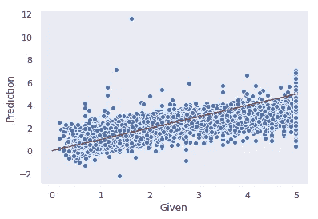

# 交叉验证:初学者指南

> 原文：<https://towardsdatascience.com/cross-validation-a-beginners-guide-5b8ca04962cd?source=collection_archive---------3----------------------->

## LOO、K 折叠和维持模型验证简介

*作者:Caleb Neale，Demetri Workman，Abhinay Dommalapati*

在开始进入机器学习和数据科学世界的旅程时，经常会有一种诱惑，即跳入算法和模型创建，而不了解如何在真实世界的数据上测试生成的模型的有效性。交叉验证是模型验证的一种形式，它试图通过利用我们的数据子集和对偏差/方差权衡的理解来改进拒绝验证的基本方法，以便更好地了解我们的模型在应用于数据之外时的实际表现。别担心，一切都会解释清楚的！

本文试图成为三种模型验证方法(支持、k-fold 和 LOOCV)及其背后概念的执行指南，并提供链接和参考来指导您进一步阅读。在给出的例子中，我们使用了 scikit learn、pandas、numpy 和其他 python 库。

本文将讨论什么:

*   什么是模型验证？
*   为什么重要？
*   模型验证中的偏差和方差是什么？
*   什么是交叉验证？
*   常见的方法有哪些？
*   不同的方法应该在何时何地实施？
*   各种交叉验证的方法是如何工作的？
*   我们如何利用交叉验证来创建更好的模型？

# 什么是模型验证？

模型验证是一个过程，通过这个过程，我们可以确保我们的模型在“真实世界”中的表现是可以接受的用更专业的术语来说，模型验证允许您预测您的模型在训练中未使用的数据集上将如何表现(模型验证是为什么[防止数据泄漏](https://machinelearningmastery.com/data-leakage-machine-learning/)如此重要的一个重要部分)。模型验证很重要，因为我们实际上并不关心模型对我们训练它的数据的预测有多好。我们已经知道用于训练模型的数据的目标值，因此，当任务是对具有相同分布和特征，但具有来自训练集的不同个体值的新数据集进行建模时，考虑模型的稳健性和能力更为重要。引入的第一种模型验证形式通常是所谓的维持验证，通常被认为是交叉验证的最简单形式，因此最容易实现。下面我们来看一个例子。

# 维持验证

对于这个例子，我们将在加州住房数据的 scikit-learn 数据库中使用线性回归[。](/introduction-to-linear-regression-in-python-c12a072bedf0)

```
# import scikit learn databases
from sklearn import datasets
# import california housing data from sklearn and store data into a variable
calihouses = datasets.fetch_california_housing()
calidata = calihouses.data
```

一旦数据存储到一个我们可以更容易处理的变量中，我们将转换成一个熊猫数据帧，这样我们就可以更容易地查看和处理数据。

```
# import pandas and numpy
import pandas as pd
import numpy as np# define the columns names of the data then convert to dataframe
headers = calihouses.feature_names
df = pd.DataFrame(calidata, columns=headers)# print the df and shape to get a better understanding of the data
print(df.shape)
print(df)
```

现在我们已经看到了我们正在处理的数据，我们可以开始生成模型和交叉验证的过程。在维持验证中，我们将数据分成训练集和测试集。训练集将是创建模型的基础，测试数据将用于验证生成的模型。虽然使用 pandas 方法有(相当容易的)方法来完成这一点，但我们可以利用 scikit-learns 的“train_test_split”方法来完成这一点。

```
# first store all target data to a variable
y = calihouses.target# create testing and training sets for hold-out verification using scikit learn method
from sklearn import train_test_split
X_train, X_test, y_train, y_test = train_test_split(df, y, test_size = 0.25)# validate set shapes
print(X_train.shape, y_train.shape)
print(X_test.shape, y_test.shape)
```

如您所见，我们使用带有三个参数的“train_test_split ”:输入(X)数据、目标(y)数据以及我们想要删除并放入测试数据集的数据的百分比，在本例中为 25%(常见的分割通常是 70-30，取决于与您的数据相关的众多因素[)。然后，我们将分割的 X 和 y 数据分配给一组新变量，以便以后使用。](/train-validation-and-test-sets-72cb40cba9e7)

此时，您的输出应该如下所示:

```
(15480, 8) (15480,)
(5160, 8) (5160,)
```

现在，我们已经创建了测试/训练分割，我们可以创建一个模型，并基于训练数据生成一些预测。虽然有其他方法可以创建一个模型来显示更多的细节，但是我们将使用 scikit learn 来使我们的生活变得更加简单。我已经包含了几行来计时函数的运行时间，我们将在后面的比较中使用。

```
# time function using .time methods for later comparison
from timeit import default_timer as timer
start_ho = timer()# fit a model using linear model method from sklearn
from sklearn import linear_model
lm = linear_model.LinearRegression()
model = lm.fit(X_train, y_train)# generate predictions
predictions = lm.predict(X_test)end_ho = timer()# calcualte function runtime
time_ho = (end_ho - start_ho)# show predictions
print(predictions)
```

让我们在这里暂停一会儿，看看我们做了什么。到目前为止，一切都只是建立一个线性模型，并使用它对数据集进行预测。这就是没有模型验证的情况下*能走多远。换句话说，当与测试数据中的实际目标值进行比较时，我们还需要观察模型对测试数据的预测表现如何。我们之前所做的测试/训练分离是必要的，以便划分数据，这样我们现在可以在训练中没有使用的数据上测试模型(请参见:数据泄漏)。现在我们已经有了一个模型，并且已经创建了一些预测，让我们继续我们的坚持验证。*

我们将首先绘制给定目标数据与预测目标数据的对比图，以直观显示模型的表现。

```
# import seaborn and plotly
mport matplotlib
from matplotlib import pyplot as plt
import seaborn as sns# set viz style
sns.set_style('dark')# plot the model
plot = sns.scatterplot(y_test, predictions)
plot.set(xlabel='Given', ylabel='Prediction')# generate and graph y = x line
x_plot = np.linspace(0,5,100)
y_plot = x_plot
plt.plot(x_plot, y_plot, color='r')
```

输出:


Scatter plot of given vs predicted data, with y = x line charted in red

在一个完美的模型中(可能过度拟合)，我们所有的数据点都在那条红线上，但是当我们的数据点接近那个趋势时，我们可以看到这个模型大致适合测试数据。

现在，让我们为这个模型打分，并与后面的方法进行比较。

```
start_ho_score = timer()# model score (neg_mean_squared_error)
from sklearn import metrics
ho_score = -1*metrics.mean_squared_error(y_test, predictions)
print(ho_score)end_ho_score = timer()ho_score_time = (end_ho_score - start_ho_score)
```

输出:

```
-0.5201754311947533
```

那就是模型验证！我们使用训练数据创建了一个模型，用它来预测测试数据分割部分的结果，然后使用评分方法来确定模型对测试数据的有效性(负均方误差)的度量。这为我们提供了该模型在其他类似数据集上的表现的近似值。

现在，要考虑一些事情。我们验证了我们的模型一次。如果我们做的拆分恰好非常有利于这个模型呢？如果我们所做的分割在日期中引入了很大的偏差会怎么样？通过这样分割，我们不是极大地减少了训练数据集的大小吗？这些是我们进入交叉验证时要考虑的几个问题，但首先是一些背景概念。

# 模型验证中的偏差和方差是什么？

为了理解偏差和方差，让我们首先解决过度拟合和欠拟合模型。在**过度拟合**时，当模型与训练数据如此紧密地拟合，以至于它可能会考虑随机噪声或不需要的趋势，这些噪声或趋势在预测后续数据集的目标时不会出现或没有用时，就会生成模型。**当模型不够复杂，无法解释数据的总体趋势时，就会出现**欠拟合，这对于预测后续数据集中的目标是有用的，例如对多项式趋势使用线性拟合(AWS 的一个令人惊叹的可视化和对这一概念的进一步解释可以在[这里](https://docs.aws.amazon.com/machine-learning/latest/dg/model-fit-underfitting-vs-overfitting.html)找到)。


Source: [https://docs.aws.amazon.com/machine-learning/latest/dg/model-fit-underfitting-vs-overfitting.html](https://docs.aws.amazon.com/machine-learning/latest/dg/model-fit-underfitting-vs-overfitting.html)

当创建一个模型时，我们考虑几种类型的误差:验证误差、测试误差、由于偏差引起的误差，以及由于偏差方差权衡关系中的方差引起的误差(另一个伟大的视觉[在这里](http://www.luigifreda.com/2017/03/22/bias-variance-tradeoff/))。


Source: [http://www.luigifreda.com/2017/03/22/bias-variance-tradeoff/](http://www.luigifreda.com/2017/03/22/bias-variance-tradeoff/)

如前所述，我们想知道模型在“真实世界”中的表现其中一部分是验证误差，它由偏差引起的误差和方差引起的误差组成(训练误差不提供模型在未来数据集上表现如何的信息，现在可以放在一边)。

最小化模型验证误差需要找到模型复杂性的点，在该点偏差和方差误差的组合最小化，如链接的视图所示。随着模型复杂性的增加，偏差导致的误差减少，而方差导致的误差增加，从而形成偏差-方差权衡，我们将在后面通过各种交叉验证方法来解决这一问题。

现在让我们定义偏差和方差:

**偏置**

偏差是由模型的预期值和实际(或“正确”)值之间的差异导致的误差，我们希望通过多次迭代来预测这些值。在准确度和精确度的科学概念中，偏差与准确度非常相似。

**差异**

方差被定义为模型中不同数据预测之间的可变性导致的误差。在方差中，正确的值没有预测值之间的差值范围重要。当我们运行多个模型创建试验时，方差也会发挥更大的作用。

更多完整的定义和视觉效果[点击这里](http://scott.fortmann-roe.com/docs/BiasVariance.html)。


Source: [http://scott.fortmann-roe.com/docs/BiasVariance.html](http://scott.fortmann-roe.com/docs/BiasVariance.html)

在机器学习中，偏差和方差通常作为“偏差-方差权衡”一起讨论，认为有效地最小化一个错误会使该错误更有可能在创建和评估模型时出现。理想情况下，我们会寻找一个模型，其权衡结果是*低偏差和低方差，我们会通过使用交叉验证来实现这一点。根据数据集的特征，在创建和评估模型时，一种交叉验证方法可能是实现偏差-方差权衡的更理想方法。*

# 什么是交叉验证？

如果我们做的拆分恰好非常有利于这个模型呢？如果我们所做的分割在日期中引入了很大的偏差会怎么样？通过这样分割，我们不是极大地减少了训练数据集的大小吗？

交叉验证是一种模型验证方法，它以创造性的方式分割数据，以获得“真实世界”模型性能的更好估计，并最小化验证错误。

还记得我们问的那些关于保持验证的问题吗？交叉验证是我们的答案。

**K 倍交叉验证**

K-fold 验证是一种流行的交叉验证方法，它将数据打乱并分成 *k* 个折叠(组)。一般来说，通过将一组作为测试数据集，将其他 *k-1* 组作为训练数据，拟合和评估模型，并记录选择的分数，来执行 K-fold 验证。然后，将每个折叠(组)作为测试数据重复该过程，并将所有分数进行平均，以获得更全面的模型验证分数。(更多的阅读和有用的可视化[在这里](http://www.ebc.cat/2017/01/31/cross-validation-strategies/#k-fold))。


Source: [http://www.ebc.cat/2017/01/31/cross-validation-strategies/#k-fold](http://www.ebc.cat/2017/01/31/cross-validation-strategies/#k-fold)

在为 *k* 选择一个值时，每个折叠(组)应该足够大，能够代表模型的**(通常 *k=10 或 k=5* )并且足够小，能够在合理的时间内计算出来。根据数据集的大小，有时可以试验不同的 k 值。一般来说，随着 *k* 的增加，偏差减少，方差增加。**

让我们用之前的数据集做一个例子。

我们将再次使用线性模型，但这次使用 scikit learn 的 cross_val_predict 方法进行模型验证，该方法将完成生成 K 倍预测的大部分繁重工作。在这种情况下，我选择设置 *k=10* 。

```
# store data as an array
X = np.array(df)# again, timing the function for comparison
start_kfold = timer()# use cross_val_predict to generate K-Fold predictions
lm_k = linear_model.LinearRegression()
k_predictions = cross_val_predict(lm_k, X, y, cv=10)
print(k_predictions)end_kfold = timer()kfold_time = (end_kfold - start_kfold)
```

输出(或近似值):

```
[4.22358985 4.04800271 3.75534521 ... 0.14474758 0.29600522 0.49525933]
```

[cross_val_predict](https://scikit-learn.org/stable/modules/generated/sklearn.model_selection.cross_val_predict.html) 获取数据上使用的模型、输入和目标数据，以及一个“cv”参数(实质上是我们的 *k* 值)并返回每个输入的预测值。现在我们可以绘制预测图，就像我们用保持法做的那样。

```
# plot k-fold predictions against actual
plot_k = sns.scatterplot(y, k_predictions)
plot_k.set(xlabel='Given', ylabel='Prediction')# generate and graph y = x line
x_plot = np.linspace(0,5,100)
y_plot = x_plot
plt.plot(x_plot, y_plot, color='r')
```

输出:


现在，让我们获得 10 个生成模型的分数，并将它们绘制成可视化图形。

```
kfold_score_start = timer()# find the mean score from the k-fold models usinf cross_val_score
kfold_scores = cross_val_score(lm_k, X, y, cv=10, scoring='neg_mean_squared_error')
print(kfold_scores.mean())kfold_score_end = timer()kfold_score_time = (kfold_score_end - kfold_score_start)# plot scores
sns.distplot(kfold_scores, bins=5)
```

输出:

```
-0.5509524296956634
```


您会注意到分数比 holdout 方法离零稍微远一点(不好)。我们稍后再讨论。

**留一交叉验证**

留一个交叉验证(LOOCV)可以被认为是一种 K 重验证，其中给定数据集中的行数，k=n。除此之外，这些方法都很相似。然而，您会注意到，运行下面的代码将比以前的方法花费更多的时间。我们稍后将深入探讨这一点。

让我们用相同的数据集做一个例子，遵循相同的过程并修改 *k* :

生成预测:

```
start_LOO = timer()# generate LOO predictions
LOO_predictions = cross_val_predict(lm_k, X, y, cv=(len(X)))end_LOO = timer()LOO_time = (end_LOO - start_LOO)
```

绘制预测图:

```
# plot LOO predictions against actual
plot_LOO = sns.scatterplot(y, LOO_predictions)
plot_LOO.set(xlabel='Given', ylabel='Prediction')# generate and graph y = x line
x_plot = np.linspace(0,5,100)
y_plot = x_plot
plt.plot(x_plot, y_plot, color='r')
```

输出:



生成并平均分数:

```
LOO_score_start = timer()# find the mean score from the LOO models using cross_val_score 
LOO_score = cross_val_score(lm_k, X, y, cv=(len(X)), scoring='neg_mean_squared_error').mean()
print(LOO_score)LOO_score_end = timer()LOO_score_time = (LOO_score_end - LOO_score_start)
```

现在让我们比较三种方法的运行时间和分数:

```
print("Hold out method took", time_ho, "seconds to generate a model and", ho_score_time ,"seconds to generate a MSE of", ho_score)
print("K-Fold method took", kfold_time, 'seconds to generate a model and', kfold_score_time, 'seconds to generate a MSE of', kfold_scores.mean())
print("Leave One Out Cross Validation method took", LOO_time, 'seconds to generate a model and', LOO_score_time, 'seconds to generate a MSE of', LOO_score)
```

输出:

Hold out 方法用了 0.03958953900000495 秒来生成一个模型，用了 0.0002666661986

K-Fold 方法生成一个模型需要 0.0780906770000583 秒，生成一个-0 的 MSE 需要 0.1253743699999

遗漏一个交叉验证方法花了 152 秒来生成一个模型，花了 161 秒来生成一个-0 的 MSE。16860.686686866617

让我们深入研究一下这些结果，以及前面提到的一些观点。

# 不同的方法应该在何时何地实施？

正如我们在比较结果中注意到的，我们可以看到 LOOCV 方法比其他两种方法花费了更长的时间。这是因为该方法为数据集中的每一行创建和评估模型，在本例中超过 20，000 行。尽管我们的 MSE 稍低，但考虑到额外的计算需求，这可能不值得。这里有一些启发，可以帮助选择一种方法。

**撑出方法**

在非常大的数据集上或者在有限的计算资源上，保持方法可以是有效的并且计算成本低廉。对于初学者来说，它也更容易实现和理解。然而，应用于小数据集很少是好的，因为它会显著减少可用的训练数据并损害模型性能。

**K 倍交叉验证**

K-Fold 在中等大小的数据集上非常有效，尽管通过调整 K 值可以显著改变验证的结果。让我们添加前面的规则；随着 k 的增加，偏差减小，方差和计算要求增加。由于调整 K 值的多功能性，K 倍交叉验证可能是三种方法中最常见的。

**LOOCV**

LOOCV 在小数据集中最有用，因为它允许在每次迭代中从训练数据中移除最少量的数据。然而，在大型数据集中，为数据集中的每一行生成模型的过程在计算上非常昂贵，因此对于大型数据集来说是不允许的。

# 不同交叉验证技术的优缺点是什么？

**维持验证**

在维持验证中，我们只需执行简单的训练/测试分割，让模型适合训练数据，并将其应用于测试数据以生成预测值。我们“坚持”测试数据只能严格用于预测目的。维持验证不是一种交叉验证技术。但是我们必须讨论模型评估的标准方法，以便我们可以将其属性与实际的交叉验证技术进行比较。

就代码而言，维持验证很容易使用。实现很简单，不需要大量的计算能力和时间复杂度。此外，我们可以更好地解释和理解维持验证的结果，因为它们不需要我们弄清楚迭代在大计划中是如何执行的。

但是，在许多情况下，维持验证不能保持数据集的统计完整性。例如，将数据分为定型段和测试段的维持验证由于没有将测试数据合并到模型中而导致偏差。测试数据可能包含一些重要的观察结果。这将导致损害模型的准确性。此外，除了引入验证和/或训练误差之外，这将导致数据的欠拟合和过拟合。
K 倍

在 K-fold 交叉验证中，我们回答了维持验证中固有的许多问题，例如欠拟合/过拟合以及验证和训练错误。这是通过在某次迭代中使用我们的验证集中的所有观察值来完成的。我们计算在每 k 次迭代中计算的所有准确度分数的平均准确度分数。通过这样做，我们可以最大限度地减少初始模型评估技术(维持验证)中可能存在的偏差和变化。

但是，从计算能力上来说，k 倍交叉验证的代价非常大。计算机必须进行几次迭代才能产生正确的准确度分数。理论上，模型的准确度分数将随着每增加 k 次迭代而增加。这将减少偏差，同时增加变化。在本文的后面，当我们尝试对一个包含大约 580，000 个观察值的非常大的数据集应用 k-fold 验证时，我们将看到一个这样的例子。

**LOOCV**

LOOCV 非常类似于 K-fold，其特殊情况是 K 等于整个数据集的长度(或样本数/行数)。因此，训练集的长度为 k-1，测试集将是数据的单个样本。当我们的数据集不够大，无法进行合理的折叠时，LOOCV 尤其有用。一般来说，LOOCV 的计算成本也较低，尽管这通常是由于其固有的较小数据集倾向于使用它。

但是，LOOCV 往往会产生较高的方差，因为该方法会通过单个测试值拾取数据中所有可能的噪声和异常值。对于非常大的数据集，LOOCV 在计算上将非常昂贵；在这种情况下，使用常规 k 折会更好。

# 什么时候你不想使用交叉验证？

当处理大型数据集时，交叉验证成为计算上昂贵且费力的模型评估方法。生成预测值最终需要很长时间，因为验证方法必须在 K-Fold 策略中运行 K 次，遍历整个数据集。因此，就时间复杂性而言，交叉验证成为非常昂贵的模型评估策略。我们将通过对[一个大约有 580，000 行的非常大的数据集](https://www.kaggle.com/uciml/forest-cover-type-dataset)执行正常的维持验证和 K-Fold 交叉验证来检查这一现象。看看你是否能弄明白，为什么它会这样工作(以及新的数据可视化)，并评论任何问题。祝你好运！

```
# upload dataset from kaggle (we're using google colab here, adapt to your IDE)from google.colab import files
uploaded = files.upload()# initialize data framedf = pd.read_csv("covtype.csv")
print(df.head())print(df.tail())# that's a lot of rows!# notice that we use all features of our dataset so that we can illustrate how taxing cross validation will beX=df.loc[:,'Elevation':'Soil_Type40']
y=df['Cover_Type']# some nan values happen to sneak into our dataset so we will fill them upX = X.fillna(method='ffill')
y = y.fillna(method='ffill')# use a K-nearest neighbhors machine learning algorithmneigh = KNeighborsClassifier(n_neighbors=5)# only with 200 folds are we able to generate an accuracy of 80%neigh.fit(X,y)
kFoldStart = time.time()
y_pred = cross_val_predict(neigh, X, y, cv = 200)
kFoldEnd = time.time()
kFoldTime = kFoldEnd - kFoldStart
print("K Fold Validation Accuracy is ", accuracy_score(y, y_pred))# it takes 16 minutes to run the K-Fold cross validation!!!!print(kFoldTime)
```

输出:

K 倍验证的准确度是 0.8016822371999202
K 倍验证需要 101 秒钟。56681.66668666661

```
# generate a heatmap of a confusion matrix with predicted and true values of the type of treeslabels = [1.0, 2.0, 3.0, 4.0, 5.0, 6.0, 7.0]
cm = confusion_matrix(y_pred, y, labels)
print(cm)
fig = plt.figure()
ax = fig.add_subplot(111)
cax = ax.matshow(cm, vmin=0, vmax=19000)
fig.colorbar(cax)
ax.set_xticklabels([''] + labels)
ax.set_yticklabels([''] + labels)
plt.xlabel('Predicted')
plt.ylabel('True')
plt.show()
```

输出:

[[166004 46040 27 0 243 43 1902]
【41396 225886 1919 4 1808 1156 293】
【59 3704 31832 442 143 1591 0】
【0 7 267 2119 0 124 0】
【539 4504 208 0 7251 68 5


**维持验证:**

```
# split our dataset into training and testing dataX_train, X_test, y_train, y_test = train_test_split(X,y, test_size=0.3, random_state=101)# some nan values happen to sneak into our dataset so we will fill them upX_train = X_train.fillna(method='ffill')
y_train = y_train.fillna(method='ffill')# run the holdout validation and make predictions
# it takes only 30 seconds for a normal validation which is still pretty longneigh.fit(X_train, y_train)
holdOutStart = time.time()
holdOutPredictions = neigh.predict(X_test)
holdOutEnd = time.time()
holdOutTime = holdOutEnd - holdOutStart
print("Hold Out Validation takes ", holdOutTime, " seconds")print(accuracy_score(y_test, holdOutPredictions))# notice how much more accurate the holdout validation is compared to the k-fold cross validation# generate a heatmap of a confusion matrix with predicted and true values of the type of treeslabels = [1.0, 2.0, 3.0, 4.0, 5.0, 6.0, 7.0]
cm = confusion_matrix(holdOutPredictions, y_test, labels)
print(cm)
fig = plt.figure()
ax = fig.add_subplot(111)
cax = ax.matshow(cm, vmin=0, vmax=8000)
fig.colorbar(cax)
ax.set_xticklabels([''] + labels)
ax.set_yticklabels([''] + labels)
plt.xlabel('Predicted')
plt.ylabel('True')
plt.show()
```


# 关键术语:

**模型验证:**根据生成模型过程中使用的*而非*附加数据验证生成模型的任何过程。例如交叉验证、K 倍验证、保持验证等。 ****K 重交叉验证:**一种交叉验证，将给定数据集分成 *k 个*组和 *k 个*模型生成。选择其中一组作为测试数据，其他 *k-1* 组作为训练数据，生成模型并评分。这个过程重复 *k* 次，使得每个 k 倍(组)作为一个测试组。 **LOOCV:** 一种类似于 K 折验证的交叉验证，其中 *k* 等于正在执行验证的数据集的长度。 **偏差:**模型的预期值和实际(或“正确”)值之间的差异导致的误差，我们希望通过多次迭代来预测这些值。在准确度和精确度的科学概念中，偏差与准确度非常相似。 **方差:**模型中不同数据预测之间的可变性所导致的误差。在方差中，正确的值没有预测值之间的差值范围重要。当我们运行多个模型创建试验时，方差也会发挥更大的作用。 **欠拟合:**当模型与训练数据拟合得如此紧密，以至于它可能会考虑随机噪声或不需要的趋势，这些趋势在预测后续数据集的目标时不会出现或没有用。 **过度拟合:**当模型不够复杂，不足以解释数据中的一般趋势时发生，这将有助于预测后续数据集中的目标，例如对多项式趋势使用线性拟合。 **偏差-方差权衡:**偏差导致的误差减少，方差导致的误差增加，这种权衡在模型验证和其他情况下应该最小化。**