# crossfit Games-2019 公开赛回顾

> 原文：<https://towardsdatascience.com/crossfit-games-restrospective-of-the-open-2019-7b6cef5cd28a?source=collection_archive---------27----------------------->

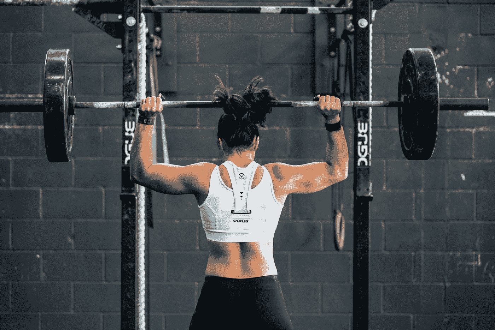

Photo by [John Arano](https://unsplash.com/@johnarano?utm_source=medium&utm_medium=referral) on [Unsplash](https://unsplash.com?utm_source=medium&utm_medium=referral)

# 过去公开赛的结果概述和新 Kaggle 数据集介绍

你好，今年公开赛的赛季又开始了(又一次！？)所以我写这篇文章是为了:

*   在 kaggle 上引入新的数据集
*   有一个关于上次开放的概述

公开赛是为明年在美国举行的“世界杯”比赛进行选拔的过程。该选拔为期 5 周，由 5 场名为 WoD 的比赛组成，公开赛的每位参与者都必须完成比赛才能获得分数，并进入游戏选拔的排行榜(排行榜中的最佳选手将被选出)。隶属于一家名为 affiliate 的健身房的每个人都可以参加这个比赛，比赛有多个组别，如果你觉得自己没有能力做最初的世界(像我一样)，你可以做一个“缩放”版本，最初的会有一点点修改，但练习的精神是一样的。

你可以在这个[链接](https://games.crossfit.com/workouts/open/2019)找到上一次公开赛练习的更多细节。

我在之前的[文章](http://the-odd-dataguy.com/crossfitopen)中开始收集 2018 年公开赛的数据，我决定现在分享我收集的关于赛事的部分数据。数据可以在 kaggle 网站上的这个[链接](https://www.kaggle.com/jeanmidev/crossfit-games)找到，你会找到关于 2019 年公开赛的数据。

数据集已经描述过了，我将在未来尝试添加越来越多关于公开赛和比赛的数据(我计划在未来用这些数据做一些 ML 工作)。

那么现在让我们开始分析。

下图显示了运动员在不同组别中的分布情况。

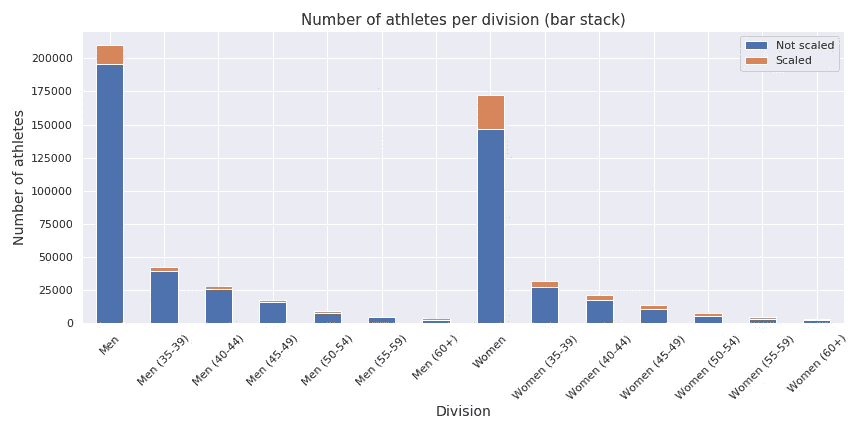

正如我们所看到的，一些最受欢迎的部门是男子和女子部门，大多数运动员不按比例练习。大约有 355418 名运动员参加了比赛。

对于分析的下一步，我将**关注男女组，而不是比例**(因此大约有 341875 名运动员)。

现在，让我们来看看这些部门的竞争受欢迎程度。

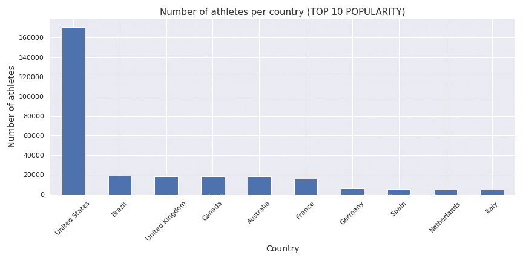

由于竞争来自美国，不出所料，运动员更重要的堡垒在美国，其次是巴西和英国。其他国家比美国小得多。

这个桶的平价是多少？

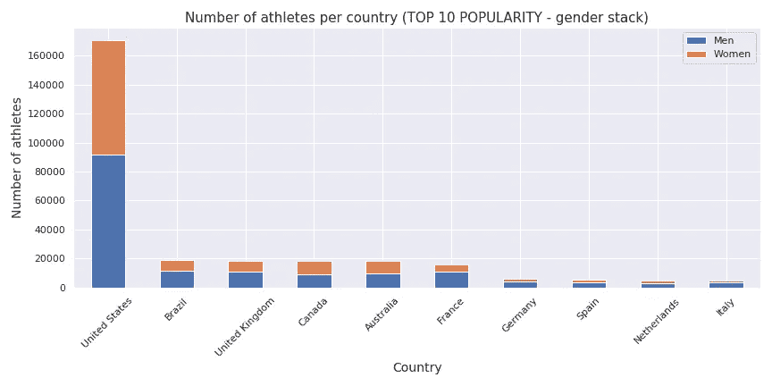

看起来男性仍然较多，但男女比例相差不远。

我根据公开赛期间的总分对运动员进行了一些简单的分析，并将其分为不同的类别:

*   他们是前 100 名运动员吗？是或否
*   他们是前 1000 名运动员吗？是或否

所以我们来看看有些国家能不能定义在“冠军窝”。

先来看看 crossfit 最流行的国家。

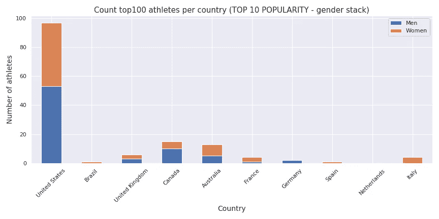

正如我们所见，受欢迎并不是冠军的同义词。如果我们除了美国，在顶级运动员的数量上顺序是不被尊重的。

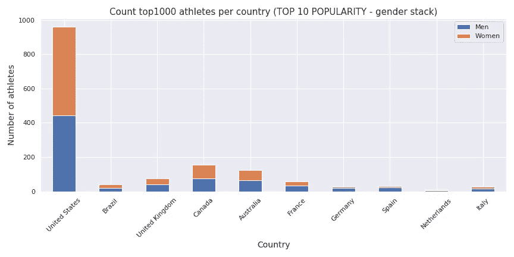

仍然是同样的逻辑，但每个国家都是前 1000 名中的冠军。

现在让我们来看看基于顶级运动员数量的顶级国家。

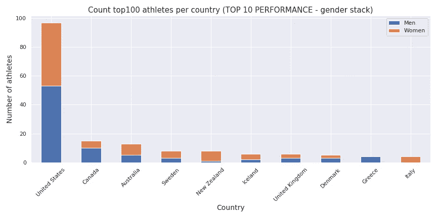

正如我们所看到的，在国家名单中有一些新人，一些像新西兰和冰岛这样的小国(就人口和人口而言)正在成为冠军(今年赢得比赛的前女子来自新西兰)。

现在让我们试着找到以下问题的答案:

我试图从世界银行的数据中添加一些与这个国家相关的数据，但我发现这个国家与拥有一些顶级运动员这一事实之间没有真正的联系(我在 Kaggle 数据集中附上了一些数据)。

在关于运动员的数据中，有些人给出了他们的体重和身高(但这是一个自由的领域，所以里面有很多废话)。如果我只是放弃没有填满场地的运动员，我将失去大约 45%的运动员。我只是用身高、体重和身体质量指数对运动员是否在顶端做了一个快速配对图(我去掉了一些不好的值)。

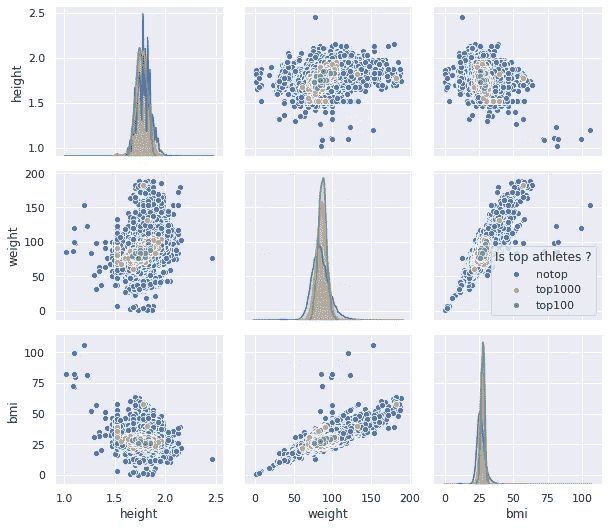

没有真正的最佳身材，似乎在顶级运动员中，人们看起来非常健康，但他们没有疯狂的身材(像大力士或美国队长)，他们是正常体型但非常健康的人。

但是现在一个新的问题出现在我的脑海里，那就是**他们在公开赛期间努力了吗？**

到目前为止，世界还不知道，所以也许这个家伙试图在整个开放期间保持能量，以便在一些特定的世界上表现得更好。有一个基于运动员在每个世界的得分的配对图。

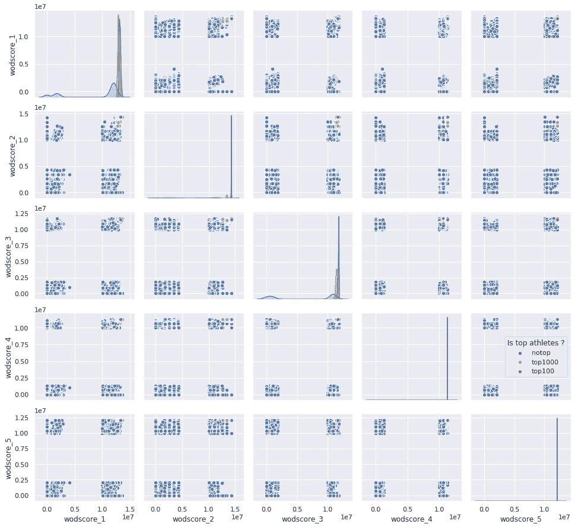

女性的结果与男性相同，但是我们可以看到，对于男性来说，基于大多数运动员没有完成所有世界记录的事实，确实存在聚类。让我们来放大一下真正完成所有世界纪录的运动员。

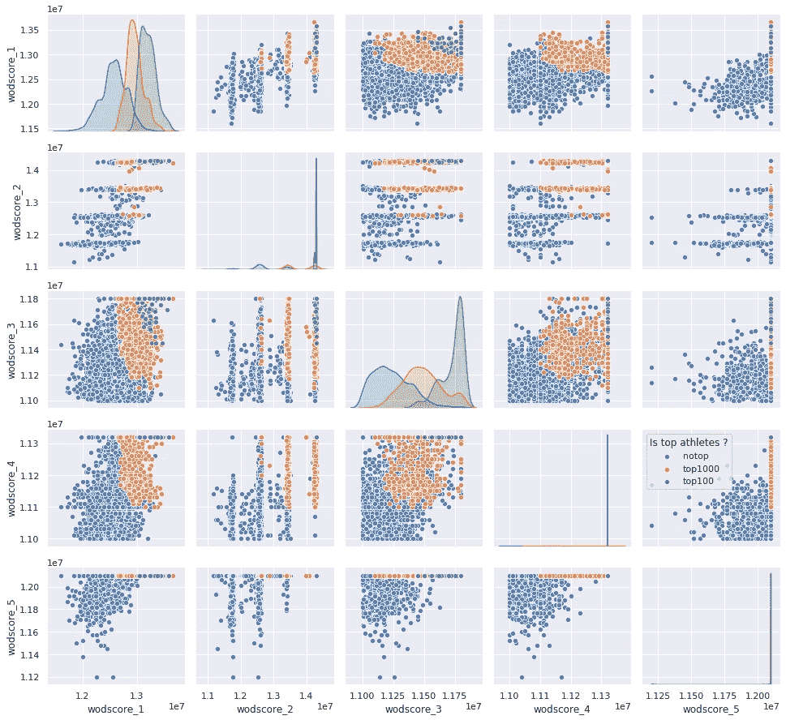

似乎对于前 100 名运动员来说，没有“赖泽·阿勒”，他们“全押”，他们总是在每个世界上得分最高。前 1000 名看起来比前 100 名更分散，所以我们可以说这 100 名绝对是机器。

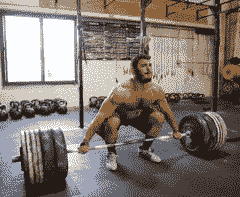

从这个分析中我们可以看出:

*   crossfit 看起来是一项受男性和女性欢迎的运动，这可能是因为它总是为男性和女性平等地做广告
*   就体重和身高而言，顶尖运动员没有不正常的体格
*   似乎没有赢得公开赛的策略，只是全押

正如我之前所说，我计划在数据集中添加更多数据，并进行一些其他分析，但老实说，这种分析只是开胃小菜(最多 2 小时)，如果您对数据集有任何意见/想法/结果，请随时联系我。

*最初发表于*[*【http://the-odd-dataguy.com】*](http://the-odd-dataguy.com)*。*