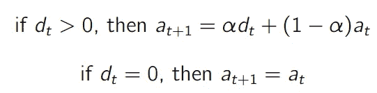
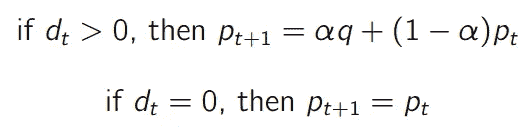
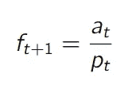
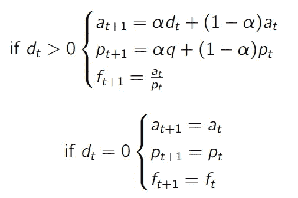
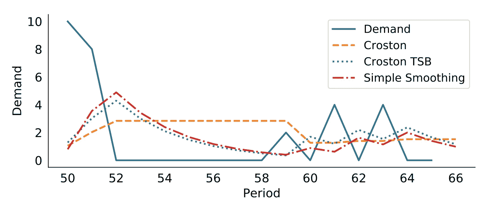
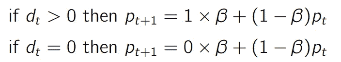
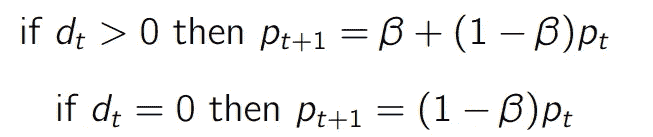
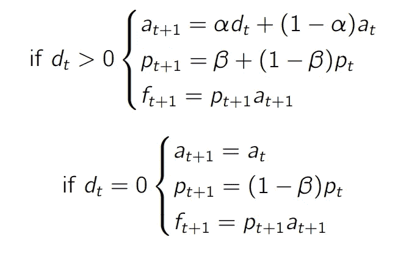
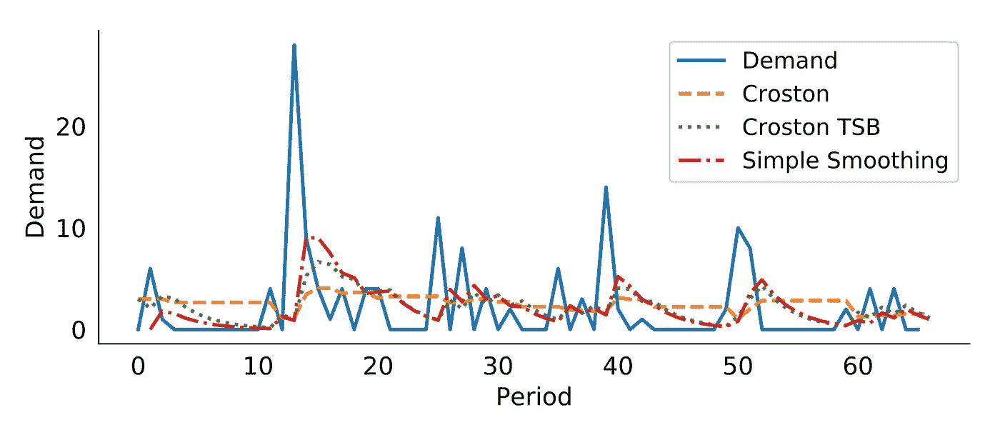
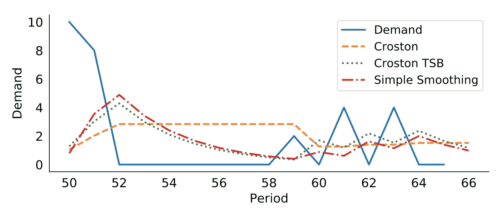

# 用克罗斯顿模型预测间歇性需求

> 原文：<https://towardsdatascience.com/croston-forecast-model-for-intermittent-demand-360287a17f5f?source=collection_archive---------2----------------------->

## 预测间歇性需求的产品是复杂的。我在这里介绍克罗斯顿的模型，这是专门设计来预测这些时间序列。

# 克罗斯顿模型

## **最初的想法**

1972 年，J.D. Croston 发表了“间歇需求的预测和库存控制”一文，介绍了一种预测间歇需求产品的新技术。他的想法可以总结为三个简单的步骤:
——当有需求发生时，评估平均需求水平。
-评估两次需求发生之间的平均时间。
-将需求预测为需求水平(发生时)乘以发生的概率。

让我们通过一个例子来一步步实现这一点:

1.  如果我们估计平均每四个周期有一次需求发生(即有 25%的机会发生)，
2.  我们预计，当出现需求时，平均需求水平为 5 个单位，
3.  然后，我们预测未来每期的需求为 5 x 0.25 = 1.25。

克罗斯顿模型回答了这个问题 ***平均每个时期我们会有多少需求？***

## **型号**

既然我们理解了克罗斯顿模型的基本思想，我们需要回答两个问题:

1.  我们如何估计需求发生的概率？
2.  当发生事故时，我们如何估计需求水平？

克罗斯顿使用了一种接近霍尔特&温特斯所用的技术来回答这些问题。对于不同的指数平滑模型，我们将查看每个变量的**先前估计**(即，水平&周期性)及其**最近观察**。

## **需求水平**

让我们记下我们的水平估计 **a** (类似于指数模型)，并记下**实际**需求观察 **d** 。只有当我们有了实际的观察结果时，我们才会更新我们的水平估计值



如同在不同的指数平滑模型中一样，我们使用学习参数α(0< alpha < 1) to allocate more or less importance to the most recent observations or the historical ones.

## **周期性**

让我们注意两次需求发生 **p** (对于 **p** 周期性)之间的时间估计，以及自上一次需求发生 **q** 以来经过的时间。我们只会在出现需求时更新 **p**



注意，我们再次使用 alpha 作为学习参数。这与我们用来估计需求水平的参数相同。

## 预报

预测很简单:需求水平( **a** )除以周期( **p** )。



## **总结**

然后我们可以总结整个模型。



如您所见，当没有需求观察时，没有任何参数被更新。这将是这种模式的局限性之一。

## **见解**

**克罗斯顿与简单指数平滑法**
与简单指数平滑法相比，克罗斯顿法最重要的优点是能够估计两次需求发生之间的时间。让我们看看下图是否有助于我们预测间歇性产品。

[](https://www.amazon.com/Data-Science-Supply-Chain-Forecast/dp/1730969437)

不幸的是，这两种模型的 MAE 值大致相同(简单平滑法略占优势):Croston 为 139%，简单平滑法为 130%。

**限制**
如上图所示，当没有需求发生时，克罗斯顿预测不会改变。这很奇怪，有两个原因。

1.  长时间没有需求出现应该是降低我们预测的一个诱因。
2.  当我们在很长一段时间没有需求之后，第一次出现需求时(看第 52-60 期)，我们降低预测。

这是反直觉的。假设我们处于第 51 期:您刚刚售出 8 件，因此您将预测更新为 3 件/期。从第 52 期到第 58 期，你一件也卖不出去，但是你不会**而不是**更新你的预测。实际上，你将不得不等待 59 期间的 2 件销售醒来，并将你的预测减少到 2 件。
这没有任何意义。为什么我们不能在无销售期间更新我们的预测，以反映我们预期我们的需求会降低的想法？

[](https://medium.com/analytics-vidhya/how-to-forecast-high-profit-low-volume-products-3331c20cc4bb) [## 如何预测高利润低产量的产品？

### 预测低需求和间歇性需求的高利润产品是一项挑战。让我们讨论一下技巧和窍门。

medium.com](https://medium.com/analytics-vidhya/how-to-forecast-high-profit-low-volume-products-3331c20cc4bb) 

# 改进克罗斯顿

2011 年，在他们的论文“间歇性需求:将预测与库存过时联系起来”中，Ruud Teunter、Aris Syntetos 和 Zied Babai 提出了对 Croston 模型的改进。他们的想法是允许模型更新(*减少*)其周期性估计，即使没有需求观察。
这很完美，因为这个限制是我们对 vanilla Croston 模型的主要限制。

## **TSB 模式**

**Level—**TSB 模型(用于 **T** eunter，**S**yntetos&**B**abai)与常规 Croston 模型相比，不会改变水平的估算方式。
**周期—** 周期 **p** 现在将表示为需求发生的概率。实际上， **p** 现在将表示范围从 0(需求从未出现)到 1(需求在每个周期出现)的频率(即概率)。我们将在每个周期更新这个周期--即使没有需求发生。
如果没有需求发生，周期将
- **减少**(因为您预计需求发生的概率会减少)。这种减少将是指数性的(如同所有的指数平滑模型)；
- **如果有需求发生，增加**。

然后我们有



这可以简化为



请记住，在传统的 Croston 模型中， **p** 是两次需求发生之间的预期周期数。

我们现在得到 TSB 模型的这组方程。



注意:
-预测 **f** 定义为周期 **p** **乘以**水平 **a** (而不是除以它，如原模型中)；
—**t+1**的预测是基于 **t+1** 的水平和周期估计(而不是 **t** )定义的。

## **见解**

让我们比较我们的新 TSB 模型与原来的克罗斯顿模型和一个简单的平滑。正如你在下面两张图中看到的，TSB 和简单模型非常相似。实际上，区别在于 TSB 模型跟踪需求水平和需求概率。相比之下，简单平滑模型仅跟踪水平(包括需求发生的可能性)。

[](https://www.amazon.com/Data-Science-Supply-Chain-Forecast/dp/1730969437)[](https://www.amazon.com/Data-Science-Supply-Chain-Forecast/dp/1730969437)

多亏了 TSB，我们现在获得了 134%的平均绝对误差。简单平滑模型似乎仍然比该产品的其他两个模型略好。当然，这只是一个例子，克罗斯顿/TSB 可能会在其他产品上做得更好。

# 自己做

你可以在下面找到克罗斯顿和 TSB 模型的 python 实现。

```
def Croston(ts,extra_periods=1,alpha=0.4):d = np.array(ts) # Transform the input into a numpy array
    cols = len(d) # Historical period length
    d = np.append(d,[np.nan]*extra_periods) # Append np.nan into the demand array to cover future periods

    #level (a), periodicity(p) and forecast (f)
    a,p,f = np.full((3,cols+extra_periods),np.nan)
    q = 1 #periods since last demand observation

    # Initialization
    first_occurence = np.argmax(d[:cols]>0)
    a[0] = d[first_occurence]
    p[0] = 1 + first_occurence
    f[0] = a[0]/p[0]# Create all the t+1 forecasts
    for t in range(0,cols):        
        if d[t] > 0:
            a[t+1] = alpha*d[t] + (1-alpha)*a[t] 
            p[t+1] = alpha*q + (1-alpha)*p[t]
            f[t+1] = a[t+1]/p[t+1]
            q = 1           
        else:
            a[t+1] = a[t]
            p[t+1] = p[t]
            f[t+1] = f[t]
            q += 1

    # Future Forecast 
    a[cols+1:cols+extra_periods] = a[cols]
    p[cols+1:cols+extra_periods] = p[cols]
    f[cols+1:cols+extra_periods] = f[cols]

    df = pd.DataFrame.from_dict({"Demand":d,"Forecast":f,"Period":p,"Level":a,"Error":d-f})return dfdef Croston_TSB(ts,extra_periods=1,alpha=0.4,beta=0.4):d = np.array(ts) # Transform the input into a numpy array
    cols = len(d) # Historical period length
    d = np.append(d,[np.nan]*extra_periods) # Append np.nan into the demand array to cover future periods

    #level (a), probability(p) and forecast (f)
    a,p,f = np.full((3,cols+extra_periods),np.nan)# Initialization
    first_occurence = np.argmax(d[:cols]>0)
    a[0] = d[first_occurence]
    p[0] = 1/(1 + first_occurence)
    f[0] = p[0]*a[0]

    # Create all the t+1 forecasts
    for t in range(0,cols): 
        if d[t] > 0:
            a[t+1] = alpha*d[t] + (1-alpha)*a[t] 
            p[t+1] = beta*(1) + (1-beta)*p[t]  
        else:
            a[t+1] = a[t]
            p[t+1] = (1-beta)*p[t]       
        f[t+1] = p[t+1]*a[t+1]

    # Future Forecast
    a[cols+1:cols+extra_periods] = a[cols]
    p[cols+1:cols+extra_periods] = p[cols]
    f[cols+1:cols+extra_periods] = f[cols]

    df = pd.DataFrame.from_dict({"Demand":d,"Forecast":f,"Period":p,"Level":a,"Error":d-f})return dfdef Croston(ts,extra_periods=1,alpha=0.4):d = np.array(ts) # Transform the input into a numpy array
    cols = len(d) # Historical period length
    d = np.append(d,[np.nan]*extra_periods) # Append np.nan into the demand array to cover future periods

    #level (a), periodicity(p) and forecast (f)
    a,p,f = np.full((3,cols+extra_periods),np.nan)
    q = 1 #periods since last demand observation

    # Initialization
    first_occurence = np.argmax(d[:cols]>0)
    a[0] = d[first_occurence]
    p[0] = 1 + first_occurence
    f[0] = a[0]/p[0]# Create all the t+1 forecasts
    for t in range(0,cols):        
        if d[t] > 0:
            a[t+1] = alpha*d[t] + (1-alpha)*a[t] 
            p[t+1] = alpha*q + (1-alpha)*p[t]
            f[t+1] = a[t+1]/p[t+1]
            q = 1           
        else:
            a[t+1] = a[t]
            p[t+1] = p[t]
            f[t+1] = f[t]
            q += 1

    # Future Forecast 
    a[cols+1:cols+extra_periods] = a[cols]
    p[cols+1:cols+extra_periods] = p[cols]
    f[cols+1:cols+extra_periods] = f[cols]

    df = pd.DataFrame.from_dict({"Demand":d,"Forecast":f,"Period":p,"Level":a,"Error":d-f})return df
```

# 关于作者

## 👉[我们在 LinkedIn 上连线吧！](https://www.linkedin.com/in/vandeputnicolas/)

[](https://www.linkedin.com/in/vandeputnicolas/) [## Nicolas vande put——顾问，创始人——供应链| LinkedIn

### 查看 Nicolas Vandeput 在世界上最大的职业社区 LinkedIn 上的个人资料。尼古拉斯有 7 份工作列在…

www.linkedin.com](https://www.linkedin.com/in/vandeputnicolas/) 

icolas Vandeput 是一名供应链数据科学家，擅长需求预测和库存优化。他在 2016 年创立了自己的咨询公司 [SupChains](http://www.supchains.com/) ，并在 2018 年共同创立了 [SKU 科学](https://bit.ly/3ozydFN)——一个快速、简单、实惠的需求预测平台。尼古拉斯对教育充满热情，他既是一个狂热的学习者，也喜欢在大学教学:自 2014 年以来，他一直在比利时布鲁塞尔为硕士学生教授预测和库存优化。自 2020 年以来，他还在法国巴黎的 CentraleSupelec 教授这两个科目。他于 2018 年出版了 [*供应链预测的数据科学*](https://www.amazon.com/Data-Science-Supply-Chain-Forecasting/dp/3110671107)(2021 年第 2 版)和 2020 年出版了 [*库存优化:模型与模拟*](https://www.amazon.com/Inventory-Optimization-Simulations-Nicolas-Vandeput/dp/3110673916) 。

