# 使用 Python 进行加密货币分析——购买并持有

> 原文：<https://towardsdatascience.com/cryptocurrency-analysis-with-python-buy-and-hold-c3b0bc164ffa?source=collection_archive---------7----------------------->

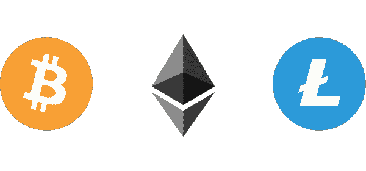

Bitcoin, Ethereum, and Litecoin

在这一部分中，我将使用买入并持有策略来分析最近两个月哪个硬币(**比特币**、**以太坊**或**莱特币**)最赚钱。我们将通过对这 3 种加密货币的分析，尝试给出一个客观的答案。

**如果你错过了我关于这个主题的其他文章:**

[](https://romanorac.medium.com/stock-market-analysis-in-python-b71bf50151d9) [## Python 中的股票市场分析

### 我用 Python 写的关于股票市场和加密货币分析的文章的精选列表。

romanorac.medium.com](https://romanorac.medium.com/stock-market-analysis-in-python-b71bf50151d9) 

**这里有几个你可能会感兴趣的链接:**

```
- [Complete your Python analyses 10x faster with Mito](https://trymito.io/) [Product]- [Free skill tests for Data Scientists & ML Engineers](https://aigents.co/skills) [Test]- [All New Self-Driving Car Engineer Nanodegree](https://imp.i115008.net/c/2402645/1116216/11298)[Course]
```

*你愿意多看一些这样的文章吗？如果是这样，你可以点击上面的任何链接来支持我。其中一些是附属链接，但你不需要购买任何东西。*

# 放弃

我不是交易者，这篇博客也不是金融建议。这纯粹是入门知识。当我们分析这一时期的巨大增长时，这个结论可能会产生误导。

# 要求

*   [seaborn:统计数据可视化](https://seaborn.pydata.org/)

其他要求，见本系列我之前的[博文](/cryptocurrency-analysis-with-python-macd-452ceb251d7c)。

# 获取数据

要获得最新的数据，请访问[之前的博客文章](/cryptocurrency-analysis-with-python-macd-452ceb251d7c)，在那里我描述了如何使用 Cryptocompare API 下载它。你也可以使用我在这个例子中使用的数据。

首先，让我们从比特币基地交易所下载 BTC、瑞士联邦理工学院和长期资本公司的每小时数据。这次我们使用每小时的时间间隔，因为它具有更高的粒度。Cryptocompare API 限制对 2000 个样本的响应，这是每枚硬币 2.7 个月的数据。

```
import pandas **as** pd**def** **get_filename**(from_symbol, to_symbol, exchange, datetime_interval, download_date):
    **return** '%s_%s_%s_%s_%s.csv' **%** (from_symbol, to_symbol, exchange, datetime_interval, download_date)**def** **read_dataset**(filename):
    **print**('Reading data from %s' **%** filename)
    df **=** pd**.**read_csv(filename)
    df**.**datetime **=** pd**.**to_datetime(df**.**datetime) *# change to datetime*
    df **=** df**.**set_index('datetime') 
    df **=** df**.**sort_index() *# sort by datetime*
    **print**(df**.**shape)
    **return** df
```

# 加载数据

```
df_btc **=** read_dataset(get_filename('BTC', 'USD', 'Coinbase', 'hour', '2017-12-24'))
df_eth **=** read_dataset(get_filename('ETH', 'USD', 'Coinbase', 'hour', '2017-12-24'))
df_ltc **=** read_dataset(get_filename('LTC', 'USD', 'Coinbase', 'hour', '2017-12-24'))df_btc.head()
```

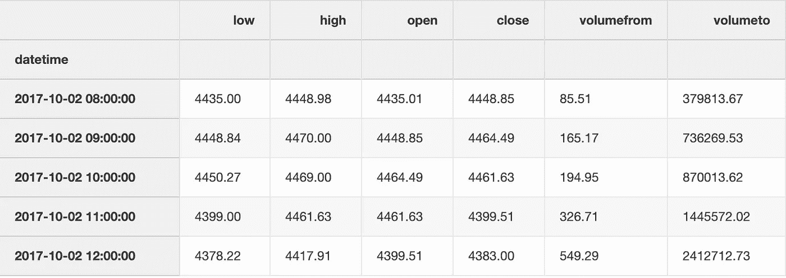

Few entries in the dataset.

# 提取收盘价

我们将分析收盘价，即小时时段收盘时的价格。我们将 BTC、ETH 和 LTC 的收盘价合并到一个数据框架中，以便于分析。

```
df **=** pd**.**DataFrame({'BTC': df_btc**.**close,
                   'ETH': df_eth**.**close,
                   'LTC': df_ltc**.**close})df**.**head()
```

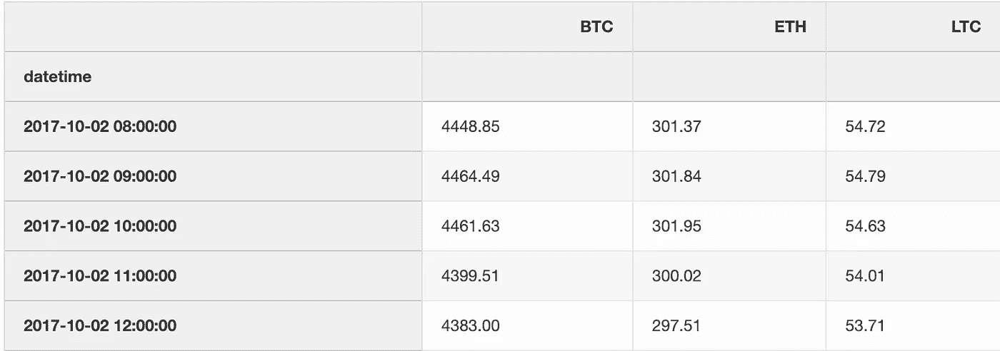

# 分析

# 基本统计

在 2.7 个月的时间里，三种加密货币的波动都很大，如下表所示。

对于每个硬币，我们计算事件的数量，并计算平均值、标准差、最小值、四分位数和最大收盘价。

**观察结果**

*   在 2.7 个月内，BTC 最高价和最低价之间的差额超过了 15000 美元。
*   LTC 从 48.61 美元暴涨到某一点的 378.66 美元，涨幅为 678.98%。

```
df**.**describe()
```

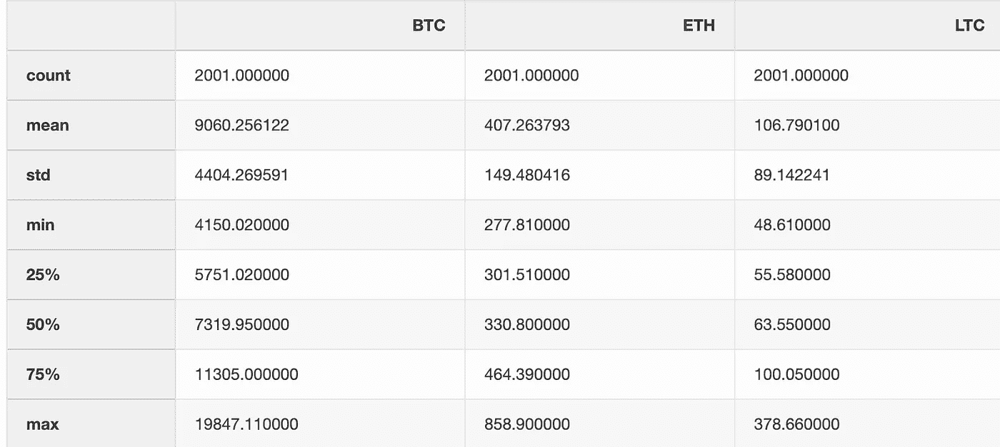

# 让我们更深入地了解 LTC

我们用方框图将上表中的数据可视化。使用[四分位间距](https://en.wikipedia.org/wiki/Interquartile_range) (IQR)的方法，箱线图显示了数据集的四分位以及被确定为异常值的点。换句话说，IQR 是第三个四分位数(75%)减去第一个四分位数(25%)。

在下面的方框图中，我们看到在过去的 2.7 个月中，LTC 的小时收盘价大部分时间都在 50 美元到 100 美元之间。所有超过 150 美元的值都是异常值(使用 IQR)。请注意，异常值是特定于这个数据样本的。

```
import seaborn **as** snsax **=** sns**.**boxplot(data**=**df['LTC'], orient**=**"h")
```

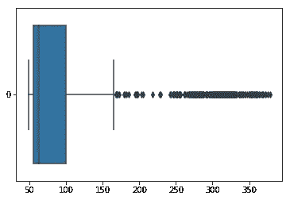

LTC Boxplot with closing hourly prices

## LTC 收盘价直方图

我们来估计一下 LTC 收盘价的频率分布。直方图显示了 LTC 具有特定值的小时数。

**观察结果**

*   LTC 收盘价在许多小时内都没有超过 100 美元。
*   它具有右偏分布，因为自然极限阻止了一边的结果。
*   蓝色虚线(中值)显示一半时间收盘价低于 63.50 美元。

```
df['LTC']**.**hist(bins**=**30, figsize**=**(15,10))**.**axvline(df['LTC']**.**median(), color**=**'b', linestyle**=**'dashed', linewidth**=**2)
```

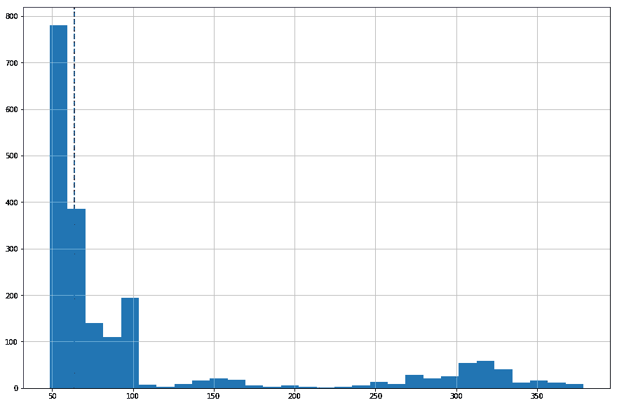

Histogram for LTC with the median

# 可视化绝对收盘价

下图显示了绝对收盘价。这没有多大用处，因为 BTC 的收盘价远高于瑞士联邦理工学院和长期资本公司的价格。

```
df**.**plot(grid**=**True, figsize**=**(15, 10))
```

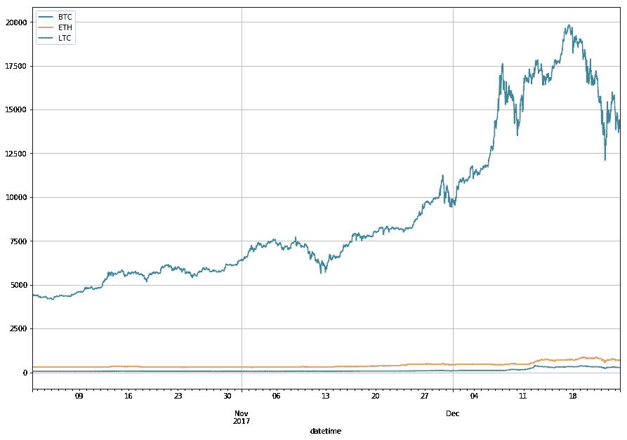

Absolute closing price changes of BTC, ETH and LTC

# 可视化收盘价的相对变化

我们感兴趣的是价格的相对变化，而不是绝对价格，因此我们使用三种不同的 y 轴刻度。

我们看到收盘价是一致的。当一枚硬币的收盘价上涨时，另一枚也会上涨。

```
import matplotlib.pyplot **as** plt
import numpy **as** npfig, ax1 **=** plt**.**subplots(figsize**=**(20, 10))
ax2 **=** ax1**.**twinx()
rspine **=** ax2**.**spines['right']
rspine**.**set_position(('axes', 1.15))
ax2**.**set_frame_on(True)
ax2**.**patch**.**set_visible(False)
fig**.**subplots_adjust(right**=**0.7)df['BTC']**.**plot(ax**=**ax1, style**=**'b-')
df['ETH']**.**plot(ax**=**ax1, style**=**'r-', secondary_y**=**True)
df['LTC']**.**plot(ax**=**ax2, style**=**'g-')*# legend*
ax2**.**legend([ax1**.**get_lines()[0],
            ax1**.**right_ax**.**get_lines()[0],
            ax2**.**get_lines()[0]],
           ['BTC', 'ETH', 'LTC'])
```

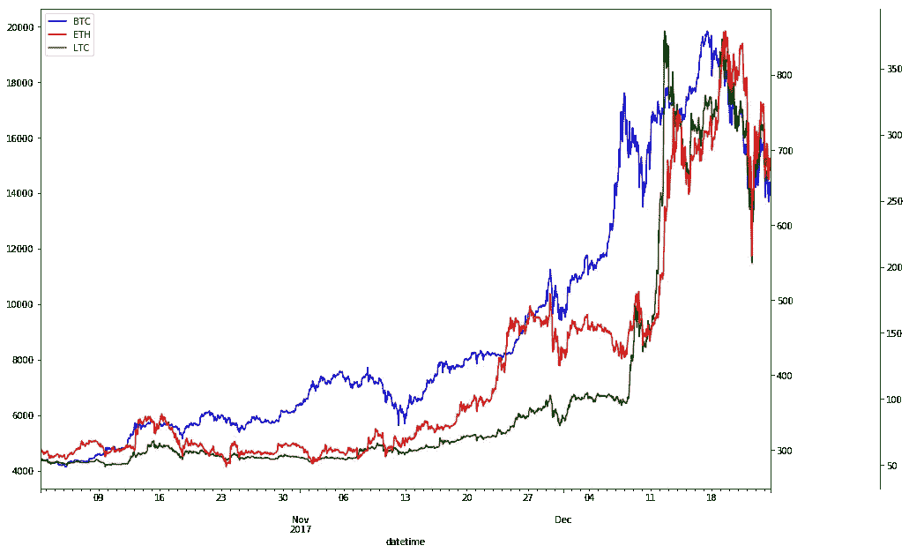

Relative closing price changes of BTC, ETH and LTC

# 衡量收盘价的相关性

我们计算 BTC、瑞士联邦理工学院和长期资本公司的收盘价之间的[皮尔逊相关](https://en.wikipedia.org/wiki/Pearson_correlation_coefficient)。皮尔逊相关是两个变量 X 和 y 之间线性相关的度量。它的值介于+1 和-1 之间，其中 1 表示完全正线性相关，0 表示没有线性相关，1 表示完全负线性相关。相关矩阵是对称的，所以我们只显示下半部分。

[Sifr 数据](https://www.sifrdata.com/cryptocurrency-correlation-matrix/)每日更新许多加密货币的皮尔逊相关性。

**观察结果**

*   收盘价没有被归一化，参见[日志返回](https://romanorac.github.io/cryptocurrency/analysis/2017/12/29/cryptocurrency-analysis-with-python-part3.html)，我们在计算相关性之前归一化收盘价。
*   BTC、ETH 和 LTC 在过去 2 个月内高度相关。这意味着，当 BTC 收盘价上涨时，ETH 和 LTC 也跟着上涨。
*   ETH 和 LTC 的相关系数更高，为 0.9565。

```
import seaborn **as** sns
import matplotlib.pyplot **as** plt*# Compute the correlation matrix*
corr **=** df**.**corr()*# Generate a mask for the upper triangle*
mask **=** np**.**zeros_like(corr, dtype**=**np**.**bool)
mask[np**.**triu_indices_from(mask)] **=** True*# Set up the matplotlib figure*
f, ax **=** plt**.**subplots(figsize**=**(10, 10))*# Draw the heatmap with the mask and correct aspect ratio*
sns**.**heatmap(corr, annot**=**True, fmt **=** '.4f', mask**=**mask, center**=**0, square**=**True, linewidths**=.**5)
```

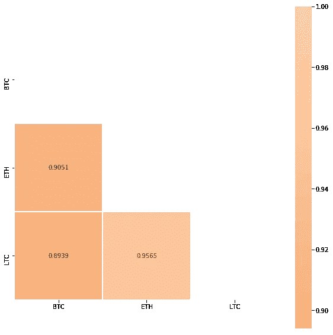

Pearson Correlation for BTC, ETH and LTC

# 买入并持有策略

[买入并持有](https://www.investopedia.com/terms/b/buyandhold.asp)是一种被动投资策略，投资者买入一种加密货币并长期持有，不管市场如何波动。

让我们用买入并持有策略来分析过去 2.7 个月的回报。我们计算回报百分比，其中 *t* 代表某个时间段， *price0* 是初始收盘价:

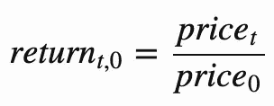

```
df_return **=** df**.**apply(**lambda** x: x **/** x[0])
df_return**.**head()
```

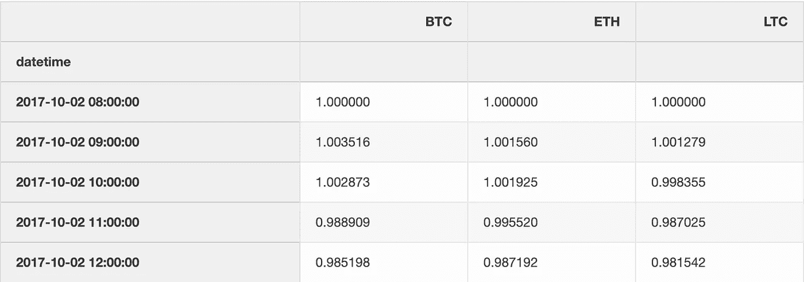

# 可视化返回

我们显示，在 2017 年 10 月 2 日至 2017 年 12 月 24 日期间，LTC 是最盈利的。

```
df_return**.**plot(grid**=**True, figsize**=**(15, 10))**.**axhline(y **=** 1, color **=** "black", lw **=** 2)
```

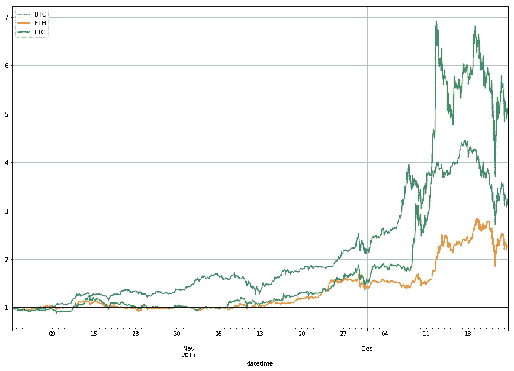

The factor of returns for BTC, ETH and LTC in 2.7 months

# 结论

我们分析的加密货币波动很大，但都在给定的 2.7 个月内上涨。

# 百分比增长呢？

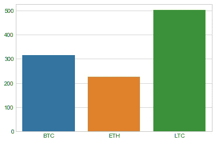

The percentage increase for BTC, ETH and LTC in 2.7 months

# 1000 美元我们能买多少硬币？

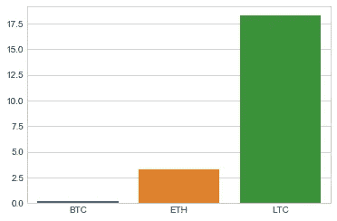

The number of coins we could buy with $1000 a while ago

# 我们能赚多少钱？

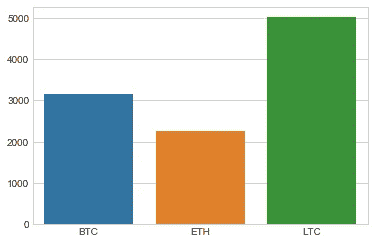

The amount of money we would make if we invested $1000 a while ago

# 在你走之前

要运行这段代码，请下载 [Jupyter 笔记本](https://romanorac.github.io/assets/notebooks/2017-12-25-cryptocurrency-analysis-with-python-part2.ipynb)。

在 [Twitter](https://twitter.com/romanorac) 上关注我，在那里我定期[发布关于数据科学和机器学习的](https://twitter.com/romanorac/status/1328952374447267843)消息。


Photo by [Courtney Hedger](https://unsplash.com/@cmhedger?utm_source=medium&utm_medium=referral) on [Unsplash](https://unsplash.com/?utm_source=medium&utm_medium=referral)