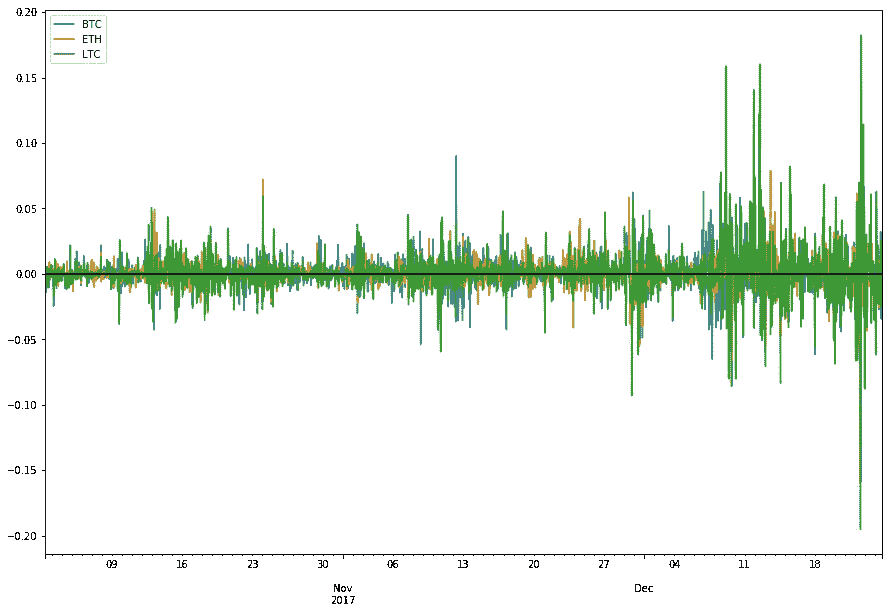
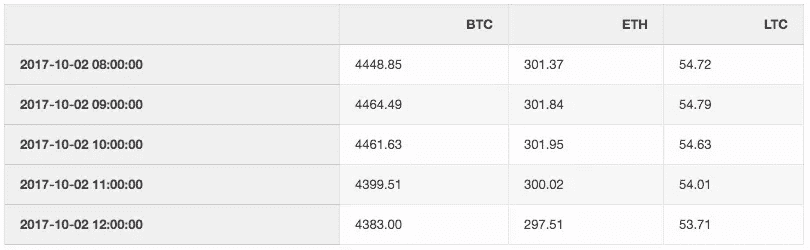
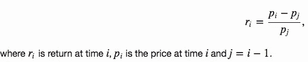
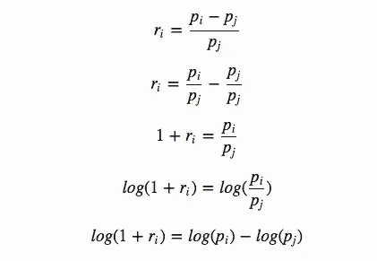
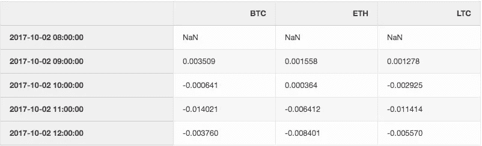
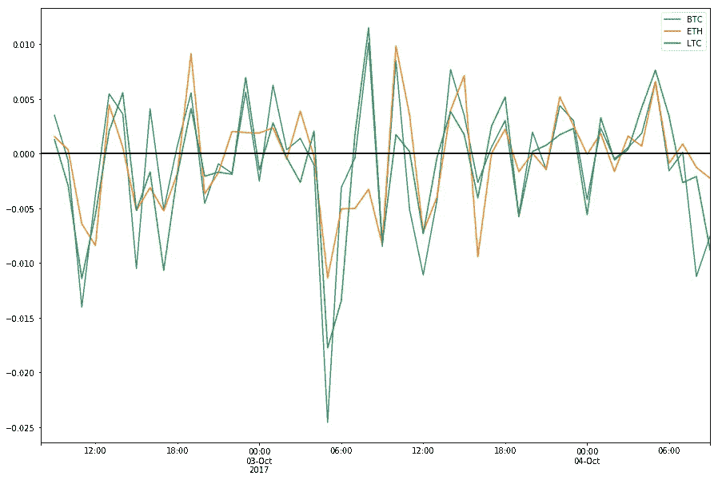
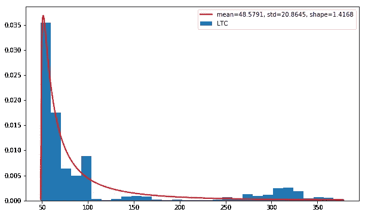
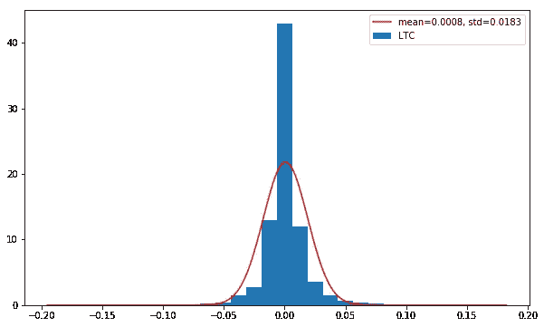
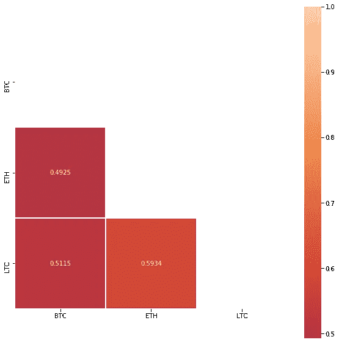

# 使用 Python 进行加密货币分析—日志回报

> 原文：<https://towardsdatascience.com/cryptocurrency-analysis-with-python-log-returns-f9c198a27884?source=collection_archive---------17----------------------->


Photo by [André François McKenzie](https://unsplash.com/@silverhousehd?utm_source=medium&utm_medium=referral) on [Unsplash](https://unsplash.com?utm_source=medium&utm_medium=referral)

在[之前的文章](/cryptocurrency-analysis-with-python-buy-and-hold-c3b0bc164ffa)中，我们分析了加密货币的原始价格变化。这种方法的问题是不同加密货币的价格没有标准化，我们无法使用可比的指标。

在这篇文章中，我们描述了使用对数收益分析价格变化的好处。你可以下载这个 [Jupyter 笔记本](https://romanorac.github.io/assets/notebooks/2017-12-29-cryptocurrency-analysis-with-python-part3.ipynb)和[数据](https://github.com/romanorac/romanorac.github.io/tree/master/assets/data)。

**如果你错过了我关于这个主题的其他文章:**

[](https://romanorac.medium.com/stock-market-analysis-in-python-b71bf50151d9) [## Python 中的股票市场分析

### 我用 Python 写的关于股票市场和加密货币分析的文章的精选列表。

romanorac.medium.com](https://romanorac.medium.com/stock-market-analysis-in-python-b71bf50151d9) 

**这里有几个你可能会感兴趣的链接:**

```
- [Labeling and Data Engineering for Conversational AI and Analytics](https://www.humanfirst.ai/)- [Data Science for Business Leaders](https://imp.i115008.net/c/2402645/880006/11298) [Course]- [Intro to Machine Learning with PyTorch](https://imp.i115008.net/c/2402645/788201/11298) [Course]- [Become a Growth Product Manager](https://imp.i115008.net/c/2402645/803127/11298) [Course]- [Deep Learning (Adaptive Computation and ML series)](https://amzn.to/3ncTG7D) [Ebook]- [Free skill tests for Data Scientists & Machine Learning Engineers](https://aigents.co/skills)
```

*上面的一些链接是附属链接，如果你通过它们购买，我会赚取佣金。请记住，我链接课程是因为它们的质量，而不是因为我从你的购买中获得的佣金。*



Bitcoin, Ethereum, and Litecoin Log Returns

# 要求

*   [SciPy——Python 的科学和数值工具](https://www.scipy.org/)

其他要求，见我这个系列的[第一篇博文](/cryptocurrency-analysis-with-python-macd-452ceb251d7c)。

# 加载数据

```
import pandas **as** pddf_btc **=** pd**.**read_csv('BTC_USD_Coinbase_hour_2017-12-24.csv', index_col**=**'datetime')
df_eth **=** pd**.**read_csv('ETH_USD_Coinbase_hour_2017-12-24.csv', index_col**=**'datetime')
df_ltc **=** pd**.**read_csv('LTC_USD_Coinbase_hour_2017-12-24.csv', index_col**=**'datetime')df **=** pd**.**DataFrame({'BTC': df_btc**.**close,
                   'ETH': df_eth**.**close,
                   'LTC': df_ltc**.**close})
df**.**index **=** df**.**index**.**map(pd**.**to_datetime)
df **=** df**.**sort_index()df**.**head()
```



与价格相比，使用回报的好处是标准化:以可比较的度量标准衡量所有变量，从而能够评估两个或更多变量之间的分析关系，尽管这些变量来自不等值的价格序列(有关详细信息，请参见[为什么记录回报](https://quantivity.wordpress.com/2011/02/21/why-log-returns/))。

让我们将回报定义为:



# 计算日志回报

[Why Log Returns](https://quantivity.wordpress.com/2011/02/21/why-log-returns/) 一书的作者概述了使用 Log Returns 代替 Returns 的几个好处，因此我们将 **returns** 等式转换为 **log returns** 等式:



现在，我们将对数回报方程应用于加密货币的收盘价:

```
import numpy **as** np*# shift moves dates back by 1*
df_change **=** df**.**apply(**lambda** x: np**.**log(x) **-** np**.**log(x**.**shift(1)))df_change**.**head()
```



# 可视化日志返回

我们绘制了过去 50 小时收盘价的归一化变化。对数差异可以解释为百分比变化。

```
df_change[:50]**.**plot(figsize**=**(15, 10))**.**axhline(color**=**'black', linewidth**=**2)
```



Bitcoin, Ethereum, and Litecoin Log Returns for last 50 hours

# LTC 价格服从对数正态分布吗？

如果我们假设价格服从对数正态分布，那么 log(1+ri)很方便地服从正态分布(详见[为什么 log 返回](https://quantivity.wordpress.com/2011/02/21/why-log-returns/))

在下图中，我们绘制了 LTC 小时收盘价的分布。我们还估计对数正态分布的参数，并用红线标出估计的对数正态分布。

```
from scipy.stats import lognorm
import matplotlib.pyplot **as** pltfig, ax **=** plt**.**subplots(figsize**=**(10, 6))values **=** df['LTC']shape, loc, scale **=** stats**.**lognorm**.**fit(values) 
x **=** np**.**linspace(values**.**min(), values**.**max(), len(values))
pdf **=** stats**.**lognorm**.**pdf(x, shape, loc**=**loc, scale**=**scale) 
label **=** 'mean=%.4f, std=%.4f, shape=%.4f' **%** (loc, scale, shape)ax**.**hist(values, bins**=**30, normed**=**True)
ax**.**plot(x, pdf, 'r-', lw**=**2, label**=**label)
ax**.**legend(loc**=**'best')
```



Distribution of LTC prices

# LTC 日志回报是否正态分布？

在下面的图表中，我们绘制了 LTC 日志回报的分布。我们还估计正态分布的参数，并用红线标出估计的正态分布。

```
import pandas **as** pd
import numpy **as** np
import scipy.stats **as** stats
import matplotlib.pyplot **as** pltvalues **=** df_change['LTC'][1:]  *# skip first NA value*
x **=** np**.**linspace(values**.**min(), values**.**max(), len(values))loc, scale **=** stats**.**norm**.**fit(values)
param_density **=** stats**.**norm**.**pdf(x, loc**=**loc, scale**=**scale)
label **=** 'mean=%.4f, std=%.4f' **%** (loc, scale)fig, ax **=** plt**.**subplots(figsize**=**(10, 6))
ax**.**hist(values, bins**=**30, normed**=**True)
ax**.**plot(x, param_density, 'r-', label**=**label)
ax**.**legend(loc**=**'best')
```



Distribution of LTC Log Returns

# 皮尔逊相关性与对数回报

我们从对数收益计算皮尔逊相关。以下相关矩阵的值与 [Sifr 数据](https://www.sifrdata.com/cryptocurrency-correlation-matrix/)中的值相似。存在差异是因为:

*   我们不计算[成交量加权平均日价格](https://www.investopedia.com/terms/v/vwap.asp)
*   不同时间段(每小时和每天)，
*   不同的数据来源(比特币基地和波洛涅克斯)。

**观察结果**

*   BTC 和瑞士联邦理工学院有着适度的正面关系，
*   LTC 和 ETH 有很强的正相关关系。

```
import seaborn **as** sns
import matplotlib.pyplot **as** plt*# Compute the correlation matrix*
corr **=** df_change**.**corr()*# Generate a mask for the upper triangle*
mask **=** np**.**zeros_like(corr, dtype**=**np**.**bool)
mask[np**.**triu_indices_from(mask)] **=** True*# Set up the matplotlib figure*
f, ax **=** plt**.**subplots(figsize**=**(10, 10))*# Draw the heatmap with the mask and correct aspect ratio*
sns**.**heatmap(corr, annot**=**True, fmt **=** '.4f', mask**=**mask, center**=**0, square**=**True, linewidths**=.**5)
```



The correlation matrix with BTC, ETH and LTC

# 结论

我们用一个实例展示了如何从原始价格计算对数收益。这样，我们将价格标准化，这简化了进一步的分析。我们还展示了如何估计正态和对数正态分布的参数。

# 在你走之前

在 [Twitter](https://twitter.com/romanorac) 上关注我，在那里我定期[发布关于数据科学和机器学习的](https://twitter.com/romanorac/status/1328952374447267843)消息。

