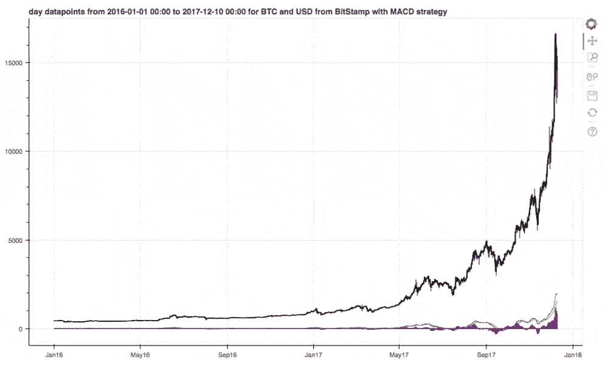
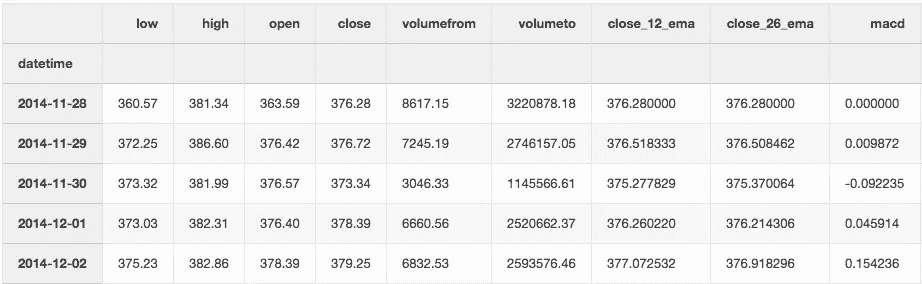
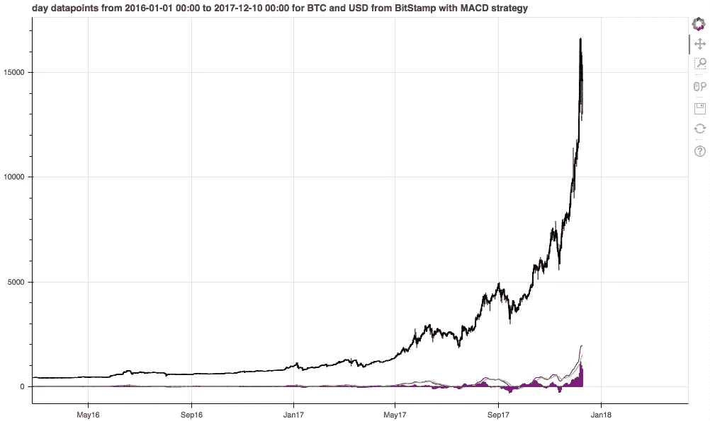

# 基于 Python 的加密货币分析——MACD

> 原文：<https://towardsdatascience.com/cryptocurrency-analysis-with-python-macd-452ceb251d7c?source=collection_archive---------10----------------------->


Photo by [Thought Catalog](https://unsplash.com/@thoughtcatalog?utm_source=medium&utm_medium=referral) on [Unsplash](https://unsplash.com?utm_source=medium&utm_medium=referral)

我决定周末学习加密货币分析。我破解了代码[来下载每日比特币价格，并对其应用简单的交易策略。](https://romanorac.github.io/assets/notebooks/2017-12-17-cryptocurrency-analysis-with-python-part1.ipynb)

**如果你错过了我关于这个话题的其他文章:**

[](https://romanorac.medium.com/stock-market-analysis-in-python-b71bf50151d9) [## Python 中的股票市场分析

### 我用 Python 写的关于股票市场和加密货币分析的文章的精选列表。

romanorac.medium.com](https://romanorac.medium.com/stock-market-analysis-in-python-b71bf50151d9) 

**这里有几个你可能会感兴趣的链接:**

```
- [Complete your Python analyses 10x faster with Mito](https://trymito.io/) [Product]- [Free skill tests for Data Scientists & ML Engineers](https://aigents.co/skills) [Test]- [All New Self-Driving Car Engineer Nanodegree](https://imp.i115008.net/c/2402645/1116216/11298)[Course]
```

您愿意阅读更多这样的文章吗？如果是这样，你可以点击上面的任何链接来支持我。其中一些是附属链接，但你不需要购买任何东西。

# 传统视图

已经存在执行这种分析的工具，例如 [tradingview](https://www.tradingview.com/) ，但是在 Python 中进行这种分析可以实现更深入的分析。



Interactive plot showing Bitcoin price

# 放弃

我不是交易者，这篇博客也不是金融建议。这纯粹是入门知识。当我们分析巨大增长的时期时，这里的结论可能是误导的。

# 要求

*   Python 3
*   [Jupyter 笔记本](http://jupyter.org/)
*   [熊猫数据分析库](https://pandas.pydata.org/)
*   [散景互动可视化库](https://bokeh.pydata.org/en/latest/)
*   [股票统计/指标计算助手](https://github.com/jealous/stockstats)

# 获取加密货币数据

我们在 Bitstamp exchange 上下载每日以美元计算的比特币数据。[也支持其他交换](https://www.cryptocompare.com/api/#introduction)。

```
from_symbol **=** 'BTC'
to_symbol **=** 'USD'
exchange **=** 'Bitstamp'
datetime_interval **=** 'day'
```

[cryptocompare API](https://www.cryptocompare.com/api/#introduction) 返回以下列:

*   **开盘**，该时段开盘的价格、
*   **高点**，期间达到的最高价位，
*   **低点**，期间达到的最低价，
*   **收盘**，该时段收盘的价格、
*   **成交量从**开始，以交易的基础货币表示的成交量，
*   **成交量到**，交易货币的成交量。

我们下载数据并存储到一个文件中。

```
import requests
from datetime import datetime **def** **get_filename**(from_symbol, to_symbol, exchange, datetime_interval, download_date):
    **return** '%s_%s_%s_%s_%s.csv' **%** (from_symbol, to_symbol, exchange, datetime_interval, download_date) **def** **download_data**(from_symbol, to_symbol, exchange, datetime_interval):
    supported_intervals **=** {'minute', 'hour', 'day'}
    **assert** datetime_interval **in** supported_intervals,\
        'datetime_interval should be one of %s' **%** supported_intervals **print**('Downloading %s trading data for %s %s from %s' **%**
          (datetime_interval, from_symbol, to_symbol, exchange))
    base_url **=** 'https://min-api.cryptocompare.com/data/histo'
    url **=** '%s%s' **%** (base_url, datetime_interval) params **=** {'fsym': from_symbol, 'tsym': to_symbol,
              'limit': 2000, 'aggregate': 1,
              'e': exchange}
    request **=** requests**.**get(url, params**=**params)
    data **=** request**.**json()
    **return** data **def** **convert_to_dataframe**(data):
    df **=** pd**.**io**.**json**.**json_normalize(data, ['Data'])
    df['datetime'] **=** pd**.**to_datetime(df**.**time, unit**=**'s')
    df **=** df[['datetime', 'low', 'high', 'open',
             'close', 'volumefrom', 'volumeto']]
    **return** df **def** **filter_empty_datapoints**(df):
    indices **=** df[df**.**sum(axis**=**1) **==** 0]**.**index
    **print**('Filtering %d empty datapoints' **%** indices**.**shape[0])
    df **=** df**.**drop(indices)
    **return** df data **=** download_data(from_symbol, to_symbol, exchange, datetime_interval)
df **=** convert_to_dataframe(data)
df **=** filter_empty_datapoints(df)current_datetime **=** datetime**.**now()**.**date()**.**isoformat()
filename **=** get_filename(from_symbol, to_symbol, exchange, datetime_interval, current_datetime)
**print**('Saving data to %s' **%** filename)
df**.**to_csv(filename, index**=**False)
```

# 读取数据

我们从文件中读取数据，所以我们不需要再次下载它。

```
import pandas **as** pd**def** **read_dataset**(filename):
    **print**('Reading data from %s' **%** filename)
    df **=** pd**.**read_csv(filename)
    *# change type from object to datetime
*    df**.**datetime **=** pd**.**to_datetime(df**.**datetime) 
    df **=** df**.**set_index('datetime') 
    df **=** df**.**sort_index() *# sort by datetime*
    **print**(df**.**shape)
    **return** dfdf **=** read_dataset(filename)
```

# 交易策略

交易策略是一套客观的规则，定义了交易进场和出场必须满足的条件。

我们将采用移动平均线收敛发散(MACD)交易策略，这是技术分析中常用的指标。MACD 计算两条不同长度的移动平均线来确定趋势方向和持续时间。然后，取这两条移动平均线(MACD 线)和这些移动平均线的指数移动平均线(信号线)之间的差值。Tradeview 有一篇关于 MACD 的精彩博文。

正如我们在下面的例子中看到的:

*   当 MACD 线穿过 MACD 信号线时退出交易，
*   当 MACD 线穿过 MACD 信号线时，进场交易(买入)。

# 计算交易策略

我们使用 [stockstats](https://github.com/jealous/stockstats) 软件包来计算 MACD。

```
from stockstats import StockDataFrame
df **=** StockDataFrame**.**retype(df)
df['macd'] **=** df**.**get('macd') *# calculate MACD*
```

stockstats 向数据集添加了 5 列:

*   **close_12_ema** 是快速 12 天指数移动平均线，
*   **close_26_ema** 是慢 26 天指数移动平均线，
*   **macd** 是 macd 线，
*   **MACD**是信号线，
*   **macdh** 是 MACD 直方图。



Few entries in the dataset.

# 可视化交易策略

我们使用散景交互式图表来绘制数据。

折线图用蜡烛线显示每日收盘价(放大)。蜡烛图显示特定时期的最高价、最低价、开盘价和收盘价。Tradeview 有一篇关于[烛台图](https://www.investopedia.com/terms/c/candlestick.asp)的很棒的博文。

在线图下方，我们用 MACD 线(蓝色)、信号线(橙色)和柱状图(紫色)绘制了 MACD 策略。

```
from math import pifrom bokeh.plotting import figure, show, output_notebook, output_file
output_notebook()datetime_from **=** '2016-01-01 00:00'
datetime_to **=** '2017-12-10 00:00' **def** **get_candlestick_width**(datetime_interval):
    **if** datetime_interval **==** 'minute':
        **return** 30 ***** 60 ***** 1000  *# half minute in ms*
    **elif** datetime_interval **==** 'hour':
        **return** 0.5 ***** 60 ***** 60 ***** 1000  *# half hour in ms*
    **elif** datetime_interval **==** 'day':
        **return** 12 ***** 60 ***** 60 ***** 1000  *# half day in ms* df_limit **=** df[datetime_from: datetime_to]**.**copy()
inc **=** df_limit**.**close **>** df_limit**.**open
dec **=** df_limit**.**open **>** df_limit**.**closetitle **=** '%s datapoints from %s to %s for %s and %s from %s with MACD strategy' **%** (
    datetime_interval, datetime_from, datetime_to, from_symbol, to_symbol, exchange)
p **=** figure(x_axis_type**=**"datetime",  plot_width**=**1000, title**=**title)p**.**line(df_limit**.**index, df_limit**.**close, color**=**'black')*# plot macd strategy*
p**.**line(df_limit**.**index, 0, color**=**'black')
p**.**line(df_limit**.**index, df_limit**.**macd, color**=**'blue')
p**.**line(df_limit**.**index, df_limit**.**macds, color**=**'orange')
p**.**vbar(x**=**df_limit**.**index, bottom**=**[
       0 **for** _ **in** df_limit**.**index], top**=**df_limit**.**macdh, width**=**4, color**=**"purple")*# plot candlesticks*
candlestick_width **=** get_candlestick_width(datetime_interval)
p**.**segment(df_limit**.**index, df_limit**.**high,
          df_limit**.**index, df_limit**.**low, color**=**"black")
p**.**vbar(df_limit**.**index[inc], candlestick_width, df_limit**.**open[inc],
       df_limit**.**close[inc], fill_color**=**"#D5E1DD", line_color**=**"black")
p**.**vbar(df_limit**.**index[dec], candlestick_width, df_limit**.**open[dec],
       df_limit**.**close[dec], fill_color**=**"#F2583E", line_color**=**"black")output_file("visualizing_trading_strategy.html", title**=**"visualizing trading strategy")
show(p)
```



# 在你走之前

在 [Twitter](https://twitter.com/romanorac) 上关注我，在那里我定期[发布关于数据科学和机器学习的](https://twitter.com/romanorac/status/1328952374447267843)消息。


Photo by [Courtney Hedger](https://unsplash.com/@cmhedger?utm_source=medium&utm_medium=referral) on [Unsplash](https://unsplash.com/?utm_source=medium&utm_medium=referral)