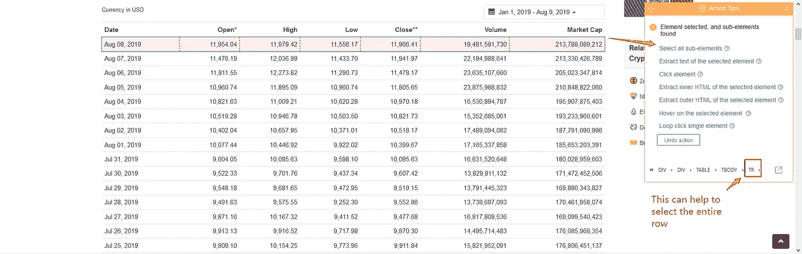
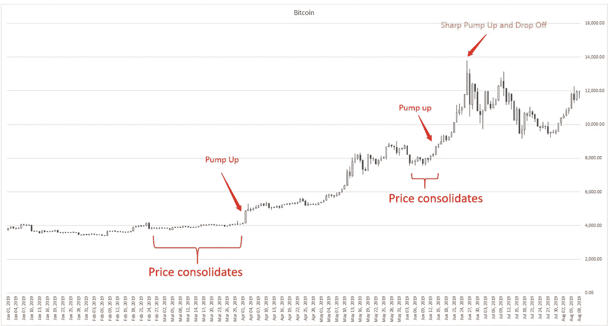
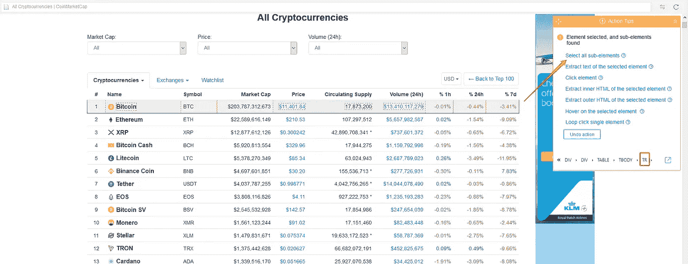
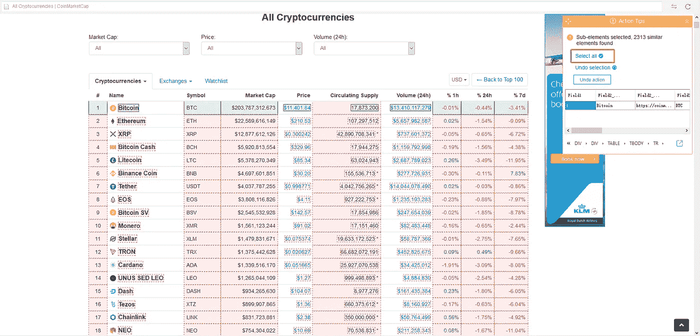
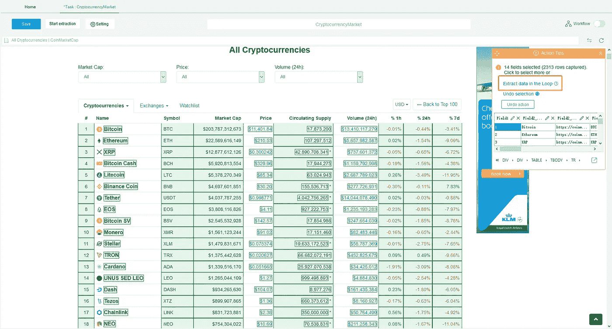

# 基于网络抓取的加密货币市场分析

> 原文：<https://towardsdatascience.com/cryptocurrency-market-analysis-with-web-scraping-61e4fd0b1c81?source=collection_archive---------11----------------------->

*Photo by* [*Eftakher Alam*](https://unsplash.com/@easiblu?utm_source=unsplash&utm_medium=referral&utm_content=creditCopyText) *on* [*Unsplash*](https://unsplash.com/search/photos/bitcoin?utm_source=unsplash&utm_medium=referral&utm_content=creditCopyText)

自 2009 年推出加密货币——比特币以来，整个加密货币市场前景看好，持续繁荣。迄今为止，已经创造了超过 4000 种替代币(比特币之外的替代加密货币)。此外，加密货币因其波动性而臭名昭著。关注市场可能非常困难，尤其是对新手投资者而言。

# **网络抓取在加密货币交易中的重要性？**

[**Web 抓取**](https://www.octoparse.com/) 主要用于电子商务和销售中的价格监控和线索生成。如今，越来越多的投资者开始利用在线金融技术。它自动化了从多个来源提取数据的过程，并以结构化格式存储数据以供进一步分析。

在这篇文章中，我将分解步骤，向你展示如何使用网络搜集来克服投资障碍:

1.  **提取历史加密市场数据，进行全面的市场分析**
2.  **监控加密定价，这样你就能像专业交易者一样清楚地了解整个市值。**

我将使用的工具是 [**Octoparse**](https://www.octoparse.com/) 。它是全球领先的 [**网页抓取提供** r](https://www.octoparse.com/) 。通过企业级服务，Octoparse 创建了一个抓取管道，并将数据集成到数据库或云 API 中。另一方面，对于想要更少数据量的用户来说，它是完全免费的。

想投资比特币但不知道时机对不对。我将提取 2019 年 1 月至今的比特币市场数据，以便我可以看到市场趋势，并决定我是否应该投资。在这种情况下，转到 [CoinMarketCap 页面](https://coinmarketcap.com/)并设置一个时间范围

**然后，在八分音符中:**

**第一步**:以高级模式启动提取任务，上传 URL。

**第二步**:点击图表的日期。Octoparse 会找到具有相同属性的相似元素。遵循操作提示，选择所有字段，包括开盘、盘高、盘低、收盘、成交量和市值。

**第三步**:开始提取，将数据导出到 Excel 中。

你应该能得到这样的整张图表:[**2019 年比特币市场。**](https://docs.google.com/spreadsheets/d/1RgdRY1NZmtNbV9RbDnLB_qTw8ZX0A_HA8iCEztqGuFY/edit?usp=sharing)

## **分析**

现在我们有了 Excel 中的数据。我们可以用 **Excel 瀑布图**来绘制。

正如你所看到的，市场遵循一个清晰的模式，价格上涨，下跌，稳定。价格上涨之后将是一个巩固期。急剧下降之后，很快就会出现急剧上升。这是有道理的，因为当市场波动太大时，它需要冷却到一个稳定的水平。6 月份以来的市场波动性较大。与年初相比，合并窗口越来越短，价格快速上涨和下跌。在大多数情况下，波动性越高，投资风险就越大。在图表的末尾，它表明价格波动呈上升趋势，没有任何稳定的迹象。这清楚地表明，现在不是一年中投资比特币的最佳时机。

既然市场价格是波动的，那么对于看客和投资者来说，都需要时刻关注市场。网络抓取可以监控价格变化，并传送到您的数据库，供以后访问。所以每当价格触及某一点时，你可以及时采取行动。

用/建立一个新项目。我将选择每个硬币名称来提取价格数据。Octoparse 通过选择所有列表名称来查找所有相似的元素。我从动作表中单击**“TR”**命令，告诉 Octoparse 提取行而不是列。

然后，我按照操作提示，单击**“选择所有子元素”**来定义来自同一行的提取字段。Octoparse 将以相同的模式选择所有数据字段。然后，我按照操作提示上的指导，点击**“全选”**命令来确认选择。如果选择成功，所选字段将变为绿色。

然后点击**“提取循环中的数据”**提取数据。现在我们有了所有的数据，包括市值、价格、流通供应量、成交量以及 1 小时、24 小时和 7 天内的变化。

在仪表板上，我将**提取计划**设置为 30 分钟间隔。因此，我的数据库每 30 分钟更新一次。我可以把手从桌子上拿开，同时还能监控市场。

# **网络抓取还有什么可以帮助加密货币分析的？**

## **情绪分析:**

情感分析通过自然语言处理来衡量人们的观点。这一想法是为了从社交媒体上监控公众对市场的情绪，因为网络是大多数加密货币投资者表达市场情绪的主要门户。Guus 认为“市场情绪的变化将与市场指数价值的变化相关联。”(Guss，2017)此外，Kaminski (2014)还指出，从 Twitter 收集的数据显示，情绪与收盘价、交易量和日内价格之间存在显著的相关性。

## [**新闻聚合器**](https://www.octoparse.com/blog/how-web-scraping-for-content-curation-works) **:**

对于管理专业人士来说，关注新闻媒体以了解最新的比特币交易信息是日常工作的基础。网络抓取工具可以从各种平台收集新闻信息并发送到你的邮箱，这样你就可以节省搜索的时间。

来源:

[https://lib . ugent . be/full txt/rug 01/002/508/647/rug 01-002508647 _ 2018 _ 0001 _ AC . pdf](https://lib.ugent.be/fulltxt/RUG01/002/508/647/RUG01-002508647_2018_0001_AC.pdf)

 [## 加密货币

### 加密货币(或加密货币)是一种数字资产，旨在作为一种使用强…

en.wikipedia.org](https://en.wikipedia.org/wiki/Cryptocurrency) 

https: //coinmarketcap.com

j . kamin ski(2014 年)。用 twitter 信号预测比特币市场。arXiv 预印本 arXiv:1406.7577。

*原载于 2019 年 8 月 1 日*[*https://www.octoparse.com*](https://www.octoparse.com/blog/cryptocurrency-market-analysis-with-web-scraping)*。*