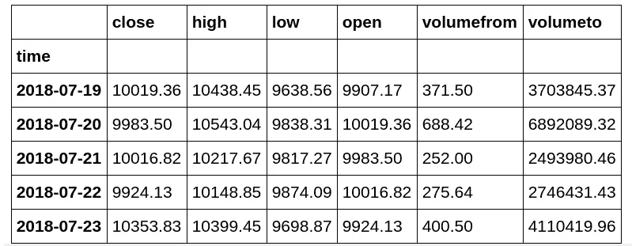
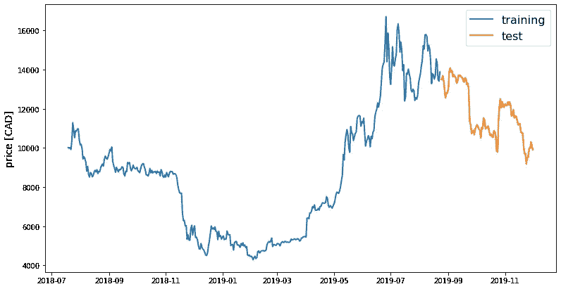
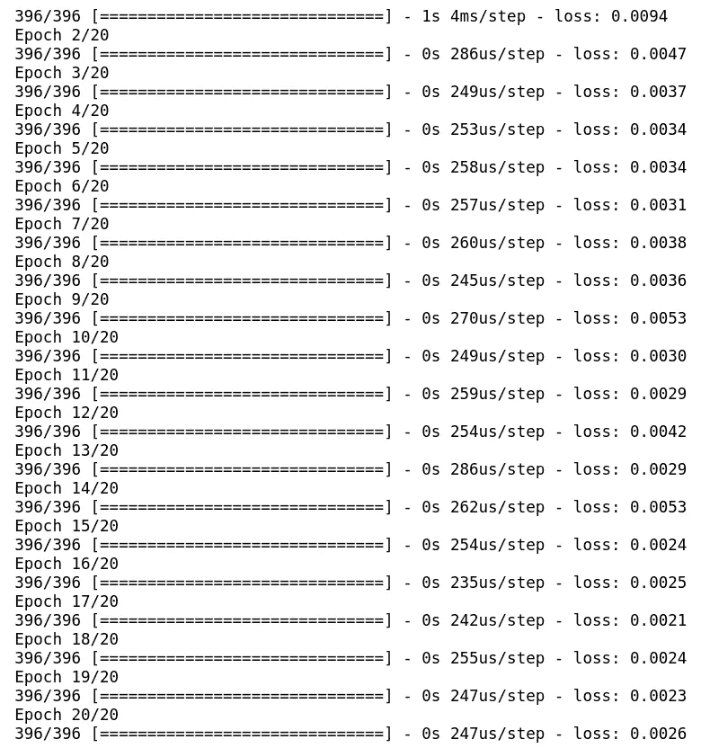
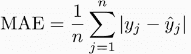
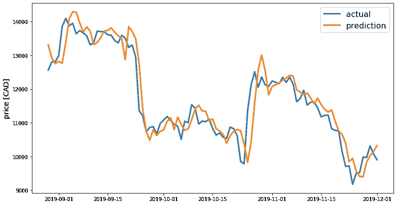

# 使用深度学习的加密货币价格预测

> 原文：<https://towardsdatascience.com/cryptocurrency-price-prediction-using-deep-learning-70cfca50dd3a?source=collection_archive---------2----------------------->

## 使用 LSTM 神经网络的完整机器学习真实世界应用程序走查


Photo by [Chris Liverani](https://unsplash.com/@chrisliverani?utm_source=unsplash&utm_medium=referral&utm_content=creditCopyText) on [Unsplash](https://unsplash.com/s/photos/stock-market?utm_source=unsplash&utm_medium=referral&utm_content=creditCopyText)

被困在付费墙后面？点击[这里](/cryptocurrency-price-prediction-using-deep-learning-70cfca50dd3a?source=friends_link&sk=331d27e1be556a0803f34b746f505467)阅读完整故事与我的朋友链接！

由于其市值连续几个月呈指数增长，加密货币的受欢迎程度在 2017 年飙升。价格在 2018 年 1 月达到峰值，超过 8000 亿美元。

尽管机器学习已经成功地通过大量不同的时间序列模型预测了股票市场价格，但它在预测加密货币价格方面的应用却受到了很大的限制。这背后的原因很明显，因为加密货币的价格取决于许多因素，如技术进步、内部竞争、市场交付压力、经济问题、安全问题、政治因素等。如果采取明智的发明策略，它们的高波动性导致高利润的巨大潜力。不幸的是，由于缺乏指数，与股票市场预测等传统金融预测相比，加密货币相对不可预测。

在这篇博客中，我将通过四个步骤来预测加密货币的价格:

1.  获取实时 crptocurrency 数据。
2.  为培训和测试准备数据。
3.  用 LSTM 神经网络预测人民币价格。
4.  将预测结果可视化。

# 挑战

使用数据集中的所有交易特征(如价格、交易量、开盘价、盘高、盘低值)来预测加密货币的价格。

# 数据

数据集可以从 CryptoCompare 网站下载，该网站可以在[这里](https://min-api.cryptocompare.com/)找到。

数据集总共包含 5 个要素。它们的详细信息如下:

1.  收盘价——这是当天货币的市场收盘价。
2.  高价——这是当天货币的最高价格。
3.  低价——这是当天货币的最低价格。
4.  开盘价—这是当天货币的市场开盘价。
5.  成交量——当天交易的货币量。

# 代码在哪里？

事不宜迟，让我们从代码开始吧。github 上的完整项目可以在[这里](https://github.com/abhinavsagar/Cryptocurrency-Price-Prediction)找到。

我从加载所有需要的库和依赖项开始。

```
import json
import requests
from keras.models import Sequential
from keras.layers import Activation, Dense, Dropout, LSTM
import matplotlib.pyplot as plt
import numpy as np
import pandas as pd
import seaborn as sns
from sklearn.metrics import mean_absolute_error
%matplotlib inline
```

我使用了加拿大的汇率，并把实时数据存入了熊猫的数据框。我使用了`to_datetime()` 方法将字符串日期时间转换成 Python 日期时间对象。这是必要的，因为文件中的日期时间对象被读取为字符串对象。对字符串而不是日期时间对象执行像时差这样的操作要容易得多。

```
endpoint = 'https://min-api.cryptocompare.com/data/histoday'
res = requests.get(endpoint + '?fsym=BTC&tsym=CAD&limit=500')
hist = pd.DataFrame(json.loads(res.content)['Data'])
hist = hist.set_index('time')
hist.index = pd.to_datetime(hist.index, unit='s')
target_col = 'close'
```

让我们看看数据集是怎样的，包括所有的交易特征，如价格、交易量、开盘价、最高价、最低价。

```
hist.head(5)
```



接下来，我将数据分成两组—分别包含 80%和 20%数据的训练集和测试集。这里所做的决定只是为了本教程的目的。在真实的项目中，你应该总是把你的数据分成训练、验证、测试(比如 60%、20%、20%)。

```
def train_test_split(df, test_size=0.2):
    split_row = len(df) - int(test_size * len(df))
    train_data = df.iloc[:split_row]
    test_data = df.iloc[split_row:]
    return train_data, test_datatrain, test = train_test_split(hist, test_size=0.2)
```

现在，让我们使用下面的代码来绘制以加元为单位的加密货币价格与时间的函数关系图:

```
def line_plot(line1, line2, label1=None, label2=None, title='', lw=2):
    fig, ax = plt.subplots(1, figsize=(13, 7))
    ax.plot(line1, label=label1, linewidth=lw)
    ax.plot(line2, label=label2, linewidth=lw)
    ax.set_ylabel('price [CAD]', fontsize=14)
    ax.set_title(title, fontsize=16)
    ax.legend(loc='best', fontsize=16)line_plot(train[target_col], test[target_col], 'training', 'test', title='')
```



我们可以观察到，在 2018 年 12 月至 2019 年 4 月之间，价格出现了明显的下降。从 2019 年 4 月到 2019 年 8 月，价格持续上涨，7 月和 8 月出现波动。从 2019 年 9 月开始，价格不断下降。从这一价格波动中值得注意的有趣的事情是，价格在冬天很低，而在夏天上涨。虽然这不能一概而论，因为所考虑的数据集只是一年的小样本。同样，对于加密货币，很难一概而论。

接下来，我创建了几个函数来规范化这些值。标准化是一种经常作为机器学习的数据准备的一部分而应用的技术。规范化的目标是将数据集中数值列的值更改为一个通用的比例，而不会扭曲值范围的差异。

```
def normalise_zero_base(df):
    return df / df.iloc[0] - 1

def normalise_min_max(df):
    return (df - df.min()) / (data.max() - df.min())
```

接下来，我创建了一个函数来提取大小为 5 的窗口的数据，如下面的代码所示:

```
def extract_window_data(df, window_len=5, zero_base=True):
    window_data = []
    for idx in range(len(df) - window_len):
        tmp = df[idx: (idx + window_len)].copy()
        if zero_base:
            tmp = normalise_zero_base(tmp)
        window_data.append(tmp.values)
    return np.array(window_data)
```

我继续创建一个函数，以某种格式准备数据，以便以后输入神经网络。我使用了同样的概念，将数据分成两组—分别包含 80%和 20%数据的训练集和测试集，如下面的代码所示:

```
def prepare_data(df, target_col, window_len=10, zero_base=True, test_size=0.2):
    train_data, test_data = train_test_split(df, test_size=test_size)
    X_train = extract_window_data(train_data, window_len, zero_base)
    X_test = extract_window_data(test_data, window_len, zero_base)
    y_train = train_data[target_col][window_len:].values
    y_test = test_data[target_col][window_len:].values
    if zero_base:
        y_train = y_train / train_data[target_col][:-window_len].values - 1
        y_test = y_test / test_data[target_col][:-window_len].values - 1

    return train_data, test_data, X_train, X_test, y_train, y_test
```

# **LSTM**

它通过使用特殊的门来允许每个 LSTM 层从先前层和当前层获取信息。数据通过多个门(如遗忘门、输入门等。)和各种激活功能(如 tanh 功能、relu 功能)并通过 LSTM 细胞。这样做的主要优点是，它允许每个 LSTM 细胞在一定时间内记住模式。需要注意的是，LSTM 可以记住重要的信息，同时忘记不相关的信息。LSTM 架构如下所示:


LSTM architecture

现在让我们建立模型。顺序模型用于堆叠所有层(输入、隐藏和输出)。神经网络包括一个 LSTM 层，后面是 20%的下降层和一个具有线性激活函数的密集层。我用 Adam 作为优化器，用均方差作为损失函数来编译这个模型。

```
def build_lstm_model(input_data, output_size, neurons=100, activ_func='linear', dropout=0.2, loss='mse', optimizer='adam'):
    model = Sequential()
    model.add(LSTM(neurons, input_shape=(input_data.shape[1], input_data.shape[2])))
    model.add(Dropout(dropout))
    model.add(Dense(units=output_size))
    model.add(Activation(activ_func))
    model.compile(loss=loss, optimizer=optimizer)
    return model
```

接下来，我设置了一些稍后要使用的参数。这些参数是——随机数种子、窗口长度、测试集大小、LSTM 层中的神经元数量、时期、批量大小、丢失、漏失和优化器。

```
np.random.seed(42)
window_len = 5
test_size = 0.2
zero_base = True
lstm_neurons = 100
epochs = 20
batch_size = 32
loss = 'mse'
dropout = 0.2
optimizer = 'adam'
```

现在让我们使用输入`x_train`和标签`y_train`来训练模型。

```
train, test, X_train, X_test, y_train, y_test = prepare_data(
    hist, target_col, window_len=window_len, zero_base=zero_base, test_size=test_size)model = build_lstm_model(
    X_train, output_size=1, neurons=lstm_neurons, dropout=dropout, loss=loss,
    optimizer=optimizer)
history = model.fit(
    X_train, y_train, epochs=epochs, batch_size=batch_size, verbose=1, shuffle=True)
```

让我们看看 20 个时期的模型训练期间的快照。



Training of the neural network

我使用平均绝对误差(MAE)作为评估标准。选择 MAE 而不是均方根误差(RMSE)的原因是 MAE 更容易解释。RMSE 没有单独描述平均误差，因此更难理解。因为我们希望这个模型即使对非技术观众也能容易地解释，所以 MAE 看起来是一个更好的选择。

# 绝对平均误差

它测量一组预测中误差的平均大小，而不考虑它们的方向。它是实际观测值和预测观测值之间的绝对差异在测试样本上的平均值，其中所有个体差异都具有相同的权重。



```
targets = test[target_col][window_len:]
preds = model.predict(X_test).squeeze()
mean_absolute_error(preds, y_test)
**# 0.027955859325876943**
```

获得的 MAE 值看起来不错。最后，让我们使用下面的代码绘制实际价格和预测价格:

```
preds = test[target_col].values[:-window_len] * (preds + 1)
preds = pd.Series(index=targets.index, data=preds)
line_plot(targets, preds, 'actual', 'prediction', lw=3)
```



# 结论

在本文中，我演示了如何使用 LSTM 神经网络实时预测加密货币的价格。我经历了四个步骤:获取实时货币数据、为训练和测试准备数据、使用 LSTM 神经网络预测价格以及可视化预测结果。随意使用超参数或尝试不同的神经网络架构以获得更好的结果。

# 参考资料/进一步阅读

 [## 用于比特币价格预测的机器学习模型比较- IEEE 会议出版物

### 近年来，比特币是加密货币市场中最有价值的。然而，比特币的价格已经非常…

ieeexplore.ieee.org](https://ieeexplore.ieee.org/document/8534911) [](https://medium.com/activewizards-machine-learning-company/bitcoin-price-forecasting-with-deep-learning-algorithms-eb578a2387a3) [## 利用深度学习算法进行比特币价格预测

### 免责声明:本文中包括算法在内的所有信息都是为教育目的而提供和发布的…

medium.com](https://medium.com/activewizards-machine-learning-company/bitcoin-price-forecasting-with-deep-learning-algorithms-eb578a2387a3)  [## 使用机器学习预测比特币的价格- IEEE 会议出版物

### 本文的目标是确定以美元为单位的比特币价格的走向可以预测到什么样的准确度。的…

ieeexplore.ieee.org](https://ieeexplore.ieee.org/abstract/document/8374483) 

# 在你走之前

相应的源代码可以在这里找到:

[](https://github.com/abhinavsagar/Cryptocurrency-Price-Prediction) [## abhinavsagar/加密货币价格预测

### 此时您不能执行该操作。您已使用另一个标签页或窗口登录。您已在另一个选项卡中注销，或者…

github.com](https://github.com/abhinavsagar/Cryptocurrency-Price-Prediction) 

# 联系人

如果你想了解我最新的文章和项目[，请关注我的媒体](https://medium.com/@abhinav.sagar)。以下是我的一些联系人详细信息:

*   [领英](https://in.linkedin.com/in/abhinavsagar4)
*   [中型型材](https://medium.com/@abhinav.sagar)
*   [GitHub](https://github.com/abhinavsagar)
*   [卡格尔](https://www.kaggle.com/abhinavsagar)
*   [个人网站](https://abhinavsagar.github.io/)

快乐阅读，快乐学习，快乐编码！