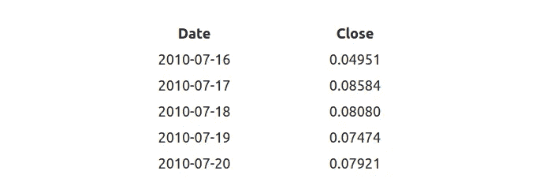
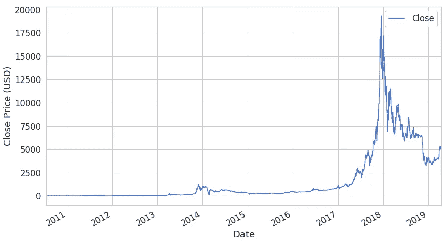
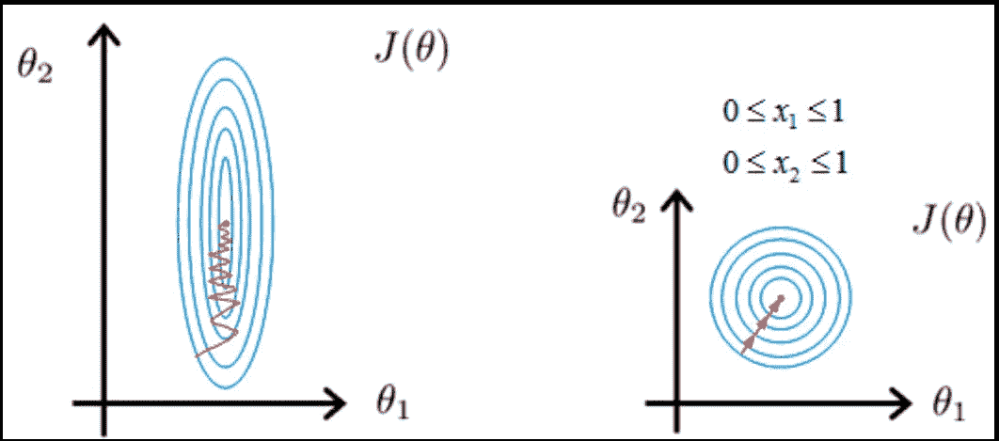
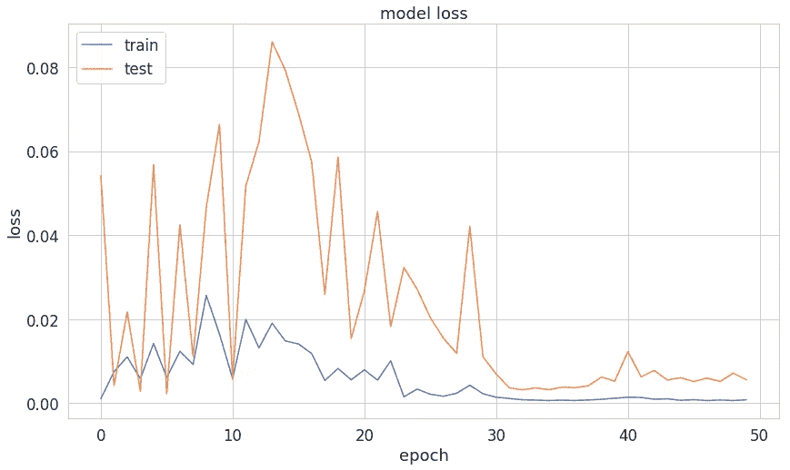
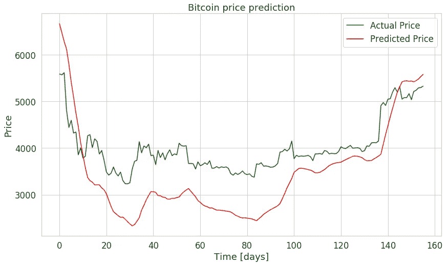

# 黑客使用 LSTMs | TensorFlow 进行加密货币价格预测(第三部分)

> 原文：<https://towardsdatascience.com/cryptocurrency-price-prediction-using-lstms-tensorflow-for-hackers-part-iii-264fcdbccd3f?source=collection_archive---------2----------------------->

## 在 TensorFlow 2 中使用 LSTM 深度神经网络预测比特币价格


Photo by [David McBee](http://davidmcbee.com/)

> *TL；DR 在 TensorFlow 2 中为时间序列预测建立并训练双向 LSTM 深度神经网络。利用模型预测未来比特币价格。*

[谷歌合作笔记本中的完整源代码](https://colab.research.google.com/drive/1wWvtA5RC6-is6J8W86wzK52Knr3N1Xbm)

这次，您将构建一个基本的深度神经网络模型，根据历史数据预测比特币价格。**你可以随心所欲地使用这个模型，但你要为自己的行为承担风险**。

你可能会问自己这样的问题:

> *用加密货币还能发财吗？*

当然，答案相当微妙。在这里，我们将看看你可能如何建立一个模型，以帮助你沿着疯狂的旅程。

或者你可能有经济困难？这里有一个可能的解决方案:

计划是这样的:

1.  *加密货币数据概述*
2.  *时间序列*
3.  *数据预处理*
4.  *在 TensorFlow 2 中建立并训练 LSTM 模型*
5.  *利用模型预测未来比特币价格*

# 数据概述

我们的数据集来自[雅虎！金融](https://finance.yahoo.com/quote/BTC-USD/history?period1=1279314000&period2=1556053200&interval=1d&filter=history&frequency=1d)并涵盖所有可用的(在撰写本文时)比特币-美元价格数据。让我们把它载入熊猫数据框架:

注意，为了以防万一，我们按日期对数据进行排序。以下是我们感兴趣的数据示例:



我们总共有 *3201* 个数据点，代表 *3201* 天(~9 年)的比特币-美元价格。我们对预测未来日期的收盘价感兴趣。



当然，比特币让一些人变得非常富有，也让一些人变得非常贫穷。问题是，它会再次发生吗？让我们来看看一个可能的模型是怎么想的。我们走吧。

我们的数据集与之前的例子有些不同。数据按时间排序，并以相等的时间间隔(1 天)记录。这样的数据序列称为 [*时间序列*](https://en.wikipedia.org/wiki/Time_series) 。

# 时间序列

时态数据集在实践中很常见。你的能量消耗和支出(卡路里输入，卡路里输出)，天气变化，股票市场，从用户那里收集的对你的产品/应用的分析，甚至你(可能在恋爱中)的心产生*时间序列*。

你可能会对你的时间序列的许多属性感兴趣，比如**平稳性**、**季节性**和**自相关性**都是最著名的。

**自相关**是由某个间隔(称为滞后)分开的数据点的相关性。

**季节性**指的是在某个时间间隔出现某种循环模式(不，不一定是每个春天)。

如果一个时间序列具有恒定的均值和方差，则称其为**平稳性**。此外，协方差与时间无关。

在观察时间序列数据时，您可能会问自己一个明显的问题:“当前时间步长的值会影响下一个时间步长吗？”又名*时间序列预测*。

有许多方法可以用于此目的。但我们将建立一个深度神经网络，为我们做一些预测，并用它来预测未来的比特币价格。

# 建模

到目前为止，我们建立的所有模型都不允许对序列数据进行操作。幸运的是，我们可以使用一类特殊的神经网络模型，称为[递归神经网络(RNNs)](https://en.wikipedia.org/wiki/Recurrent_neural_network) 来实现这个目的。 *RNNs* 允许使用模型的输出作为同一模型的新输入。该过程可以无限重复。

*RNNs* 的一个严重限制是[无法捕捉序列中的长期相关性](https://colah.github.io/posts/2015-08-Understanding-LSTMs/)(例如，今天的价格和两周前的价格之间存在相关性吗？).处理这种情况的一种方法是使用**长短期记忆(LSTM)**RNN*的变体。*

LSTM 的默认行为是长时间记忆信息。让我们看看如何在 Keras 中使用 LSTM。

## 数据预处理

首先，我们将把价格数据压缩到[0，1]范围内。回想一下，这将帮助我们的优化算法更快地收敛:



source: [Andrew Ng](https://www.andrewng.org/)

我们将使用 [scikit learn](https://scikit-learn.org/stable/index.html) 中的[最小最大缩放器](https://scikit-learn.org/stable/modules/generated/sklearn.preprocessing.MinMaxScaler.html):

缩放器期望数据的形状为(x，y ),因此我们在应用之前使用 [reshape](https://docs.scipy.org/doc/numpy/reference/generated/numpy.reshape.html) 添加一个虚拟尺寸。

让我们也去掉 nan，因为我们的模型不能很好地处理它们:

我们用 [isnan](https://docs.scipy.org/doc/numpy/reference/generated/numpy.isnan.html) 作为屏蔽，过滤掉 nan 值。在移除 nan 后，我们再次重塑数据。

## 制作序列

LSTMs 期望数据是三维的。我们需要将数据分割成预设长度的序列。我们想要获得的形状是:

```
[batch_size, sequence_length, n_features]
```

我们还想保存一些数据用于测试。让我们建立一些序列:

构建序列的过程通过在位置 0 创建指定长度的序列来进行。然后我们向右移动一个位置(例如 1)并创建另一个序列。重复该过程，直到使用了所有可能的位置。

我们保存 5%的数据用于测试。数据集看起来像这样:

```
(2945, 99, 1)
(156, 99, 1)
```

我们的模型将使用代表 99 天比特币价格变化的 2945 个序列进行训练。我们将预测未来 156 天的价格(从我们的模型视点)。

## 建立 LSTM 模型

我们正在创建一个 3 层 [LSTM](https://www.tensorflow.org/versions/r2.0/api_docs/python/tf/keras/layers/LSTM) 递归神经网络。我们使用 20%的[退出率](https://www.tensorflow.org/versions/r2.0/api_docs/python/tf/keras/layers/Dropout)来对抗培训期间的过度配合:

你可能想知道[双向](https://www.tensorflow.org/versions/r2.0/api_docs/python/tf/keras/layers/Bidirectional)和 CuDNNLSTM 是怎么回事？

[双向 RNNs](https://maxwell.ict.griffith.edu.au/spl/publications/papers/ieeesp97_schuster.pdf) 允许您对序列数据进行正向和反向(反向)训练。实际上，这种方法在 LSTMs 中运行良好。

[CuDNNLSTM](https://www.tensorflow.org/api_docs/python/tf/keras/layers/CuDNNLSTM) 是一个“由 cuDNN 支持的快速 LSTM 实现”。我个人认为这是一个很好的漏抽象的例子，但是它太快了！

我们的输出层有一个单神经元(预测比特币价格)。我们使用线性激活函数[,其激活与输入成比例。](https://ml-cheatsheet.readthedocs.io/en/latest/activation_functions.html#linear)

## 培养

我们将使用[均方误差](https://en.wikipedia.org/wiki/Mean_squared_error)作为损失函数，并使用 [Adam](https://www.tensorflow.org/versions/r2.0/api_docs/python/tf/optimizers/Adam) 优化器。

注意，我们不想打乱训练数据，因为我们使用的是时间序列。

经过闪电般的训练(感谢谷歌免费的 T4 图形处理器)，我们有以下训练损失:



# **预测比特币价格**

让我们的模型预测比特币价格吧！

我们可以使用我们的缩放器来反转我们所做的转换，这样价格就不再在[0，1]范围内缩放。



我们相当简洁的模型似乎在测试数据上做得很好。想试试其他货币吗？

# 结论

恭喜你，你刚刚在 TensorFlow 2 中构建了一个双向 LSTM 递归神经网络。我们的模型(和预处理“管道”)非常通用，可以用于其他数据集。

[谷歌合作笔记本中的完整源代码](https://colab.research.google.com/drive/1wWvtA5RC6-is6J8W86wzK52Knr3N1Xbm)

未来研究的一个有趣方向可能是分析不同加密货币之间的相关性，以及这将如何影响我们模型的性能。

【https://www.curiousily.com】最初发表于[](https://www.curiousily.com/posts/cryptocurrency-price-prediction-in-tensorflow-2/)**。**