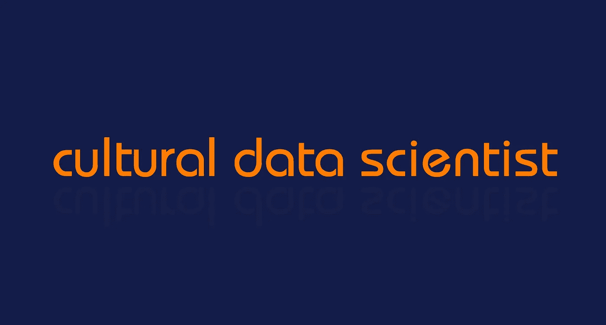

# 我是一名文化数据科学家

> 原文：<https://towardsdatascience.com/cultural-data-scientist-f2edb9095092?source=collection_archive---------18----------------------->

## 我可能刚刚创造了一个新的工作头衔…？

[vishalkumar.london ©](https://vishalkumar.london/)

我用这个头衔已经有几个月了。在我的[网站](https://vishalkumar.london/)上。在我的[作品集](https://docs.google.com/presentation/d/19SyqXgL7fCI7wIBiLK78SpcUSSGd8fEVk26LSQtbsyI/edit?usp=sharing)里。在[的会谈和介绍](https://sites.google.com/view/vishalkumarlondon/presentations/data-science-for-arts-and-culture?authuser=0)。甚至当我认识新朋友的时候。

问题是，“文化数据科学家”这个术语并不存在。我刚编的。

我是一名数据科学家，使用统计学、计量经济学、机器学习、城市分析、社交媒体分析和数据可视化来了解和衡量文化在城市中的经济和社会影响。

但这显然有点拗口，尤其是当我在酒吧和一个不知道这些行话术语定义的人聊天时。

所以，我想我应该写一篇关于它的博客。

## 什么是文化？

文化是其中一个很重要的术语。这个定义被分为“艺术”和“社会行为”两部分，但它是一个泛指我们的术语。

《牛津词典》对文化的[定义是:](https://en.oxforddictionaries.com/definition/culture)

1.  艺术和其他人类智力成就的表现形式的总称。
2.  特定民族或社会的观念、习俗和社会行为。

维基百科将文化描述为“人类社会中的社会行为和规范”

英国政府数字、文化、媒体和体育部(DCMS)有一个完整的部门关注“文化和创意”产业，其中包括艺术；电影、电视和音乐；收音机；摄影；工艺品；博物馆和美术馆；图书馆和档案馆；文化教育；历史建筑和类似旅游景点的经营；广告和营销；建筑；工艺品；设计和设计师时尚。

令人恼火的是，商界最近似乎也在劫持这个词。

## **什么是数据科学？**

数据科学是一门使用和分析数据来测试假设、回答问题和理解见解的学科。

[数据科学](https://en.wikipedia.org/wiki/Data_science)是“统一统计学、数据分析、机器学习及其相关方法的概念”，以便用数据“理解和分析实际现象”。

## 文化数据科学家

因此，*文化数据科学家*这个头衔很好地概括了我的工作。

我是一名数据科学家，使用统计学、计量经济学、机器学习、城市分析、社交媒体分析和数据可视化来了解和衡量文化在城市中的经济和社会影响。

我对文化的研究始于艺术，但现在已经相当广泛，跨越了[艺术](https://datastudio.google.com/open/10vokOkG-XN5L9TyTM8xbwPOBVYYLE2GV)到[音乐](https://datastudio.google.com/open/1iFCO-OjkJtMEmE_1OLsfPPI3ORqEdGIv)、[时尚](https://datastudio.google.com/open/1ePKpgGWY9o_7w2tKtSO4TMMknWkhdzAu)和食物。

职称比*“我是文化部门的数据科学家”*好多了。

## 可比资产

就像你如何成为一名经济顾问、财务顾问、软件工程师、机器学习工程师、土木工程师或 T21 工程师一样

我是一名*文化*数据科学家。

也许我太迂腐了？

但事实是，我每天打交道的人——艺术和文化部门的人——甚至不知道什么是数据科学家！

将“*文化*”放在“*数据科学家*”的前面，这种区分不仅独特有趣，而且有助于将我的工作置于背景之中。

## 研究

为了证明职位名称*文化数据科学家*并不存在，我将链接几个流行且常用的搜索引擎。

根据 Google Trends — [此处](https://trends.google.com/trends/explore?date=all&q=cultural%20data%20scientist) —该术语不存在(2019 年 2 月 11 日检索)。

LinkedIn — [这里](https://www.linkedin.com/search/results/people/?keywords=cultural%20data%20scientist&origin=SWITCH_SEARCH_VERTICAL) —没有其他人有这个职位(2019 年 2 月 11 日检索)。

天使名单上也没有那个职位的工作——此处[此处](https://angel.co/search?q=cultural%20data%20scientist)(2019 年 2 月 11 日检索)。

甚至一个标准的谷歌搜索也不会产生这个词。

## 文化分析和文化数据科学

不可否认，有人在使用“文化分析”这个术语，也有一些大学在使用“文化数据科学”。

列夫·马诺维奇在 2007 年发明的术语[文化分析](https://en.wikipedia.org/wiki/Cultural_analytics)，是“对视觉材料的海量文化数据集的探索和分析”。

另一方面，加拿大蒙特利尔的麦吉尔大学有一个社会和文化数据科学的 T4 中心。

伦敦帝国理工学院有一个[社会和文化分析实验室](https://www.imperial.ac.uk/data-science/research/multidisciplinary-labs/social-and-cultural-analytics-lab/)，但是他们的[推特账户](https://twitter.com/SOCA_Lab)自 2015 年 10 月 30 日以来就没有发过一次推特！严重努力差！

我目前就读的位于 UCL 的巴特利特学院将推出一个名为文化遗产数据科学的新硕士学位。

但有趣的是，没有人使用文化数据科学家的头衔。

## 我是不是创造了一个新的头衔…？

截至 2019 年 3 月，我未能找到任何积极使用职位名称“文化数据科学家”的人。

该术语是必需的。随着我们进入 2020 年，文化变得更加数字化，现在存在更大的数据集，并且有更复杂的方法来分析这些数据。

如果大学正在创建这些研究实验室，那么人们应该对使用文化数据科学家这个头衔来描述他们正在做的工作感到舒服。

在我看来，社会科学家这个词是不行的，数据科学家也太宽泛了。*计算社会科学家*是个东西，但你指的是哪门社会科学……地理学、经济学、人类学、社会学、心理学、政治学……全部？

无论如何，看起来我刚刚创造了一个新的工作头衔，而且我会坚持一段时间！如果你的工作符合要求，我鼓励你也使用它！

感谢阅读！

Vishal

*本文首发于 2019 年 3 月 10 日*[*vishalkumar . London*](https://vishalkumar.london/cultural-data-scientist/im-a-cultural-data-scientist)*。*

Vishal 是一名文化数据科学家，也是伦敦 UCL 的一名研究生。他对城市文化的经济和社会影响感兴趣。你可以在[*Twitter*](https://twitter.com/vishalkumarldn)*或者*[*LinkedIn*](https://www.linkedin.com/in/vishalkumarlondon/)*上与他取得联系。在*[*insta gram*](https://www.instagram.com/vishalkumar.london/)*或他的* [*网站*](https://vishalkumar.london/) *上看到更多 Vishal 的作品。*